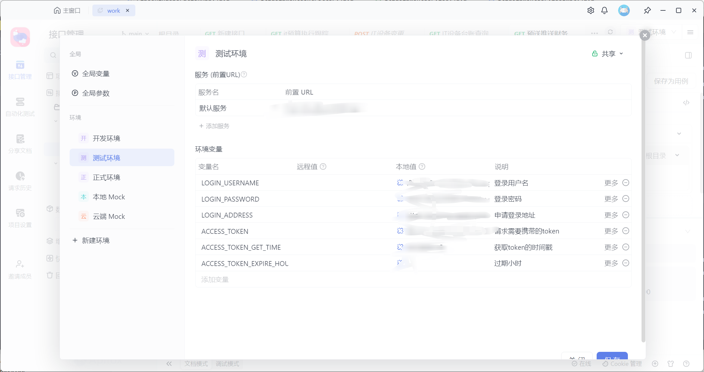

# Apifox自动更新请求token
## 配置环境变量




| 变量名 | 说明 |
| -- | -- |
| LOGIN_USERNAME | 登录用户名|
| LOGIN_PASSWORD | 登录密码 |
| LOGIN_ADDRESS | 登录请求地址 |
| ACCESS_TOKEN | 获取到的token |
| ACCESS_TOKEN_GET_TIME | token获取时的时间戳 |
| ACCESS_TOKEN_EXPIRE_HOUR | 过期小时 |

可以设置浏览器离线查看具体登录请求


## 配置全局前置操作


## 全局刷新脚本


```js
// 定义发送登录接口请求方法
function sendLoginRequest() {
  // 获取环境里的 前置URL  
  const loginAddress = pm.environment.get("LOGIN_ADDRESS");

  // 登录用户名，这里从环境变量 LOGIN_USERNAME 获取，也可以写死（但是不建议）  
  const username = pm.environment.get("LOGIN_USERNAME");
  // 登录密码，这里从环境变量 LOGIN_PASSWORD 获取，也可以写死（但是不建议）  
  const password = pm.environment.get("LOGIN_PASSWORD");
  const loginRequest = {
    url: loginAddress,
    method: "POST",
    // body 为 json 格式
    header: {
      "Content-Type": "application/json", // 注意：header 需要加上 Content-Type
    },
    body: {
      mode: 'raw',// 此处为 raw
      raw: JSON.stringify({ account: username, password: password }), // 序列化后的 json 字符串
    }
  };
  // 发送请求。  
  // pm.sendrequest 参考文档: https://www.apifox.cn/help/app/scripts/api-references/pm-reference/#pm-sendrequest  
  pm.sendRequest(loginRequest, function (err, res) {
    if (err) {
      console.log(err);
    } else {
      // 读取接口返回的 json 数据。      
      // 如果你的 token 信息是存放在 cookie 的，可以使用 res.cookies.get('token') 方式获取。      
      // cookies 参考文档：https://www.apifox.cn/help/app/scripts/api-references/pm-reference/#pm-cookies      
      const jsonData = res.json();
      // 将 accessToken 写入环境变量 ACCESS_TOKEN      
      pm.environment.set("ACCESS_TOKEN", jsonData.data);
      // 将获取token的时间戳写入环境变量 ACCESS_TOKEN_GET_TIME  
      pm.environment.set(
        "ACCESS_TOKEN_GET_TIME",
        new Date().getTime()
      );
    }
  });
}

// 获取环境变量里的 ACCESS_TOKEN
const accessToken = pm.environment.get("ACCESS_TOKEN");

// 获取环境变量里的 ACCESS_TOKEN_GET_TIME
const accessTokenGetTime = pm.environment.get("ACCESS_TOKEN_GET_TIME");
const accessTokenExpireHour = pm.environment.get("ACCESS_TOKEN_EXPIRE_HOUR");

// 如 ACCESS_TOKEN 没有值，或离 ACCESS_TOKEN_GET_TIME 过了 ACCESS_TOKEN_EXPIRE_HOUR 小时，则执行发送登录接口请求
if (
  !accessToken || (new Date().setHours(new Date(accessTokenGetTime).getHours() + Number(accessTokenExpireHour)) <= new Date())
) {
  sendLoginRequest();
}
```

## 设置全局请求前增加请求头token


