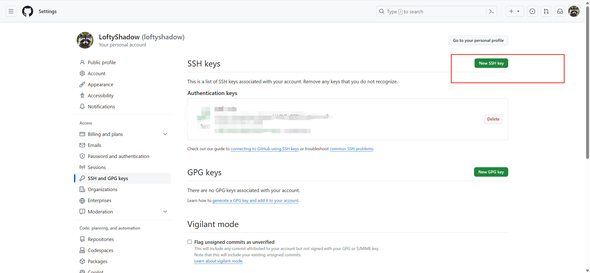

# Github使用SSH连接

## 生成SSH密钥
```shell
ssh-keygen -t rsa -b 4096 -C "1094290505@qq.com"
```

打开~/.ssh/id_rsa.pub这个文件 复制内容
```shell
cd ~/.ssh
cat ./id_rsa.pub
```

## 添加公钥到Github



输入命令
```shell
ssh -T git@github.com
```

如果是第一次的会提示是否continue，输入yes就会看到：You've successfully authenticated, but GitHub does not provide shell access 。这就表示已成功连上github。

设置Git提交name 和 email

```shell
git config --global user.name "niemingzhi"
git config --global user.email "1094290505@qq.com"
```
