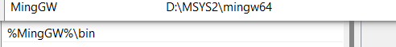

# MSYS2安装gcc、gmake

## 下载msys2

[官网](https://www.msys2.org/)下载后安装
msys2提供了四种环境以供使用：ucrt64, mingw64, clang64, msys。
其中前三种都可以编译出 windows native本机应用，第四种 msys 是unix 环境工具，编译出的工具是供应msys本身或者开发者本身使用，比如 vim 编辑器往往是自己编译自己用，只提供 msys 版就够了。
推荐打开 `ucrt64` 窗口，安装软件也选择 `ucrt64` 前缀的。

## 更新 msys2 pacman

打开 msys2 ucrt64 窗口，首次更新 msys2 pacman，执行命令:

```shell
pacman -Syu --noconfirm
```

其中 --noconfirm 选项是为了不被询问确认，也可以不加此项，那么执行 pacman 时就要等你输入 Y/n 确认。
自动下载更新安装结束后，重启 msys2 `ucrt64` 窗口，再次执行：

```shell
pacman -Syu --noconfirm
```

## 安装 gcc c++ 编译器

如何用 pacman 搜索库和软件, 以搜索 gcc 为例

```shell
pacman -Ss gcc

pacman -Ss gcc | grep ucrt64
```

找到 `ucrt64/mingw-w64-ucrt-x86_64-gcc`，即是我们要安装的 gcc 编译，
解释下名字为何这么长：因为安装直接的名字 gcc 是 msys2 (unix风格) native 的，不是 windows native 的
开始安装 gcc 编译器了

```shell
pacman -S --needed ucrt64/mingw-w64-ucrt-x86_64-gcc
```

安装之后的 gcc 在哪

```shell
which gcc
which g++
```

## 添加到环境变量中


