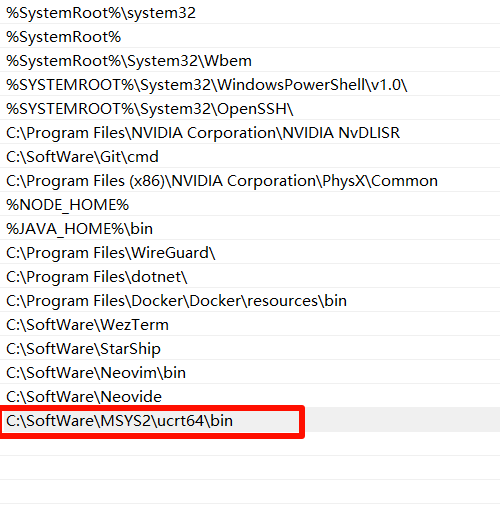

# 下载msys2
[官网](https://www.msys2.org/)下载后安装
msys2提供了四种环境以供使用：ucrt64, mingw64, clang64, msys。
其中前三种都可以编译出 windows native本机应用，第四种 msys 是unix 环境工具，编译出的工具是供应msys本身或者开发者本身使用，比如 vim 编辑器往往是自己编译自己用，只提供 msys 版就够了。
推荐打开 `ucrt64` 窗口，安装软件也选择 `ucrt64` 前缀的。
# 更新 msys2 pacman
打开 msys2 ucrt64 窗口，首次更新 msys2 pacman，执行命令:
```shell
pacman -Syu --noconfirm
```
其中 `--noconfirm` 选项是为了不被询问确认，也可以不加此项，那么执行 pacman 时就要等你输入 Y/n 确认。
自动下载更新安装结束后，重启 msys2 `ucrt64` 窗口，再次执行：
```shell
pacman -Syu --noconfirm
```
# 安装 gcc c++ 编译器
```shell
$ pacman -S mingw-w64-ucrt-x86_64-gcc
```
安装之后的 gcc 在哪
```shell
which gcc
which g++
```
# 添加到环境变量中

