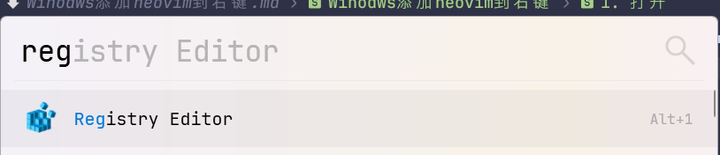
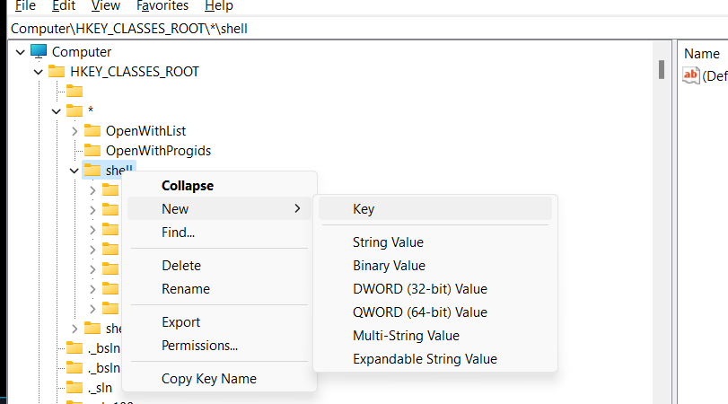
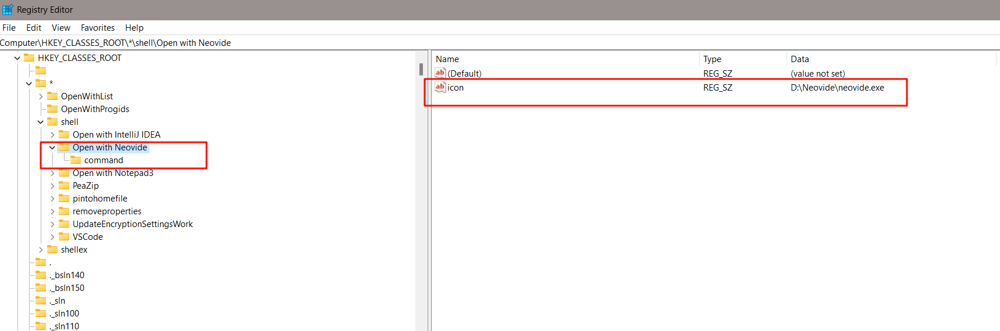
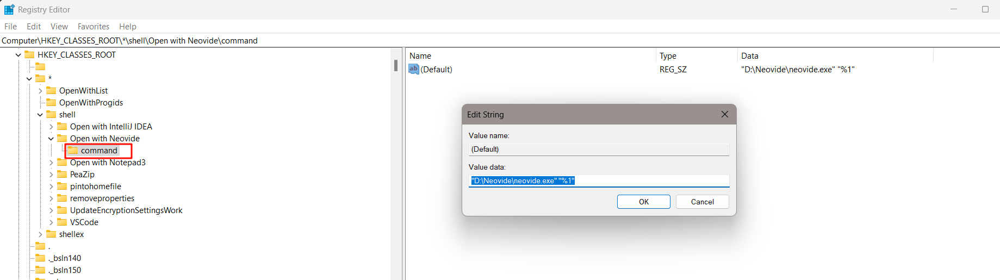
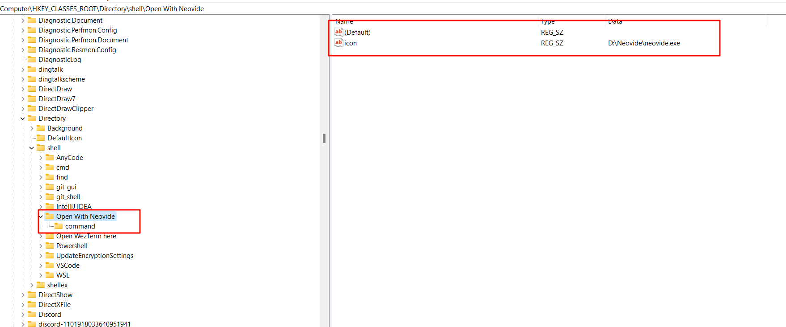
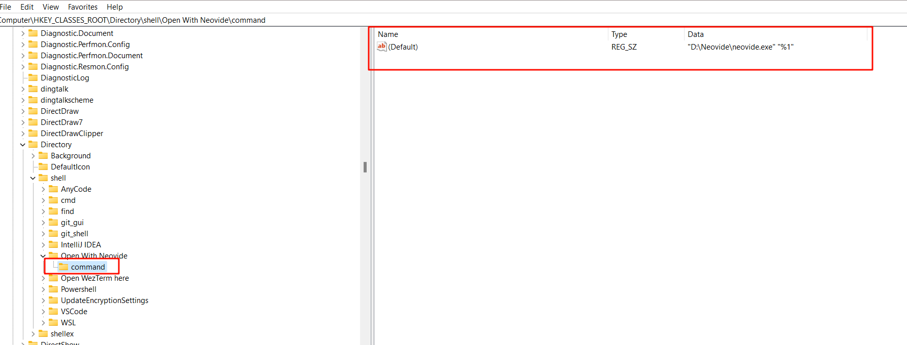

# 文件
打开注册表

在`\HKEY_CLASSES_ROOT\*\shell`新建项`Open with Neovide`

新建String类型名为icon值为neovim地址

在`Open with Neovide`下创建`command`项

修改值为"Neovide地址" "%1"
# 文件夹
找到`HKEY_CLASSES_ROOT\Directory\shell`  
操作同文件

