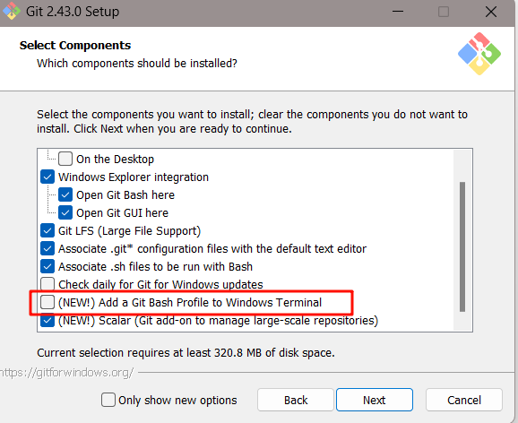
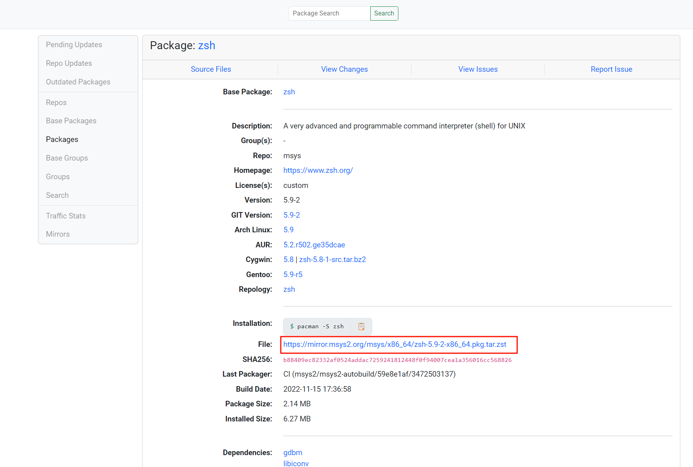
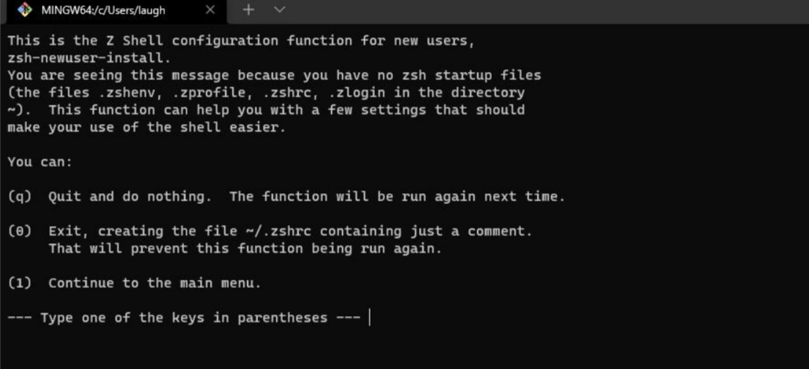

# Zsh 整理
## Windows Zsh 安装
### 安装 Git
前往[git 官网](https://gitforwindows.org/)安装 git

### 安装 Zsh
下载[zsh](https://packages.msys2.org/package/zsh?repo=msys&variant=x86_64)压缩文件,

直接解压至 Git 根目录下**重点**，可使用[PeaZip](https://peazip.github.io/)解压  
打开 Git Bash 标签页输入 zsh，出现下图则代表安装成功，否则检查是否解压至 Git 根目录下

初始化直到生成对应的.zshrc 文件,输入`zsh`即可进入  
配置默认启动 zsh  
在`../Git/etc/bash.bashrc`文件末尾追加以下内容：
```shell
# 运行 Zsh
if [ -t 1 ]; then
exec zsh
fi
```
## 安装starship(推荐)
[StarShip](https://github.com/starship/starship/releases)  
下载压缩包配置到环境变量中  
为 Starship 创建配置文件 `~/.config/starship.toml`。
```shell
mkdir -p ~/.config && touch ~/.config/starship.toml
```

<details>
<summary>个人配置</summary>

```text

# 根据 schema 提供自动补全
"$schema" = 'https://starship.rs/config-schema.json'

# 在提示符之间插入空行
add_newline = false

# A continuation prompt that displays two filled in arrows
continuation_prompt = '▶▶ '

format = """
[░▒▓](#a3aed2)\
[  ](bg:#a3aed2 fg:#090c0c)\
[](bg:#769ff0 fg:#a3aed2)\
$directory\
[](fg:#769ff0 bg:#394260)\
$git_branch\
$git_status\
[](fg:#394260 bg:#212736)\
$nodejs\
$rust\
$golang\
$php\
[](fg:#212736 bg:#1d2230)\
$time\
[ ](fg:#1d2230)\
\n$character"""

[directory]
style = "fg:#e3e5e5 bg:#769ff0"
format = "[ $path ]($style)"
truncation_length = 3
truncation_symbol = "…/"

[directory.substitutions]
"Documents" = "󰈙 "
"Downloads" = " "
"Music" = " "
"Pictures" = " "

[git_branch]
symbol = ""
style = "bg:#394260"
format = '[[ $symbol $branch ](fg:#769ff0 bg:#394260)]($style)'

[git_status]
style = "bg:#394260"
format = '[[($all_status$ahead_behind )](fg:#769ff0 bg:#394260)]($style)'

[nodejs]
symbol = ""
style = "bg:#212736"
format = '[[ $symbol ($version) ](fg:#769ff0 bg:#212736)]($style)'

[rust]
symbol = ""
style = "bg:#212736"
format = '[[ $symbol ($version) ](fg:#769ff0 bg:#212736)]($style)'

[golang]
symbol = ""
style = "bg:#212736"
format = '[[ $symbol ($version) ](fg:#769ff0 bg:#212736)]($style)'

[php]
symbol = ""
style = "bg:#212736"
format = '[[ $symbol ($version) ](fg:#769ff0 bg:#212736)]($style)'

[time]
disabled = false
time_format = "%R"                                      # Hour:Minute Format
style = "bg:#1d2230"
format = '[[  $time ](fg:#a0a9cb bg:#1d2230)]($style)'
```
</details>

在`~/.zshrc`最后增加
```text
eval "$(starship init zsh)"
```
安装插件
```shell
mkdir ~/zsh-plugins
cd ~/zsh-plugins

git clone https://github.com/MichaelAquilina/zsh-you-should-use.git
git clone https://github.com/hlissner/zsh-autopair.git
git clone https://github.com/zsh-users/zsh-autosuggestions.git
git clone https://github.com/zsh-users/zsh-syntax-highlighting.git
git clone https://github.com/Aloxaf/fzf-tab.git
```
在`~/.zshrc`中添加
```text
source ~/zsh-plugins/zsh-you-should-use/you-should-use.plugin.zsh
source ~/zsh-plugins/zsh-autosuggestions/zsh-autosuggestions.zsh
source ~/zsh-plugins/zsh-autopair/autopair.plugin.zsh
source ~/zsh-plugins/zsh-syntax-highlighting/zsh-syntax-highlighting.zsh
source ~/zsh-plugins/fzf-tab/fzf-tab.zsh
```
安装fzf
```
winget install fzf
```
安装rg
```
winget install BurntSushi.ripgrep.MSVC
```
安装fd
```
winget install sharkdp.fd
```

<details>
<summary>个人配置</summary>

```
# The following lines were added by compinstall
zstyle :compinstall filename '/c/Users/10942/.zshrc'

autoload -Uz compinit
compinit

source ~/zsh-plugins/zsh-you-should-use/you-should-use.plugin.zsh
source ~/zsh-plugins/zsh-autosuggestions/zsh-autosuggestions.zsh
source ~/zsh-plugins/zsh-autopair/autopair.plugin.zsh
source ~/zsh-plugins/zsh-syntax-highlighting/zsh-syntax-highlighting.zsh
source ~/zsh-plugins/fzf-tab/fzf-tab.zsh

function ll(){
	ls -al
}

function yz() {
	local tmp="$(mktemp -t "yazi-cwd.XXXXX")"
	yazi "$@" --cwd-file="$tmp"
	if cwd="$(cat -- "$tmp")" && [ -n "$cwd" ] && [ "$cwd" != "$PWD" ]; then
		cd -- "$cwd"
	fi
	rm -f -- "$tmp"
}

function lg(){
	lazygit
}

function wsls(){
	wsl --shutdown
}

function n(){
	nvim "$1"
}

function v(){
	neovide "$1"
}

function nb(){
	cd /d/vue/vue-project/blog && n ./
}

function vb(){
	cd /d/vue/vue-project/blog && neovide ./
}

function nn(){
	cd ~/AppData/Local/nvim && n ./
}

function vn(){
	cd ~/AppData/Local/nvim && neovide ./
}

function na(){
    cd /d/vue/vue-project/accounting-web && n ./
}

function va(){
    cd /d/vue/vue-project/accounting-web && neovide ./
}
# End of lines added by compinstall
eval "$(starship init zsh)"

```
</details>

## 安装 Oh My Zsh(不推荐)
进入[官网](https://ohmyz.sh/#install)，复制首页命令进行安装
```shell
sh -c "$(curl -fsSL https://raw.githubusercontent.com/ohmyzsh/ohmyzsh/master/tools/install.sh)"
```
提示可忽略  

### 安装插件
### 下载
```shell
cd ~/.oh-my-zsh/custom/plugins

git clone https://github.com/MichaelAquilina/zsh-you-should-use.git
git clone https://github.com/hlissner/zsh-autopair.git
git clone https://github.com/zsh-users/zsh-autosuggestions.git
git clone https://github.com/zsh-users/zsh-syntax-highlighting.git
git clone https://github.com/Aloxaf/fzf-tab.git

```
### 配置
```shell
vi ~/.zshrc
```
```shell
source ~/.zshrc
```

<details>
<summary>个人 zsh 配置</summary>

```text
#
# If you come from bash you might have to change your $PATH.
# export PATH=$HOME/bin:/usr/local/bin:$PATH

# Path to your oh-my-zsh installation.
export ZSH="$HOME/.oh-my-zsh"

# Set name of the theme to load --- if set to "random", it will
# load a random theme each time oh-my-zsh is loaded, in which case,
# to know which specific one was loaded, run: echo $RANDOM_THEME
# See https://github.com/ohmyzsh/ohmyzsh/wiki/Themes
ZSH_THEME="eastwood"

# Set list of themes to pick from when loading at random
# Setting this variable when ZSH_THEME=random will cause zsh to load
# a theme from this variable instead of looking in $ZSH/themes/
# If set to an empty array, this variable will have no effect.
# ZSH_THEME_RANDOM_CANDIDATES=( "robbyrussell" "agnoster" )

# Uncomment the following line to use case-sensitive completion.
# CASE_SENSITIVE="true"

# Uncomment the following line to use hyphen-insensitive completion.
# Case-sensitive completion must be off. _ and - will be interchangeable.
# HYPHEN_INSENSITIVE="true"

# Uncomment one of the following lines to change the auto-update behavior
# zstyle ':omz:update' mode disabled  # disable automatic updates
# zstyle ':omz:update' mode auto      # update automatically without asking
# zstyle ':omz:update' mode reminder  # just remind me to update when it's time

# Uncomment the following line to change how often to auto-update (in days).
# zstyle ':omz:update' frequency 13

# Uncomment the following line if pasting URLs and other text is messed up.
# DISABLE_MAGIC_FUNCTIONS="true"

# Uncomment the following line to disable colors in ls.
# DISABLE_LS_COLORS="true"

# Uncomment the following line to disable auto-setting terminal title.
# DISABLE_AUTO_TITLE="true"

# Uncomment the following line to enable command auto-correction.
# ENABLE_CORRECTION="true"

# Uncomment the following line to display red dots whilst waiting for completion.
# You can also set it to another string to have that shown instead of the default red dots.
# e.g. COMPLETION_WAITING_DOTS="%F{yellow}waiting...%f"
# Caution: this setting can cause issues with multiline prompts in zsh < 5.7.1 (see #5765)
# COMPLETION_WAITING_DOTS="true"

# Uncomment the following line if you want to disable marking untracked files
# under VCS as dirty. This makes repository status check for large repositories
# much, much faster.
# DISABLE_UNTRACKED_FILES_DIRTY="true"

# Uncomment the following line if you want to change the command execution time
# stamp shown in the history command output.
# You can set one of the optional three formats:
# "mm/dd/yyyy"|"dd.mm.yyyy"|"yyyy-mm-dd"
# or set a custom format using the strftime function format specifications,
# see 'man strftime' for details.
# HIST_STAMPS="mm/dd/yyyy"

# Would you like to use another custom folder than $ZSH/custom?
# ZSH_CUSTOM=/path/to/new-custom-folder

# Which plugins would you like to load?
# Standard plugins can be found in $ZSH/plugins/
# Custom plugins may be added to $ZSH_CUSTOM/plugins/
# Example format: plugins=(rails git textmate ruby lighthouse)
# Add wisely, as too many plugins slow down shell startup.
plugins=(git 
	z
  	npm
    fzf-tab
	copypath
	copyfile
	copybuffer
	you-should-use
	zsh-autosuggestions
	zsh-autopair
	zsh-syntax-highlighting
	)

source $ZSH/oh-my-zsh.sh

# User configuration

# export MANPATH="/usr/local/man:$MANPATH"

# You may need to manually set your language environment
# export LANG=en_US.UTF-8

# Preferred editor for local and remote sessions
# if [[ -n $SSH_CONNECTION ]]; then
#   export EDITOR='vim'
# else
#   export EDITOR='mvim'
# fi

# Compilation flags
# export ARCHFLAGS="-arch x86_64"

# Set personal aliases, overriding those provided by oh-my-zsh libs,
# plugins, and themes. Aliases can be placed here, though oh-my-zsh
# users are encouraged to define aliases within the ZSH_CUSTOM folder.
# For a full list of active aliases, run `alias`.
#
# Example aliases
# alias zshconfig="mate ~/.zshrc"
# alias ohmyzsh="mate ~/.oh-my-zsh"
export LC_ALL=en_US.UTF-8  
export LANG=en_US.UTF-8

function yz() {
	local tmp="$(mktemp -t "yazi-cwd.XXXXX")"
	yazi "$@" --cwd-file="$tmp"
	if cwd="$(cat -- "$tmp")" && [ -n "$cwd" ] && [ "$cwd" != "$PWD" ]; then
		cd -- "$cwd"
	fi
	rm -f -- "$tmp"
}

function yarnr(){
	yarn run serve
}

function lg(){
	lazygit
}

function wsls(){
	wsl --shutdown
}

function n(){
	nvim "$1"
}

function nb(){
	cd /d/vue/vue-project/blog && n
}

function nn(){
	cd ~/AppData/Local/nvim && n
}

```
</details>
