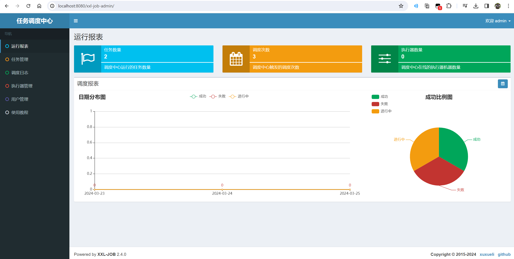
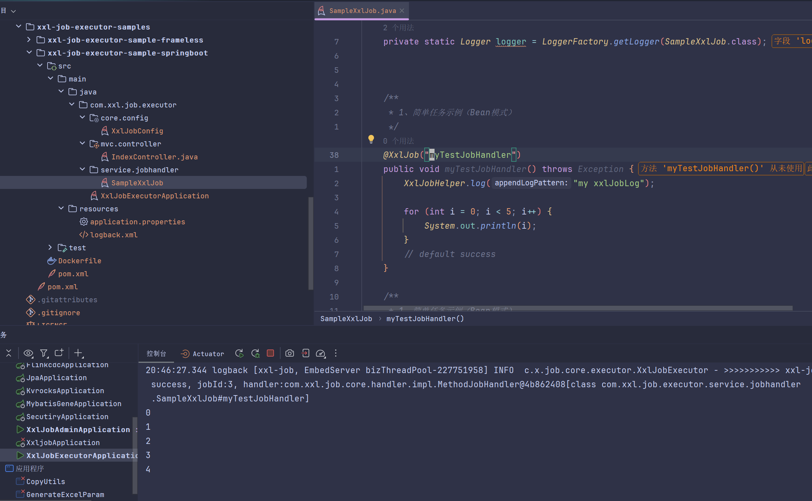
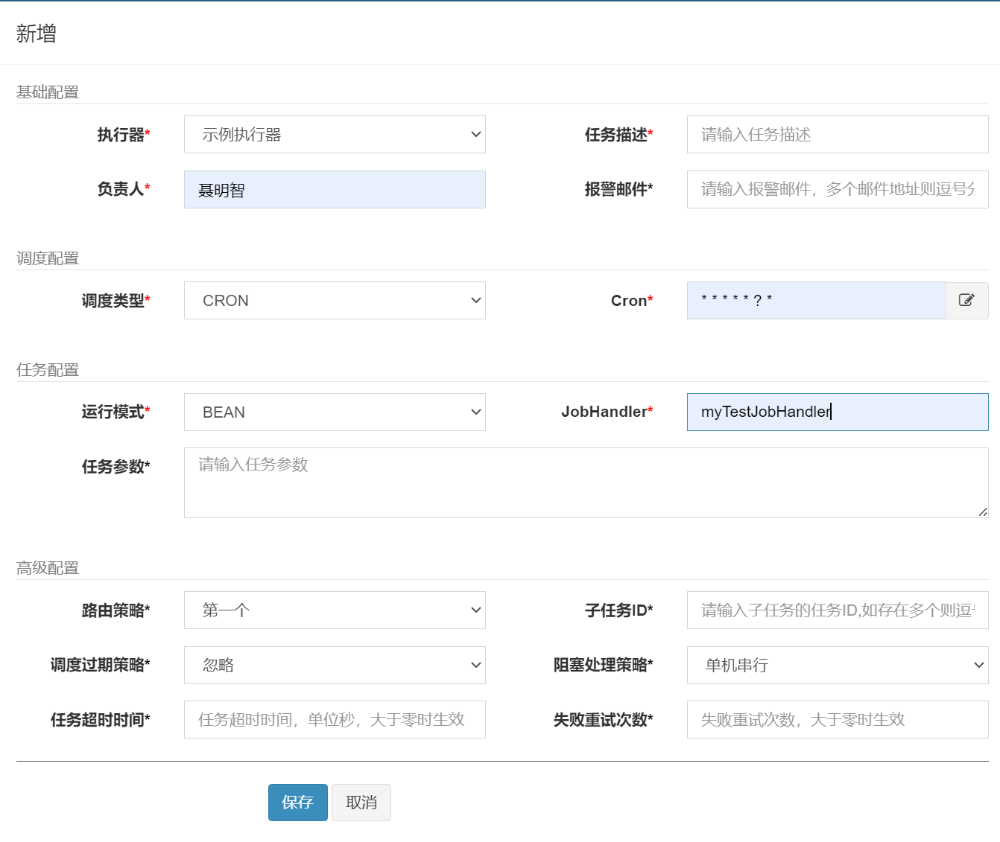
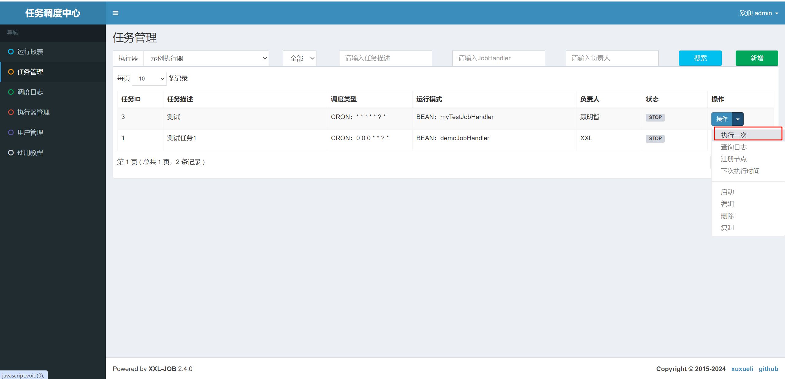
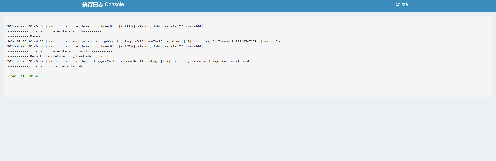

# xxl-job整理

## 1. 依赖地址

::: code-group
```maven
<!-- https://mvnrepository.com/artifact/com.xuxueli/xxl-job-core -->
<dependency>
    <groupId>com.xuxueli</groupId>
    <artifactId>xxl-job-core</artifactId>
    <version>2.4.0</version>
</dependency>
```

```gradle
// https://mvnrepository.com/artifact/com.xuxueli/xxl-job-core
implementation group: 'com.xuxueli', name: 'xxl-job-core', version: '2.4.0'
```

:::

## 2. 下载
| 源码仓库地址	| Release Download |
|-- | -- |
| https://github.com/xuxueli/xxl-job |	[Download](https://github.com/xuxueli/xxl-job/releases) |
| http://gitee.com/xuxueli0323/xxl-job |	[Download](http://gitee.com/xuxueli0323/xxl-job/releases) |

## 3. 初始化调度数据库
请下载项目源码并解压，获取 “调度数据库初始化SQL脚本” 并执行即可。

“调度数据库初始化SQL脚本” 位置为:

`/xxl-job/doc/db/tables_xxl_job.sql`
调度中心支持集群部署，集群情况下各节点务必连接同一个mysql实例;

如果mysql做主从,调度中心集群节点务必强制走主库;

<details>
<summary>tables_xxl_job.sql</summary>

```mysql
#
# XXL-JOB v2.4.0
# Copyright (c) 2015-present, xuxueli.

CREATE database if NOT EXISTS `xxl_job` default character set utf8mb4 collate utf8mb4_unicode_ci;
use `xxl_job`;

SET NAMES utf8mb4;

CREATE TABLE `xxl_job_info` (
  `id` int(11) NOT NULL AUTO_INCREMENT,
  `job_group` int(11) NOT NULL COMMENT '执行器主键ID',
  `job_desc` varchar(255) NOT NULL,
  `add_time` datetime DEFAULT NULL,
  `update_time` datetime DEFAULT NULL,
  `author` varchar(64) DEFAULT NULL COMMENT '作者',
  `alarm_email` varchar(255) DEFAULT NULL COMMENT '报警邮件',
  `schedule_type` varchar(50) NOT NULL DEFAULT 'NONE' COMMENT '调度类型',
  `schedule_conf` varchar(128) DEFAULT NULL COMMENT '调度配置，值含义取决于调度类型',
  `misfire_strategy` varchar(50) NOT NULL DEFAULT 'DO_NOTHING' COMMENT '调度过期策略',
  `executor_route_strategy` varchar(50) DEFAULT NULL COMMENT '执行器路由策略',
  `executor_handler` varchar(255) DEFAULT NULL COMMENT '执行器任务handler',
  `executor_param` varchar(512) DEFAULT NULL COMMENT '执行器任务参数',
  `executor_block_strategy` varchar(50) DEFAULT NULL COMMENT '阻塞处理策略',
  `executor_timeout` int(11) NOT NULL DEFAULT '0' COMMENT '任务执行超时时间，单位秒',
  `executor_fail_retry_count` int(11) NOT NULL DEFAULT '0' COMMENT '失败重试次数',
  `glue_type` varchar(50) NOT NULL COMMENT 'GLUE类型',
  `glue_source` mediumtext COMMENT 'GLUE源代码',
  `glue_remark` varchar(128) DEFAULT NULL COMMENT 'GLUE备注',
  `glue_updatetime` datetime DEFAULT NULL COMMENT 'GLUE更新时间',
  `child_jobid` varchar(255) DEFAULT NULL COMMENT '子任务ID，多个逗号分隔',
  `trigger_status` tinyint(4) NOT NULL DEFAULT '0' COMMENT '调度状态：0-停止，1-运行',
  `trigger_last_time` bigint(13) NOT NULL DEFAULT '0' COMMENT '上次调度时间',
  `trigger_next_time` bigint(13) NOT NULL DEFAULT '0' COMMENT '下次调度时间',
  PRIMARY KEY (`id`)
) ENGINE=InnoDB DEFAULT CHARSET=utf8mb4;

CREATE TABLE `xxl_job_log` (
  `id` bigint(20) NOT NULL AUTO_INCREMENT,
  `job_group` int(11) NOT NULL COMMENT '执行器主键ID',
  `job_id` int(11) NOT NULL COMMENT '任务，主键ID',
  `executor_address` varchar(255) DEFAULT NULL COMMENT '执行器地址，本次执行的地址',
  `executor_handler` varchar(255) DEFAULT NULL COMMENT '执行器任务handler',
  `executor_param` varchar(512) DEFAULT NULL COMMENT '执行器任务参数',
  `executor_sharding_param` varchar(20) DEFAULT NULL COMMENT '执行器任务分片参数，格式如 1/2',
  `executor_fail_retry_count` int(11) NOT NULL DEFAULT '0' COMMENT '失败重试次数',
  `trigger_time` datetime DEFAULT NULL COMMENT '调度-时间',
  `trigger_code` int(11) NOT NULL COMMENT '调度-结果',
  `trigger_msg` text COMMENT '调度-日志',
  `handle_time` datetime DEFAULT NULL COMMENT '执行-时间',
  `handle_code` int(11) NOT NULL COMMENT '执行-状态',
  `handle_msg` text COMMENT '执行-日志',
  `alarm_status` tinyint(4) NOT NULL DEFAULT '0' COMMENT '告警状态：0-默认、1-无需告警、2-告警成功、3-告警失败',
  PRIMARY KEY (`id`),
  KEY `I_trigger_time` (`trigger_time`),
  KEY `I_handle_code` (`handle_code`)
) ENGINE=InnoDB DEFAULT CHARSET=utf8mb4;

CREATE TABLE `xxl_job_log_report` (
  `id` int(11) NOT NULL AUTO_INCREMENT,
  `trigger_day` datetime DEFAULT NULL COMMENT '调度-时间',
  `running_count` int(11) NOT NULL DEFAULT '0' COMMENT '运行中-日志数量',
  `suc_count` int(11) NOT NULL DEFAULT '0' COMMENT '执行成功-日志数量',
  `fail_count` int(11) NOT NULL DEFAULT '0' COMMENT '执行失败-日志数量',
  `update_time` datetime DEFAULT NULL,
  PRIMARY KEY (`id`),
  UNIQUE KEY `i_trigger_day` (`trigger_day`) USING BTREE
) ENGINE=InnoDB DEFAULT CHARSET=utf8mb4;

CREATE TABLE `xxl_job_logglue` (
  `id` int(11) NOT NULL AUTO_INCREMENT,
  `job_id` int(11) NOT NULL COMMENT '任务，主键ID',
  `glue_type` varchar(50) DEFAULT NULL COMMENT 'GLUE类型',
  `glue_source` mediumtext COMMENT 'GLUE源代码',
  `glue_remark` varchar(128) NOT NULL COMMENT 'GLUE备注',
  `add_time` datetime DEFAULT NULL,
  `update_time` datetime DEFAULT NULL,
  PRIMARY KEY (`id`)
) ENGINE=InnoDB DEFAULT CHARSET=utf8mb4;

CREATE TABLE `xxl_job_registry` (
  `id` int(11) NOT NULL AUTO_INCREMENT,
  `registry_group` varchar(50) NOT NULL,
  `registry_key` varchar(255) NOT NULL,
  `registry_value` varchar(255) NOT NULL,
  `update_time` datetime DEFAULT NULL,
  PRIMARY KEY (`id`),
  KEY `i_g_k_v` (`registry_group`,`registry_key`,`registry_value`)
) ENGINE=InnoDB DEFAULT CHARSET=utf8mb4;

CREATE TABLE `xxl_job_group` (
  `id` int(11) NOT NULL AUTO_INCREMENT,
  `app_name` varchar(64) NOT NULL COMMENT '执行器AppName',
  `title` varchar(12) NOT NULL COMMENT '执行器名称',
  `address_type` tinyint(4) NOT NULL DEFAULT '0' COMMENT '执行器地址类型：0=自动注册、1=手动录入',
  `address_list` text COMMENT '执行器地址列表，多地址逗号分隔',
  `update_time` datetime DEFAULT NULL,
  PRIMARY KEY (`id`)
) ENGINE=InnoDB DEFAULT CHARSET=utf8mb4;

CREATE TABLE `xxl_job_user` (
  `id` int(11) NOT NULL AUTO_INCREMENT,
  `username` varchar(50) NOT NULL COMMENT '账号',
  `password` varchar(50) NOT NULL COMMENT '密码',
  `role` tinyint(4) NOT NULL COMMENT '角色：0-普通用户、1-管理员',
  `permission` varchar(255) DEFAULT NULL COMMENT '权限：执行器ID列表，多个逗号分割',
  PRIMARY KEY (`id`),
  UNIQUE KEY `i_username` (`username`) USING BTREE
) ENGINE=InnoDB DEFAULT CHARSET=utf8mb4;

CREATE TABLE `xxl_job_lock` (
  `lock_name` varchar(50) NOT NULL COMMENT '锁名称',
  PRIMARY KEY (`lock_name`)
) ENGINE=InnoDB DEFAULT CHARSET=utf8mb4;

INSERT INTO `xxl_job_group`(`id`, `app_name`, `title`, `address_type`, `address_list`, `update_time`) VALUES (1, 'xxl-job-executor-sample', '示例执行器', 0, NULL, '2018-11-03 22:21:31' );
INSERT INTO `xxl_job_info`(`id`, `job_group`, `job_desc`, `add_time`, `update_time`, `author`, `alarm_email`, `schedule_type`, `schedule_conf`, `misfire_strategy`, `executor_route_strategy`, `executor_handler`, `executor_param`, `executor_block_strategy`, `executor_timeout`, `executor_fail_retry_count`, `glue_type`, `glue_source`, `glue_remark`, `glue_updatetime`, `child_jobid`) VALUES (1, 1, '测试任务1', '2018-11-03 22:21:31', '2018-11-03 22:21:31', 'XXL', '', 'CRON', '0 0 0 * * ? *', 'DO_NOTHING', 'FIRST', 'demoJobHandler', '', 'SERIAL_EXECUTION', 0, 0, 'BEAN', '', 'GLUE代码初始化', '2018-11-03 22:21:31', '');
INSERT INTO `xxl_job_user`(`id`, `username`, `password`, `role`, `permission`) VALUES (1, 'admin', 'e10adc3949ba59abbe56e057f20f883e', 1, NULL);
INSERT INTO `xxl_job_lock` ( `lock_name`) VALUES ( 'schedule_lock');

commit;

```
</details>

## 4. 编译源码

解压源码,按照maven格式将源码导入IDE, 使用maven进行编译即可，源码结构如下：

> xxl-job-admin：调度中心
>
> xxl-job-core：公共依赖
>
> xxl-job-executor-samples：执行器Sample示例（选择合适的版本执行器，可直接使用，也可以参考其并将现有项目改造成执行器）
>     
>   - ：xxl-job-executor-sample-springboot：Springboot版本，通过Springboot管理执行器，**推荐这种方式**；
>
>   - ：xxl-job-executor-sample-frameless：无框架版本；

## 5. 配置部署“调度中心”
调度中心项目：`xxl-job-admin`
作用：统一管理任务调度平台上调度任务，负责触发调度执行，并且提供任务管理平台。
步骤一：调度中心配置：
调度中心配置文件地址：

/xxl-job/xxl-job-admin/src/main/resources/application.properties

调度中心配置内容说明：

```properties
### 调度中心JDBC链接：链接地址请保持和 2.1章节 所创建的调度数据库的地址一致
spring.datasource.url=jdbc:mysql://127.0.0.1:3306/xxl_job?useUnicode=true&characterEncoding=UTF-8&autoReconnect=true&serverTimezone=Asia/Shanghai
spring.datasource.username=root
spring.datasource.password=root_pwd
spring.datasource.driver-class-name=com.mysql.jdbc.Driver
### 报警邮箱
spring.mail.host=smtp.qq.com
spring.mail.port=25
spring.mail.username=xxx@qq.com
spring.mail.password=xxx
spring.mail.properties.mail.smtp.auth=true
spring.mail.properties.mail.smtp.starttls.enable=true
spring.mail.properties.mail.smtp.starttls.required=true
spring.mail.properties.mail.smtp.socketFactory.class=javax.net.ssl.SSLSocketFactory
### 调度中心通讯TOKEN [选填]：非空时启用；
xxl.job.accessToken=
### 调度中心国际化配置 [必填]： 默认为 "zh_CN"/中文简体, 可选范围为 "zh_CN"/中文简体, "zh_TC"/中文繁体 and "en"/英文；
xxl.job.i18n=zh_CN
## 调度线程池最大线程配置【必填】
xxl.job.triggerpool.fast.max=200
xxl.job.triggerpool.slow.max=100
### 调度中心日志表数据保存天数 [必填]：过期日志自动清理；限制大于等于7时生效，否则, 如-1，关闭自动清理功能；
xxl.job.logretentiondays=30
```

如果已经正确进行上述配置，可将项目编译打包部署。

调度中心访问地址：`http://localhost:8080/xxl-job-admin` (该地址执行器将会使用到，作为回调地址)

默认登录账号 “admin/123456”, 登录后运行界面如下图所示。




## 6. 配置执行器

确认pom文件中引入了 “xxl-job-core” 的maven依赖；

执行器配置,配置文件地址：

`/xxl-job/xxl-job-executor-samples/xxl-job-executor-sample-springboot/src/main/resources/application.properties`

执行器配置，配置内容说明：
```properties
### 调度中心部署根地址 [选填]：如调度中心集群部署存在多个地址则用逗号分隔。执行器将会使用该地址进行"执行器心跳注册"和"任务结果回调"；为空则关闭自动注册；
xxl.job.admin.addresses=http://127.0.0.1:8080/xxl-job-admin
### 执行器通讯TOKEN [选填]：非空时启用；
xxl.job.accessToken=
### 执行器AppName [选填]：执行器心跳注册分组依据；为空则关闭自动注册
xxl.job.executor.appname=xxl-job-executor-sample
### 执行器注册 [选填]：优先使用该配置作为注册地址，为空时使用内嵌服务 ”IP:PORT“ 作为注册地址。从而更灵活的支持容器类型执行器动态IP和动态映射端口问题。
xxl.job.executor.address=
### 执行器IP [选填]：默认为空表示自动获取IP，多网卡时可手动设置指定IP，该IP不会绑定Host仅作为通讯实用；地址信息用于 "执行器注册" 和 "调度中心请求并触发任务"；
xxl.job.executor.ip=
### 执行器端口号 [选填]：小于等于0则自动获取；默认端口为9999，单机部署多个执行器时，注意要配置不同执行器端口；
xxl.job.executor.port=9999
### 执行器运行日志文件存储磁盘路径 [选填] ：需要对该路径拥有读写权限；为空则使用默认路径；
xxl.job.executor.logpath=/data/applogs/xxl-job/jobhandler
### 执行器日志文件保存天数 [选填] ： 过期日志自动清理, 限制值大于等于3时生效; 否则, 如-1, 关闭自动清理功能；
xxl.job.executor.logretentiondays=30
```
## 7. 执行器组件配置

执行器组件,配置文件地址：

`/xxl-job/xxl-job-executor-samples/xxl-job-executor-sample-springboot/src/main/java/com/xxl/job/executor/core/config/XxlJobConfig.java`
执行器组件,配置内容说明：

```java
@Bean
public XxlJobSpringExecutor xxlJobExecutor() {
    logger.info(">>>>>>>>>>> xxl-job config init.");
    XxlJobSpringExecutor xxlJobSpringExecutor = new XxlJobSpringExecutor();
    xxlJobSpringExecutor.setAdminAddresses(adminAddresses);
    xxlJobSpringExecutor.setAppname(appname);
    xxlJobSpringExecutor.setIp(ip);
    xxlJobSpringExecutor.setPort(port);
    xxlJobSpringExecutor.setAccessToken(accessToken);
    xxlJobSpringExecutor.setLogPath(logPath);
    xxlJobSpringExecutor.setLogRetentionDays(logRetentionDays);
    return xxlJobSpringExecutor;
}
```


## 8. 部署执行器项目：
如果已经正确进行上述配置，可将执行器项目编译打部署，系统提供多种执行器Sample示例项目，选择其中一个即可，各自的部署方式如下。

xxl-job-executor-sample-springboot：项目编译打包成springboot类型的可执行JAR包，命令启动即可；

xxl-job-executor-sample-frameless：项目编译打包成JAR包，命令启动即可；
至此“执行器”项目已经部署结束。

## 9. 开发第一个任务“Hello World”
BEAN模式（方法形式）
Bean模式任务，支持基于方法的开发方式，每个任务对应一个方法。

优点：
每个任务只需要开发一个方法，并添加”@XxlJob”注解即可，更加方便、快速。
支持自动扫描任务并注入到执行器容器。
缺点：要求Spring容器环境；
基于方法开发的任务，底层会生成JobHandler代理，和基于类的方式一样，任务也会以JobHandler的形式存在于执行器任务容器中。

执行器项目中，开发Job方法：
1. 任务开发：在Spring Bean实例中，开发Job方法；
2. 注解配置：为Job方法添加注解 "@XxlJob(value="自定义jobhandler名称", init = "JobHandler初始化方法", destroy = "JobHandler销毁方法")"，注解value值对应的是调度中心新建任务的JobHandler属性的值。
3. 执行日志：需要通过 "XxlJobHelper.log" 打印执行日志；
4. 任务结果：默认任务结果为 "成功" 状态，不需要主动设置；如有诉求，比如设置任务结果为失败，可以通过 "XxlJobHelper.handleFail/handleSuccess" 自主设置任务结果；
// 可参考Sample示例执行器中的 "com.xxl.job.executor.service.jobhandler.SampleXxlJob" ，如下：
```
@XxlJob("demoJobHandler")
public void demoJobHandler() throws Exception {
    XxlJobHelper.log("XXL-JOB, Hello World.");
}
```




步骤二：调度中心，新建调度任务
参考上文“配置属性详细说明”对新建的任务进行参数配置，运行模式选中 “BEAN模式”，JobHandler属性填写任务注解“@XxlJob”中定义的值；



执行自定义任务



查看执行日志


原生内置Bean模式任务
为方便用户参考与快速实用，示例执行器内原生提供多个Bean模式任务Handler，可以直接配置实用，如下：

demoJobHandler：简单示例任务，任务内部模拟耗时任务逻辑，用户可在线体验Rolling Log等功能；
shardingJobHandler：分片示例任务，任务内部模拟处理分片参数，可参考熟悉分片任务；
httpJobHandler：通用HTTP任务Handler；业务方只需要提供HTTP链接等信息即可，不限制语言、平台。示例任务入参如下：
> url: http://www.xxx.com
>
> method: get 或 post
>
> data: post-data
>
> commandJobHandler：通用命令行任务Handler；业务方只需要提供命令行即可；如 “pwd”命令；
