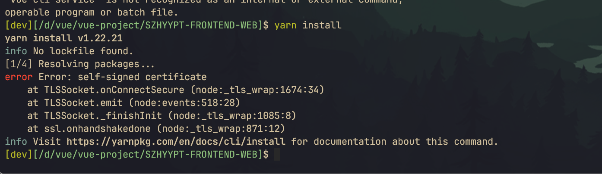

# yarn错误整理

## yarn 安装包时Resolving packages... 报“certificate has expired”
[原文链接](https://blog.csdn.net/Wjangia/article/details/135760090)

将yarn配置中的 strict-ssl 设置为 flase , 在 info yarn config 信息中， 'strict-ssl' 为 true，表示需要验证 HTTPS 证书。我们可以将 'strict-ssl' 设置为 false，跳过 HTTPS 证书验证。

使用命令yarn config set strict-ssl false将其改为 false 即可
