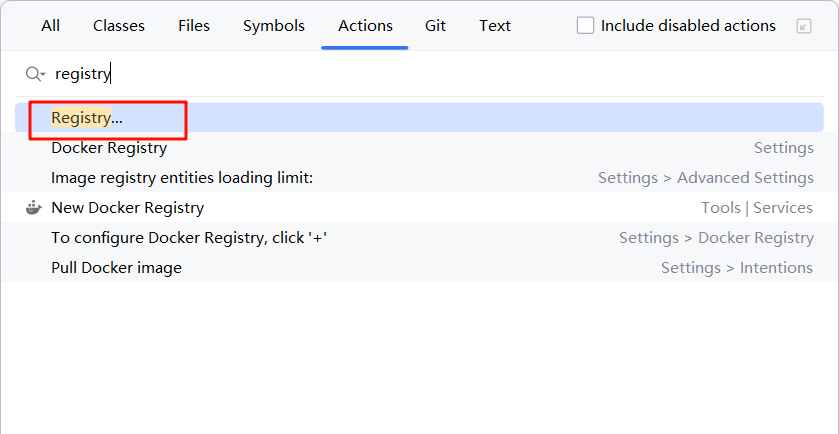
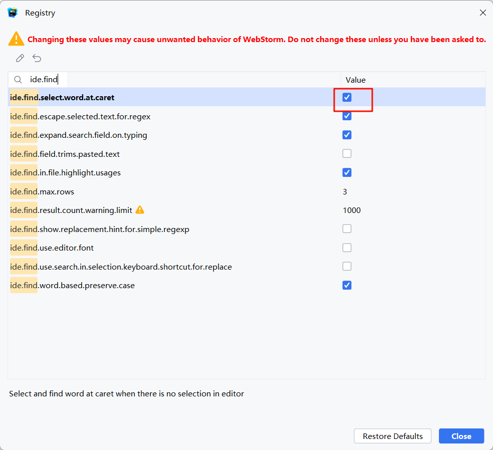

# 打开注册表方式
1. 双击shift选择Actions输入registry打开注册表

2. 找到指定值激活

# 直接复制选中单词
```text:no-line-numbers
ide.find.select.word.at.caret
```

# 展示内存

```text:no-line-numbers
show memory indicator
```

# 终端新ui(目前不推荐使用)
```text:no-line-numbers
ide.experimental.ui.new.terminal
```

# 启动时使用JDK版本
```text:no-line-numbers
Choose Boot Runtime for the IDE
```

# VM Option
```text:no-line-numbers
-Xms4g
-Xmx4g
-ea
-XX:+UseZGC
-XX:+IgnoreUnrecognizedVMOptions
-XX:+HeapDumpOnOutOfMemoryError
-XX:-OmitStackTraceInFastThrow
-Djdk.http.auth.tunneling.disabledSchemes=""
-Dkotlinx.coroutines.debug=off
-XX:ErrorFile=$USER_HOME/java_error_in_idea_%p.log
-XX:HeapDumpPath=$USER_HOME/java_error_in_idea.hprof
--add-opens=java.base/jdk.internal.org.objectweb.asm=ALL-UNNAMED
--add-opens=java.base/jdk.internal.org.objectweb.asm.tree=ALL-UNNAMED
-XX:ReservedCodeCacheSize=512m
-XX:SoftRefLRUPolicyMSPerMB=50
-XX:CICompilerCount=2
-XX:CompileCommand=exclude,com/intellij/openapi/vfs/impl/FilePartNodeRoot,trieDescend
-Dsun.io.useCanonCaches=false
-Dsun.java2d.metal=true
-Djbr.catch.SIGABRT=true
-Djdk.attach.allowAttachSelf=true
-Djdk.module.illegalAccess.silent=true
```
