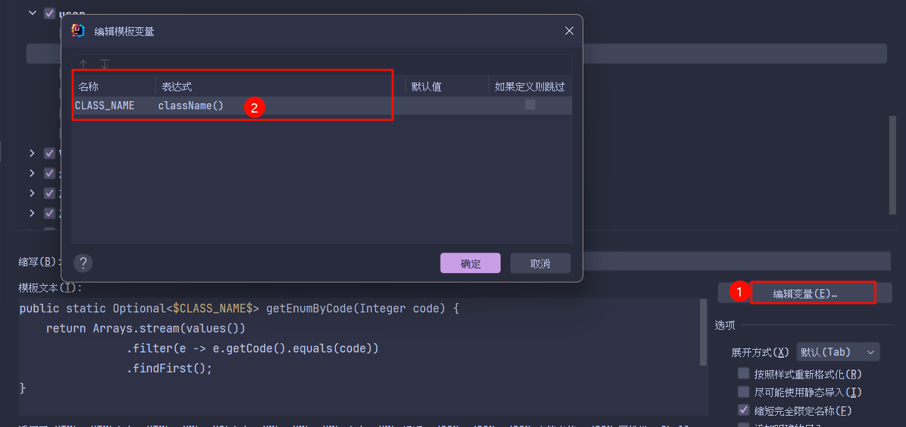

Idea配置Live Templates位置如上图
# File and Code Templates
## Includes
### File Header
```text
/**
* @description $description
* @author: 聂明智
* @date: ${DATE}-${TIME}
*/
```
## Code
### Junit5 Test Class
```text
#set($SOURCE_NAME_INDEX= $NAME.length() - 4)
#set($SOURCE_CLASS_NAME = $NAME.substring(0,$SOURCE_NAME_INDEX))
#set($BEAN_NAME = $SOURCE_CLASS_NAME.substring(0,1).toLowerCase() + $SOURCE_CLASS_NAME.substring(1))
import lombok.extern.slf4j.Slf4j;

import static org.junit.jupiter.api.Assertions.*;

import org.junit.jupiter.api.DisplayName;
import org.junit.jupiter.api.Test;
import org.mockito.InjectMocks;
import org.mockito.Spy;
import org.junit.jupiter.api.extension.ExtendWith;
import org.mockito.junit.jupiter.MockitoExtension;

#parse("File Header.java")

@ExtendWith(MockitoExtension.class)
@Slf4j
class ${NAME} {

    @Spy
    @InjectMocks
    ${SOURCE_CLASS_NAME} ${BEAN_NAME};

    ${BODY}
}
```

# live templates

## log

```text:no-line-numbers
private static final Logger log = LoggerFactory.getLogger($CLASS_NAME$.class);
```

## test

```text:no-line-numbers
@Test
@SneakyThrows
@DisplayName("")
void $METHOD_NAME$() {
    $METHOD_BODY$
}
```

## serial
```text:no-line-numbers
@Serial
private static final long serialVersionUID = 1L;
```

## sleep

```text:no-line-numbers
TimeUnit.SECONDS.sleep($END$);
```

## thread 新建一个线程:

```text:no-line-numbers
new Thread(() -> {
        $threadBody$
    }, $threadName$).start();
```

## @DNA

```text:no-line-numbers
@Data
@NoArgsConstructor
@AllArgsConstructor
```
## reg

```text:no-line-numbers
// region
```

## endreg

```text:no-line-numbers
// endregion
```

## getEnum
```
public static Optional<$CLASS_NAME$> getEnumByName(String name) {
    return Arrays.stream(values())
                .filter(e -> e.name().equals(name))
                .findFirst();
}
```
枚举类`$CLASS_NAME$`会失效获取不到ClassName需要自己配置

