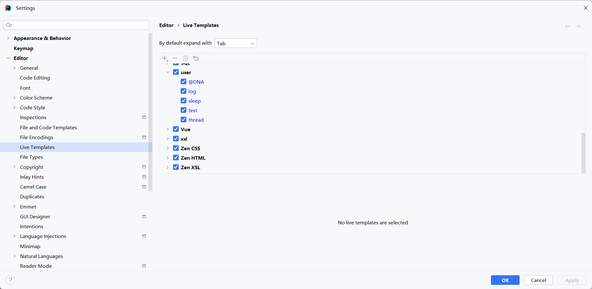

# 模板live templates

Idea配置Live Templates位置如上图

### log

```text
private static final Logger log = LoggerFactory.getLogger($CLASS_NAME$.class);
```

### test

```text
@Test
public void $METHOD_NAME$() {
    $METHOD_BODY$
}
```

### sleep

```text
try { TimeUnit.SECONDS.sleep($SECONDS$); } catch (InterruptedException e) { throw new RuntimeException(e); }
```

### thread 新建一个线程:

```text
new Thread(() -> {
        $threadBody$
    }, $threadName$).start();
```

### @DNA

```text
@Data
@NoArgsConstructor
@AllArgsConstructor
```
