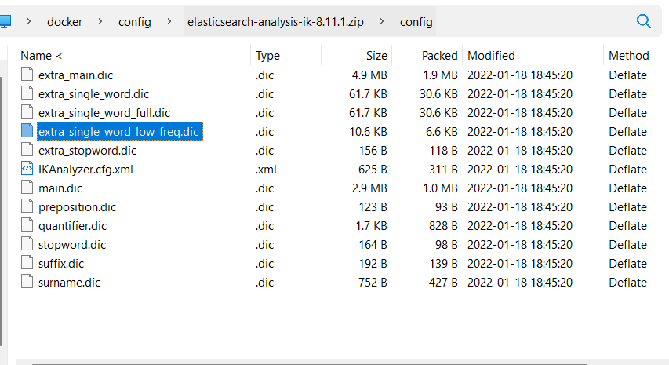

ik下载地址：https://github.com/medcl/elasticsearch-analysis-ik/releases?page=1
# 分词器配置文件
目录结构如图



**extra_single_word.dic**：常用的单个汉字  
**extra_single_word_full.dic**：全部的单个汉字  
**extra_single_word_low_freq.dic**：低频(不常用)单个汉字  
****IKAnalyzer.cfg.xml****：用来配置自定义词库  
**main.dic**：ik 原生内置的中文词库，总共有 27 万多条，只要是这些单词，都会被分在一起  
**quantifier.dic**：放了一些单位相关的词  
**suffix.dic**：放了一些后缀  
**surname.dic**：中国的姓氏  
**stopword.dic**：英文停用词  

**IKAnalyzer.cfg.xml** 内容如下:
```xml
<?xml version="1.0" encoding="UTF-8"?>
<!DOCTYPE properties SYSTEM "http://java.sun.com/dtd/properties.dtd">
<properties>
	<comment>IK Analyzer 扩展配置</comment>
	<!--用户可以在这里配置自己的扩展字典 -->
	<entry key="ext_dict">custom/mydict.dic;custom/single_word_low_freq.dic</entry>
	 <!--用户可以在这里配置自己的扩展停止词字典-->
	<entry key="ext_stopwords">custom/ext_stopword.dic</entry>
	<!--用户可以在这里配置远程扩展字典 -->
	<!-- <entry key="remote_ext_dict">words_location</entry> -->
	<!--用户可以在这里配置远程扩展停止词字典-->
	<!-- <entry key="remote_ext_stopwords">words_location</entry> -->
</properties>

```
ik 原生最重要的两个配置文件

**main.dic**：包含了原生的中文词语，会按照这个里面的词语去分词  
**stopword.dic**：包含了英文的停用词。  
**custom/ext_stopword.dic** 中包含了中文的一些扩展词  
什么是停用词？与其他词相比，功能词没有什么实际含义，比如'the'、'is'、'at'、'which'、'on'等

# 自定义分词库
每年都会涌现一些特殊的流行词,一般不会在 ik 的原生词典里， 自己补充自己的最新的词语，到 ik 的词库里面去

**IKAnalyzer.cfg.xml**：ext_dict，custom/mydict.dic 是在配置文件的默认文件，可以追加，也可以自定义

**想要词库生效，需要重启 es**

# 热更新 IK 分词使用方法
        目前该插件支持热更新 IK 分词，通过上文在 IK 配置文件中提到的如下配置
```xml
	<!--用户可以在这里配置远程扩展字典 -->
	<entry key="remote_ext_dict">location</entry>
	<!--用户可以在这里配置远程扩展停止词字典-->
	<entry key="remote_ext_stopwords">location</entry>
```
其中 `location` 是指一个 url，比如 `http://yoursite.com/getCustomDict`，该请求只需满足以下两点即可完成分词热更新。

该 http 请求需要返回两个头部(header)，一个是 `Last-Modified`，一个是 `ETag`，这两者都是字符串类型，只要有一个发生变化，该插件就会去抓取新的分词进而更新词库。

该 http 请求返回的内容格式是一行一个分词，换行符用 \n 即可。

满足上面两点要求就可以实现热更新分词了，不需要重启 ES 实例。

可以将需自动更新的热词放在一个 UTF-8 编码的 .txt 文件里，放在 nginx 或其他简易 http server 下，当 .txt 文件修改时，http server 会在客户端请求该文件时自动返回相应的 Last-Modified 和 ETag。可以另外做一个工具来从业务系统提取相关词汇，并更新这个 .txt 文件。
**IKAnalyzer.cfg.xml**配置文件中 location 配置为 ip:port/applicationName/es-dic 即可

```java
@GetMapping("/es-dic")
public String getIkAnalyzer(HttpServletResponse response) {
    //获取数据库存储的词库
    List<String> lists = service.searchAll();
    StringBuffer stringBuffer = new StringBuffer();
    lists.forEach(list->stringBuffer.append("\n"));

    response.setHeader("Etag",String.valueOf(lists.size()));
    response.setHeader("Last-Modified",String.valueOf(lists.size()));

    return stringBuffer.toString();
}
```
