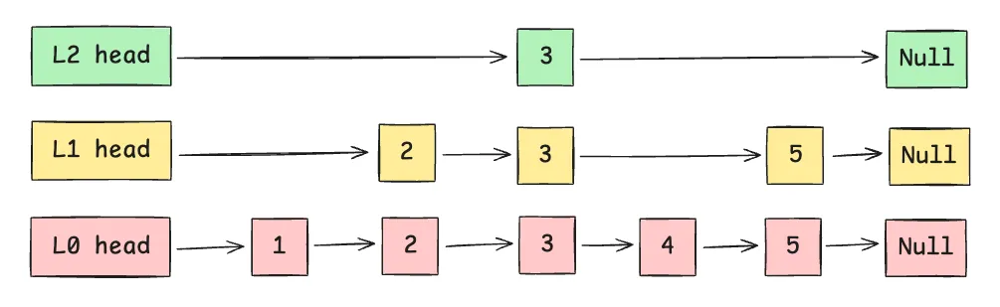

您提出的问题非常核心，直指 Redis 中 ZSET（有序集合）这一强大数据结构的精髓。为了同时实现您提到的三个特性——**元素唯一、元素与分数关联、按分数范围快速查找**——ZSET 在底层采用了一种非常精妙的复合数据结构。

### **核心答案：底层数据结构**

Redis 的 ZSET 在底层主要使用了两种数据结构来协同工作：

1.  **哈希表 (Hash Table)**：用于存储元素（member）和分数（score）的映射关系。
2.  **跳表 (Skip List)**：用于根据分数对元素进行排序，并支持高效的范围查找。

当一个 ZSET 对象同时满足以下两个条件时，Redis 会采用 **ziplist（压缩列表）** 进行编码以节省内存：
*   有序集合保存的元素数量小于 128 个；
*   所有元素成员的长度都小于 64 字节。
    当任何一个条件不满足时，Redis 就会将编码从 `ziplist` 转换为 `skiplist`。 `ziplist` 是一种内存优化结构，但在大规模数据下，其性能不如 `skiplist` 和哈希表的组合。因此，我们主要讨论后者，因为它更能体现 ZSET 设计的巧妙之处。

接下来，我们详细解析这两种数据结构如何协同工作，以满足您的所有要求。

---

### **1. 如何保证元素唯一性？**

**通过哈希表实现。**

*   ZSET 的所有元素（member）都存储在一个哈希表中。
*   哈希表的键（key）就是 ZSET 中的元素（member），而值（value）是该元素对应的分数（score）。
*   我们知道，哈希表的键本身就是唯一的。当你尝试向 ZSET 中添加一个已经存在的元素时，Redis 不会插入一个新元素，而是会更新该元素对应的分数。 这正是利用了哈希表键唯一的特性。

**操作示例：**
*   当你执行 `ZADD myzset 10 "redis"` 时，哈希表中会创建一个条目 `"redis" -> 10`。
*   如果你再次执行 `ZADD myzset 20 "redis"`，哈希表中不会新增条目，而是将 `"redis"` 对应的值从 10 更新为 20。

这种设计使得通过元素本身查找其分数的操作非常快，时间复杂度为 **O(1)**，例如 `ZSCORE` 命令。

### **2. 如何将元素与分数关联起来？**

**哈希表与跳表共同实现。**

*   **哈希表** 负责存储从 "元素" 到 "分数" 的直接映射。
*   **跳表** 则负责存储从 "分数" 到 "元素" 的映射，并且是排序的。

这两者内部通过指针或引用相互关联，确保数据的一致性。当你添加一个元素时，Redis 会同时在哈希表和跳表中进行操作。

*   在哈希表中，它直接存储了 `member -> score` 的关系。
*   在跳表中，每个节点都保存了元素成员（member）及其分数（score）。

这样一来，ZSET 就同时拥有了两种快速查找的能力：通过元素找分数（O(1)）和通过分数找元素（O(logN)）。

### **3. 如何实现按分数范围的快速查找？**

**通过跳表实现。**

跳表是一种非常高效的有序数据结构，可以看作是多层级的链表，其查找、插入、删除的平均时间复杂度都是 **O(logN)**，与平衡二叉树相当，但实现起来更简单。

*   **有序性**：跳表内部的所有节点都是根据分数从小到大排序的。如果分数相同，则按照元素的字典序进行排序。
*   **范围查找**：
    1.  当你执行一个按分数范围查找的命令（如 `ZRANGEBYSCORE`）时，Redis 首先会在跳表中快速定位到范围的起始点。这个定位过程的时间复杂度是 O(logN)。
    2.  一旦找到起始节点，由于跳表的最底层是一个有序的双向链表，Redis 只需要沿着这个链表向后遍历，直到超出范围的结束点即可。 这个遍历过程的复杂度与返回的元素数量（M）成正比，即 O(M)。

因此，一个按分数范围查找操作的总时间复杂度是 **O(logN + M)**，其中 N 是 ZSET 的总元素数，M 是返回的元素数。这在处理大规模有序数据时非常高效。

### **总结**

| 特性 | 实现方式 | 优势 | 相关命令示例 |
| --- | --- | --- | --- |
| **元素唯一** | **哈希表** 的键唯一特性 | 保证了集合中不会有重复的成员。 | `ZADD`, `ZSCORE` |
| **元素与分数关联** | **哈希表** 和 **跳表** 共同存储 | 既能通过元素快速获取分数，也能通过分数找到元素。 | `ZADD`, `ZSCORE` |
| **按分数范围快速查找** | **跳表** 的有序性和多层结构 | 能够以对数级时间复杂度定位范围起点，然后高效遍历。 | `ZRANGEBYSCORE`, `ZREVRANGEBYSCORE` |

综上所述，Redis ZSET 通过将哈希表和跳表这两种数据结构的优点结合起来，完美地实现了元素唯一性、成员与分数的映射以及高效的范围查询，使其成为排行榜、实时分析、优先级队列等场景的理想选择。

## 跳表
好的，没问题。我们来深入剖析一下 Redis 中跳表（Skip List）的精妙之处。

我会从 **为什么需要跳表** 开始，然后讲解 **它的结构**，**核心操作**，最后再分析 **Redis 为什么选择它**。

---

### 1. 为什么需要跳表？从有序链表说起

想象一下，为了对元素进行排序，我们最先想到的可能是**有序链表**。

一个普通的有序链表，所有元素从低到高串联起来：

```
Header -> 10 -> 21 -> 35 -> 50 -> 78 -> 99 -> Tail
```

**优点：**
*   插入和删除时，只需要修改相邻节点的指针，不需要移动大量元素，很方便。
*   天然有序。

**致命缺点：**
*   **查找效率极低**。比如我想查找值为 78 的节点，必须从头节点开始，一个一个地向后遍历，直到找到为止。其时间复杂度为 **O(N)**。当数据量巨大时，这会成为性能瓶颈。

为了解决这个问题，跳表应运而生。它的核心思想就是 **“升维”**，在原始链表的基础上，增加多级“**快速通道**”。



你可以把跳表想象成一个城市的交通网络：
*   **Level 0 (最底层)**：是包含所有站点的“普通公交线路”，站站都停。
*   **Level 1, Level 2...**：是“快速公交”或“地铁线路”，只停靠一些重要的换乘大站。

当你想从城市的一端到另一端时，你肯定会先坐地铁（高层索引）到离你目的地最近的大站，然后再换乘普通公交（底层链表）精确到达。跳表的查找过程就是如此。

跳跃表的多级结构有效地帮助我们跳过节点 1、2 和 4，直接到达 5。相比之下，链表需要遍历所有节点才能到达 5。
上图更是一种概念性表示，旨在使其更易于理解；它并不反映 skiplist 如何实际组织数据。那么，它实际上是如何构建的呢？
---

### 2. Redis 跳表的具体结构

实际上，每个节点都有一个指针数组（蓝色），其中的元素指向该节点参与的所有级别的下一个节点。例如，在图中，节点 1 有一个长度为 1 的指针数组，因为它只参与级别 0，而这个指针指向节点 2。

在 Redis 的实现中，一个跳表由两部分构成：`zskiplist` 和 `zskiplistNode`。

#### **`zskiplistNode` (跳表节点)**

这是构成跳表的基本单元。每个节点包含以下关键信息：

```c
// Redis 源码中的结构（简化版）
typedef struct zskiplistNode {
    // 元素成员 (member)，在 ZSET 中是一个 sds 对象
    sds ele;
    // 分数 (score)
    double score;
    // 后退指针，用于从后向前遍历
    struct zskiplistNode *backward;
    // 层级信息（柔性数组）
    struct zskiplistLevel {
        // 前进指针，指向同一层的下一个节点
        struct zskiplistNode *forward;
        // 跨度 (span)，表示当前节点到 forward 指向节点之间有多少个节点
        unsigned long span;
    } level[];
} zskiplistNode;
```

**关键点解释：**
*   `ele` 和 `score`：就是 ZSET 中存储的元素和它的分数。跳表根据 `score` 排序，如果 `score` 相同，则根据 `ele` 的字典序排序。
*   `backward`：这是一个指向前一个节点的指针。它使得跳表的最底层构成了一个**双向链表**，方便从表尾向表头遍历（例如 `ZREVRANGE` 命令）。
*   `level[]`：这是一个柔性数组，是跳表实现“分层”的核心。一个节点可以同时存在于多个层级。`level[0]` 存放第一层的前进指针，`level[1]` 存放第二层的...以此类推。
*   `span`（跨度）：这是 Redis 跳表一个非常精妙的设计。它记录了当前节点的当前层级指针，到下一个节点之间，跨越了多少个底层节点。**这个 `span` 属性是实现 `ZRANK` (计算排名) 命令时间复杂度为 O(logN) 的关键**。

#### **`zskiplist` (跳表结构体)**

这个结构体持有整个跳表的信息：

```c
// Redis 源码中的结构（简化版）
typedef struct zskiplist {
    // 头节点和尾节点指针
    struct zskiplistNode *header, *tail;
    // 跳表中的节点数量
    unsigned long length;
    // 跳表中层级最高的节点的层级数 (不含头节点)
    int level;
} zskiplist;
```

**关键点解释：**
*   `header`: 是一个不存储任何实际数据的“哨兵”头节点，它的层级是固定的最高层级（32 或 64），极大地简化了插入和删除的边界条件处理。
*   `tail`: 指向跳表的最后一个节点，方便快速从尾部操作。
*   `length`: 记录了 ZSET 的成员数量，`ZCARD` 命令可以直接返回这个值，时间复杂度 O(1)。
*   `level`: 记录当前跳表实际达到的最高层级。

---

### 3. 跳表的核心操作

#### **A. 查找过程 (O(logN))**

查找过程是所有操作的基础，我们以查找分数为 50 的节点为例：

1.  从 `header` 节点的**最高层**开始。
2.  在当前层，向右移动，直到下一个节点的分数**大于等于** 50，或者到达了当前层的末尾。
    *   假设在 Level 3，`header` 的下一个是 99（>50），所以无法前进。
3.  从当前节点**下降一层**，到 Level 2。
4.  在 Level 2，重复步骤 2。从 `header` 向右移动，遇到 35（<50），可以前进。在 35 的下一个是 99（>50），无法前进。
5.  从 35 节点**下降一层**，到 Level 1。
6.  在 Level 1，重复步骤 2。从 35 向右移动，遇到 50（==50），找到了！

整个过程像是在走楼梯，不断地向右、向下，最终精确地定位到目标节点。由于每次都是跳过大量中间节点，其平均时间复杂度为 **O(logN)**。

#### **B. 插入过程 (O(logN))**

1.  **确定新节点的层级**：Redis 通过一个随机算法为新节点生成一个层级（1 到最大层级之间）。这是一种**概率性**的平衡策略，使得节点在各层级的分布大致均匀。高层级的节点少，低层级的节点多，形成金字塔结构。
2.  **查找插入位置**：类似查找操作，找到每一层中新节点应该插入的位置，并记录下这些位置的前驱节点（保存在一个 `update` 数组中）。
3.  **创建并链接节点**：创建新节点，然后在 `update` 数组记录的每个前驱节点后面，将新节点链接进去。同时，还需要更新 `backward` 指针和所有受影响的 `span` 值。

在插入新节点时，跳表随机决定它应该占据多少层级。  
如果一个节点占据第 3 层，例如，它也会占据第 3 层以下的所有层级，即它占据第 0 层、第 1 层、第 2 层和第 3 层。  
这也意味着每个新节点有 100%的概率占据层级 0（否则它会去哪里呢？）。  
节点占据更高层级的概率随着层级的增加而减少四倍（即衰减因子=1/4=25%）。具体如下：  
- level 0, 100% 层级 0，100%
- level 1, 25% (=100%/4) 层级 1，25%（=100%/4）
- level 2, 6.25% (=25%/4) 第 2 级，6.25%（=25%/4）
- level 3, 1.56% (=6.25%/4) 第 3 级，1.56%（=6.25%/4）
- ...

理论上，随着更多节点的插入，跳表的级数可以无限增长。为了限制内存使用，Redis 将最大级数限制为 32

#### **C. 删除过程 (O(logN))**

1.  **查找并记录前驱节点**：与插入类似，首先找到要删除的节点，并记录下它在每一层的前驱节点。
2.  **修改指针和跨度**：修改所有前驱节点的 `forward` 指针，让它们“跳过”被删除的节点，直接指向被删除节点的下一个节点。同时也要更新受影响的 `span` 值。
3.  **释放节点**：释放被删除节点的内存。

---

### 4. Redis 为什么选择跳表而不是平衡树？

像红黑树（Red-Black Tree）这样的平衡二叉搜索树，同样可以实现 O(logN) 的查找、插入、删除，那为什么 Redis 选择了跳表呢？

1.  **实现更简单**：相对于红黑树复杂的旋转和着色规则，跳表的实现和调试要简单得多。代码可读性和可维护性更高。
2.  **范围查找效率相近且更易实现**：在跳表中，进行范围查找（如 `ZRANGEBYSCORE`）非常直观。只需定位到范围的起始点（O(logN)），然后通过底层的双向链表向后遍历即可。在红黑树上做范围查找，需要中序遍历，逻辑相对复杂一些。
3.  **支持 O(logN) 的排名查询**：通过 `span` 属性的设计，Redis 的跳表可以非常高效地计算出任意一个元素的排名（`ZRANK`）。在查找元素的过程中，将沿途经过的所有 `span` 值累加起来，就是该元素的排名。要在红黑树上实现同等效率的排名查询，需要在每个节点上额外存储其子树的节点数量，这会增加树在旋转时的更新负担和复杂性。
4.  **并发场景下更友好 (理论上)**：虽然 Redis 本身是单线程模型，但跳表的设计在并发环境中比红黑树更有优势。因为对跳表的修改影响的通常是局部的前后节点，锁定的粒度可以更小。而红黑树的旋转操作可能会影响从叶节点到根节点的整条路径，需要锁定的范围更大。

### **总结**

Redis 的跳表是一种兼具了**查找效率（O(logN)）**、**范围查询便利性**和**实现简洁性**的动态数据结构。它通过**随机化的分层**思想，巧妙地解决了有序链表查找效率低下的问题，并通过 `span` 属性的引入，高效地支持了排名查询。正是这种种优点，使其成为实现 ZSET 的理想选择。

希望这次详细的讲解能帮助您更好地理解 Redis 跳表。如果您还有其他问题，请随时提出！
