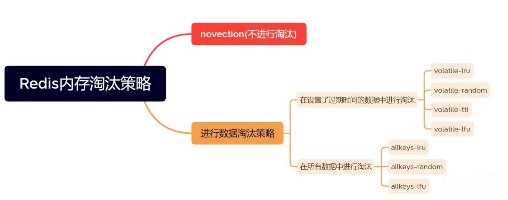
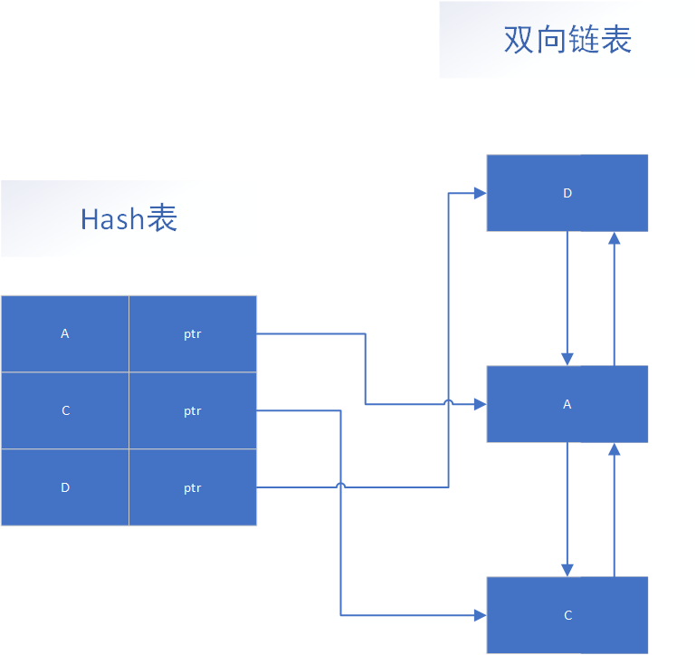

# Redis的数据过期清除策略

设计过期时间
```redis
-- 设置键值对的时候，同时指定过期时间（精确到秒）
set <key> <value> ex <n>
-- 设置键值对的时候，同时指定过期时间（精确到毫秒）
set <key> <value> px <n>
-- 设置键值对的时候，同时指定过期时间（精确到秒）
setex <key> <n> <valule>
```
如果你想查看某个 key 剩余的存活时间，可以使用 `TTL <key>` 命令。

# 两种策略

## 存活时间
expire数据结构 Redis中可以使用expire命令设置一个键的存活时间(ttl: time to live)，过了这段时间，该键就会自动被删除。
```c 
typedef struct redisDb {
    dict *dict; -- key Value
    dict *expires; -- key ttl
    dict *blocking_keys;
    dict *ready_keys;
    dict *watched_keys;
    int id;
} redisDb;
``` 
上面的代码是Redis 中关于数据库的结构体定义，这个结构体定义中除了 id 以外都是指向字典的指针，其中我们只看 dict 和 expires。  
dict 用来维护一个 Redis 数据库中包含的所有 Key-Value 键值对，expires则用于维护一个 Redis 数据库中设置了失效时间的键(即key与失效时间的映射)。  
当我们使用 expire命令设置一个key的失效时间时，Redis 首先到 dict 这个字典表中查找要设置的key是否存在，如果存在就将这个key和失效时间添加到 expires 这个字典表。  
当我们使用 setex命令向系统插入数据时，Redis 首先将 Key 和 Value 添加到 dict 这个字典表中，然后将 Key 和失效时间添加到 expires 这个字典表中。  
简单地总结来说就是，设置了失效时间的key和具体的失效时间全部都维护在 expires 这个字典表中。  
## **过期策略**：定期删除 + 惰性删除
#### 1. 惰性删除 (Passive Deletion / Lazy Expiration)

*   **工作方式**：不主动去检查键是否过期，而是在每次客户端访问这个键时，先检查它的过期时间。如果发现已经过期，就立即删除它，并返回 `nil`（空），就像这个键从未存在过一样。
*   **优点**：非常节省 CPU。它只在键被访问时才进行检查，避免了对大量从未被再次访问的过期键进行无效的检查。
*   **缺点**：如果一个键设置了过期时间，但之后再也没有被访问过，那么它就会一直占用着内存，无法被释放。这可能会导致大量的“内存僵尸”。

#### 2. 定期删除 (Active Deletion / Periodic Expiration)

*   **工作方式**：为了弥补惰性删除的缺点，Redis 会在后台定期地、随机地抽取一部分设置了过期时间的键进行检查。如果发现有过期的，就将其删除。
*   **执行逻辑**：
    *   Redis 每秒执行 `server.hz` 次这个清理任务（`hz` 的值默认为10，可在配置文件中设置）。
    *   它不是遍历所有的键（因为那样会非常耗时，阻塞主线程），而是随机抽取一部分（默认20个）来进行检查。
    *   如果发现过期的键比例超过了25%，它会立即重复这个过程，直到比例降到25%以下或者本次任务超时，以避免长时间占用CPU。
*   **优点**：通过定期清理，可以有效地回收那些“僵尸键”占用的内存，减少内存浪费。
*   **缺点**：
    *   **CPU消耗**：这是一个需要权衡的策略。清理任务执行得越频繁、检查的键越多，对CPU的消耗就越大。
    *   **不保证实时性**：由于是随机抽查，总会有一些过期键被漏掉，无法被立即删除。

**总结：Redis 的过期策略是“惰性删除 + 定期删除”两种策略的结合。** 它们互相配合，在 CPU 性能和内存回收效率之间取得了一个很好的平衡。
## 定期删除 + 惰性删除存在的问题  
如果某个key过期后，定期删除没删除成功，然后也没再次去请求key，也就是说惰性删除也没生效。  
这时，如果大量过期的key堆积在内存中，redis的内存会越来越高，导致redis的内存块耗尽。那么就应该采用内存淘汰机制。

## 参数配置
### hz
Redis服务器会每隔一段时间（由hz配置项决定）主动进行过期键的删除。这种策略通过在后台线程中扫描一定数量的数据库键并删除过期键，以减少对客户端请求的影响。定期删除的执行频率可以通过调整hz配置项来控制

hz配置项的默认值是10，即每秒执行10次基于时间的事件。这意味着Redis服务器会每100毫秒进行一次定期删除操作，清理过期键，并在需要时关闭闲置的客户端连接。

```redis
config set hz 200
```

### maxmemory-samples
在Redis中，可以使用`maxmemory-samples`配置项来设置每次清理过期键时要检查的最大键数。这个配置项决定了Redis在执行清理过期键任务时一次检查多少个键。  
默认情况下`，maxmemory-samples`的值是5，表示Redis每次清理过期键时会检查5个键。这个值可以根据实际需求进行调整。  
要修改`maxmemory-samples`的值，可以在redis.conf文件中找到相应的配置项，并将其设置为所需的值。然后，重新启动Redis服务器使配置生效。  
需要注意的是，增加`maxmemory-samples`的值可能会增加Redis服务器的处理开销，因为每次清理过期键任务都需要检查更多的键。因此，应根据服务器的性能和负载情况来适当调整`maxmemory-samples`的值。  
另外，还可以通过调用CONFIG SET命令动态地修改`maxmemory-samples`的值，而不需要重启Redis服务器。例如，可以使用以下命令将`maxmemory-samples`的值设置为10：
```redis
CONFIG SET maxmemory-samples 10
```
总之，通过修改Redis的`maxmemory-samples`配置项，可以设置一次检查多少个过期键。根据服务器的性能和负载情况，可以适当调整这个值。
# Redis中的缓存淘汰策略
**淘汰机制解决的问题是：当 Redis 的内存使用达到上限（`maxmemory` 配置项）时，为了给新的数据腾出空间，应该删除哪些现有的键？**

这个机制是 Redis 在内存不足时的“求生法则”。如果内存满了，又没有淘汰机制，那么 Redis 在接收到新的写命令时就会返回错误（这是默认行为）。

Redis 提供了多种淘汰策略，你可以在 `redis.conf` 文件中通过 `maxmemory-policy` 来配置。

以下是主要的几种策略（自 Redis 4.0 后，策略更加完善）：

#### 1. 针对设置了过期时间的键 (Volatile)

*   `volatile-lru`: **(最常用)** 在所有设置了过期时间的键中，移除最近最少使用的（Least Recently Used）。
*   `volatile-lfu`: 在所有设置了过期时间的键中，移除最不经常使用的（Least Frequently Used）。(Redis 4.0+ 新增)
*   `volatile-ttl`: 在所有设置了过期时间的键中，移除剩余存活时间最短的（Time To Live）。
*   `volatile-random`: 在所有设置了过期时间的键中，随机移除一个。

#### 2. 针对所有键 (Allkeys)

*   `allkeys-lru`: **(非常常用)** 在所有的键中（无论是否设置过期时间），移除最近最少使用的。当你将 Redis 用作纯缓存时，这通常是最好的选择。
*   `allkeys-lfu`: 在所有的键中，移除最不经常使用的。(Redis 4.0+ 新增)
*   `allkeys-random`: 在所有的键中，随机移除一个。

#### 3. 不淘汰

*   `noeviction`: **(默认策略)** 当内存达到上限时，不删除任何键。此时，所有会导致内存增加的写命令（如 `SET`, `LPUSH` 等）都会返回错误，但读命令（如 `GET`）仍然可以正常执行。这种策略适用于数据不能被丢失的场景。

设置Redis最大内存  
```redis
CONFIG SET maxmemory 4gb
```
Redis提供了8种缓存淘汰策略，如下图所示：

**不淘汰数据**：  
1. **noeviction**：不进行淘汰数据。一旦缓存被写满，再有写请求进来，Redis就不再提供服务，而是直接返回错误。Redis 用作缓存时，实际的数据集通常都是大于缓存容量的，总会有新的数据要写入缓存，这个策略本身不淘汰数据，也就不会腾出新的缓存空间，我们不把它用在 Redis 缓存中。  

**设置过期时间**：  
2. **volatile-ttl**：在设置了过期时间的键值对中，移除即将过期的键值对。  
3. **volatile-random**：在设置了过期时间的键值对中，随机移除某个键值对。  
4. **volatile-lru**：在设置了过期时间的键值对中，移除最近最少使用的键值对。  
5. **volatile-lfu**：在设置了过期时间的键值对中，移除最近最不频繁使用的键值对  
**所有数据进行淘汰**：  
6. **allkeys-random**：在所有键值对中，随机移除某个key。  
7. **allkeys-lru**：在所有的键值对中，移除最近最少使用的键值对。  
8. **allkeys-lfu**：在所有的键值对中，移除最近最不频繁使用的键值对。  

> 通常情况下推荐优先使用 **allkeys-lru** 策略。这样可以充分利用 LRU 这一经典缓存算法的优势，把最近最常访问的数据留在缓存中，提升应用的访问性能。  
如果你的业务数据中有明显的冷热数据区分，建议使用 **allkeys-lru** 策略。  
如果业务应用中的数据访问频率相差不大，没有明显的冷热数据区分，建议使用 **allkeys-random** 策略，随机选择淘汰的数据就行。
如果没有设置过期时间的键值对，那么 **volatile-lru**，**volatile-lfu**，**volatile-random** 和 **volatile-ttl** 策略的行为, 和 **noeviction** 基本上一致。
如何设置策略
```redis
-- 查看目前的策略
config get  maxmemory-policy
-- 根据自身的实际情况 选择一种策略进行设置
config set  maxmemory-policy volatile-lfu
```
# Redis中的LRU和LFU算法
## 1. LRU算法

采用Hash表 + 双向链表的结构，利用Hash表确保数据查找的时间复杂度是O(1)，双向链表又可以使数据插入/删除等操作也是O(1)。

LRU 算法的全称是 Least Recently Uses，按照最近最少使用的原则来筛选数据，最不常用的数据会被筛选出来。LRU 会把所有的数据组织成一个链表，链表的头和尾分别表示 MRU 端和 LRU 端，分别代表最近最常使用的数据和最近最不常用的数据。  
LRU 算法在实际实现时，需要用链表管理所有的缓存数据，移除元素时直接从链表队尾移除，增加时加到头部就可以了，但这会带来额外的空间开销。而且，当有数据被访问时，需要在链表上把该数据移动到 MRU 端，如果有大量数据被访问，就会带来很多链表移动操作，会很耗时，进而会降低 Redis 缓存性能。  
所以，在 Redis 中，LRU 算法被做了简化，以减轻数据淘汰对缓存性能的影响。具体来说：Redis 默认会记录每个数据的最近一次访问的时间戳（由键值对数据结构 RedisObject 中的 lru 字段记录）。然后，Redis 在决定淘汰的数据时，第一次会随机选出 N 个数据，把它们作为一个候选集合。  
接下来，Redis 会比较这 N 个数据的 lru 字段，把 lru 字段值最小的数据从缓存中淘汰出去。当需要再次淘汰数据时，Redis 需要挑选数据进入第一次淘汰时创建的候选集合。这里的挑选标准是：能进入候选集合的数据的 lru 字段值必须小于候选集合中最小的 lru 值。  
当有新数据进入候选数据集后，如果候选数据集中的数据个数达到了 N 个，Redis 就把候选数据集中 lru 字段值最小的数据淘汰出去。这样一来，Redis 缓存不用为所有的数据维护一个大链表，也不用在每次数据访问时都移动链表项，提升了缓存的性能。  
Redis 提供了一个配置参数 `maxmemory-samples`，这个参数就是 Redis 选出的数据个数 N。例如，我们执行如下命令，可以让 Redis 选出 100 个数据作为候选数据集：  
`CONFIG SET maxmemory-samples 100`  
之所以这样处理也是因为以下几个原因：
- 筛选规则，Redis是随机抽取一批数据去按照淘汰策略排序，不再需要对所有数据排序；
- 性能问题，每次数据访问都可能涉及数据移位，性能会有少许损失；
- 内存问题，Redis对内存的使用一向很“抠门”，数据结构都很精简，尽量不使用复杂的数据结构管理数据；
- 策略配置，如果线上Redis实例动态修改淘汰策略会触发全部数据的结构性改变，这个Redis系统无法承受的。

### 近似LRU而非精准LRU

首先需要明确一个核心概念：**Redis 实现的并非传统教科书意义上的精准LRU，而是一种近似LRU (Approximated LRU) 算法**。

这样做的主要原因是出于对内存和性能的极致追求。传统的LRU算法通常需要借助哈希表和双向链表，虽然能做到精准淘汰，但每个键都需要额外的指针来维护链表，这会带来显著的内存开销。 对于Redis这样一个对内存占用极为敏感的系统来说，这种开销是难以接受的。因此，Redis选择了一种空间效率更高、性能也足够好的近似实现方案。

### 核心数据结构：`redisObject`

Redis实现近似LRU的关键，在于其核心对象结构 `redisObject`。在每个 `redisObject` 的元数据中，包含了一个名为 `lru` 的字段。

*   **`lru` 字段**: 这是一个24位的字段，用于存储该对象最后一次被访问的时间戳。

这个时间戳并不是标准的Unix时间戳，而是Redis服务器内部维护的一个全局时钟 `server.lruclock` 的值。这个全局时钟的分辨率通常是秒级的（在较新版本中可能是毫秒级），它会周期性地更新。

当一个key被访问时（例如通过 `GET` 命令），Redis会使用全局的 `lruclock` 来更新这个key对应 `redisObject` 的 `lru` 字段。

**数据结构设计考量**：
*   **空间效率**：使用一个24位的整数字段来存储访问时间，相比于传统LRU实现中需要两个指针（例如64位系统下为16字节）来维护链表关系，极大地节省了内存空间。
*   **访问效率**：更新时间戳只是一个简单的写操作，时间复杂度为O(1)，对正常命令的执行性能影响微乎其微。

### 核心淘汰算法：随机采样与池化策略

当Redis的内存使用达到 `maxmemory` 限制时，就会触发淘汰机制。如果配置的淘汰策略是 `allkeys-lru` 或 `volatile-lru` 等，近似LRU算法便会启动。 其工作流程如下：

#### 1. 随机采样 (Random Sampling)

Redis并不会遍历所有的键来寻找最久未被使用的那一个（这会导致严重的性能问题）。相反，它会随机地选取N个键（这个N值可以通过 `maxmemory-samples` 参数配置，默认为5）。

#### 2. 比较与淘汰

Redis会比较这N个被采样键的 `lru` 字段值，其中**`lru` 值最小的那个键**（意味着距离当前全局时钟最久远，即最久未被使用），就会被识别为“最差”的键。

#### 3. 淘汰池 (Eviction Pool) - Redis 3.0及之后的优化

从Redis 3.0开始，算法得到了显著增强。它引入了一个大小为16（硬编码）的候选池（Eviction Pool）。

*   **填充与维护**：每次进行采样时，新采样的键会与淘汰池中已有的键进行比较。新采样的键如果其空闲时间（`lruclock` - `key.lru`）比池中任何一个键都长，它就会被加入到池中，并将池中最“年轻”（空闲时间最短）的那个键踢出去，以维持池的大小。
*   **最终淘汰**：在填充和维护完淘汰池之后，Redis会从整个池中选择**空闲时间最长**（即 `lru` 值最小）的那个键进行最终的淘汰。

**算法优势**：
*   **性能高效**：通过随机采样避免了全局扫描，保证了淘汰过程的性能，不会阻塞主线程。
*   **效果近似**：实验和理论证明，增加采样数量（`maxmemory-samples`）可以让近似LRU算法的效果非常接近于理论上的精准LRU。 当采样值为10时，其表现已经和理论LRU非常相似。
*   **池化优化**：淘汰池的设计，使得算法具有了一定的“记忆能力”。它保存了一批“比较差”的候选者，后续的淘汰决策可以在一个更优的集合里进行，从而让淘汰的选择更加精准，进一步提升了近似算法的效果。

### LRU相关配置策略

在 `redis.conf` 中，与LRU相关的淘汰策略主要有：

*   `allkeys-lru`：从所有的key中，使用近似LRU算法进行淘汰。这是最常用的缓存淘汰策略。
*   `volatile-lru`：仅从设置了过期时间（expire）的key中，使用近似LRU算法进行淘汰。这种策略适合于将Redis同时用作持久化存储和缓存的场景。

### 总结

| 方面 | 实现方式 | 优势与考量 |
| :--- | :--- | :--- |
| **核心思想** | 近似LRU算法，而非精准LRU | 牺牲一定的精准度，换取极高的内存效率和性能。 |
| **数据结构** | 在`redisObject`中内嵌一个24位的`lru`字段，记录最后访问时间戳。 | 相比传统双向链表+哈希表的实现，极大节省了内存开销。 |
| **淘汰算法** | 1. 达到内存上限时触发。 <br> 2. 随机采样N个键（`maxmemory-samples`）。<br>3. （Redis 3.0+）将采样键与一个候选池中的键比较，更新候选池。<br> 4. 从候选池中淘汰最久未被访问的键。 | 避免了全量扫描，执行速度快，对服务性能影响小；通过调整采样数可以平衡精准度和性能。 |

综上所述，Redis的LRU实现是一个非常经典的设计，它完美地体现了在系统工程中如何进行权衡（Trade-off）。通过一个轻量级的数据结构和一个高效的近似算法，成功地在内存、性能和淘汰精准度之间找到了一个绝佳的平衡点。
### 2. LFU算法

LFU是在Redis4.0后出现的，它的核心思想是根据key的最近被访问的频率进行淘汰，很少被访问的优先被淘汰，被访问的多的则被留下来。LFU算法能更好的表示一个key被访问的热度。假如你使用的是LRU算法，一个key很久没有被访问到，只刚刚是偶尔被访问了一次，那么它就被认为是热点数据，不会被淘汰，而有些key将来是很有可能被访问到的则被淘汰了。  
如果使用LFU算法则不会出现这种情况，因为使用一次并不会使一个key成为热点数据。它的使用与LRU有所区别：
> **LFU (Least Frequently Used)** ：最近最不频繁使用，跟使用的次数有关，淘汰使用次数最少的。
>
> **LRU (Least Recently Used)**：最近最少使用，跟使用的最后一次时间有关，淘汰最近使用时间离现在最久的。

LRU的最近最少使用实际上并不精确，考虑下面的情况，如果在 “|” 处删除，那么A距离的时间最久，但实际上A的使用频率要比D频繁，所以合理的淘汰策略应该是淘汰D。LFU就是为应对这种情况而生的。
```txt
 ~~~~~A~~~~~A~~~~~A~~~~A~~~~~A~~~~~A~~|
 ~~R~~R~~R~~R~~R~~R~~R~~R~~R~~R~~R~~R~|
 ~~~~~~~~~~C~~~~~~~~~C~~~~~~~~~C~~~~~~|
 ~~~~~D~~~~~~~~~~D~~~~~~~~~D~~~~~~~~~D|
```
每个波浪号代表一秒，A 每五秒，R 每两秒，C 和 D 每十秒 ， 最近被访问的字符是 D，但显然按照现有的规律，下一个被访问的更可能是 R 而不是 D。  
LFU 实现比较复杂，需要考虑几个问题:
如果实现为链表，当对象被访问时按访问次数移动到链表的某个有序位置可能是低效的，因为可能存在大量访问次数相同的 key，最差情况是O(n) .  
某些 key 访问次数可能非常之大，理论上可以无限大，但实际上我们并不需要精确的访问次数.  
访问次数特别大的 key 可能以后都不再访问了，但是因为访问次数大而一直占用着内存不被淘汰，需要一个方法来逐步“驱除”（有点 LRU的意思），最简单的就是逐步衰减访问次数.  
Redis 只用了 24bit （server.lruclock 也是24bit）来记录上述的信息:  
访问次数的计算如下：
```c 
uint8_t LFULogIncr(uint8_t counter) {
    if (counter == 255) return 255;
    double r = (double)rand()/RAND_MAX;
    double baseval = counter - LFU_INIT_VAL;
    if (baseval < 0) baseval = 0;
    double p = 1.0/(baseval*server.lfu_log_factor+1);
    if (r < p) counter++;
    return counter;
}
```
核心就是访问次数越大，访问次数被递增的可能性越小，最大 255，可以在配置 redis.conf 中写明访问多少次递增多少。由于访问次数是有限的，所以第一个问题也被解决了，直接一个255数组或链表都可以。  
16bit 部分保存的是时间戳的后16位（分钟），表示上一次递减的时间，算法是这样执行，随机采样N个key，检查递减时间，如果距离现在超过 N 分钟（可配置），则递减或者减半（如果访问次数数值比较大）。  
此外，由于新加入的 key 访问次数很可能比不被访问的老 key小，为了不被马上淘汰，新key访问次数设为 5。

理解 Redis LFU 的关键在于明白它并非一个“精确”的 LFU 实现，而是一种“近似”的、兼顾了性能和内存占用的巧妙设计。传统的 LFU 算法需要为每个键维护一个精确的访问计数器，并在一个复杂的数据结构（如最小堆）中进行排序，这在 Redis 这种对性能和内存要求极高的场景下是不可接受的。

因此，Redis 从 4.0 版本开始引入的 LFU 驱逐策略，其核心原理主要建立在两大基石之上：**概率计数器（Morris Counter）** 和 **访问时间衰减机制**。

### 1. 核心数据结构：概率性计数与节省空间

为了在 `redisObject` 这个核心对象中尽可能少地占用内存，Redis 的 LFU 实现并没有使用一个标准的整型来存储每个 key 的访问频率。相反，它与 LRU 策略共享了对象中的同一个 `lru` 字段（24位）。这24位空间被划分如下：

*   **`ldt` (Last Decrement Time)**: 8位，用于记录计数器上一次衰减的时间（分钟为单位）。
*   **`counter`**: 16位，用于存储访问频率的计数值。

这里的 `counter` 并非一个简单的线性计数器。如果每次访问都直接加1，那么经常被访问的热点 key 的计数值会迅速增长，导致新加入的 key 几乎没有机会“崭露头角”，而且很快会达到16位的上限。

为了解决这个问题，Redis 采用了 **Morris Counter**，一种概率性计数算法。其核心思想是：

**计数值越高的键，其计数器增加的概率就越低。**

这种方式带来了两个好处：
*   **节省空间**：用较少的位数（16位）就能表示一个非常大的访问量范围。
*   **对数增长**：计数器的增长是呈对数趋势的，可以有效地区分不同访问热度的 key，即使它们的访问次数相差巨大。

具体实现上，每次访问一个 key 时，算法会根据当前 `counter` 的值和一个可配置的 `lfu-log-factor` 参数来决定是否要增加计数器。简化的逻辑如下：
1.  生成一个0到1之间的随机数 `r`。
2.  计算一个概率 `p`，这个概率与当前 `counter` 的值成反比。`counter` 越大，`p` 越小。
3.  只有当 `r < p` 时，才会对 `counter` 执行加1操作。

通过 `lfu-log-factor` 参数，我们可以调整计数器增长的灵敏度。`factor` 越大，计数器增长得越慢，需要更多的访问次数才能达到较高的计数值。

### 2. 适应变化：访问频率的衰减机制

单纯记录访问频率会导致一个问题：一个曾经的热点 key，即使后来不再被访问，它的计数值依然很高，会长时间“霸占”缓存空间，无法适应访问模式的变化。

为此，Redis 引入了 **衰减（Decay）机制**。它的原理很简单：**如果一个 key 在一段时间内没有被访问，它的计数值就应该被降低**。

这个机制是通过前面提到的8位 `ldt` 字段和 `lfu-decay-time` 配置参数协同工作的。具体流程如下：
1.  当一个 key 被访问时，程序会检查当前时间与该 key 的 `ldt` 记录的时间差。
2.  `lfu-decay-time` 参数定义了计数值衰减一半所需要经过的时间（单位是分钟）。
3.  根据经过的时间和 `lfu-decay-time`，计算出需要对 `counter` 进行衰减的量。例如，如果 `lfu-decay-time` 设置为1，而距离上次衰减已经过去了3分钟，那么计数器就会被减半3次。
4.  衰减后，再执行前面提到的概率性增加计数的逻辑。

这个衰减机制确保了 LFU 算法能够适应访问模式的动态变化，让“旧”的热点数据有机会被淘汰，为“新”的热点数据腾出空间。

### 3. 淘汰策略：近似的采样淘汰

当 Redis 内存达到上限（`maxmemory`），需要触发淘汰时，它并不会遍历所有的 key 去寻找那个计数值最低的 key，因为这同样会带来巨大的性能开销。

和 LRU 策略一样，LFU 也采用了一种 **近似的随机采样** 方式：
1.  Redis 会随机选取 `maxmemory-samples` 个 key（默认是5个）放入一个候选池中。
2.  然后，它会比较这几个候选 key 的 `counter` 值。
3.  计数值最低的那个 key 将被淘汰。

这种采样方式在性能和淘汰精度之间取得了很好的平衡。虽然不能保证100%淘汰掉全局最不常用的 key，但在大多数场景下，其效果已经非常接近于精确的 LFU 算法。

### 总结

作为一名工程师，我们可以将 Redis LFU 的实现原理归纳为以下几点：

*   **近似而非精确**：为了性能和内存效率，牺牲了绝对的准确性。
*   **空间优化**：通过 `redisObject` 内部的24位复用字段，结合 Morris Counter 概率算法，用极小的空间记录了访问频率。
*   **时间动态性**：引入了衰减机制，使得算法能够适应访问模式的变化，避免历史热点数据永久占据缓存。
*   **高效淘汰**：采用随机采样的方式选择淘汰候选项，避免了全局扫描带来的性能瓶颈。

总的来说，Redis 的 LFU 实现是一个非常典型的工程决策案例，它没有追求理论上的完美，而是在内存、性能和准确性这几个相互制约的因素之间找到了一个出色的平衡点，为实际应用提供了高效且实用的缓存淘汰策略。
# 缓存淘汰策略的选择
依据策略的特性，可以针对不同场景选择不同的策略去淘汰数据。
当缓存数据没有明显的冷热之分，即数据的访问频率差距不大，建议使用**allkeys-random** 随机策略淘汰数据；  
当数据有明显的冷热之分，建议使用**allkeys-lru** 或者**volatile-lru** 算法，将最近最常访问的数据留在缓存数据中；  
当业务中存在置顶需求，即不会过期的数据，这类一般不会设置过期时间，可以采用**volatile-lru**策略。这样这类数据就不会被淘汰，而其它数据可以根据lru规则进行淘汰


| 策略 | 适用场景 | 优点 | 缺点 |
| :--- | :--- | :--- | :--- |
| **`allkeys-lru`** | **通用缓存 (首选)** | 经典、高效，符合二八定律 | 偶尔的突发访问会污染热点数据判断 |
| **`allkeys-lfu`** | **通用缓存 (升级版)** | **命中率通常更高**，能更精准识别热点数据 | 算法比 LRU 略复杂 |
| **`volatile-lru`** | **混合使用 (缓存+持久化)** | 能保护持久化数据不被淘汰 | 需要你为所有缓存键正确设置过期时间 |
| **`volatile-lfu`** | **混合使用 (升级版)** | 在 `volatile-lru` 基础上提供更高的缓存命中率 | 算法比 LRU 略复杂 |
| `noeviction` | **数据不能丢失的场景** | **数据安全**，不会自动删除任何数据 | 内存满时会阻塞写操作，影响服务可用性 |
| `volatile-ttl` | 时效性数据缓存 | 优先清理即将过期的数据，逻辑清晰 | 不关心数据的访问热度 |
| `*-random` | 数据访问无热点 | 实现简单，CPU 消耗最低 | 完全随机，可能会淘汰掉常用数据 |

### 核心区别总结

| 特性     | **过期策略 (Expiration)**                                | **淘汰机制 (Eviction)**                                      |
| :------- | :------------------------------------------------------- | :----------------------------------------------------------- |
| **触发时机** | 一个键的 **TTL 到期**时                                  | Redis 的 **总内存使用量达到 `maxmemory` 上限**时             |
| **处理对象** | 只处理 **已过期** 的键                                   | 根据设定的策略，从 **可能未过期** 的键中挑选并删除             |
| **解决问题** | 如何清理逻辑上已经死亡但仍占用内存的数据？               | 内存不足时，如何从“活”的数据中牺牲一部分来为新数据腾出空间？ |
| **执行方式** | 惰性删除（被动） + 定期删除（主动）                      | 在执行写命令发现内存不足时触发（被动）                       |

**简单来说：**
*   **过期策略** 是在处理“死”数据。
*   **淘汰机制** 是在处理“活”数据，决定让谁“牺牲”。
