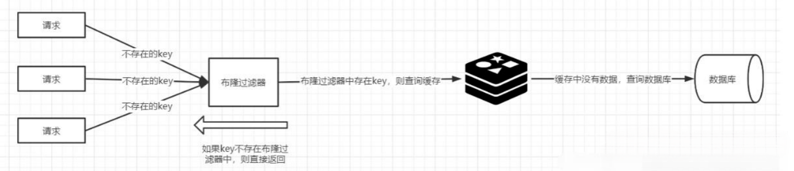

# Redis常见缓存问题

## 1. 缓存雪崩
### 1.1 什么是缓存雪崩
如果缓在某一个时刻出现大规模的key失效，那么就会导致大量的请求打在了数据库上面，导致数据库压力巨大，如果在高并发的情况下，可能瞬间就会导致数据库宕机.

### 1.2 问题分析
造成缓存雪崩的关键在于同一时间的大规模的key失效，为什么会出现这个问题，主要有两种可能：第一种是Redis宕机，第二种可能就是采用了相同的过期时间。
### 1.3 解决方案
**事前**

① 均匀过期：设置不同的过期时间，让缓存失效的时间尽量均匀，避免相同的过期时间导致缓存雪崩，造成大量数据库的访问。

② 分级缓存：第一级缓存失效的基础上，访问二级缓存，每一级缓存的失效时间都不同。

③ 热点数据缓存永远不过期。

永不过期实际包含两层意思：

物理不过期，针对热点key不设置过期时间

逻辑过期，把过期时间存在key对应的value里，如果发现要过期了，通过一个后台的异步线程进行缓存的构建。

④ 保证Redis缓存的高可用，防止Redis宕机导致缓存雪崩的问题。可以使用 主从+ 哨兵，Redis集群来避免 Redis 全盘崩溃的情况。

**事中**

① 互斥锁：在缓存失效后，通过互斥锁或者队列来控制读数据写缓存的线程数量，比如某个key只允许一个线程查询数据和写缓存，其他线程等待。这种方式会阻塞其他的线程，此时系统的吞吐量会下降
② 使用熔断机制，限流降级。当流量达到一定的阈值，直接返回“系统拥挤”之类的提示，防止过多的请求打在数据库上将数据库击垮，至少能保证一部分用户是可以正常使用，其他用户多刷新几次也能得到结果。

**事后**

开启Redis持久化机制，尽快恢复缓存数据，一旦重启，就能从磁盘上自动加载数据恢复内存中的数据。

## 2. 缓存击穿
### 2.1 什么是缓存击穿
缓存击穿跟缓存雪崩有点类似，缓存雪崩是大规模的key失效，而缓存击穿是某个热点的key失效，大并发集中对其进行请求，就会造成大量请求读缓存没读到数据，从而导致高并发访问数据库，引起数据库压力剧增。这种现象就叫做缓存击穿。

### 2.2 问题分析
关键在于某个热点的key失效了，导致大并发集中打在数据库上。所以要从两个方面解决，第一是否可以考虑热点key不设置过期时间，第二是否可以考虑降低打在数据库上的请求数量。

### 2.3 解决方案
1. 在缓存失效后，通过互斥锁或者队列来控制读数据写缓存的线程数量，比如某个key只允许一个线程查询数据和写缓存，其他线程等待。这种方式会阻塞其他的线程，此时系统的吞吐量会下降。
2. 热点数据缓存永远不过期。永不过期实际包含两层意思：
物理不过期，针对热点key不设置过期时间。
逻辑过期，把过期时间存在key对应的value里，如果发现要过期了，通过一个后台的异步线程进行缓存的构建。

## 3. 缓存穿透
### 3.1 什么是缓存穿透
缓存穿透是指用户请求的数据在缓存中不存在，同时在数据库中也不存在，导致用户每次请求该数据都到数据库中查询一遍。如果有恶意攻击者不断请求系统中不存在的数据，会导致短时间内大量请求落在数据库上，造成数据库压力过大，甚至导致数据库承受不住而宕机崩溃。

### 3.2 问题分析
缓存穿透的关键在于在Redis中查不到key值，它和缓存击穿的根本区别在于传进来的key在Redis中是不存在的。假如有黑客传进大量的不存在的key，那么大量的请求打在数据库上是很致命的问题，所以在日常开发中要对参数做好校验，一些非法的参数，不可能存在的key就直接返回错误提示。

### 3.3 解决方法
1. 将无效的key存放进Redis中：
当出现Redis查不到数据，数据库也查不到数据的情况，我们就把这个key保存到Redis中，设置value="null"，并设置其过期时间极短，后面再出现查询这个key的请求的时候，直接返回null，就不需要再查询数据库了。但这种处理方式是有问题的，假如传进来的这个不存在的Key值每次都是随机的，那存进Redis也没有意义。
2. 使用布隆过滤器：
如果布隆过滤器判定某个 key 不存在布隆过滤器中，那么就一定不存在，如果判定某个 key 存在，那么很大可能是存在(存在一定的误判率)。于是我们可以在缓存之前再加一个布隆过滤器，将数据库中的所有key都存储在布隆过滤器中，在查询Redis前先去布隆过滤器查询 key 是否存在，如果不存在就直接返回，不让其访问数据库，从而避免了对底层存储系统的查询压力。

3. 如何选择
针对一些恶意攻击，攻击带过来的大量key是随机，那么我们采用第一种方案就会缓存大量不存在key的数据。那么这种方案就不合适了，我们可以先对使用布隆过滤器方案进行过滤掉这些key。所以，针对这种key异常多、请求重复率比较低的数据，优先使用第二种方案直接过滤掉。而对于空数据的key有限的，重复率比较高的，则可优先采用第一种方式进行缓存。
## 4. HotKey
### 4.1 什么是HotKey
在某个Key接收到的访问次数、显著高于其它Key时，我们可以将其称之为HotKey，常见的HotKey如：某Redis实例的每秒总访问量为10000，而其中一个Key的每秒访问量达到了7000（访问次数显著高于其它Key）。

### 4.2 问题分析
业务规划不足、Redis不正确的使用、无效数据的堆积、访问突增等会产生HotKey, 如：预期外的访问量陡增，如突然出现的爆款商品、访问量暴涨的热点新闻、直播间某大主播搞活动带来的大量刷屏点赞、游戏中某区域发生多个工会间的战斗涉及大量玩家等（热Key）。

### 4.3 解决方法
#### 4.3.1 找出HotKey

1、预估热key，比如秒杀的商品、火爆的新闻等。

2、在客户端进行统计，实现简单，加一行代码即可。

3、如果是Proxy，比如Codis，可以在Proxy端收集。

4、利用Redis自带的命令，monitor、hotkeys。但是执行缓慢（不要用）

5、利用基于大数据领域的流式计算技术来进行实时数据访问次数的统计，比如 Storm、Spark

Streaming、Flink，这些技术都是可以的。发现热点数据后可以写到zookeeper中。

#### 4.3.2 处理HotKey

1. 变分布式缓存为本地缓存
发现热key后，把缓存数据取出后，直接加载到本地缓存中。可以采用Ehcache、Guava Cache都可以，这样系统在访问热key数据时就可以直接访问自己的缓存了。（数据不要求时时一致）
2. 在每个Redis主节点上备份热key数据，这样在读取时可以采用随机读取的方式，将访问压力负载到每个Redis上。
3. 利用对热点数据访问的限流熔断保护措施。每个系统实例每秒最多请求缓存集群读操作不超过 400 次，一超过就可以熔断掉，不让请求缓存集群，直接返回一个空白信息，然后用户稍后会自行再次重新刷新页面之类的。（首页不行，系统友好性差）
通过系统层自己直接加限流熔断保护措施，可以很好的保护后面的缓存集群。

## 5. BigKey
### 5.1 什么是BigKey
通常我们会将含有较大数据或含有大量成员、列表数的Key称之为大Key，下面我们将用几个实际的例子对大Key的特征进行描述：

- 一个STRING类型的Key，它的值为5MB（数据过大）
- 一个LIST类型的Key，它的列表数量为20000个（列表数量过多）
- 一个ZSET类型的Key，它的成员数量为10000个（成员数量过多）
- 一个HASH格式的Key，它的成员数量虽然只有1000个但这些成员的value总大小为100MB（成员体积过大）

需要注意的是，在以上的例子中，为了方便理解，我们对大Key的数据、成员、列表数给出了具体的数字。为了避免误导，在实际业务中，大Key的判定仍然需要根据Redis的实际使用场景、业务场景来进行综合判断。

### 5.2 问题分析
业务规划不足、Redis不正确的使用、无效数据的堆积、访问突增等都会产生BigKey，如：

1. 将Redis用在并不适合其能力的场景，造成Key的value过大，如使用String类型的Key存放大体积二进制文件型数据（BigKey）；
2. 业务上线前规划设计考虑不足没有对Key中的成员进行合理的拆分，造成个别Key中的成员数量过多（BigKey）；
3. 没有对无效数据进行定期清理，造成如HASH类型Key中的成员持续不断的增加(BigKey)；
4. 使用LIST类型Key的业务消费侧代码故障，造成对应Key的成员只增不减（BigKey）；
### 5.3 解决方法
#### 5.3.1 找出BigKey

1、redis-cli --bigkeys命令。可以找到某个实例5种数据类型(String、hash、list、set、zset)的最大key。但如果Redis 的key比较多，执行该命令会比较慢

2、获取生产Redis的rdb文件，通过rdbtools分析rdb生成csv文件，再导入MySQL或其他数据库中进行分析统计，根据size_in_bytes统计bigkey

3、通过业务层定位热Key。指向Redis的每一次访问都来自业务层，因此我们可以通过在业务层增加相应的代码对Redis的访问进行记录并异步汇总分析。该方案的优势为能够准确并及时的分析出热Key的存在，缺点为业务代码复杂度的增加，同时可能会降低一些性能

#### 5.3.2 处理BigKey

优化big key的原则就是string减少字符串长度，list、hash、set、zset等减少成员数。

1. string类型的big key，尽量不要存入Redis中，可以使用文档型数据库MongoDB或缓存到CDN上。如果必须用Redis存储，最好单独存储，不要和其他的key一起存储。采用一主一从或多从。
2. 单个简单的key存储的value很大，可以尝试将对象分拆成几个key-value， 使用mget获取值，这样分拆的意义在于分拆单次操作的压力，将操作压力平摊到多次操作中，降低对redis的IO影响。
3. hash， set，zset，list 中存储过多的元素，可以将这些元素分拆。（常见）
4. 删除大key时不要使用del,因为del是阻塞命令，删除时会影响性能。
5. 使用 lazy delete (unlink命令)
删除指定的key(s),若key不存在则该key被跳过。但是，相比DEL会产生阻塞，该命令会在另一个线程中回收内存，因此它是非阻塞的。 这也是该命令名字的由来：仅将keys从key空间中删除，真正的数据删除会在后续异步操作。

## 6. 缓存预热
### 6.1 什么是缓存预热
缓存预热是指系统上线后，提前将相关的缓存数据加载到缓存系统。避免在用户请求的时候，先查询数据库，然后再将数据缓存的问题，用户直接查询事先被预热的缓存数据。

### 6.2 问题分析
如果不进行预热，那么Redis初始状态数据为空，系统上线初期，对于高并发的流量，都会访问到数据库中， 对数据库造成流量的压力。

### 6.3 解决方法
1. 数据量不大的时候，工程启动的时候进行加载缓存动作；
2. 数据量大的时候，设置一个定时任务脚本，进行缓存的刷新；
3. 数据量太大的时候，优先保证热点数据进行提前加载到缓存。
