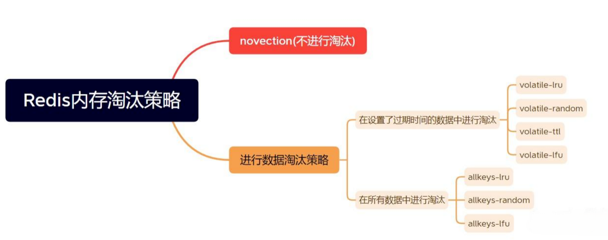
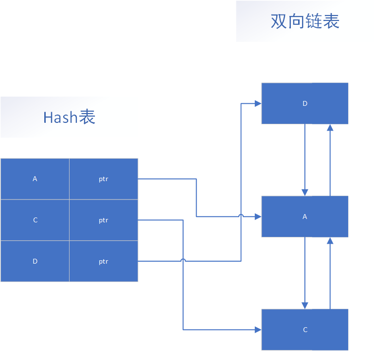

# Redis过期删除策略与内存淘汰策略
## Redis的数据过期清除策略

设计过期时间
```redis
-- 设置键值对的时候，同时指定过期时间（精确到秒）
set <key> <value> ex <n>
-- 设置键值对的时候，同时指定过期时间（精确到毫秒）
set <key> <value> px <n>
-- 设置键值对的时候，同时指定过期时间（精确到秒）
setex <key> <n> <valule>
```
如果你想查看某个 key 剩余的存活时间，可以使用 `TTL <key>` 命令。

## 三种策略

### 存活时间
expire数据结构 Redis中可以使用expire命令设置一个键的存活时间(ttl: time to live)，过了这段时间，该键就会自动被删除。
```c 
typedef struct redisDb {
    dict *dict; -- key Value
    dict *expires; -- key ttl
    dict *blocking_keys;
    dict *ready_keys;
    dict *watched_keys;
    int id;
} redisDb;
``` 
上面的代码是Redis 中关于数据库的结构体定义，这个结构体定义中除了 id 以外都是指向字典的指针，其中我们只看 dict 和 expires。  
dict 用来维护一个 Redis 数据库中包含的所有 Key-Value 键值对，expires则用于维护一个 Redis 数据库中设置了失效时间的键(即key与失效时间的映射)。  
当我们使用 expire命令设置一个key的失效时间时，Redis 首先到 dict 这个字典表中查找要设置的key是否存在，如果存在就将这个key和失效时间添加到 expires 这个字典表。  
当我们使用 setex命令向系统插入数据时，Redis 首先将 Key 和 Value 添加到 dict 这个字典表中，然后将 Key 和失效时间添加到 expires 这个字典表中。  
简单地总结来说就是，设置了失效时间的key和具体的失效时间全部都维护在 expires 这个字典表中。  
### **过期策略**：定期删除 + 惰性删除

(1) **定期删除**：redis默认每隔100ms就随机抽取一些设置了过期时间的key，检查其是否过期，如果有过期就删除。注意这里是随机抽取的。  
为什么要随机呢？你想一想假如 redis 存了几十万个 key ，每隔100ms就遍历所有的设置过期时间的 key 的话，就会给 CPU 带来很大的负载。  
为什么不用定时删除策略呢？
> 定时删除，用一个定时器来负责监视key，过期则自动删除。虽然内存及时释放，但是十分消耗CPU资源。在大并发请求下，CPU要将时间应用在处理请求，而不是删除key，因此没有采用这一策略。

(2) **惰性删除**：定期删除可能导致很多过期的key 到了时间并没有被删除掉。这时就要使用到惰性删除。在你获取某个key的时候，redis会检查一下，这个key如果设置了过期时间并且过期了，是的话就删除。

### 定期删除 + 惰性删除存在的问题  
如果某个key过期后，定期删除没删除成功，然后也没再次去请求key，也就是说惰性删除也没生效。  
这时，如果大量过期的key堆积在内存中，redis的内存会越来越高，导致redis的内存块耗尽。那么就应该采用内存淘汰机制。

### 参数配置
#### hz
Redis服务器会每隔一段时间（由hz配置项决定）主动进行过期键的删除。这种策略通过在后台线程中扫描一定数量的数据库键并删除过期键，以减少对客户端请求的影响。定期删除的执行频率可以通过调整hz配置项来控制

hz配置项的默认值是10，即每秒执行10次基于时间的事件。这意味着Redis服务器会每100毫秒进行一次定期删除操作，清理过期键，并在需要时关闭闲置的客户端连接。

```redis
config set hz 200
```

#### maxmemory-samples
在Redis中，可以使用`maxmemory-samples`配置项来设置每次清理过期键时要检查的最大键数。这个配置项决定了Redis在执行清理过期键任务时一次检查多少个键。  
默认情况下`，maxmemory-samples`的值是5，表示Redis每次清理过期键时会检查5个键。这个值可以根据实际需求进行调整。  
要修改`maxmemory-samples`的值，可以在redis.conf文件中找到相应的配置项，并将其设置为所需的值。然后，重新启动Redis服务器使配置生效。  
需要注意的是，增加`maxmemory-samples`的值可能会增加Redis服务器的处理开销，因为每次清理过期键任务都需要检查更多的键。因此，应根据服务器的性能和负载情况来适当调整`maxmemory-samples`的值。  
另外，还可以通过调用CONFIG SET命令动态地修改`maxmemory-samples`的值，而不需要重启Redis服务器。例如，可以使用以下命令将`maxmemory-samples`的值设置为10：
```redis
CONFIG SET maxmemory-samples 10
```
总之，通过修改Redis的`maxmemory-samples`配置项，可以设置一次检查多少个过期键。根据服务器的性能和负载情况，可以适当调整这个值。
## Redis中的缓存淘汰策略
Redis 的运行内存已经超过 Redis 设置的最大内存之后，则会使用内存淘汰策略删除符合条件的 key，以此来保障 Redis 高效的运行  
设置Redis最大内存  
```redis
CONFIG SET maxmemory 4gb
```
Redis提供了8种缓存淘汰策略，如下图所示：

**不淘汰数据**：  
1. **noeviction**：不进行淘汰数据。一旦缓存被写满，再有写请求进来，Redis就不再提供服务，而是直接返回错误。Redis 用作缓存时，实际的数据集通常都是大于缓存容量的，总会有新的数据要写入缓存，这个策略本身不淘汰数据，也就不会腾出新的缓存空间，我们不把它用在 Redis 缓存中。  

**设置过期时间**：  
2. **volatile-ttl**：在设置了过期时间的键值对中，移除即将过期的键值对。  
3. **volatile-random**：在设置了过期时间的键值对中，随机移除某个键值对。  
4. **volatile-lru**：在设置了过期时间的键值对中，移除最近最少使用的键值对。  
5. **volatile-lfu**：在设置了过期时间的键值对中，移除最近最不频繁使用的键值对  
**所有数据进行淘汰**：  
6. **allkeys-random**：在所有键值对中，随机移除某个key。  
7. **allkeys-lru**：在所有的键值对中，移除最近最少使用的键值对。  
8. **allkeys-lfu**：在所有的键值对中，移除最近最不频繁使用的键值对。  

> 通常情况下推荐优先使用 **allkeys-lru** 策略。这样可以充分利用 LRU 这一经典缓存算法的优势，把最近最常访问的数据留在缓存中，提升应用的访问性能。  
如果你的业务数据中有明显的冷热数据区分，建议使用 **allkeys-lru** 策略。  
如果业务应用中的数据访问频率相差不大，没有明显的冷热数据区分，建议使用 **allkeys-random** 策略，随机选择淘汰的数据就行。
如果没有设置过期时间的键值对，那么 **volatile-lru**，**volatile-lfu**，**volatile-random** 和 **volatile-ttl** 策略的行为, 和 **noeviction** 基本上一致。
如何设置策略
```redis
-- 查看目前的策略
config get  maxmemory-policy
-- 根据自身的实际情况 选择一种策略进行设置
config set  maxmemory-policy volatile-lfu
```
## Redis中的LRU和LFU算法
### 1. LRU算法

采用Hash表 + 双向链表的结构，利用Hash表确保数据查找的时间复杂度是O(1)，双向链表又可以使数据插入/删除等操作也是O(1)。

LRU 算法的全称是 Least Recently Uses，按照最近最少使用的原则来筛选数据，最不常用的数据会被筛选出来。LRU 会把所有的数据组织成一个链表，链表的头和尾分别表示 MRU 端和 LRU 端，分别代表最近最常使用的数据和最近最不常用的数据。  
LRU 算法在实际实现时，需要用链表管理所有的缓存数据，移除元素时直接从链表队尾移除，增加时加到头部就可以了，但这会带来额外的空间开销。而且，当有数据被访问时，需要在链表上把该数据移动到 MRU 端，如果有大量数据被访问，就会带来很多链表移动操作，会很耗时，进而会降低 Redis 缓存性能。  
所以，在 Redis 中，LRU 算法被做了简化，以减轻数据淘汰对缓存性能的影响。具体来说：Redis 默认会记录每个数据的最近一次访问的时间戳（由键值对数据结构 RedisObject 中的 lru 字段记录）。然后，Redis 在决定淘汰的数据时，第一次会随机选出 N 个数据，把它们作为一个候选集合。  
接下来，Redis 会比较这 N 个数据的 lru 字段，把 lru 字段值最小的数据从缓存中淘汰出去。当需要再次淘汰数据时，Redis 需要挑选数据进入第一次淘汰时创建的候选集合。这里的挑选标准是：能进入候选集合的数据的 lru 字段值必须小于候选集合中最小的 lru 值。  
当有新数据进入候选数据集后，如果候选数据集中的数据个数达到了 N 个，Redis 就把候选数据集中 lru 字段值最小的数据淘汰出去。这样一来，Redis 缓存不用为所有的数据维护一个大链表，也不用在每次数据访问时都移动链表项，提升了缓存的性能。  
Redis 提供了一个配置参数 `maxmemory-samples`，这个参数就是 Redis 选出的数据个数 N。例如，我们执行如下命令，可以让 Redis 选出 100 个数据作为候选数据集：  
`CONFIG SET maxmemory-samples 100`  
之所以这样处理也是因为以下几个原因：
- 筛选规则，Redis是随机抽取一批数据去按照淘汰策略排序，不再需要对所有数据排序；
- 性能问题，每次数据访问都可能涉及数据移位，性能会有少许损失；
- 内存问题，Redis对内存的使用一向很“抠门”，数据结构都很精简，尽量不使用复杂的数据结构管理数据；
- 策略配置，如果线上Redis实例动态修改淘汰策略会触发全部数据的结构性改变，这个Redis系统无法承受的。
### 2. LFU算法

LFU是在Redis4.0后出现的，它的核心思想是根据key的最近被访问的频率进行淘汰，很少被访问的优先被淘汰，被访问的多的则被留下来。LFU算法能更好的表示一个key被访问的热度。假如你使用的是LRU算法，一个key很久没有被访问到，只刚刚是偶尔被访问了一次，那么它就被认为是热点数据，不会被淘汰，而有些key将来是很有可能被访问到的则被淘汰了。  
如果使用LFU算法则不会出现这种情况，因为使用一次并不会使一个key成为热点数据。它的使用与LRU有所区别：
> **LFU (Least Frequently Used)** ：最近最不频繁使用，跟使用的次数有关，淘汰使用次数最少的。
>
> **LRU (Least Recently Used)**：最近最少使用，跟使用的最后一次时间有关，淘汰最近使用时间离现在最久的。

LRU的最近最少使用实际上并不精确，考虑下面的情况，如果在 “|” 处删除，那么A距离的时间最久，但实际上A的使用频率要比D频繁，所以合理的淘汰策略应该是淘汰D。LFU就是为应对这种情况而生的。
```txt
 ~~~~~A~~~~~A~~~~~A~~~~A~~~~~A~~~~~A~~|
 ~~R~~R~~R~~R~~R~~R~~R~~R~~R~~R~~R~~R~|
 ~~~~~~~~~~C~~~~~~~~~C~~~~~~~~~C~~~~~~|
 ~~~~~D~~~~~~~~~~D~~~~~~~~~D~~~~~~~~~D|
```
每个波浪号代表一秒，A 每五秒，R 每两秒，C 和 D 每十秒 ， 最近被访问的字符是 D，但显然按照现有的规律，下一个被访问的更可能是 R 而不是 D。  
LFU 实现比较复杂，需要考虑几个问题:
如果实现为链表，当对象被访问时按访问次数移动到链表的某个有序位置可能是低效的，因为可能存在大量访问次数相同的 key，最差情况是O(n) .  
某些 key 访问次数可能非常之大，理论上可以无限大，但实际上我们并不需要精确的访问次数.  
访问次数特别大的 key 可能以后都不再访问了，但是因为访问次数大而一直占用着内存不被淘汰，需要一个方法来逐步“驱除”（有点 LRU的意思），最简单的就是逐步衰减访问次数.  
Redis 只用了 24bit （server.lruclock 也是24bit）来记录上述的信息:  
访问次数的计算如下：
```c 
uint8_t LFULogIncr(uint8_t counter) {
    if (counter == 255) return 255;
    double r = (double)rand()/RAND_MAX;
    double baseval = counter - LFU_INIT_VAL;
    if (baseval < 0) baseval = 0;
    double p = 1.0/(baseval*server.lfu_log_factor+1);
    if (r < p) counter++;
    return counter;
}
```
核心就是访问次数越大，访问次数被递增的可能性越小，最大 255，可以在配置 redis.conf 中写明访问多少次递增多少。由于访问次数是有限的，所以第一个问题也被解决了，直接一个255数组或链表都可以。  
16bit 部分保存的是时间戳的后16位（分钟），表示上一次递减的时间，算法是这样执行，随机采样N个key，检查递减时间，如果距离现在超过 N 分钟（可配置），则递减或者减半（如果访问次数数值比较大）。  
此外，由于新加入的 key 访问次数很可能比不被访问的老 key小，为了不被马上淘汰，新key访问次数设为 5。
## 缓存淘汰策略的选择
依据策略的特性，可以针对不同场景选择不同的策略去淘汰数据。
当缓存数据没有明显的冷热之分，即数据的访问频率差距不大，建议使用**allkeys-random** 随机策略淘汰数据；  
当数据有明显的冷热之分，建议使用**allkeys-lru** 或者**volatile-lru** 算法，将最近最常访问的数据留在缓存数据中；  
当业务中存在置顶需求，即不会过期的数据，这类一般不会设置过期时间，可以采用**volatile-lru**策略。这样这类数据就不会被淘汰，而其它数据可以根据lru规则进行淘汰
