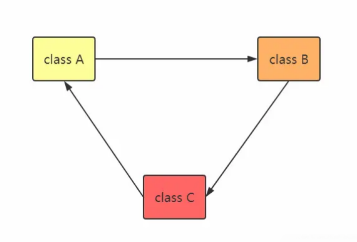
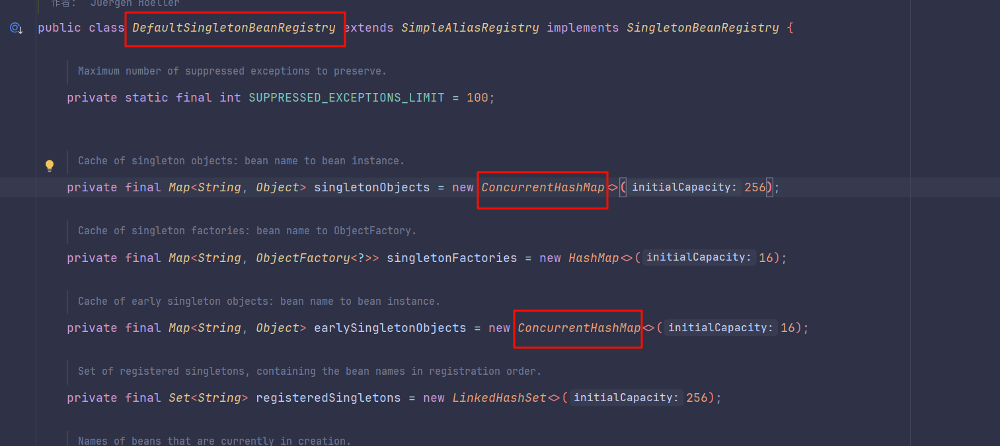
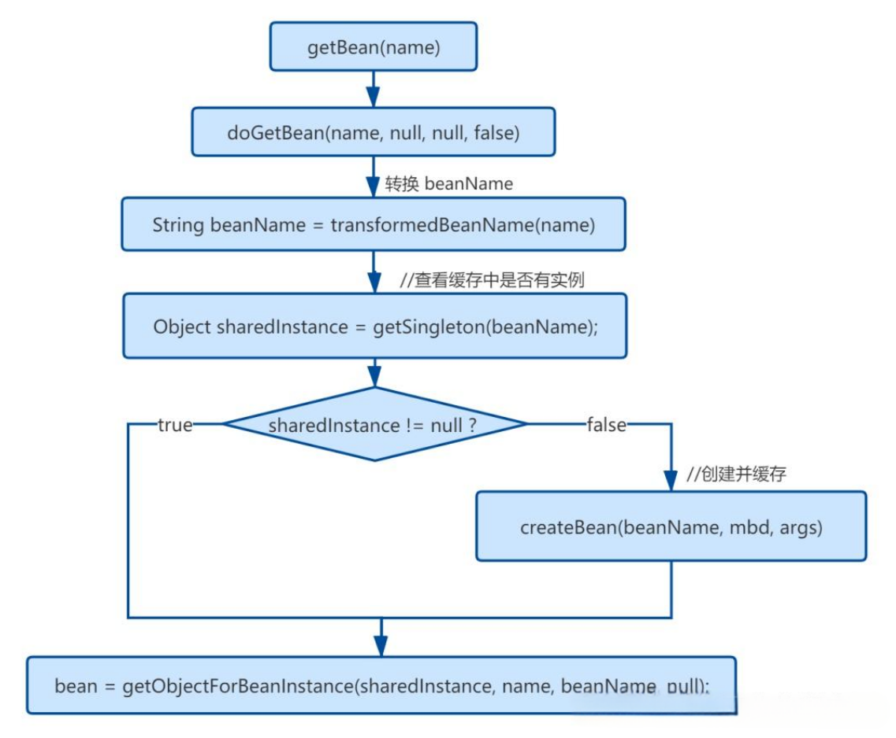
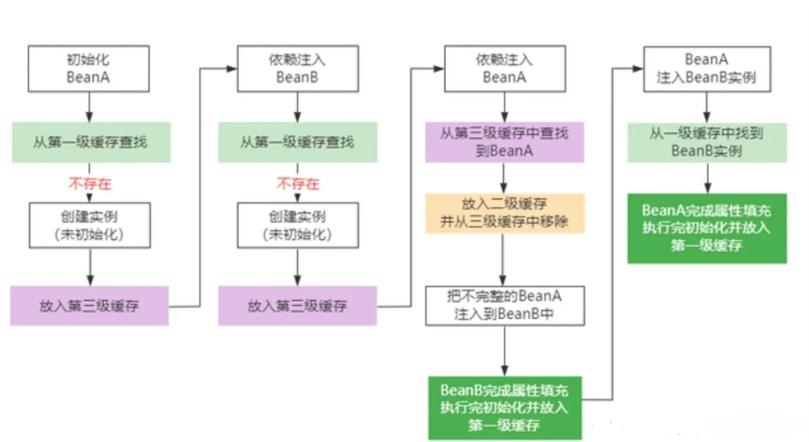

[原文链接 ](https://juejin.cn/post/6882266649509298189)  
既然要解决循环依赖，那么就要知道循环依赖是什么。如下图所示：

通过上图，我们可以看出：

- A 依赖于 B
- B 依赖于 C
- C 依赖于 A
```java
public class A {
    private B b;
}

public class B {
    private C c;
}

public class C {
    private A a;
}
```
这种依赖关系形成了一种闭环，从而造成了循环依赖的局面。  
下面是未解决循环依赖的常规步骤：  
1. 实例化 A，此时 A 还未完成属性填充和初始化方法（@PostConstruct）的执行。
2. A 对象发现需要注入 B 对象，但是容器中并没有 B 对象（如果对象创建完成并且属性注入完成和执行完初始化方法就会放入容器中）。
3. 实例化 B，此时 B 还未完成属性填充和初始化方法（@PostConstruct）的执行。
4. B 对象发现需要注入 C 对象，但是容器中并没有 C 对象。
5. 实例化 C，此时 C 还未完成属性填充和初始化方法（@PostConstruct）的执行。
6. C 对象发现需要注入 A 对象，但是容器中并没有 A 对象。
7. 重复步骤 1。

**属性注入可以解决，构造器注入没办法解决**  
**单例可以解决，多例没办法解决**  
**多例和构造器为什么无法解决循环依赖**

为什么多例Bean不能解决循环依赖？  
我们自己手写了解决循环依赖的代码，可以看到，核心是利用一个map，来解决这个问题的，这个map就相当于缓存。
为什么可以这么做，因为我们的bean是单例的，而且是字段注入（setter注入）的，单例意味着只需要创建一次对象，后面就可以从缓存中取出来，字段注入，意味着我们无需调用构造方法进行注入。  
如果是原型bean，那么就意味着每次都要去创建对象，无法利用缓存；  
如果是构造方法注入，那么就意味着需要调用构造方法注入，也无法利用缓存。
**为什么Spring不能解决构造器的循环依赖**？  
因为构造器是在实例化时调用的，此时bean还没有实例化完成，如果此时出现了循环依赖，一二三级缓存并没有Bean实例的任何相关信息，在实例化之后才放入三级缓存中，因此当getBean的时候缓存并没有命中，这样就抛出了循环依赖的异常了。
# 三级缓存
Spring 解决循环依赖的核心就是提前暴露对象,三级缓存在`DefaultSingletonBeanRegistry`中，而提前暴露的对象就是放置于第二级缓存中。下表是三级缓存的说明：

| 名称 | 描述                                                 |
| ---- |----------------------------------------------------|
| singletonObjects | 	一级缓存，存放完整的 Bean。                                  |
|earlySingletonObjects | 	二级缓存，存放提前暴露的Bean，Bean 是不完整的，未完成属性注入和执行 init 方法。   |
|singletonFactories | 	三级缓存，存放的是 Bean 工厂(Lambda表达式)，主要是生产 Bean，存放到二级缓存中。 |


所有被 Spring 管理的 Bean，最终都会存放在 `singletonObjects` 中，这里面存放的 Bean 是经历了所有生命周期的（除了销毁的生命周期），完整的，可以给用户使用的。  
`earlySingletonObjects` 存放的是已经被实例化，但是还没有注入属性和执行 init 方法的 Bean。  
`singletonFactories` 存放的是生产 Bean 的工厂(一个lambda表达式)。
```java
addSingletonFactory(beanName, () -> getEarlyBeanReference(beanName, mbd, bean));

protected void addSingletonFactory(String beanName, ObjectFactory<?> singletonFactory) {
    Assert.notNull(singletonFactory, "Singleton factory must not be null");
    synchronized (this.singletonObjects) {
        if (!this.singletonObjects.containsKey(beanName)) {
            this.singletonFactories.put(beanName, singletonFactory);
            this.earlySingletonObjects.remove(beanName);
            this.registeredSingletons.add(beanName);
        }
    }
}
```
Bean 都已经实例化了，为什么还需要一个生产 Bean 的工厂呢？这里实际上是跟 AOP 有关，如果项目中不需要为 Bean 进行代理，那么这个 Bean 工厂就会直接返回一开始实例化的对象，如果需要使用 AOP 进行代理，那么这个工厂就会发挥重要的作用了，这也是本文需要重点关注的问题之一。  
SPRING在创建BEAN的时候，在哪里创建的动态代理？  
①：如果没有循环依赖的话，在bean初始化完成后创建动态代理  
②：如果有循环依赖，在bean实例化之后创建！
# 解决循环依赖
Spring 是如何通过上面介绍的三级缓存来解决循环依赖的呢？这里只用 A，B 形成的循环依赖来举例：  
1. 实例化 A，此时 A 还未完成属性填充和初始化方法（@PostConstruct）的执行，A 只是一个半成品。
2. 为 A 创建一个 Bean 工厂，并放入到 singletonFactories 中。
3. 发现 A 需要注入 B 对象，但是一级、二级、三级缓存均为发现对象 B。
4. 实例化 B，此时 B 还未完成属性填充和初始化方法（@PostConstruct）的执行，B 只是一个半成品。
5. 为 B 创建一个 Bean 工厂，并放入到 singletonFactories 中。
6. 发现 B 需要注入 A 对象，此时在一级、二级未发现对象 A，但是在三级缓存中发现了对象 A，从三级缓存中得到对象 A，并将对象 A 放入二级缓存中，同时删除三级缓存中的对象 A。（注意，此时的 A 还是一个半成品，并没有完成属性填充和执行初始化方法）
7. 将对象 A 注入到对象 B 中。
8. 对象 B 完成属性填充，执行初始化方法，并放入到一级缓存中，同时删除二级缓存中的对象 B。（此时对象 B 已经是一个成品）
9. 对象 A 得到对象 B，将对象 B 注入到对象 A 中。（对象 A 得到的是一个完整的对象 B）
10. 对象 A 完成属性填充，执行初始化方法，并放入到一级缓存中，同时删除二级缓存中的对象 A。
我们从源码中来分析整个过程：
创建 Bean 的方法在 `AbstractAutowireCapableBeanFactory::doCreateBean()`
```java
protected Object doCreateBean(final String beanName, final RootBeanDefinition mbd, Object[] args) throws BeanCreationException {
    BeanWrapper instanceWrapper = null;
	
    if (instanceWrapper == null) {
        // ① 实例化对象
        instanceWrapper = this.createBeanInstance(beanName, mbd, args);
    }

    final Object bean = instanceWrapper != null ? instanceWrapper.getWrappedInstance() : null;
    Class<?> beanType = instanceWrapper != null ? instanceWrapper.getWrappedClass() : null;
   
    // ② 判断是否允许提前暴露对象，如果允许，则直接添加一个 ObjectFactory 到三级缓存
	boolean earlySingletonExposure = (mbd.isSingleton() && this.allowCircularReferences &&
				isSingletonCurrentlyInCreation(beanName));
    if (earlySingletonExposure) {
        // 添加三级缓存的方法详情在下方
        addSingletonFactory(beanName, () -> getEarlyBeanReference(beanName, mbd, bean));
    }

    // ③ 填充属性
    this.populateBean(beanName, mbd, instanceWrapper);
    // ④ 执行初始化方法，并创建代理
    exposedObject = initializeBean(beanName, exposedObject, mbd);
   
    return exposedObject;
}
```
添加三级缓存的方法如下：

```java
protected void addSingletonFactory(String beanName, ObjectFactory<?> singletonFactory) {
    Assert.notNull(singletonFactory, "Singleton factory must not be null");
    synchronized (this.singletonObjects) {
        if (!this.singletonObjects.containsKey(beanName)) { // 判断一级缓存中不存在此对象
            this.singletonFactories.put(beanName, singletonFactory); // 添加至三级缓存
            this.earlySingletonObjects.remove(beanName); // 确保二级缓存没有此对象
            this.registeredSingletons.add(beanName);
        }
    }
}

@FunctionalInterface
public interface ObjectFactory<T> {
	T getObject() throws BeansException;
}
```
通过这段代码，我们可以知道 Spring 在实例化对象的之后，就会为其创建一个 Bean 工厂，并将此工厂加入到三级缓存中。  
因此，Spring 一开始提前暴露的并不是实例化的 Bean，而是将 Bean 包装起来的 ObjectFactory。为什么要这么做呢？  
这实际上涉及到 AOP，如果创建的 Bean 是有代理的，那么注入的就应该是代理 Bean，而不是原始的 Bean。但是 Spring 一开始并不知道 Bean 是否会有循环依赖，通常情况下（没有循环依赖的情况下），Spring 都会在完成填充属性，并且执行完初始化方法之后再为其创建代理。但是，如果出现了循环依赖的话，Spring 就不得不为其提前创建代理对象，否则注入的就是一个原始对象，而不是代理对象。因此，这里就涉及到应该在哪里提前创建代理对象？  
Spring 的做法就是在 `ObjectFactory` 中去提前创建代理对象。它会执行 `getObject()` 方法来获取到 Bean。实际上，它真正执行的方法如下：
```java
protected Object getEarlyBeanReference(String beanName, RootBeanDefinition mbd, Object bean) {
    Object exposedObject = bean;
    if (!mbd.isSynthetic() && hasInstantiationAwareBeanPostProcessors()) {
        for (BeanPostProcessor bp : getBeanPostProcessors()) {
            if (bp instanceof SmartInstantiationAwareBeanPostProcessor) {
                SmartInstantiationAwareBeanPostProcessor ibp = (SmartInstantiationAwareBeanPostProcessor) bp;
                // 如果需要代理，这里会返回代理对象；否则返回原始对象
                exposedObject = ibp.getEarlyBeanReference(exposedObject, beanName);
            }
        }
    }
    return exposedObject;
}
```
因为提前进行了代理，避免对后面重复创建代理对象，会在 earlyProxyReferences 中记录已被代理的对象。
```java
public abstract class AbstractAutoProxyCreator extends ProxyProcessorSupport
		implements SmartInstantiationAwareBeanPostProcessor, BeanFactoryAware {
    @Override
    public Object getEarlyBeanReference(Object bean, String beanName) {
        Object cacheKey = getCacheKey(bean.getClass(), beanName);
        // 记录已被代理的对象
        this.earlyProxyReferences.put(cacheKey, bean);
        return wrapIfNecessary(bean, beanName, cacheKey);
    }
}
```
**通过上面的解析，我们可以知道 Spring 需要三级缓存的目的是为了在没有循环依赖的情况下，延迟代理对象的创建，使 Bean 的创建符合 Spring 的设计原则。**

# 如何获取依赖
我们目前已经知道了 Spring 的三级依赖的作用，但是 Spring 在注入属性的时候是如何去获取依赖的呢？  
他是通过一个 `getSingleton()` 方法去获取所需要的 Bean 的。
```java
/**
 * Return the (raw) singleton object registered under the given name.
 * <p>Checks already instantiated singletons and also allows for an early
 * reference to a currently created singleton (resolving a circular reference).
 * @param beanName the name of the bean to look for
 * @param allowEarlyReference whether early references should be created or not
 * @return the registered singleton object, or {@code null} if none found
 */
@Nullable
protected Object getSingleton(String beanName, boolean allowEarlyReference) {
    // Quick check for existing instance without full singleton lock
    Object singletonObject = this.singletonObjects.get(beanName);
    if (singletonObject == null && isSingletonCurrentlyInCreation(beanName)) {
        singletonObject = this.earlySingletonObjects.get(beanName);
        if (singletonObject == null && allowEarlyReference) {
            synchronized (this.singletonObjects) {
                // Consistent creation of early reference within full singleton lock
                singletonObject = this.singletonObjects.get(beanName);
                if (singletonObject == null) {
                    singletonObject = this.earlySingletonObjects.get(beanName);
                    if (singletonObject == null) {
                        ObjectFactory<?> singletonFactory = this.singletonFactories.get(beanName);
                        if (singletonFactory != null) {
                            singletonObject = singletonFactory.getObject();
                            this.earlySingletonObjects.put(beanName, singletonObject);
                            this.singletonFactories.remove(beanName);
                        }
                    }
                }
            }
        }
    }
    return singletonObject;
}
```
当 Spring 为某个 Bean 填充属性的时候，它首先会寻找需要注入对象的名称，然后依次执行 `getSingleton()` 方法得到所需注入的对象，而获取对象的过程就是先从一级缓存中获取，一级缓存中没有就从二级缓存中获取，二级缓存中没有就从三级缓存中获取，如果三级缓存中也没有，那么就会去执行 doCreateBean() 方法创建这个 Bean。
```java
protected Object getSingleton(String beanName, boolean allowEarlyReference) {
    // 一级缓存
    Object singletonObject = this.singletonObjects.get(beanName);
    if (singletonObject == null && isSingletonCurrentlyInCreation(beanName)) {
        synchronized (this.singletonObjects) {
            // 二级缓存
            singletonObject = this.earlySingletonObjects.get(beanName);
            if (singletonObject == null && allowEarlyReference) {
                // 三级缓存
                ObjectFactory<?> singletonFactory = this.singletonFactories.get(beanName);
                if (singletonFactory != null) {
                    // Bean 工厂中获取 Bean
                    singletonObject = singletonFactory.getObject();
                    // 放入到二级缓存中
                    this.earlySingletonObjects.put(beanName, singletonObject);
                    this.singletonFactories.remove(beanName);
                }
            }
        }
    }
    return singletonObject;
}
```
当 Spring 为某个 Bean 填充属性的时候，它首先会寻找需要注入对象的名称，然后依次执行 `getSingleton()` 方法得到所需注入的对象，而获取对象的过程就是先从一级缓存中获取，一级缓存中没有就从二级缓存中获取，二级缓存中没有就从三级缓存中获取，如果三级缓存中也没有，那么就会去执行 `doCreateBean()` 方法创建这个 Bean。

# 二级缓存
我们现在已经知道，第三级缓存的目的是为了延迟代理对象的创建，因为如果没有依赖循环的话，那么就不需要为其提前创建代理，可以将它延迟到初始化完成之后再创建。
既然目的只是延迟的话，那么我们是不是可以不延迟创建，而是在实例化完成之后，就为其创建代理对象，这样我们就不需要第三级缓存了。因此，我们可以将`addSingletonFactory()` 方法进行改造。
```java
protected void addSingletonFactory(String beanName, ObjectFactory<?> singletonFactory) {
    Assert.notNull(singletonFactory, "Singleton factory must not be null");
    synchronized (this.singletonObjects) {
        if (!this.singletonObjects.containsKey(beanName)) { // 判断一级缓存中不存在此对象
            object o = singletonFactory.getObject(); // 直接从工厂中获取 Bean
            this.earlySingletonObjects.put(beanName, o); // 添加至二级缓存中
            this.registeredSingletons.add(beanName);
        }
    }
}
```
这样的话，每次实例化完 Bean 之后就直接去创建代理对象，并添加到二级缓存中。**测试结果是完全正常的，Spring 的初始化时间应该也是不会有太大的影响，因为如果 Bean 本身不需要代理的话，是直接返回原始 Bean 的，并不需要走复杂的创建代理 Bean 的流程。**
# 结论

1. `doCreateBean`方法会调用`createBeanInstance`方法来对beanA进行实例化。
2. `addSingletonFactory(beanName, () -> getEarlyBeanReference(beanName, mbd, bean));`会将生成代理对象的工厂放入到三级缓存。
3. beanA调用`populateBean`方法，注入beanB实例。  
在注入beanB实例的过程中，发现beanB依赖了beanA，需要将beanA加载出来。  
会再次对beanA调用`doGetBean`方法。这时候，`getSingleton`方法就真正派上用场了。
4. 在getSingleton方法中，会将beanA的bean工厂从三级缓存中取出来，调用`getObject`方法，也就是`getEarlyBeanReference`方法，将返回结果放入二级缓存，同时从三级缓存移除掉。
5. 把不完整的beanA注入到beanB中
6. beanB执行`addSingleton(beanName, singletonObject)`方法，这个方法将beanB放入到一级缓存，且从二级缓存中移除掉。
7. beanA注入beanB实例。
8. beanA完成属性填充和初始化，执行`addSingleton(beanName, singletonObject)`方法，将BeanA放入到一级缓存。 

从上面注入的流程，可以看出，如果没有存放半成品的二级缓存，那么循环依赖是无法解决的。如果我们在实例化完beanA，立刻创建出代理对象放到二级缓存，再填充beanA的属性以及初始化，这样也可以正常完成BeanA，BeanB的注入。这样就省掉了第三级缓存。那第三级缓存存在的原因是什么呢？  
如果 Spring 选择二级缓存来解决循环依赖的话，那么就意味着所有 Bean 都需要在实例化完成之后就立马为其创建代理，而 Spring 的设计原则是在 Bean 初始化完成之后才为其创建代理。   
所以，Spring 选择了三级缓存。但是因为循环依赖的出现，导致了 Spring 不得不提前去创建代理，因为如果不提前创建代理对象，那么注入的就是原始对象，这样就会产生错误。
