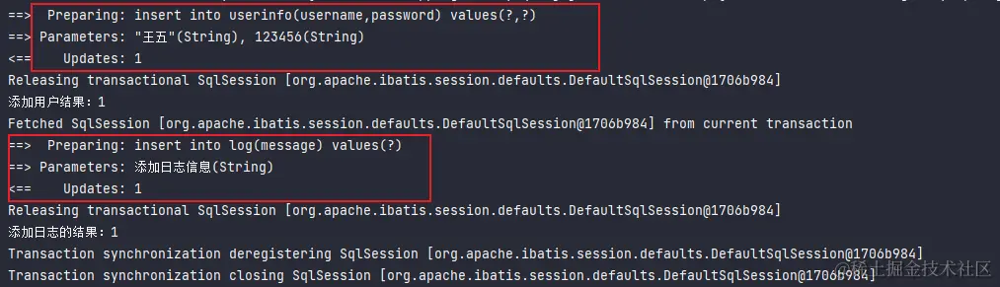

# Spring的事务及传播机制
[原文链接](https://juejin.cn/post/7237439385909592122?searchId=20240226122602E689EE2FACE0E63D4DAE)
## 事务是什么？为什么需要事务？
事务是一种用于管理数据库操作的机制。它将一组操作封装成一个单元，确保数据库操作要么全部成功提交，要么全部回滚，以保持数据的一致性和完整性。  
为什么要使用事务呢？请看下面的案例。  
假设有两个用户的银行账户，账户A和账户B，它们分别存储着一定的金额。现在，用户A想要向用户B转账100元。这个转账操作需要以下两个步骤：  
1. 从用户A的账户中扣除100元。
2. 将扣除的100元添加到用户B的账户中。
在这个过程中，我们需要确保两个步骤要么同时成功提交，要么同时回滚。如果第一步执行成功了，第二步却执行失败了，那么B没有收到这100块钱，A的钱就不翼而飞了。所以如果其中一个步骤出现问题，我们必须回滚整个事务，以保持数据的一致性。
## Spring中事务的实现
### 编程式事务
Spring Boot中内置了两个对象，即：`DataSourceTransactionManager`与 `TransactionDefinition`，用这两个对象就可以来操作事务了。  
这里已经配置了相应的数据库环境
```java
@RestController
@RequestMapping("/user")
public class UserController {

    @Autowired
    private UserService userService;

    //DataSourceTransactionManager: 数据源事务管理器
    @Autowired
    private DataSourceTransactionManager dataSourceTransactionManager;

    //TransactionDefinition：事务定义    
    @Autowired
    private TransactionDefinition transactionDefinition;

    //根据 id 删除数据
    @RequestMapping("/delete")
    public Integer delete(Integer id) {
        //开启事务
        TransactionStatus transactionStatus = dataSourceTransactionManager.getTransaction(transactionDefinition);

        //对数据库操作：删除
        Integer result = userService.delete(1);

        //提交事务 or 回滚事务
        //回滚事务
        dataSourceTransactionManager.rollback(transactionStatus);
        //提交事务
        //dataSourceTransactionManager.commit(transactionStatus);
        return result;
    }
}
```
- 使用`DataSourceTransactionManager`的`getTransaction`方法开始一个事务。
- 在`getTransaction`方法中传递一个`TransactionDefinition`对象来定义事务的属性。
- `getTransaction`方法返回一个`TransactionStatus`对象，表示当前事务的状态。
- 在事务执行过程中，可以通过`TransactionStatus`对象来检查事务的状态。
- 最终，通过调用`dataSourceTransactionManager`的commit或rollback方法提交或回滚事务。
下面是更为完整、规范的代码：
```java
@RestController
@RequestMapping("/user")
public class UserController {

    @Autowired
    private UserService userService;

    @Autowired
    private DataSourceTransactionManager transactionManager;

    @Autowired
    private TransactionDefinition transactionDefinition;

    @RequestMapping("/delete")
    public Integer delete(Integer id){
        if(id == null || id <= 0){
            return 0;
        }

        TransactionStatus transactionStatus = null;
        int result = 0;
        try{
            //开启事务
            transactionStatus = transactionManager.getTransaction(transactionDefinition);
            //业务操作
            result = userService.delete(id);
            System.out.println("删除：" + result);
            //提交事务
            transactionManager.commit(transactionStatus);
        }catch (Exception e){
            //回滚事务
            if(transactionStatus != null){
                transactionManager.rollback(transactionStatus);
            }
        }
        return result;
    }
}
```

`TransactionTemplate`实现

```java
public void testTransactionTemplateWithoutResult() {
    transactionTemplate.execute(new TransactionCallbackWithoutResult() {
        @Override
        protected void doInTransactionWithoutResult(TransactionStatus transactionStatus) {
            try {
                //业务代码
            } catch (Exception e) {
                //回滚
                transactionStatus.setRollbackOnly();
            }
        }
    });
}


public void testTransactionTemplateWithResult() {
    Object execute = transactionTemplate.execute(transactionStatus -> {
        try {
            //业务代码
            return new Object();
        } catch (Exception e) {
            //回滚
            transactionStatus.setRollbackOnly();
            return null;
        }
    });
    log.debug("execute为: {}", execute);
}
```

### 声明式事务（注解）
使用 `@Transactional` 注解：

```java
@RestController
@RequestMapping("/user")
public class UserController {

    @Autowired
    private UserService userService;

    @RequestMapping("/delete2")
    @Transactional
    public Integer delete2(Integer id){
        if(id == null || id <= 0){
            return 0;
        }
        int result = userService.delete(id);
        System.out.println("删除：" + result);
        return result;
    }
}
```
无需手动开启事务和提交事务，进入方法时自动开启事务，方法执行完会自动提交事务，如果中途发生了没有处理的异常会自动回滚事务。
待删除数据的表，这里删除“张三”：

进行访问后：


说明事务提交成功。
#### 发生异常的时候
1. 没有处理的异常会自动回滚事务  
下面的代码会抛出异常，这时候再看看事务是否会回滚。
```java
@RequestMapping("/delete2")
@Transactional
public Integer delete2(Integer id){
    if(id == null || id <= 0){
        return 0;
    }
    int result = userService.delete(id);
    int x = 8 / 0; //会抛出 ArithmeticException 异常
    System.out.println("删除：" + result);
    return result;
}
```


中途发生了没有处理的异常会自动回滚事务。  
2. 处理后的异常不会自动回滚事务
```java
@RestController
@RequestMapping("/user")
public class UserController {
    @RequestMapping("/delete2")
    @Transactional
    public Integer delete2(Integer id){
        if(id == null || id <= 0){
            return 0;
        }
        int result = 0;
        try {
            //删除数据
            result = userService.delete(id);
            System.out.println("删除：" + result);
            int x = 8 / 0;
        }catch (Exception e){
            System.out.println(e.getMessage());
        }
        return result;
    }
}
```
访问前的表：

删除 `id=4`：

访问后的表：

可以看到处理了异常后，事务没有回滚，这样的操作非常的危险，但是也有解决的方法，那就是手动回滚事务：
```java
@RequestMapping("/delete2")
@Transactional
public Integer delete2(Integer id){
    if(id == null || id <= 0){
        return 0;
    }
    int result = 0;
    try {
        result = userService.delete(id);
        System.out.println("删除：" + result);
        int x = 8 / 0;
    }catch (Exception e){
        System.out.println(e.getMessage());
        //手动回滚事务
        TransactionAspectSupport.currentTransactionStatus().setRollbackOnly();
    }
    return result;
}
```
可以看到处理了异常后，事务没有回滚，这样的操作非常的危险，但是也有解决的方法，那就是手动回滚事务：
```java
@RequestMapping("/delete2")
@Transactional
public Integer delete2(Integer id){
    if(id == null || id <= 0){
        return 0;
    }
    int result = 0;
    try {
        result = userService.delete(id);
        System.out.println("删除：" + result);
        int x = 8 / 0;
    }catch (Exception e){
        System.out.println(e.getMessage());
        //手动回滚事务
        TransactionAspectSupport.currentTransactionStatus().setRollbackOnly();
    }
    return result;
}
```
这样它就会回滚事务了。
#### @Transactional 作用范围
`@Transactional` 可以加在方法上以及类上，但是：
- 当使用 `@Transactional` 注解修饰方法时，它只对`public`的方法生效。
- 当使用 `@Transactional` 注解修饰类时，表示对该类中所有的`public`方法生效。
这是因为基于代理的事务管理机制在运行时创建代理对象，并且代理对象只能访问`public`方法。当`@Transactional`注解应用于非`public`方法（如`protected`、`private`或默认包可见性的方法）时，代理对象无法访问这些方法，导致事务管理无法生效。  
#### @Transactional 参数说明  
下面是补充的 `@Transactional` 注解的参数及其作用的汇总表格：

| 参数 | 描述 |
| ---- | ---- |
|value | 指定事务管理器的名称。 |
| propagation | 指定事务的传播行为。 |
| isolation |   指定事务的隔离级别。 |
| readOnly |    指定事务是否为只读。 |
| timeout | 指定事务的超时时间（以秒为单位）。 |
| rollbackFor | 指定哪些异常触发事务回滚。 |
| rollbackForClassName |    指定哪些异常类名触发事务回滚。 |
| noRollbackFor |   指定哪些异常不触发事务回滚。 |
| noRollbackForClassName |  指定哪些异常类名不触发事务回滚。 |

1. **propagation**：指定事务的传播行为（后文详细介绍）。
2. **isolation**：指定事务的隔离级别，定义了事务之间的可见性和并发控制（后文详细介绍）。
3. **readOnly**：指定事务是否为只读，如果设置为 true，则表示该事务只读取数据，不修改数据。
4. **timeout**：指定事务的超时时间，单位为秒。如果事务执行时间超过指定的超时时间，则事务会被强制回滚。
5. **rollbackFor**：指定哪些异常触发事务回滚。可以指定一个或多个异常类型的数组。
6. **rollbackForClassName**：指定哪些异常类名触发事务回滚。可以指定一个或多个异常类名的字符串数组。
7. **noRollbackFor**：指定哪些异常不触发事务回滚。可以指定一个或多个异常类型的数组。
8. **noRollbackForClassName**：指定哪些异常类名不触发事务回滚。可以指定一个或多个异常类名的字符串数组。

####  @Transactional 工作原理
Spring 通过代理模式实现 `@Transactional` 的工作原理。当一个带有 `@Transactional` 注解的方法被调用时，Spring 将创建一个代理对象来管理事务。Spring 使用 AOP（面向切面编程）将事务管理逻辑织入到带有 `@Transactional` 注解的方法周围。这样，在方法执行前后，会插入事务管理相关的代码。  
下面是方法调用的详细过程：
1. 调用者通过代理对象调用被代理的方法。
2. 代理对象接收到方法调用请求。
3. 代理对象在方法调用前执行预定义的逻辑，例如事务管理的开始。
4. 代理对象将实际的方法调用委托给原对象。这意味着代理对象将真正的方法调用传递给原对象，使原对象执行实际的业务逻辑。
5. 原对象执行方法的实际逻辑。
6. 原对象返回方法的结果给代理对象。
7. 代理对象在方法调用后执行额外的逻辑，例如事务管理的提交或回滚。
8. 代理对象将方法的结果返回给调用者。

## 事务的隔离级别
### 事务特性
事务具有以下四个重要的特性，通常被称为 ACID 特性：

- **原子性（Atomicity）**：原子性要求事务被视为不可分割的最小工作单元，要么全部执行成功，要么全部失败回滚。事务在执行过程中发生错误或中断，系统必须能够将其恢复到事务开始前的状态，保证数据的一致性。
- **一致性（Consistency）**：一致性确保事务在执行前后数据库的状态是一致的。事务在执行过程中对数据库进行的修改必须满足预定义的规则和约束，以保证数据的完整性。
- **隔离性（Isolation）**：隔离性指多个事务并发执行时，每个事务的操作都应当与其他事务相互隔离，使它们感觉不到其他事务的存在。隔离性可以防止并发执行的事务之间发生干扰和数据冲突，确保数据的正确性。
- **持久性（Durability）**：持久性要求事务一旦提交，其对数据库的修改就是永久性的，即使在系统发生故障或重启的情况下，修改的数据也能够被恢复。持久性通过将事务的结果写入非易失性存储介质（如磁盘）来实现。
### 事务的隔离级别
对于隔离性，通常有以下四个标准的隔离级别：
- **Read Uncommitted（读取未提交数据）**：最低的隔离级别。在该级别下，一个事务可以读取到另一个事务未提交的数据，可能导致脏读，即读取到了未经验证的数据。这个级别会导致数据的不一致性，并且不提供任何并发控制。
- **Read Committed（读取已提交数据）**：在该级别下，一个事务只能读取到已经提交的数据。它避免了脏读，但可能出现不可重复读（Non-repeatable Read）的问题。不可重复读是指同一个事务中多次读取同一数据，在事务执行过程中，该数据被其他事务修改，导致每次读取到的值不一致。
- **Repeatable Read（可重复读）**：在该级别下，一个事务在执行期间多次读取同一数据时，保证能够读取到一致的结果。即使其他事务对该数据进行修改，也不会影响当前事务的读取操作。这个级别通过锁定读取的数据，避免了不可重复读，但可能出现幻读（Phantom Read）的问题。幻读是指同一个事务中多次查询同一个范围的数据时，由于其他事务插入了新的数据，导致每次查询结果集不一致。
- **Serializable（可串行化）**：最高的隔离级别，它要求事务串行执行，完全避免了并发问题。在该级别下，事务之间互相看不到对方的操作，可以避免脏读、不可重复读和幻读等问题。然而，由于串行化执行，会牺牲一定的并发性能。
### Spring 中设置隔离级别
在Spring中，可以使用`@Transactional`注解设置事务的隔离级别。Spring提供了与数据库事务隔离级别对应的五个常量：
- **DEFAULT**：使用数据库的默认隔离级别。
- **READ_UNCOMMITTED**：对应数据库的读取未提交数据（Read Uncommitted）隔离级别。
- **READ_COMMITTED**：对应数据库的读取已提交数据（Read Committed）隔离级别。
- **REPEATABLE_READ**：对应数据库的可重复读（Repeatable Read）隔离级别。
- **SERIALIZABLE**：对应数据库的可串行化（Serializable）隔离级别。
使用@Transactional注解时，可以通过isolation属性指定事务的隔离级别。例如：
```java
@Transactional(isolation = Isolation.READ_COMMITTED)
public void myMethod() {
    // 事务处理逻辑
}
```

## @Transactional注解实现场景
1. 如果Transactional注解应用在非public 修饰的方法上，Transactional将会失效。
2. `@Transactional` 注解属性 propagation 设置错误
这种失效是由于配置错误，若是错误的配置以下三种 propagation，事务将不会发生回滚。  
**TransactionDefinition.PROPAGATION_SUPPORTS**：如果当前存在事务，则加入该事务；如果当前没有事务，则以非事务的方式继续运行。  
**TransactionDefinition.PROPAGATION_NOT_SUPPORTED**：以非事务方式运行，如果当前存在事务，则把当前事务挂起。  
**TransactionDefinition.PROPAGATION_NEVER**：以非事务方式运行，如果当前存在事务，则抛出异常。
3. @Transactional 注解属性 rollbackFor 设置错误  
rollbackFor 可以指定能够触发事务回滚的异常类型。Spring默认抛出了未检查unchecked异常（继承自 RuntimeException 的异常）或者 Error才回滚事务；其他异常不会触发回滚事务。如果在事务中抛出其他类型的异常，但却期望 Spring 能够回滚事务，就需要指定 rollbackFor属性。若在目标方法中抛出的异常是 rollbackFor 指定的异常的子类，事务同样会回滚。  
4. 同一个类中方法调用，导致@Transactional失效  
开发中避免不了会对同一个类里面的方法调用，比如有一个类Test，它的一个方法A，A再调用本类的方法B（不论方法B是用public还是private修饰），但方法A没有声明注解事务，而B方法有。则外部调用方法A之后，方法B的事务是不会起作用的。这也是经常犯错误的一个地方。  
那为啥会出现这种情况？其实这还是由于使用Spring AOP代理造成的，因为只有当事务方法被当前类以外的代码调用时，才会由Spring生成的代理对象来管理。
```java
//@Transactional
@GetMapping("/test")
private Integer A() throws Exception {
    CityInfoDict cityInfoDict = new CityInfoDict();
    cityInfoDict.setCityName("2");
    /**
     * B 插入字段为 3的数据
     */
    this.insertB();
    /**
     * A 插入字段为 2的数据
     */
    int insert = cityInfoDictMapper.insert(cityInfoDict);

    return insert;
}

@Transactional()
public Integer insertB() throws Exception {
    CityInfoDict cityInfoDict = new CityInfoDict();
    cityInfoDict.setCityName("3");
    cityInfoDict.setParentCityId(3);

    return cityInfoDictMapper.insert(cityInfoDict);
}
```
可以用`AopContext.currentProxy()`获取当前代理调用
```java
public class MyService {

    public void method1() {
        // 调用method2方法
        method2();
    }

    public void method2() {
        // 获取当前对象的AOP代理
        MyService proxy = (MyService) AopContext.currentProxy();

        // 在method2方法中调用另一个方法，确保AOP增强生效
        proxy.method3();
    }

    public void method3() {
        // 这里是实际的业务逻辑
        // AOP增强会在这里生效
    }
}
```
其实AopContext.currentProxy()的本质是使用的ThreadLocal生成本地代理，这样的做法可能影响性能  
5. 异常被你的 catch“吃了”导致@Transactional失效
这种情况是最常见的一种@Transactional注解失效场景，
```java
@Transactional
private Integer A() throws Exception {
    int insert = 0;
    try {
        CityInfoDict cityInfoDict = new CityInfoDict();
        cityInfoDict.setCityName("2");
        cityInfoDict.setParentCityId(2);
        /**
         * A 插入字段为 2的数据
         */
        insert = cityInfoDictMapper.insert(cityInfoDict);
        /**
         * B 插入字段为 3的数据
         */
        b.insertB();
    } catch (Exception e) {
        e.printStackTrace();
    }
}
```
6. 数据库引擎不支持事务
这种情况出现的概率并不高，事务能否生效数据库引擎是否支持事务是关键。常用的MySQL数据库默认使用支持事务的innodb引擎。一旦数据库引擎切换成不支持事务的myisam，那事务就从根本上失效了。
## Spring 事务传播机制
### 什么是事务的传播机制？
事务传播机制是指定事务在方法调用之间如何传播和影响的机制，通过定义事务的传播行为，**控制事务在不同方法之间的创建、挂起、恢复和回滚操作。**

下面是常见的事务传播行为：  
- **REQUIRED（默认）**：如果当前存在事务，则加入到当前事务中，如果没有事务，则创建一个新的事务。
- **SUPPORTS**：如果当前存在事务，则加入到当前事务中，如果没有事务，则以非事务的方式执行。
- **MANDATORY**：必须在一个已存在的事务中执行，否则抛出异常。
- **REQUIRES_NEW**：每次都会创建一个新的事务，如果当前存在事务，则将当前事务挂起。
- **NOT_SUPPORTED**：以非事务的方式执行操作，如果当前存在事务，则将当前事务挂起。
- **NEVER**：必须以非事务方式执行，如果当前存在事务，则抛出异常。
- **NESTED**：如果当前存在事务，则在嵌套事务内执行，如果没有事务，则创建一个新的事务。  
"当前存在事务"指的是在方法调用期间已经开启的事务。在Spring中，事务是基于线程的，每个线程都有一个事务上下文。如果在方法调用期间已经存在一个事务上下文（即已经开启了一个事务），则可以说"当前存在事务"。  
当一个方法被调用时，Spring会检查当前线程是否已经有一个事务上下文存在。如果有，那么这个方法就可以在这个已存在的事务上下文中执行，即在当前事务中执行。方法可以访问和操作当前事务中的数据，并共享该事务的一致性和隔离级别（取决于方法的事务传播行为设置）。  
如果当前线程没有事务上下文存在，那么方法可以选择创建一个新的事务，或者以非事务方式执行。这取决于方法的事务传播行为设置。新的事务上下文会在方法开始时创建，并在方法执行完毕后进行提交或回滚。  
例如，一个方法A内部调用了另一个方法B，如果方法B具有REQUIRED（默认）的事务传播行为，而方法A已经在一个事务中执行，那么方法B将加入到方法A的事务中，共同参与事务的操作。

### 事务传播机制的演示
本篇只演示一部分。

#### 准备工作
在演示之前，这里先创建两张表，以方便我们看出它们的作用。


插入的数据：

log 表为空：

定义3个类：
```java
@RestController
@RequestMapping("/user3")
public class UserController3 {

    @Autowired
    private UserService userService;

    // REQUIRED 类型
    @RequestMapping("/add")
    @Transactional(propagation = Propagation.REQUIRED)
    public int add(String username,String password){
        if(username == null || password == null || username.isEmpty() || password.isEmpty()){
            return 0;
        }
        UserInfo userInfo = new UserInfo();
        userInfo.setUsername(username);
        userInfo.setPassword(password);
        return userService.add(userInfo);
    }
}
```
```java
@Service
public class UserService {
    @Autowired
    private UserMapper userMapper;

    @Autowired
    private LogService logService;

    public Integer delete(int id){
        return userMapper.delete(id);
    }

    // REQUIRED 类型
    //添加用户
    @Transactional(propagation = Propagation.REQUIRED)
    public Integer add(UserInfo userInfo){
        //给用户表添加用户信息
        int addUserResult = userMapper.add(userInfo);
        System.out.println("添加用户结果：" + addUserResult);
        Log log = new Log();
        log.setMessage("添加日志信息");
        logService.add(log);
        return 0;
    }
}
```
```java
@Service
public class LogService {

    @Autowired
    private LogMapper logMapper;
    
    //添加日志信息
	// REQUIRED 类型
    @Transactional(propagation = Propagation.REQUIRED)
    public Integer add(Log log){
        int result = logMapper.add(log);
        System.out.println("添加日志的结果：" + result);
        //回滚事务，模仿发生异常，这里为什么不写一个异常呢？因为异常会传递到外面的方法。
        TransactionAspectSupport.currentTransactionStatus().setRollbackOnly();
        return result;
    }
}
```
#### REQUIRED 演示
调用关系：

传入以下的值：


可以看到，两个表都是添加成功的，但是LogService中的add方法回滚了，重点看其它方法回滚了没有：

这两个表没有变化，说明所有的方法都是回滚了的。这就体现了REQUIRED这个传播行为，一个方法回滚了，其它所有方法都回滚。  
更具体的：`LogService`中的`add`方法本身有事务，`UserService`中的`add`方法也是`REQUIRED`。这时候，`LogService`中的`add`就加入了`UserService`中的事务，相当于一个整体。
#### REQUIRES_NEW 演示
将方法都改为REQUIRES_NEW，方法调用跟上面一样。
```java
@RequestMapping("/add")
@Transactional(propagation = Propagation.REQUIRES_NEW)
public int add(String username,String password){
    if(username == null || password == null || username.equals("") || password.equals("")){
        return 0;
    }
    UserInfo userInfo = new UserInfo();
    userInfo.setUsername(username);
    userInfo.setPassword(password);
    int result = userService.add(userInfo);
    return result;
}
```
```java
//添加用户
@Transactional(propagation = Propagation.REQUIRES_NEW)
public Integer add(UserInfo userInfo){
    //给用户表添加用户信息
    int addUserResult = userMapper.add(userInfo);
    System.out.println("添加用户结果：" + addUserResult);
    Log log = new Log();
    log.setMessage("添加日志信息");
    logService.add(log);
    return 0;
}
```
```java
@Transactional(propagation = Propagation.REQUIRES_NEW)
public Integer add(Log log){
    int result = logMapper.add(log);
    System.out.println("添加日志的结果：" + result);
    //回滚事务，模仿发生异常，这里为什么不写一个异常呢？因为异常会传递到外面的方法。
    TransactionAspectSupport.currentTransactionStatus().setRollbackOnly();
    return result;
}
```
发送请求：

结果：

`UserService`中`add`方法的事务没有回滚，`LogService`中的事务回滚了，回忆`REQUIRES_NEW`：每次都会创建一个新的事务，
如果当前存在事务，则将当前事务挂起。在这里，`LogService`中的事务先执行，执行完后再执行`UserService`中的事务。
#### NESTED（嵌套事务）演示
同样的，把`@Transactional`改为`NESTED`。
请求：

数据库中的表：

`LogService`中的事务已经回滚，但是嵌套事务不会回滚嵌套之前的事务，也就是说嵌套事务可以实现部分事务回滚，
但是这与上面的`REQUIRES_NEW`是一样的效果呀，它们有什么区别呢？
#### NESTED（嵌套事务）与 REQUIRES_NEW的区别
- `NESTED`（嵌套事务）：
在嵌套事务中，**内部事务实际上是由外部事务开启和提交/回滚的。** 当外部事务回滚时，会导致内部事务也被回滚，即使内部事务已经执行了一些提交操作。 这是因为嵌套事务的模拟通过保存和恢复事务状态来实现，当外部事务回滚时，它会回滚到开启内部事务的那个点，包括内部事务执行的任何修改或提交。这样可以确保事务的一致性。
- `REQUIRES_NEW`：
`REQUIRES_NEW`表示创建一个独立的事务。当一个事务（外部事务）调用另一个带有REQUIRES_NEW传播行为的事务时，内部事务将在一个新的事务中执行，独立于外部事务。内部事务的提交或回滚不会影响外部事务。无论外部事务是否回滚，内部事务都可以独立提交或回滚。
### 嵌套事务和加入事务的区别
- **嵌套事务（Nested Transactions）**： **嵌套事务是指在一个事务内部开启了另一个独立的事务**。
嵌套事务可以在父事务的范围内执行，**并且具有独立的事务日志和回滚机制**。 嵌套事务允许在父事务中进行更细粒度的操作和控制，例如，在一个长事务中的某个步骤中开启了一个子事务，子事务可以独立提交或回滚，而不会影响父事务的其他步骤。嵌套事务通常用于复杂的业务逻辑，可以提供更灵活的事务处理。
- **加入事务（Join Transactions）**： **加入事务是指将一个独立的事务合并到当前事务中，使它们成为一个整体**。
加入事务可以将多个事务合并为一个更大的事务，确保它们作为一个原子操作进行提交或回滚。加入事务通常用于多个独立事务之间存在逻辑上的依赖关系，需要以一致的方式进行处理。通过将多个事务加入到一个事务中，可以保证它们的一致性，**并且要么全部提交成功，要么全部回滚。**
