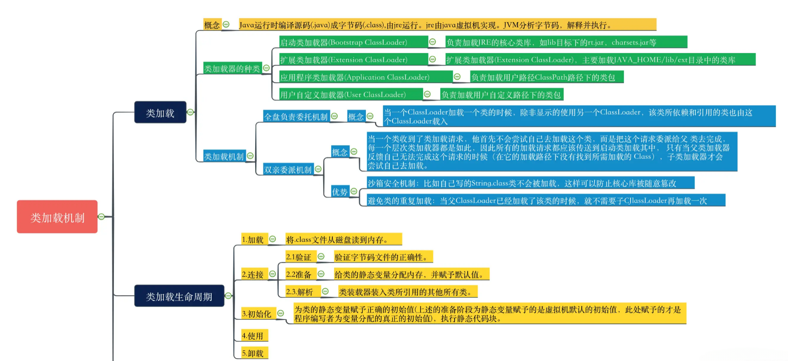

[原文链接](https://juejin.cn/post/7278244851064307770?searchId=20240402175109B1F2024ADC35300477EE)

# 类加载过程

## 类加载子系统

负责从文件获取网络加载Class字节流
由此得知，加载一个字节码文件到内存，可以从本地，也可以从网络
负责读取字节码中的信息，加载到JVM运行时内存区域（方法区）
任何字节码文件被加载到JVM之前，都要符合JVM字节码规范

## 类加载过程图示

1. **加载（Loading）阶段**
   ：该阶段是类加载过程的第一步，它的目标是将类的字节码加载到内存中。在加载阶段，Java虚拟机会根据类的全限定名查找并加载类的字节码文件，可以是从本地文件系统、网络或其他来源获取。加载后的字节码会被存储在方法区中，并在内存中创建一个代表该类的Class对象。

2. **链接（Linking）阶段**：链接阶段是类加载过程的第二步，它分为三个子阶段：验证、准备和解析。

- **验证（Verification）**：在验证阶段，Java虚拟机会对加载的字节码进行各种验证，以确保字节码的正确性和安全性。验证的内容包括语法检查、字节码验证、符号引用验证等。
- **准备（Preparation）**：在准备阶段，Java虚拟机会为类的静态变量分配内存，并设置默认初始值。这些静态变量会被存储在方法区中。
- **解析（Resolution）**：在解析阶段，Java虚拟机会将类、接口、字段和方法的符号引用解析为直接引用。解析的过程可以在编译期间进行静态解析，也可以在运行期间进行动态解析。

3. **初始化（Initialization）**
   ：初始化阶段是类加载过程的最后一步，它负责执行类的初始化代码。在初始化阶段，Java虚拟机会按照程序员定义的顺序执行类的静态变量赋值和静态代码块中的代码。初始化阶段标志着类的准备工作完成，可以开始使用该类创建对象和调用方法。
4. **使用**
   当 JVM 完成初始化阶段之后，JVM 便开始从入口方法开始执行用户的程序代码。
5. **卸载**
   当用户程序代码执行完毕后，JVM 便开始销毁创建的 Class 对象，最后负责运行的 JVM 也退出内存。

> QA:为什么验证字节码不放在第一阶段执行？
>
> 因为第一步的时候字节码还不存在，如果在这个时候验证可能会出现各种问题，例如网络断开，文件读取失败等。

## 1.加载阶段

- 读取字节码二进制流
- 解析二进制流的静态数据，转换为JVM运行时方法区的数据
- 生成一个类的java.lang.Class对象，放入堆内存中，作为方法区的访问入口
- 检测是否存在父类，如果有执行父类的类加载，重新经过一次类加载流程

假设有两个类：Base类、User类，User继承Base，那么加载User的时候就会是以下流程：


堆内存存放的Class对象实例是一个访问的入口，可以通过对象实例访问方法区的数据。
**该过程可以总结为「JVM 加载 Class 字节码文件到内存中，并在方法区创建对应的 Class 对象」。**

### Class示例何时会创建

- 使用new关键字

```java
User user = new User();
```

- 使用反射

```java
Class<Object> clazz = Class.forName("cn.yufire.User");
 ```

- 子类创建时，父类自动加载

```java
public class User extends Base {
}
```

- JVM启动时，包含入口main方法的主类

- jdk1.7后动态语言类型支持

## 2.Linking阶段

链接阶段分为3个小阶段：

**验证阶段(`Verify`)：确保字节码符合虚拟机要求，不通虚拟机版本要求可能不一致。**

- 文件格式校验
    - `CAFEBABE`
    - 版本号
    - ...
- 元数据匹配，语义分析
    - 是否有父类
    - 是否继承了final修饰的类
    - ...
- 字节码验证，数据流与控制流分析
    - 类型转换是否有效
    - 无法执行到return？
    - ...
- 符号引用
    - 通过全限定名是否能找到类 `ClassNotFoundException`
    - 通过全限定名是否能找到方法 `NoSuchMethodError`

**准备阶段(`Prepare`)：为字段赋予初始值。**

- 为类的static字段赋予初始值
    - `public static int a = 100;`
- 在准备阶段时，字段的值还是初始值，即a=0
    - 初始化阶段时才会使a=100

Java 中的变量有「类变量」和「类成员变量」两种类型。  
「类变量」指的是被 static 修饰的变量，而其他所有类型的变量都属于「类成员变量」。  
在准备阶段，JVM 只会为「类变量」分配内存，而不会为「类成员变量」分配内存。「类成员变量」的内存分配需要等到初始化阶段才开始。

```java
public static int factor = 3;
public String website = "www.google.com";
```

如上代码，在准备阶段，只会为 factor 变量分配内存，而不会为 website 变量分配内存。

**解析阶段(`Resolve`)：字节码内的符号引用`#6`转换为直接引用。**

- 其实就是将`#6`这些符号引用，转换成`JVM`内存中实实在在的内存指针关联

- 例如：字节码中类描述信息中：`Super Class：cn.yufire.Base`

- 解析后将描述信息的字符串转换为指针信息，指向内存中的`Base.class`的`Class`实例


像这些符号引用转为内存指针引用主要针对4种类型的引用，这些东西在字节码中都是以符号引用的方式进行存储，都是**静态的字符串 ->
转换为动态指针关联。**

- 类解析
- 字段解析
- 方法解析
- 接口解析

解析过程中，JVM 针对「类或接口」、「字段」、「类方法」、「接口方法」、「方法类型」、「方法句柄」、「调用点限定符」这 7
类引用进行解析。解析过程的主要任务是将其在常量池中的符号引用，替换成其在内存中的直接引用。

## 3.初始化阶段

初始化阶段(`Initialzation`)

- 初始化阶段是执行类构造器方法`<clint>()`的过程
- 类的初始化构造方法`<clint>()`不需要显式声明，Java编译器会自动生成1。
    - 这个阶段和其它两个阶段的区别是：其它两个阶段是虚拟机主导的，和我们的代码无关，而这个阶段会使用我们的代码创建`<clint>`
      方法，并完成类的初始化。

**初始化知识点**

- 对类的变量进行赋值，和执行`static`代码块
- 子类初始化过程会优先执行父类的`<clint>`方法
- 没有类变量以及static{}就不会产生`<clint>`
- 使用`-XX:+TraceClassLoading` 查看类加载过程
- `<clint>`方法默认会增加同步锁，确保只会执行一次。

案例`<clint>`

类中的所有`static`属性和`static{}`代码块如下

```java

@Slf4j // lombok的注解，相当于生成一个static的log对象
public static final ThreadLocal<String> MY_BATIS_METHOD_NAME = new ThreadLocal<>();
public static Integer NUM = 10;

static {
    NUM = 20;
    System.out.println("num已赋值");
}
```

我们类里的静态变量和static{}代码自动生成的字节码如下：


# Java 类加载器

类加载就是将`.class`文件通过`IO`读入内存，并生成一个Class对象的过程。

类加载通常由`JVM`提供默认的类加载器，这些被称之为系统加载器，还可以通过继承`ClassLoader`来实现自定义加载器。

一个类被加载到`JVM`中后，通常不会被加载第二次，因为通过双亲委派模型可以很好的避免重复加载的问题。

## 一、类加载器种类

在`Java`中默认的类加载器有三种，分别为：

- BootStrap ClassLoader (启动类加载器)
    - 执行优先级最高的类加载器
    - 用于加载`JRE`核心类库的`.jar`文件，如`rt.jar`
    - 使用`C`语言实现，双亲委派顶级祖宗加载器
- Extensions ClassLoader 也称 (Ext ClassLoader) (扩展类加载器)
    - 用于加载`JRE`扩展目录下的`.jar`文件
    - 使用`Java`实现
- Application ClassLoader (应用程序类加载器)
    - 用于加载用户自己编写的类文件，和项目中引用其他`.jar`包中的类文件
- Custom ClassLoader (自定义加载器)
    - 用于加载指定目录下的类，通常用于自定义实现

前 3 种 classloader 均继承了抽象类 ClassLoader，其源码如下，该抽象类拥有一个 parent 属性，用于指定其父类的加载器。

```java
public abstract class ClassLoader {

    private static native void registerNatives();

    static {
        registerNatives();
    }

    // The parent class loader for delegation
    // Note: VM hardcoded the offset of this field, thus all new fields
    // must be added *after* it.
    private final ClassLoader parent;

    protected Class<?> findClass(String name) throws ClassNotFoundException {
        throw new ClassNotFoundException(name);
    }

    // ...

    protected synchronized Class<?> loadClass(String name, boolean resolve) throws ClassNotFoundException {
        // First, check if the class has already been loaded
        Class<Object> c = findLoadedClass(name);
        if (c == null) {
            try {
                if (parent != null) {
                    c = parent.loadClass(name, false);
                } else {
                    c = findBootstrapClass0(name);
                }
            } catch (ClassNotFoundException e) {
                // If still not found, then invoke findClass in order
                // to find the class.
                c = findClass(name);
            }
        }
        if (resolve) {
            resolveClass(c);
        }
        return c;
    }
}
```

可以通过下面这种方式，打印加载路径及相关 jar。

```java
System.out.println("boot:" + System.getProperty("sun.boot.class.path"));
System.out.println("ext:" + System.getProperty("java.ext.dirs"));
System.out.println("app:" + System.getProperty("java.class.path"));
```

此处给出一个自定义类加载器示例。

```java
import java.io.IOException;
import java.io.InputStream;

public class ConsumerClassLoaderDemo extends ClassLoader {
    public static void main(String[] args) throws Exception {
        ClassLoader myClassLoader = new ConsumerClassLoader();
        Class<?> clazz = myClassLoader.loadClass("com.lbs0912.java.demo.ConsumerClassLoaderDemo");
        Object obj = clazz.getConstructor().newInstance();
        ClassLoader classLoader = obj.getClass().getClassLoader();
        // BootStrapClassLoader在Java中不存在的，因此会是null
        while (null != classLoader) {
            System.out.println(classLoader);
            classLoader = classLoader.getParent();
        }
    }
}

@Slf4j
class ConsumerClassLoader extends ClassLoader {
    @Override
    public Class<?> loadClass(String name) {
        String classFile = name.substring(name.lastIndexOf(".") + 1) + ".class";
        try (InputStream in = getClass().getResourceAsStream(classFile)) {
            if (null == in) {
                return super.loadClass(name);
            }
            byte[] bytes = new byte[in.available()];
            in.read(bytes);
            return defineClass(name, bytes, 0, bytes.length);
        } catch (Exception e) {
            log.error(e.getMessage());
        }
        return null;
    }
}
```

控制台输入如下


- 关系类图如下


Java9变化


**类加载机制的特点**

「类加载机制」中，通过「类加载器（classloader）」来完成类加载的过程。Java 中的类加载机制，有如下 3 个特点

1. **双亲委派**  
   JVM 中，类加载器默认使用双亲委派原则
2. **负责依赖**  
   如果一个加载器在加载某个类的时候，发现这个类依赖于另外几个类或接口，也会去尝试加载这些依赖项。
3. **缓存加载**  
   为了提升加载效率，消除重复加载，一旦某个类被一个类加载器加载，那么它会缓存这个加载结果，不会重复加载。
   下面对「双亲委派」进行说明。

## 二、双亲委派模型

1. 如果一个类加载器收到了类加载请求，它并不会自己先加载，而是把这个请求委托给父类的加载器去执行。
2. 如果父类加载器还存在其父类加载器，则进一步向上委托，依次递归，请求最终将到达顶层的引导类加载器 BootstrapClassLoader。
3. 如果父类加载器可以完成类加载任务，就成功返回；倘若父类加载器无法完成加载任务，子加载器才会尝试自己去加载。
4. 父类加载器一层一层往下分配任务，如果子类加载器能加载，则加载此类；如果将加载任务分配至系统类加载器（AppClassLoader）也无法加载此类，则抛出异常。

**双亲**

`classloader` 类存在一个 `parent` 属性，可以配置双亲属性。默认情况下，JDK 中设置如下。

```java
ExtClassLoader.parent = null;
AppClassLoader.parent = ExtClassLoader;
//自定义
XxxClassLoader.parent = AppClassLoader;
```

需要注意的是，启动类加载器（`BootstrapClassLoader`）不是一个 Java 类，它是由底层的 C++ 实现，因此启动类加载器不属于 Java
类库，无法被 Java 程序直接引用，所以  
`ExtClassLoader.parent=null`。

**委派**

双亲设置之后，便可以委派了。委派过程也就是类文件加载过程。
`ClassLoader` 里面有 3 个重要的方法，即

1. `loadClass()`
2. `findClass()`
3. `defineClass()`

实现双亲委派的代码都集中在 `java.lang.ClassLoader` 的 `loadClass()` 方法中。

```java
public abstract class ClassLoader {
    // 委派的父类加载器
    private final ClassLoader parent;

    public Class<?> loadClass(String name) throws ClassNotFoundException {
        return loadClass(name, false);
    }

    protected Class<?> loadClass(String name, boolean resolve) throws ClassNotFoundException {
        // 保证该类只加载一次
        synchronized (getClassLoadingLock(name)) {
            // 首先，检查该类是否被加载
            Class<?> c = findLoadedClass(name);
            if (c == null) {
                try {
                    if (parent != null) {
                        //父类加载器不为空，则用该父类加载器
                        c = parent.loadClass(name, false);
                    } else {
                        //若父类加载器为空，则使用启动类加载器作为父类加载器
                        c = findBootstrapClassOrNull(name);
                    }
                } catch (ClassNotFoundException e) {
                    //若父类加载器抛出ClassNotFoundException ，
                    //则说明父类加载器无法完成加载请求
                }

                if (c == null) {
                    //父类加载器无法完成加载请求时
                    //调用自身的findClass()方法进行类加载
                    c = findClass(name);
                }
            }
            if (resolve) {
                resolveClass(c);
            }
            return c;
        }
    }

    protected Class<?> findClass(String name) throws ClassNotFoundException {
        throw new ClassNotFoundException(name);
    }
}
```

上述代码的主要步骤如下

1. 先检查类是否已经被加载过
2. 若没有加载，则调用父加载器的 loadClass() 方法进行加载
3. 若父加载器为空，则默认使用启动类加载器作为父加载器
4. 如果父类加载失败，抛出 ClassNotFoundException 异常后，再调用自己的 findClass() 方法进行加载
   此处给出一个加载时序图，加深理解。


**loadClass、findClass、defineClass 方法的区别**  
ClassLoader 中和类加载有关的方法有很多，前面提到了 loadClass()，除此之外，还有 findClass() 和 defineClass() 等。这3个方法的区别如下

- **loadClass()**：默认的双亲委派机制在此方法中实现
- **findClass()**：根据名称或位置加载 .class 字节码
- **definclass()**：把 .class 字节码转化为 Class 对象

使用双亲委派模型有以下好处

- 可以避免重复加载类
    - 虽然有多个类加载器，但是因为每个类都是唯一的，且都会通过父亲加载器加载，所以可以避免类加载重复。
- 可以避免Java核心类被用户篡改,保证安全性
    - 如果用户自定义了一个类为`java.lang.String`，那么会一层一层向上加载，直到`BootStrap ClassLoader`祖宗类加载器(入口加载器)
      ，但是在这个加载器里已经将JDK包下的`java.lang.String`加载过了，所以会直接跳过加载用户编写的`String`类。

3. 双亲委派模型图


## 三、破坏双亲委派

双亲委派有两个弊端：

双亲委派模型并不是一个强制性约束，而是 Java 设计者推荐给开发者的类加载器的实现方式。在一定条件下，为了完成某些操作，可以
“打破” 模型。

打破双亲委派模型的方法主要包括

1. 重写 `loadClass()` 方法
2. 利用线程上下文加载器

**重写 loadClass 方法**

在双亲委派的过程，都是在 **loadClass()** 方法中实现的，因此要想要破坏这种机制，可以自定义一个类加载器，继承 **ClassLoader** 并重写
**loadClass()** 方法即可，使其不进行双亲委派。

### 1. 不委派父亲加载器

从上述源码中可以得知，双亲委派机制是由`ClassLoader -> loadClass()`方法进行实现的，而且此方法非`final`
修饰，则代表此方法是可以被我们的自定义加载器重写的。

双亲委派的核心源码为：

```java
// 查找当前加载器是否有父亲加载器，(双亲委派机制)
if (parent != null) {
    // 调用父亲加载器进行加载
    c = parent.loadClass(name, false);
}
```

如果我们将`loadClass()`方法进行重写，且不执行这段逻辑的话，则双亲委派机制就会被打破，从而遭到破坏！

**为什么建议重写findClass()方法**

因为是出于历史原因，且`JDK`是向上兼容的，所以该方法并不能随便进行更改，但是`JDK`开发者也意识到了这个问题，所以在
`ClassLoader`抽象类中新增了`findClass()`方法，供开发者进行重写，和实现自定义类加载器。

在`JDK`源码中的`loadClass()`方法上有一段注释说明了此方法不建议被重写：

```java

/*加载具有指定二进制名称的类。该方法的默认实现按照以下顺序搜索类:  
调用findLoadedClass(String)检查类是否已经加载。  
在父类装入器上调用loadClass方法。如果父类为空，  则使用虚拟机内置的类装入器。
调用findClass(String)方法来查找类。如果使用上述步骤找到了类，  
并且resolve标志为真，则该方法将对生成的class对象调用resolveClass(class)方法。  
ClassLoader的子类被鼓励重写findClass(String)，  而不是这个方法。除非被重写，
否则这个方法在整个类加载过程中同步getClassLoadingLock方法的结果。*/
protected Class<?> loadClass(String name, boolean resolve) throws ClassNotFoundException {...}
```


### 2. 向下委派子加载器

服务提供接口（SPI，Service Provider Interface） 是 JDK 内置的一种「服务提供发现机制」，是 Java 提供的一套用来被第三方实现或者扩展的
API，它可以用来启用框架扩展和替换组件（可通过 SPI 机制实现模块化）。SPI 的整体机制图如下。


Java 的 SPI 机制可以为某个接口寻找服务实现。SPI 机制主要思想是将装配的控制权移到程序之外，在「模块化设计」中这个机制尤其重要，其核心思想就是「解耦」。Java
SPI 实际上是 *“基于接口的编程 ＋ 策略模式 ＋ 配置文件”* 组合实现的动态加载机制。

> 在JDK中引入了SPI机制后，例如JDBC有个驱动管理类`DriverManager`，他是在rt.jar下的，由BootStrap
>
ClassLoader进行加载，但是由于这个类里需要加载所有的Driver驱动，但是，像是MySQL、Oracle等数据库驱动都是由各家数据库厂商实现的，是以外部依赖的模式进行引入的，此时如果SPI机制想要顺利的加载驱动，就不能使用BootStrap
> ClassLoader因为各个数据库驱动并不在rt.jar下，所以无法加载，因此JDK搞了一个线程上下文类加载器，和setContextClassLoader()
> 来手动设置类加载器，才解决了这个问题，此时其实已经是调用了线程上下文类加载器，一般为Application ClassLoader，进行加载驱动的动作了。

**使用示例**
Java 中使用 SPI 的步骤如下图所示，主要包括 3 步
1. 目录创建
- Java 中，在 ClassPath 下创建 META-INF/services 目录
2. 文件创建
- 创建服务提供接口（SPI）
- 创建实现者，实现上述 SPI 接口
- 创建配置文件
3. 开始使用
- 通过 `Service.load()` 获得服务提供接口（SPI）的所有实现类


下面给出一个具体的例子，展示 SPI 的使用。项目结构如下图所示。


- 创建 ICustomSvc接口，作为服务提供接口（SPI）

```java
public interface ICustomSvc {
    String getName();
}
```

- 创建接口的实现者 CustomSvcOne、CustomSvcTwo。实际应用中，接口实现者为第三方厂商提供。开发者可通过 jar 包导入或 maven依赖方式集成到自己的工程。

```java
public class CustomSvcOne implements ICustomSvc {
    @Override
    public String getName() {
        return "CustomSvcOne";
    }
}

public class CustomSvcTwo implements ICustomSvc {
    @Override
    public String getName() {
        return "CustomSvcTwo";
    }
}
```

- 通过 `Service.load()` 获得服务提供接口（SPI）的所有实现类。

```java
import java.util.ServiceLoader;

public class CustomTest {
    public static void main(String[] args) {
        ServiceLoader<ICustomSvc> serviceLoader = ServiceLoader.load(ICustomSvc.class);
        serviceLoader.forEach(s -> System.out.println(s.getName()));
    }
}
```

在`resources`下新建`META-INF/services`自定义的文件,名称为自己的接口，具体内容为实现类
`com.nmz.spi.service.ICustomSvc`

```text
com.nmz.spi.service.impl.CustomSvcOne
com.nmz.spi.service.impl.CustomSvcTwo
```

- 程序输出如下。


**SPI 机制的实现原理**

从「SPI 的使用示例」中可知，使用 SPI 时，要通过 Service.load() 获得服务提供接口（SPI）的所有实现类，得到的是一个
`ServiceLoader<S>` 类型的数据结构。
不妨看一下 JDK 中 `ServiceLoader<S>` 方法的具体实现。

<details>
<summary>ServiceLoader</summary>

```java
//ServiceLoader实现了Iterable接口，可以遍历所有的服务实现者
public final class ServiceLoader<S>
        implements Iterable<S> {
    //查找配置文件的目录
    private static final String PREFIX = "META-INF/services/";
    //表示要被加载的服务的类或接口
    private final Class<S> service;
    //这个ClassLoader用来定位，加载，实例化服务提供者
    private final ClassLoader loader;
    // 访问控制上下文
    private final AccessControlContext acc;
    // 缓存已经被实例化的服务提供者，按照实例化的顺序存储
    private LinkedHashMap<String, S> providers = new LinkedHashMap<>();
    // 迭代器
    private LazyIterator lookupIterator;

    //重新加载，就相当于重新创建ServiceLoader了，用于新的服务提供者安装到正在运行的Java虚拟机中的情况。
    public void reload() {
        //清空缓存中所有已实例化的服务提供者
        providers.clear();
        //新建一个迭代器，该迭代器会从头查找和实例化服务提供者
        lookupIterator = new LazyIterator(service, loader);
    }

    //私有构造器
    //使用指定的类加载器和服务创建服务加载器
    //如果没有指定类加载器，使用系统类加载器，就是应用类加载器。
    private ServiceLoader(Class<S> svc, ClassLoader cl) {
        service = Objects.requireNonNull(svc, "Service interface cannot be null");
        loader = (cl == null) ? ClassLoader.getSystemClassLoader() : cl;
        acc = (System.getSecurityManager() != null) ? AccessController.getContext() : null;
        reload();
    }

    //解析失败处理的方法
    private static void fail(Class<?> service, String msg, Throwable cause)
            throws ServiceConfigurationError {
        throw new ServiceConfigurationError(service.getName() + ": " + msg,
                cause);
    }

    private static void fail(Class<?> service, String msg)
            throws ServiceConfigurationError {
        throw new ServiceConfigurationError(service.getName() + ": " + msg);
    }

    private static void fail(Class<?> service, URL u, int line, String msg)
            throws ServiceConfigurationError {
        fail(service, u + ":" + line + ": " + msg);
    }

    //解析服务提供者配置文件中的一行
    //首先去掉注释校验，然后保存
    //返回下一行行号
    //重复的配置项和已经被实例化的配置项不会被保存
    private int parseLine(Class<?> service, URL u, BufferedReader r, int lc,
                          List<String> names)
            throws IOException, ServiceConfigurationError {
        //读取一行
        String ln = r.readLine();
        if (ln == null) {
            return -1;
        }
        //#号代表注释行
        int ci = ln.indexOf('#');
        if (ci >= 0) ln = ln.substring(0, ci);
        ln = ln.trim();
        int n = ln.length();
        if (n != 0) {
            if ((ln.indexOf(' ') >= 0) || (ln.indexOf('\t') >= 0))
                fail(service, u, lc, "Illegal configuration-file syntax");
            int cp = ln.codePointAt(0);
            if (!Character.isJavaIdentifierStart(cp))
                fail(service, u, lc, "Illegal provider-class name: " + ln);
            for (int i = Character.charCount(cp); i < n; i += Character.charCount(cp)) {
                cp = ln.codePointAt(i);
                if (!Character.isJavaIdentifierPart(cp) && (cp != '.'))
                    fail(service, u, lc, "Illegal provider-class name: " + ln);
            }
            if (!providers.containsKey(ln) && !names.contains(ln))
                names.add(ln);
        }
        return lc + 1;
    }

    //解析配置文件，解析指定的url配置文件
    //使用parseLine方法进行解析，未被实例化的服务提供者会被保存到缓存中去
    @Slf4j
    private Iterator<String> parse(Class<?> service, URL u)
            throws ServiceConfigurationError {
        InputStream in;
        BufferedReader r;
        ArrayList<String> names = new ArrayList<>();
        try {
            in = u.openStream();
            r = new BufferedReader(new InputStreamReader(in, "utf-8"));
            int lc = 1;
            while ((lc = parseLine(service, u, r, lc, names)) >= 0) ;
        } catch (Exception e) {
            log.error(e.getMessage());
        }
        return names.iterator();
    }

    @Slf4j
    //服务提供者查找的迭代器
    private class LazyIterator
            implements Iterator<S> {

        Class<S> service;//服务提供者接口
        ClassLoader loader;//类加载器
        Enumeration<URL> configs = null;//保存实现类的url
        Iterator<String> pending = null;//保存实现类的全名
        String nextName = null;//迭代器中下一个实现类的全名

        private LazyIterator(Class<S> service, ClassLoader loader) {
            this.service = service;
            this.loader = loader;
        }

        private boolean hasNextService() {
            if (nextName != null) {
                return true;
            }
            if (configs == null) {
                try {
                    String fullName = PREFIX + service.getName();
                    if (loader == null)
                        configs = ClassLoader.getSystemResources(fullName);
                    else
                        configs = loader.getResources(fullName);
                } catch (Exception e) {
                    log.error(e.getMessage());
                }
            }
            while ((pending == null) || !pending.hasNext()) {
                if (!configs.hasMoreElements()) {
                    return false;
                }
                pending = parse(service, configs.nextElement());
            }
            nextName = pending.next();
            return true;
        }

        @Slf4j
        private S nextService() {
            if (!hasNextService())
                throw new NoSuchElementException();
            String cn = nextName;
            nextName = null;
            Class<?> c;
            try {
                c = Class.forName(cn, false, loader);
                if (!service.isAssignableFrom(c)) {
                    fail(service, "Provider " + cn + " not a subtype");
                }
                S p = service.cast(c.getConstructor().newInstance());
                providers.put(cn, p);
                return p;
            } catch (Exception e) {
                log.error(e.getMessage());
            }
        }

        public boolean hasNext() {
            if (acc == null) {
                return hasNextService();
            } else {
                PrivilegedAction<Boolean> action = new PrivilegedAction<Boolean>() {
                    public Boolean run() {
                        return hasNextService();
                    }
                };
                return AccessController.doPrivileged(action, acc);
            }
        }

        public S next() {
            if (acc == null) {
                return nextService();
            } else {
                PrivilegedAction<S> action = new PrivilegedAction<S>() {
                    public S run() {
                        return nextService();
                    }
                };
                return AccessController.doPrivileged(action, acc);
            }
        }

        public void remove() {
            throw new UnsupportedOperationException();
        }

    }

    //获取迭代器
    //返回遍历服务提供者的迭代器
    //以懒加载的方式加载可用的服务提供者
    //懒加载的实现是：解析配置文件和实例化服务提供者的工作由迭代器本身完成
    public Iterator<S> iterator() {
        return new Iterator<S>() {
            //按照实例化顺序返回已经缓存的服务提供者实例
            Iterator<Map.Entry<String, S>> knownProviders
                    = providers.entrySet().iterator();

            public boolean hasNext() {
                if (knownProviders.hasNext())
                    return true;
                return lookupIterator.hasNext();
            }

            public S next() {
                if (knownProviders.hasNext())
                    return knownProviders.next().getValue();
                return lookupIterator.next();
            }

            public void remove() {
                throw new UnsupportedOperationException();
            }

        };
    }

    //为指定的服务使用指定的类加载器来创建一个ServiceLoader
    public static <S> ServiceLoader<S> load(Class<S> service,
                                            ClassLoader loader) {
        return new ServiceLoader<>(service, loader);
    }

    //使用线程上下文的类加载器来创建ServiceLoader
    public static <S> ServiceLoader<S> load(Class<S> service) {
        ClassLoader cl = Thread.currentThread().getContextClassLoader();
        return ServiceLoader.load(service, cl);
    }

    //使用扩展类加载器为指定的服务创建ServiceLoader
    //只能找到并加载已经安装到当前Java虚拟机中的服务提供者，应用程序类路径中的服务提供者将被忽略
    public static <S> ServiceLoader<S> loadInstalled(Class<S> service) {
        ClassLoader cl = ClassLoader.getSystemClassLoader();
        ClassLoader prev = null;
        while (cl != null) {
            prev = cl;
            cl = cl.getParent();
        }
        return ServiceLoader.load(service, prev);
    }

    public String toString() {
        return "java.util.ServiceLoader[" + service.getName() + "]";
    }

}
```

</details>

- `ServiceLoader` 实现了 Iterable 接口，所以它有迭代器的属性。`ServiceLoader` 实现了迭代器的 `hasNext` 和 `next` 方法。`ServiceLoader`
  持有了 private LazyIterator lookupIterator;，这是一个懒加载类型的迭代器 迭代器（懒加载迭代器）。
- `hasNextService()` 方法中获取 fullName 时，使用到了前缀 PREFIX，这个值是 `"META-INF/services/"`。所以，在创建配置文件时，其路径是
  `ClassPath` 下的 `META-INF/services/`。
- SPI 机制中，通过反射方法 `Class.forName()` 加载类对象，并用 `newInstance` 方法将类实例化，并把实例化后的类缓存到 providers
  对象中（其类型为 `LinkedHashMap<String,S>`），最后返回实例对象。
- `ServiceLoader` 不是实例化以后，就去读取配置文件中的具体实现并进行实例化，而是等到使用迭代器去遍历的时候，才会加载对应的配置文件去解析，调用
  `hasNext` 方法的时候会去加载配置文件进行解析，调用 `next` 方法的时候进行实例化并缓存。
- 所有的配置文件只会加载一次，服务提供者也只会被实例化一次，重新加载配置文件可使用 reload 方法。

SPI 机制应用较为广泛，包括

- 数据库驱动 JDBC DriveManager
- 日志库门面 Common-Logging
- 插件体系
- Spring 中使用 SPI

以「 JDBC DriveManager」为例，简要介绍下 SPI 机制的应用。

1. Java 定义服务提供接口（SPI），提供一个标准，如 java.sql.Driver。
2. 具体厂商或框架来实现这个 SPI 接口，比如 me.cxis.sql.MyDriver。
3. 具体厂商或框架创建配置文件，在 META-INF/services 目录下定义一个名字为接口全限定名的文件，如 java.sql.Driver
   文件。文件内容是具体的实现名字，如 me.cxis.sql.MyDriver。
4. 开发者引用具体厂商的 jar 包进行业务逻辑开发。

```java
//获取ServiceLoader
ServiceLoader<Driver> loadedDrivers = ServiceLoader.load(Driver.class);
//获取迭代器
Iterator<Driver> driversIterator = loadedDrivers.iterator();

//遍历
while (driversIterator.hasNext()) {
    driversIterator.next();
    //可以做具体的业务逻辑
}
```

**SPI 机制的缺点**

1. 不能按需加载

- 需要遍历所有的实现，并实例化，然后在循环中才能找到我们需要的实现。
- 如果不想用某些实现类，或者某些类实例化很耗时，就会造成浪费。

2. 获取某个实现类的方式不够灵活

- 只能通过 Iterator 形式获取
- 不能根据某个参数来获取对应的实现类

3. 多线程下不安全

- 多个并发多线程使用 ServiceLoader 类的实例，是不安全的

**Spring SPI**

SPI 机制不仅在 JDK 中实现，Spring 及 Dubbo 框架也都有对应的 SPI 机制。
在 Spring Boot 中好多配置和实现都有默认的实现，我们如果想要修改某些配置，我们只需要在配置文件中写上对应的配置，项目应用的便是我们定义的配置内容。这正是通过
SPI 机制实现的。

- 我们将想要注入 IoC 容器的类的全类限定名写到 `META-INF/spring.factories` 文件中
- Spring Boot 程序启动时，使用 `SpringFactoriesLoader` 进行加载，扫描每个 jar 包 class-path 目录下的
  `META-INF/spring.factories` 配置文件，然后解析 properties 文件，找到指定名称的配置

**Java SPI 与 Spring SPI 的区别**

1. JDK 使用的加载工具类是 ServiceLoader，而 Spring 使用的是 SpringFactoriesLoader。
2. JDK 目录命名方式是 META-INF/services/提供方接口全类名，而 Spring 使用的是 META-INF/spring-factories。

## 四、自定义Java内部

如果在自己的工程目录中自定义了一个和`JDK`中同包，同类名的一个类，例如：`java.lang.String`，会有什么样的结果？

首先我们了解类加载器和类加载器的双亲委派机制，因此得知，要加载这个类，可以使用`Application ClassLoader`或
`Custom ClassLoader`进行加载，当其中一个类加载器加载时，会调用父亲的`loadClass()`方法，最终调用到`BootStrap ClassLoader`
中去，但是由于`java.lang.String`为JDK核心类，并且已经被祖宗加载器加载过了，所以会跳过自己工程下的`java.lang.String`
。从而避免了核心类篡改和重复加载的问题。

此时如果调用自定义`java.lang.String`类的方法，会报**NoSuchMethodError**异常。因为自定义的类并没有被加载。
## 图解

