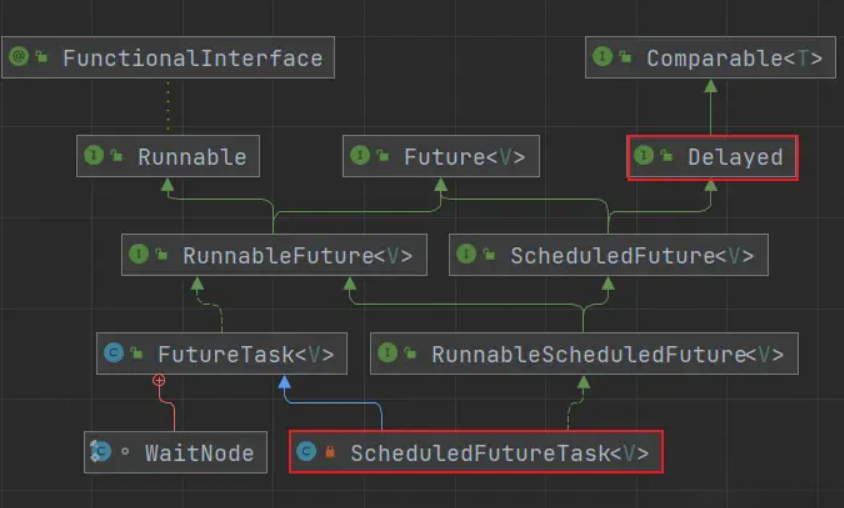

# 什么是队列？

队列的实现可以是数组、也可以是链表，可以实现先进先出的顺序队列，也可以实现先进后出的栈队列

那什么是阻塞队列？

在经典的生产者/消费者模型中，生产者们将生产的元素放入队列，而消费者们从队列获取元素消费

当队列已满，我们会手动阻塞生产者，直到消费者消费再来手动唤醒生产者

当队列为空，我们会手动阻塞消费者，直到生产者生产再来手动唤醒消费者

在这个过程中由于使用的是普通队列，阻塞与唤醒我们需要手动操作，保证同步机制

**阻塞队列在队列的基础上提供等待/通知功能，用于线程间的通信，避免线程竞争死锁**

生产者可以看成往线程池添加任务的用户线程，而消费者则是线程池中的工作线程

当阻塞队列为空时阻塞工作线程获取任务，当阻塞队列已满时阻塞用户线程向队列中添加任务（创建非核心线程、拒绝策略）

JDK7提供了7个阻塞队列。分别是

- ArrayBlockingQueue ： 一个由数组结构组成的有界阻塞队列。
- LinkedBlockingQueue ： 一个由链表结构组成的有界阻塞队列。
- PriorityBlockingQueue ： 一个支持优先级排序的无界阻塞队列。
- DelayQueue： 一个使用优先级队列实现的无界阻塞队列。
- SynchronousQueue： 一个不存储元素的阻塞队列。
- LinkedTransferQueue： 一个由链表结构组成的无界阻塞队列。
- LinkedBlockingDeque： 一个由链表结构组成的双向阻塞队列。

JDK提供的阻塞队列中，`LinkedBlockingDeque` 是一个 Deque（双向的队列），其实现的接口是 `BlockingDeque`；其余6个阻塞队列则是 Queue（单向队列），实现的接口是 `BlockingQueue`。

- BlockingQueue接口： 单向阻塞队列实现了该接口。
- BlockingDeque接口： 双向阻塞队列实现了该接口

**注意事项**：

SynchronousQueue: 队列只有一个元素，如果想插入多个，必须等队列元素取出后，才能插入，只能有一个“坑位”，用一个插一个。

需要注意的是LinkedBlockingQueue虽然是有界的，但有个巨坑，其默认大小是Integer.MAX_VALUE，高达21亿，一般情况下内存早爆了（在线程池的ThreadPoolExecutor有体现）。


# API
阻塞队列提供一下四种添加、删除元素的API，我们常用阻塞等待/超时阻塞等待的API

| 方法名|	抛出异常 |	返回true/false |	阻塞等待 |	超时阻塞等待 |
|-- | -- |-- |--|--|
| 添加 |	add(Object)|	offer(Object) | 	put(Object) |	offer(Object,long,TimeUnit) |
| 删除 | 	remove() | 	poll()	| take() | 	poll(long,TimeUnit) |
1. 抛出异常:队满add 抛出异常`IllegalStateExceptio` ；队空remove 抛出异常`NoSuchElementException`
2. 返回值: 队满offer返回false，队空poll返回null
3. 阻塞等待: 队满时put会阻塞线程 或 队空时take会阻塞线程
4. 超时阻塞等待: 在阻塞等待、返回true/false的基础上增加超时等待（等待一定时间就退出等待）

# 阻塞队列的公平与不公平


什么是阻塞队列的公平与不公平？

当阻塞队列已满时，如果是公平的，那么阻塞的线程根据先后顺序从阻塞队列中获取元素，不公平则反之

实际上阻塞队列的公平与不公平，要看实现阻塞队列的锁是否公平

阻塞队列一般默认使用不公平锁

# ArrayBlockingQueue
从名称看就可以知道它是数组实现的，我们先来看看它有哪些重要字段
```java
 public class ArrayBlockingQueue<E> extends AbstractQueue<E>
         implements BlockingQueue<E>, java.io.Serializable {
     //存储元素的数组
     final Object[] items;
     //记录元素出队的下标
     int takeIndex;
     //记录元素入队的下标
     int putIndex;
     //队列中元素数量
     int count;
     //使用的锁
     final ReentrantLock lock;
     //出队的等待队列，作用于消费者
     private final Condition notEmpty;
     //入队的等待队列，作用于生产者
     private final Condition notFull;
     
 }
```

看完关键字段，我们可以知道：ArrayBlockingQueue由数组实现、使用并发包下的可重入锁、同时用两个等待队列作用生产者和消费者

为什么出队、入队要使用两个下标记录？

实际上它是一个环形数组，在初始化后就不改变大小，后续查看源码自然能明白它是环形数组

在构造器中、初始化数组容量，同时使用非公平锁
```java
public ArrayBlockingQueue(int capacity) {
    this(capacity, false);
}
public ArrayBlockingQueue(int capacity, boolean fair) {
    if (capacity <= 0)
        throw new IllegalArgumentException();
    this.items = new Object[capacity];
    //锁是否为公平锁
    lock = new ReentrantLock(fair);
    notEmpty = lock.newCondition();
    notFull =  lock.newCondition();
}
```
ArrayBlockingQueue的公平性是由ReentrantLock来实现的

我们来看看入队方法，入队方法都大同小异，我们本文都查看支持超时、响应中断的方法
```java
public boolean offer(E e, long timeout, TimeUnit unit)
    throws InterruptedException {
    //检查空指针
    checkNotNull(e);
    //获取超时纳秒
    long nanos = unit.toNanos(timeout);
    final ReentrantLock lock = this.lock;
    //加锁
    lock.lockInterruptibly();
    try {
        //如果队列已满
        while (count == items.length) {
            //超时则返回入队失败，否则生产者等待对应时间
            if (nanos <= 0)
                return false;
            nanos = notFull.awaitNanos(nanos);
        }
        //入队
        enqueue(e);
        return true;
    } finally {
        //解锁
        lock.unlock();
    }
}
```


直接使用可重入锁保证同步，如果队列已满，在此期间判断是否超时，超时就返回，未超时等待；未满则执行入队方法

```java
private void enqueue(E x) {
    //队列数组
    final Object[] items = this.items;
    //往入队下标添加值
    items[putIndex] = x;
    //自增入队下标 如果已满则定位到0 成环
    if (++putIndex == items.length)
        putIndex = 0;
    //统计数量增加
    count++;
    //唤醒消费者
    notEmpty.signal();
}
```
在入队中，主要是添加元素、修改下次添加的下标、统计队列中的元素和唤醒消费者，到这以及可以说明它的实现是环形数组

`ArrayBlockingQueue`由环形数组实现的阻塞队列，固定容量不支持动态扩容，使用非公平的`ReertrantLock`保证入队、出队操作的原子性，使用两个等待队列存储等待的生产者、消费者，适用于在并发量不大的场景

**特征:**
基于数组实现，队列容量固定。存/取数据的操作共用一把锁(默认非公平锁)，无法实现真正意义上存/取操作并行执行。

**分析:**
由于基于数组，容量固定所以不容易出现内存占用率过高，但是如果容量太小，取数据比存数据的速度慢，那么会造成过多的线程进入阻塞(也可以使用offer()方法达到不阻塞线程)， 此外由于存取共用一把锁，所以有高并发和吞吐量的要求情况下，我们也不建议使用`ArrayBlockingQueue`。


# LinkedBlockingQueue

`LinkedBlockingQueue`从名称上来看，就是使用链表实现的，我们来看看它的关键字段
```java
public class LinkedBlockingQueue<E> extends AbstractQueue<E>
        implements BlockingQueue<E>, java.io.Serializable {
    //节点
    static class Node<E> {
        //存储元素
        E item;
        //下一个节点
        Node<E> next;
        
        //...
    }
    //容量上限
    private final int capacity;
    //队列元素数量
    private final AtomicInteger count = new AtomicInteger();
    //头节点
    transient Node<E> head;
    //尾节点
    private transient Node<E> last;
    //出队的锁
    private final ReentrantLock takeLock = new ReentrantLock();
    //出队的等待队列
    private final Condition notEmpty = takeLock.newCondition();
    //入队的锁
    private final ReentrantLock putLock = new ReentrantLock();
    //入队的等待队列
    private final Condition notFull = putLock.newCondition();
}
```
从字段中，我们可以知道它使用单向链表的节点、且用首尾节点记录队列的头尾，并且它使用两把锁、两个等待队列作用于队头、尾，与`ArrayBlockingQueue`相比能够增加并发性能

有个奇怪的地方：都使用锁了，为什么记录元素数量count却使用原子类呢？

这是由于两把锁，作用于入队与出队的操作，入队与出队也可能并发执行，同时修改count，因此要使用原子类保证修改数量的原子性

**在初始化时需要设置容量大小，否则会设置成无界的阻塞队列（容量是int的最大值）**

**当消费速度小于生产速度时，阻塞队列中会堆积任务，进而导致容易发生OOM**

```java
public LinkedBlockingQueue() {
    this(Integer.MAX_VALUE);
}
  
public LinkedBlockingQueue(int capacity) {
    if (capacity <= 0) throw new IllegalArgumentException();
    this.capacity = capacity;
    last = head = new Node<E>(null);
}
```
在构造中，首尾节点会指向一个值为空的虚拟节点

后续首节点会一直指向值为空的虚拟节点

而真实的队头节点实际上是这个虚拟节点的next节点

来看看入队操作
```java
public boolean offer(E e, long timeout, TimeUnit unit)
    throws InterruptedException {
  
    if (e == null) throw new NullPointerException();
    long nanos = unit.toNanos(timeout);
    int c = -1;
    final ReentrantLock putLock = this.putLock;
    final AtomicInteger count = this.count;
    //加锁
    putLock.lockInterruptibly();
    try {
        //队列已满，超时返回，不超时等待
        while (count.get() == capacity) {
            if (nanos <= 0)
                return false;
            nanos = notFull.awaitNanos(nanos);
        }
        //入队
        enqueue(new Node<E>(e));
        // 先获取再自增 c中存储的是旧值
        c = count.getAndIncrement();
        //如果数量没满 唤醒生产者
        if (c + 1 < capacity)
            notFull.signal();
    } finally {
        //解锁
        putLock.unlock();
    }
    //如果旧值为0 说明该入队操作前是空队列，唤醒消费者来消费
    if (c == 0)
        signalNotEmpty();
    return true;
}
```

入队操作类似，只不过在此期间如果数量没满唤醒生产者生产，队列为空唤醒消费者来消费，从而增加并发性能

入队只是改变指向关系
```java
//添加节点到末尾
private void enqueue(Node<E> node) {
    last = last.next = node;
}
```
唤醒消费者前要先获取锁
```java
private void signalNotEmpty() {
    final ReentrantLock takeLock = this.takeLock;
    takeLock.lock();
    try {
        notEmpty.signal();
    } finally {
        takeLock.unlock();
    }
}
```
出队操作也类似
```java
public E poll(long timeout, TimeUnit unit) throws InterruptedException {
    E x = null;
    int c = -1;
    long nanos = unit.toNanos(timeout);
    final AtomicInteger count = this.count;
    final ReentrantLock takeLock = this.takeLock;
    takeLock.lockInterruptibly();
    try {
        // 队列为空 超时返回空，否则等待
        while (count.get() == 0) {
            if (nanos <= 0)
                return null;
            nanos = notEmpty.awaitNanos(nanos);
        }
        //出队
        x = dequeue();
        c = count.getAndDecrement();
        //队列中除了当前线程获取的任务外还有任务就去唤醒消费者消费
        if (c > 1)
            notEmpty.signal();
    } finally {
        takeLock.unlock();
    }
    //原来队列已满就去唤醒生产者 生产
    if (c == capacity)
        signalNotFull();
    return x;
}
```
`LinkedBlockingQueue`与`ArrayBlockingQueue`的出队、入队实现类似

只不过`LinkedBlockingQueue`入队、出队获取/释放的锁不同，并且在此过程中不同情况回去唤醒其他的生产者、消费者从而进一步提升并发性能

**LinkedBlockingQueue 由单向链表实现的阻塞队列，记录首尾节点；默认是无界、非公平的阻塞队列（初始化时要设置容量否则可能OOM），使用两把锁、两个等待队列，分别操作入队、出队的生产者、消费者，在入队、出队操作期间不同情况还会去唤醒生产者、消费者，从而进一步提升并发性能，适用于并发量大的场景**
**特征**:

LinkedBlockingQueue基于链表实现，队列容量默认Integer.MAX_VALUE
存/取数据的操作分别拥有独立的锁，可实现存/取并行执行。

**分析**:
1. 基于链表，数据的新增和移除速度比数组快，但是每次存储/取出数据都会有Node对象的新建和移除，所以也存在由于GC影响性能的可能
2. 默认容量非常大，所以存储数据的线程基本不会阻塞，但是如果消费速度过低，内存占用可能会飙升。
3. 读/取操作锁分离，所以适合有并发和吞吐量要求的项目中

**使用场景**:
在项目的一些核心业务且生产和消费速度相似的场景中:

# LinkedBlockingDeque
`LinkedBlockingDeque`实现与`LinkedBlockQueue`类似，在`LinkedBlockQueue`的基础上支持从队头、队尾进行添加、删除的操作

它是一个双向链表，带有一系列First、Last的方法，比如：`offerLast`、`pollFirst`

由于`LinkedBlockingDeque`双向，常用其来**实现工作窃取算法，从而减少线程的竞争**

什么是工作窃取算法？

比如多线程处理多个阻塞队列的任务（一一对应），每个线程从队头获取任务处理，当A线程处理完它负责的阻塞队列所有任务时，它再从队尾窃取其他阻塞队列的任务，这样就不会发生竞争，除非队列中只剩一个任务，才会发生竞争

`ForkJoin`框架就使用其来充当阻塞队列

# PriorityBlockingQueue
`PriorityBlockingQueue`是优先级排序的无界阻塞队列，阻塞队列按照优先级进行排序

**使用堆排序，具体排序算法由`Comparable`或`Comparator`实现比较规则**

1. 默认：泛型中的对象需要实现Comparable比较规则 ，根据compareTo方法规则排序
2. 构造器中指定比较器Comparator 根据比较器规则排序
```java
@Test
public void testPriorityBlockingQeque() {
    //默认使用Integer实现Comparable的升序
    PriorityBlockingQueue<Integer> queue = new PriorityBlockingQueue<>(6);
    queue.offer(99);
    queue.offer(1099);
    queue.offer(299);
    queue.offer(992);
    queue.offer(99288);
    queue.offer(995);
    //99 299 992 995 1099 99288
    while (!queue.isEmpty()){
        System.out.print(" "+queue.poll());
    }
  
    System.out.println();
    //指定Comparator 降序
    queue = new PriorityBlockingQueue<>(6, (o1, o2) -> o2-o1);
    queue.offer(99);
    queue.offer(1099);
    queue.offer(299);
    queue.offer(992);
    queue.offer(99288);
    queue.offer(995);
    //99288 1099 995 992 299 99
    while (!queue.isEmpty()){
        System.out.print(" "+queue.poll());
    }
}
```
适用于需要根据优先级排序处理的场景

**特征**:

基于数组实现，队列容量最大为Integer.MAX_VALUE - 8(减8是因为数组的对象头)。

根据传入的优先级进行排序，保证按优先级来消费

**分析**:

优先级阻塞队列中存在一次排序，根据优先级来将数据放入到头部或者尾部
排序带来的损耗因素，由二叉树最小堆排序算法来降低

**使用场景**:

在项目上存在优先级的业务

# DelayQueue
Delay是一个延时获取元素的无界阻塞队列， 延时最长排在队尾

Delay队列元素实现Delayed接口通过`getDelay`获取延时时间
```java
public class DelayQueue<E extends Delayed> extends AbstractQueue<E>
    implements BlockingQueue<E> {
}
​
public interface Delayed extends Comparable<Delayed> {
    long getDelay(TimeUnit unit);
}
```

> DelayQueue应用场景

1. 缓存系统的设计：DelayQueue存放缓存有效期，当可以获取到元素时，说明缓存过期
2. 定时任务调度： 将定时任务的时间设置为延时时间，一旦可以获取到任务就开始执行
以定时线程池`ScheduledThreadPoolExecutor`的定时任务`ScheduledFutureTask`为例，它实现`Delayed`获取延迟执行的时间



1. 创建对象时,初始化数据

```java
ScheduledFutureTask(Runnable r, V result, long ns, long period) {
    super(r, result);
    //time记录当前对象延迟到什么时候可以使用,单位是纳秒
    this.time = ns;
    this.period = period;
    //sequenceNumber记录元素在队列中先后顺序  sequencer原子自增
    //AtomicLong sequencer = new AtomicLong();
    this.sequenceNumber = sequencer.getAndIncrement();
}
```
2. 实现Delayed接口的getDelay方法
```java
public long getDelay(TimeUnit unit) {
    return unit.convert(time - now(), NANOSECONDS);
}
```
3. Delay接口继承了Comparable接口，目的是要实现compareTo方法来继续排序
```java
public int compareTo(Delayed other) {
    if (other == this) // compare zero if same object
        return 0;
    if (other instanceof ScheduledFutureTask) {
        ScheduledFutureTask<?> x = (ScheduledFutureTask<?>)other;
        long diff = time - x.time;
        if (diff < 0)
            return -1;
        else if (diff > 0)
            return 1;
        else if (sequenceNumber < x.sequenceNumber)
            return -1;
        else
            return 1;
    }
    long diff = getDelay(NANOSECONDS) - other.getDelay(NANOSECONDS);
    return (diff < 0) ? -1 : (diff > 0) ? 1 : 0;
}
```
**特征**:

DelayQueue延迟队列，基于优先级队列来实现
存储元素必须实现Delayed接口(Delayed接口继承了Comparable接口)

**分析**:

由于是基于优先级队列实现，但是它比较的是时间，我们可以根据需要去倒叙或者正序排列(一般都是倒叙，用于倒计时)

# SynchronousQueue


一种阻塞队列，其中每个插入操作必须等待另一个线程的对应移除操作 ，反之亦然。

**SynchronousQueue 的几个特点**

- 同步队列没有任何内部容量，甚至连一个队列的容量都没有。 所以很多继承的方法就没有用了，（如 isEmpty()始终返回true,size()为0,包含contain、移除remove 都始终为false 等等)。或者说，真正有意义的只有以下几个方法：获取并移除（poll()、poll(timeout，timeunit)、take()）、插入（offer()、offer(timeout,timeunit)、put()）;
- 适合于传递性设计，在这种设计中, 每一个put操作必须等待一个take操作，反之亦然 。（当然，如果用的是offer、poll的话，那么就不会阻塞等待）。SynchronousQueue可以看成是一个传球手，负责把生产者线程处理的数据直接传递给消费者线程。
- 支持可选的公平排序策略。 默认情况下不保证这种排序。但是，使用公平设置为 true 所构造的队列可保证线程以 FIFO 的顺序进行访问。

**SynchronousQueue是一个默认下支持非公平不存储元素的阻塞队列**

每个put操作要等待一个take操作,否则不能继续添加元素会阻塞

> 使用公平锁
```java
@Test
public void testSynchronousQueue() throws InterruptedException {
    final SynchronousQueue<Integer> queue = new SynchronousQueue(true);
    new Thread(() -> {
        try {
            queue.put(1);
            queue.put(2);
        } catch (InterruptedException e) {
            e.printStackTrace();
        }
    }, "put12线程").start();
  
    new Thread(() -> {
        try {
            queue.put(3);
            queue.put(4);
        } catch (InterruptedException e) {
            e.printStackTrace();
        }
    }, "put34线程").start();
  
    TimeUnit.SECONDS.sleep(1);
    System.out.println(Thread.currentThread().getName() + "拿出" + queue.take());
    TimeUnit.SECONDS.sleep(1);
    System.out.println(Thread.currentThread().getName() + "拿出" + queue.take());
    TimeUnit.SECONDS.sleep(1);
    System.out.println(Thread.currentThread().getName() + "拿出" + queue.take());
    TimeUnit.SECONDS.sleep(1);
    System.out.println(Thread.currentThread().getName() + "拿出" + queue.take());
}
 //结果 因为使用公平锁 1在2前，3在4前
 //main拿出1
 //main拿出3
 //main拿出2
 //main拿出4
```

**SynchronousQueue队列本身不存储元素，负责把生产者的数据传递给消费者，适合传递性的场景**

**在该场景下吞吐量会比ArrayBlockingQueue，LinkedBlockingQueue高**

**特征**:

采用双栈双队列算法的无空间队列或栈
任何一个对SynchronousQueue写需要等到一个对SynchronousQueue的读操作，任何一个个读操作需要等待一个写操作
没有容量，是无缓冲等待队列，是一个不存储元素的阻塞队列，会直接将任务交给消费者。

**分析**:
相当于是交换通道，不存储任何元素，提供者和消费者是需要组队完成工作，缺少一个将会阻塞线程，直到等到配对为止

**使用场景**:

参考线程池newCachedThreadPool()。

# LinkedTransferQueue
LinkedTransferQueue是一个链表组成的无界阻塞队列，拥有transfer()和tryTransfer()方法

transfer()

如果有消费者在等待接收元素，transfer(e)会把元素e传输给消费者

如果没有消费者在等待接收元素，transfer(e)会将元素e存放在队尾，直到有消费者获取了才返回
```java
@Test
public void testTransfer() throws InterruptedException {
    LinkedTransferQueue queue = new LinkedTransferQueue();
    new Thread(()->{
        try {
            //阻塞直到被获取
            queue.transfer(1);
            //生产者放入的1被取走了
            System.out.println(Thread.currentThread().getName()+"放入的1被取走了");
        } catch (InterruptedException e) {
            e.printStackTrace();
        }
    },"生产者").start();
  
    TimeUnit.SECONDS.sleep(3);
    //main取出队列中的元素
    System.out.println(Thread.currentThread().getName()+"取出队列中的元素");
    queue.poll();
}
```
`tryTransfer()`无论消费者是否消费都直接返回
```java
@Test
public void testTryTransfer() throws InterruptedException {
    LinkedTransferQueue<Integer> queue = new LinkedTransferQueue<>();
    //false
    System.out.println(queue.tryTransfer(1));
    //null
    System.out.println(queue.poll());
  
    new Thread(()->{
        try {
            //消费者取出2
            System.out.println(Thread.currentThread().getName()+"取出"+queue.poll(2, TimeUnit.SECONDS));
        } catch (InterruptedException e) {
            e.printStackTrace();
        }
    },"消费者").start();
    TimeUnit.SECONDS.sleep(1);
    //true
    System.out.println(queue.tryTransfer(2));
}
```
`tryTransfer(long,TimeUnit)` 在超时时间内消费者消费元素返回true，反之返回false


# 总结
ArrayBlockingQueue由环形数组实现，固定容量无法扩容，使用非公平的可重入锁锁、两个等待队列操作入队、出队操作，适合并发小的场景

LinkedBlockingQueue由单向链表实现，默认无界，使用两个可重入锁、两个等待队列进行入队、出队操作，并在此期间可能唤醒生产者或消费者线程，以此提高并发性能

LinkedBlockingDeque由双向链表实现，在LinkedBlockingQueue的基础上，能够在队头、队尾都进行添加、删除操作，适用工作窃取算法

PriorityBlockingQueue由堆排序实现的优先级队列，具体排序算法由Comparable、Comparator来实现，适用于需要根据优先级排序处理任务的场景

DelayQueue 是一个延时队列，队列中存储的元素需要实现Delayed接口来获取延时时间，适用于缓存失效、定时任务的场景

SynchronousQueue不存储元素，只将生产者生产的元素传递给消费者， 适用于传递性的场景，比如不同线程间传递数据

LinkedTransgerQueue是传输形的阻塞队列，适用于单个元素传递的场景

在使用无界的阻塞队列时，需要设置容量，避免存储任务太多导致OOM
