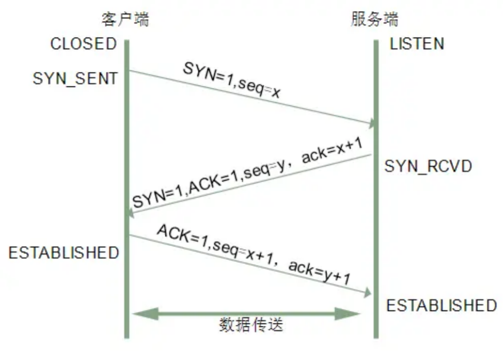
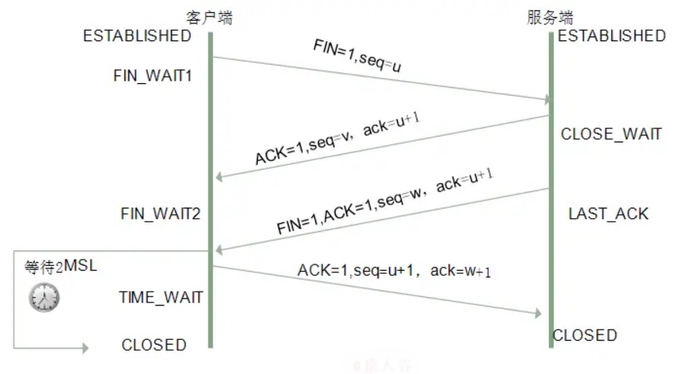
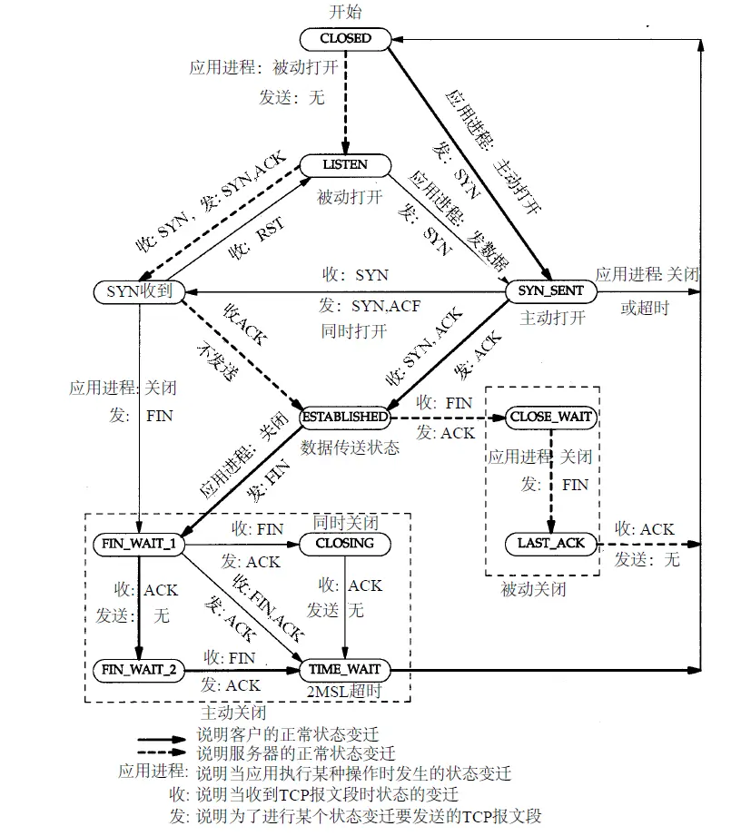
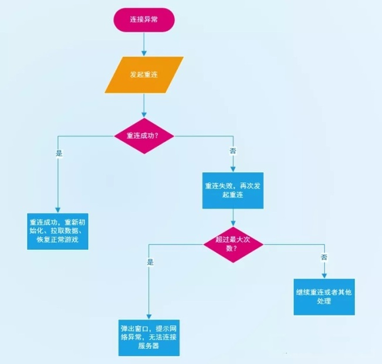

[原文链接](https://www.jianshu.com/p/7130c4be4713)  
# 1. 三次握手
三次握手（Three-way Handshake）其实就是指建立一个TCP连接时，需要客户端和服务器总共发送3个包。进行三次握手的主要作用就是为了确认双方的接收能力和发送能力是否正常、指定自己的初始化序列号为后面的可靠性传送做准备。实质上其实就是连接服务器指定端口，建立TCP连接，并同步连接双方的序列号和确认号，交换`TCP窗口大小`信息。  
刚开始客户端处于 Closed 的状态，服务端处于 Listen 状态。  
进行三次握手：  
- 第一次握手：客户端给服务端发一个 SYN 报文，并指明客户端的初始化序列号 ISN。此时客户端处于 `SYN_SENT` 状态。
首部的同步位SYN=1，初始序号seq=x，SYN=1的报文段不能携带数据，但要消耗掉一个序号。
- 第二次握手：服务器收到客户端的 SYN 报文之后，会以自己的 SYN 报文作为应答，并且也是指定了自己的初始化序列号 ISN(s)。同时会把客户端的 ISN + 1 作为ACK 的值，表示自己已经收到了客户端的 SYN，此时服务器处于 `SYN_RCVD` 的状态。  
在确认报文段中SYN=1，ACK=1，确认号ack=x+1，初始序号seq=y。
- 第三次握手：客户端收到 SYN 报文之后，会发送一个 ACK 报文，当然，也是一样把服务器的 ISN + 1 作为 ACK 的值，表示已经收到了服务端的 SYN 报文，此时客户端处于 `ESTABLISHED` 状态。服务器收到 ACK 报文之后，也处于 `ESTABLISHED` 状态，此时，双方已建立起了连接。  
确认报文段ACK=1，确认号ack=y+1，序号seq=x+1（初始为seq=x，第二个报文段所以要+1），ACK报文段可以携带数据，不携带数据则不消耗序号。  
发送第一个SYN的一端将执行主动打开（active open），接收这个SYN并发回下一个SYN的另一端执行被动打开（passive open）。  
在socket编程中，客户端执行connect()时，将触发三次握手。

## 1.1 为什么需要三次握手，两次不行吗？
弄清这个问题，我们需要先弄明白三次握手的目的是什么，能不能只用两次握手来达到同样的目的。  
- 第一次握手：客户端发送网络包，服务端收到了。  
这样服务端就能得出结论：客户端的发送能力、服务端的接收能力是正常的。
- 第二次握手：服务端发包，客户端收到了。  
这样客户端就能得出结论：服务端的接收、发送能力，客户端的接收、发送能力是正常的。不过此时服务器并不能确认客户端的接收能力是否正常。  
- 第三次握手：客户端发包，服务端收到了。  
这样服务端就能得出结论：客户端的接收、发送能力正常，服务器自己的发送、接收能力也正常。  
因此，需要三次握手才能确认双方的接收与发送能力是否正常。  
试想如果是用两次握手，则会出现下面这种情况：  
如客户端发出连接请求，但因连接请求报文丢失而未收到确认，于是客户端再重传一次连接请求。后来收到了确认，建立了连接。  
数据传输完毕后，就释放了连接，客户端共发出了两个连接请求报文段，其中第一个丢失，第二个到达了服务端，  
但是第一个丢失的报文段只是在某些网络结点长时间滞留了，延误到连接释放以后的某个时间才到达服务端，  
此时服务端误认为客户端又发出一次新的连接请求，于是就向客户端发出确认报文段，同意建立连接，不采用三次握手，  
只要服务端发出确认，就建立新的连接了，此时客户端忽略服务端发来的确认，也不发送数据，则服务端一致等待客户端发送数据，浪费资源。  
## 1.2 什么是半连接队列？
服务器第一次收到客户端的 SYN 之后，就会处于 SYN_RCVD 状态，此时双方还没有完全建立其连接，服务器会把此种状态下请求连接放在一个**队列**里，我们把这种队列称之为**半连接队列**。  
当然还有一个**全连接队列**，就是已经完成三次握手，建立起连接的就会放在全连接队列中。如果队列满了就有可能会出现丢包现象。  
这里在补充一点关于**SYN-ACK 重传次数**的问题：  
服务器发送完SYN-ACK包，如果未收到客户确认包，服务器进行首次重传，等待一段时间仍未收到客户确认包，进行第二次重传。如果重传次数超过系统规定的最大重传次数，系统将该连接信息从半连接队列中删除。
注意，每次重传等待的时间不一定相同，一般会是指数增长，例如间隔时间为 1s，2s，4s，8s…
## 1.3 ISN(Initial Sequence Number)是固定的吗？
当一端为建立连接而发送它的SYN时，它为连接选择一个初始序号。ISN随时间而变化，因此每个连接都将具有不同的ISN。  
ISN可以看作是一个32比特的计数器，每4ms加1 。这样选择序号的目的在于防止在网络中被延迟的分组在以后又被传送，而导致某个连接的一方对它做错误的解释。  
**三次握手的其中一个重要功能是客户端和服务端交换 ISN(Initial Sequence Number)，以便让对方知道接下来接收数据的时候如何按序列号组装数据。如果 ISN 是固定的，攻击者很容易猜出后续的确认号，因此 ISN 是动态生成的。**
## 1.4 三次握手过程中可以携带数据吗？
其实第三次握手的时候，是可以携带数据的。但是,**第一次、第二次握手不可以携带数据**  
为什么这样呢?大家可以想一个问题，假如第一次握手可以携带数据的话，如果有人要恶意攻击服务器，那他每次都在第一次握手中的 SYN 报文中放入大量的数据。因为攻击者根本就不理服务器的接收、发送能力是否正常，然后疯狂着重复发 SYN 报文的话，这会让服务器花费很多时间、内存空间来接收这些报文。  
也就是说, **第一次握手不可以放数据，其中一个简单的原因就是会让服务器更加容易受到攻击了。而对于第三次的话，此时客户端已经处于 ESTABLISHED 状态。对于客户端来说，他已经建立起连接了，并且也已经知道服务器的接收、发送能力是正常的了，所以能携带数据也没啥毛病。**  
## 1.5 SYN攻击是什么？
**服务器端的资源分配是在二次握手时分配的，而客户端的资源是在完成三次握手时分配的**，所以服务器容易受到SYN洪泛攻击。  
SYN攻击就是Client在短时间内伪造大量不存在的IP地址，并向Server不断地发送SYN包，Server则回复确认包，并等待Client确认，由于源地址不存在，因此Server需要不断重发直至超时，这些伪造的SYN包将长时间占用未连接队列，导致正常的SYN请求因为队列满而被丢弃，从而引起网络拥塞甚至系统瘫痪。  
SYN 攻击是一种典型的 DoS/DDoS 攻击。  
检测 SYN 攻击非常的方便，当你在服务器上看到大量的半连接状态时，特别是源IP地址是随机的，基本上可以断定这是一次SYN攻击。在 Linux/Unix 上可以使用系统自带的 netstat 命令来检测 SYN 攻击。
```shell
netstat -n -p TCP | grep SYN_RECV
```
常见的防御 SYN 攻击的方法有如下几种：
- 缩短超时（SYN Timeout）时间
- 增加最大半连接数
- 过滤网关防护
- SYN cookies技术
# 2. 四次挥手
建立一个连接需要三次握手，而终止一个连接要经过四次挥手（也有将四次挥手叫做四次握手的）。这由TCP的`半关闭`（half-close）造成的。所谓的半关闭，其实就是TCP提供了连接的一端在结束它的发送后还能接收来自另一端数据的能力。  
TCP 连接的拆除需要发送四个包，因此称为四次挥手(Four-way handshake)，客户端或服务端均可主动发起挥手动作。  
刚开始双方都处于`ESTABLISHED` 状态，假如是客户端先发起关闭请求。四次挥手的过程如下：  
- 第一次挥手：客户端发送一个 FIN 报文，报文中会指定一个序列号。此时客户端处于 `FIN_WAIT1` 状态。  
即发出**连接释放报文段**（FIN=1，序号seq=u），并停止再发送数据，主动关闭TCP连接，进入`FIN_WAIT1`（终止等待1）状态，等待服务端的确认。
- 第二次挥手：服务端收到 FIN 之后，会发送 ACK 报文，且把客户端的序列号值 +1 作为 ACK 报文的序列号值，表明已经收到客户端的报文了，此时服务端处于 CLOSE_WAIT 状态。  
即服务端收到连接释放报文段后即发出确认报文段（ACK=1，确认号ack=u+1，序号seq=v），服务端进入CLOSE_WAIT（关闭等待）状态，此时的TCP处于半关闭状态，客户端到服务端的连接释放。客户端收到服务端的确认后，进入FIN_WAIT2（终止等待2）状态，等待服务端发出的连接释放报文段。
- 第三次挥手：如果服务端也想断开连接了，和客户端的第一次挥手一样，发给 FIN 报文，且指定一个序列号。此时服务端处于 `LAST_ACK` 的状态。  
即服务端没有要向客户端发出的数据，服务端发出**连接释放报文段**（FIN=1，ACK=1，序号seq=w，确认号ack=u+1），服务端进入`LAST_ACK`（最后确认）状态，等待客户端的确认。
- 第四次挥手：客户端收到 FIN 之后，一样发送一个 ACK 报文作为应答，且把服务端的序列号值 +1 作为自己 ACK 报文的序列号值，此时客户端处于 `TIME_WAIT` 状态。  
需要过一阵子以确保服务端收到自己的 ACK 报文之后才会进入 CLOSED 状态，服务端收到 ACK 报文之后，就处于关闭连接了，处于 `CLOSED` 状态。
即客户端收到服务端的连接释放报文段后，对此发出**确认报文段**（ACK=1，seq=u+1，ack=w+1），客户端进入TIME_WAIT（时间等待）状态。此时TCP未释放掉，需要经过时间等待计时器设置的时间2MSL后，客户端才进入CLOSED状态。  
收到一个FIN只意味着在这一方向上没有数据流动。**客户端执行主动关闭并进入TIME_WAIT是正常的，服务端通常执行被动关闭，不会进入TIME_WAIT状态。**  
在socket编程中，任何一方执行close()操作即可产生挥手操作。  

## 2.1 挥手为什么需要四次？
因为当服务端收到客户端的SYN连接请求报文后，可以直接发送SYN+ACK报文。其中**ACK报文是用来应答的，SYN报文是用来同步的**.  
但是关闭连接时，当服务端收到FIN报文时，很可能并不会立即关闭SOCKET，所以只能先回复一个ACK报文，告诉客户端，“你发的FIN报文我收到了”。只有等到我服务端所有的报文都发送完了，我才能发送FIN报文，因此不能一起发送。故需要四次挥手。
## 2.2 2MSL等待状态
TIME_WAIT状态也成为2MSL等待状态。每个具体TCP实现必须选择一个报文段最大生存时间MSL（Maximum Segment Lifetime），它是任何报文段被丢弃前在网络内的最长时间。这个时间是有限的，因为TCP报文段以IP数据报在网络内传输，而IP数据报则有限制其生存时间的TTL字段。  
对一个具体实现所给定的MSL值，处理的原则是：当TCP执行一个主动关闭，并发回最后一个ACK，该连接必须在TIME_WAIT状态停留的时间为2倍的MSL。这样可让TCP再次发送最后的ACK以防这个ACK丢失（另一端超时并重发最后的FIN）。  
这种2MSL等待的另一个结果是这个TCP连接在2MSL等待期间，定义这个连接的插口（客户的IP地址和端口号，服务器的IP地址和端口号）不能再被使用。这个连接只能在2MSL结束后才能再被使用。
## 2.3 四次挥手释放连接时，等待2MSL的意义?
> MSL是Maximum Segment Lifetime的英文缩写，可译为“最长报文段寿命”，它是任何报文在网络上存在的最长时间，超过这个时间报文将被丢弃。

为了保证客户端发送的最后一个ACK报文段能够到达服务器。因为这个ACK有可能丢失，从而导致处在LAST-ACK状态的服务器收不到对FIN-ACK的确认报文。服务器会超时重传这个FIN-ACK，接着客户端再重传一次确认，重新启动时间`等待计时器`。最后客户端和服务器都能正常的关闭。假设客户端不等待2MSL，而是在发送完ACK之后直接释放关闭，一但这个ACK丢失的话，服务器就无法正常的进入关闭连接状态。  
**两个理由：**  
**1. 保证客户端发送的最后一个ACK报文段能够到达服务端。**  
这个ACK报文段有可能丢失，使得处于LAST-ACK状态的B收不到对已发送的FIN+ACK报文段的确认，服务端超时重传FIN+ACK报文段，而客户端能在2MSL时间内收到这个重传的FIN+ACK报文段  
接着客户端重传一次确认，重新启动2MSL计时器，最后客户端和服务端都进入到CLOSED状态，若客户端在TIME-WAIT状态不等待一段时间，而是发送完ACK报文段后立即释放连接，则无法收到服务端重传的FIN+ACK报文段，所以不会再发送一次确认报文段，则服务端无法正常进入到CLOSED状态。  
**2. 防止“已失效的连接请求报文段”出现在本连接中。**  
客户端在发送完最后一个ACK报文段后，再经过2MSL，就可以使本连接持续的时间内所产生的所有报文段都从网络中消失，使下一个新的连接中不会出现这种旧的连接请求报文段。  
## 2.4 为什么TIME_WAIT状态需要经过2MSL才能返回到CLOSE状态？
理论上，四个报文都发送完毕，就可以直接进入CLOSE状态了，但是可能网络是不可靠的，有可能最后一个ACK丢失。所以**TIME_WAIT状态就是用来重发可能丢失的ACK报文。**
## 3. 总结
《TCP/IP详解 卷1:协议》有一张TCP状态变迁图，很具有代表性，有助于大家理解三次握手和四次挥手的状态变化。如下图所示，粗的实线箭头表示正常的客户端状态变迁，粗的虚线箭头表示正常的服务器状态变迁。

# TCP传输协议中如何解决丢包问题
首先TPC为什么会丢包？
## TCP是基于不可靠的网路实现可靠传输，肯定会存在丢包问题。

如果在通信过程中，发现缺少数据或者丢包，那边么最大的可能性是程序发送过程或者接受过程中出现问题。  
TCP协议丢包后，如何解决丢包的问题  
为了满足TCP协议不丢包。TCP协议有如下规定：
- **数据分片**：发送端对数据进行分片，接受端要对数据进行重组，由TCP确定分片的大小并控制分片和重组
- **到达确认**：接收端接收到分片数据时，根据分片数据序号向发送端发送一个确认
- **超时重发**：发送方在发送分片时设置超时定时器，如果在定时器超时之后没有收到相应的确认，重发分片数据
- **滑动窗口**：TCP连接的每一方的接受缓冲空间大小固定，接收端只允许另一端发送接收端缓冲区所能接纳的数据，TCP在滑动窗口的基础上提供流量控制，防止较快主机致使较慢主机的缓冲区溢出
- **失序处理**：作为IP数据报来传输的TCP分片到达时可能会失序，TCP将对收到的数据进行重新排序，将收到的数据以正确的顺序交给应用层;
- **重复处理**：作为IP数据报来传输的TCP分片会发生重复，TCP的接收端必须丢弃重复的数据;
- **数据校验**：TCP将保持它首部和数据的检验和，这是一个端到端的检验和，目的是检测数据在传输过程中的任何变化。如果收到分片的检验或有差错，TCP将丢弃这个分片，并不确认收到此报文段导致对端超时并重发

# UDP丢包的问题
## 一、主要丢包原因
1. 接收端处理时间过长导致丢包：  
调用recv方法接收端收到数据后，处理数据花了一些时间，处理完后再次调用recv方法，在这二次调用间隔里,发过来的包可能丢失。对于这种情况可以修改接收端，将包接收后存入一个缓冲区，然后迅速返回继续recv。
2. 发送的包巨大丢包：  
虽然send方法会帮你做大包切割成小包发送的事情，但包太大也不行。例如超过50K的一个udp包，不切割直接通过send方法发送也会导致这个包丢失。这种情况需要切割成小包再逐个send。
3. 发送的包较大，超过接受者缓存导致丢包：  
包超过mtu size数倍，几个大的udp包可能会超过接收者的缓冲，导致丢包。这种情况可以设置socket接收缓冲。以前遇到过这种问题，我把接收缓冲设置成64K就解决了。
4. 发送的包频率太快：  
虽然每个包的大小都小于mtu size 但是频率太快，例如40多个mut size的包连续发送中间不sleep，也有可能导致丢包。这种情况也有时可以通过设置socket接收缓冲解决，但有时解决不了。所以在发送频率过快的时候还是考虑sleep一下吧。
5. 局域网内不丢包，公网上丢包：  
这个问题我也是通过切割小包并sleep发送解决的。如果流量太大，这个办法也不灵了。总之udp丢包总是会有的，如果出现了用我的方法解决不了，还有这个几个方法： 要么减小流量，要么换tcp协议传输，要么做丢包重传的工作。
## 解决UDP丢包的问题
1. 发送频率过高导致丢包  
很多人会不理解发送速度过快为什么会产生丢包，原因就是UDP的SendTo不会造成线程阻塞，也就是说，UDP的SentTo不会像TCP中的SendTo那样，直到数据完全发送才会return回调用函数，它不保证当执行下一条语句时数据是否被发送。（SendTo方法是异步的）这样，如果要发送的数据过多或者过大，那么在缓冲区满的那个瞬间要发送的报文就很有可能被丢失。至于对“过快”的解释，作者这样说：“A few packets a second are not an issue; hundreds or thousands may be an issue.”（一秒钟几个数据包不算什么，但是一秒钟成百上千的数据包就不好办了）。 要解决接收方丢包的问题很简单，首先要保证程序执行后马上开始监听（如果数据包不确定什么时候发过来的话），其次，要在收到一个数据包后最短的时间内重新回到监听状态，其间要尽量避免复杂的操作（比较好的解决办法是使用多线程回调机制）。  
2. 报文过大丢包  
至于报文过大的问题，可以通过控制报文大小来解决，使得每个报文的长度小于MTU。以太网的MTU通常是1500 bytes，其他一些诸如拨号连接的网络MTU值为1280 bytes，如果使用speaking这样很难得到MTU的网络，那么最好将报文长度控制在1280 bytes以下。  
3. 发送方丢包  
发送方丢包：内部缓冲区（internal buffers）已满，并且发送速度过快（即发送两个报文之间的间隔过短）； 接收方丢包：Socket未开始监听； 虽然UDP的报文长度最大可以达到64 kb，但是当报文过大时，稳定性会大大减弱。这是因为当报文过大时会被分割，使得每个分割块（翻译可能有误差，原文是fragmentation）的长度小于MTU，然后分别发送，并在接收方重新组合（reassemble），但是如果其中一个报文丢失，那么其他已收到的报文都无法返回给程序，
# tcp 和 udp 是 OSI 模型中的运输层中的协议。tcp 提供可靠的通信传输，而 udp 则常被用于让广播和细节控制交给应用的通信传输。
两者的区别大致如下：  
- tcp 面向连接，udp 面向非连接即发送数据前不需要建立链接；
- tcp 提供可靠的服务（数据传输），udp 无法保证；
- tcp 面向字节流，udp 面向报文；
- tcp 数据传输慢，udp 数据传输快；
