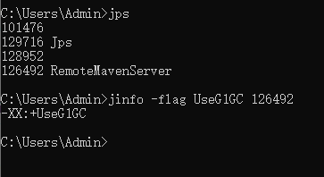
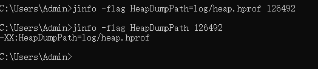
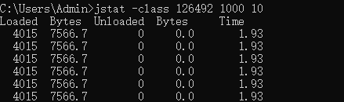
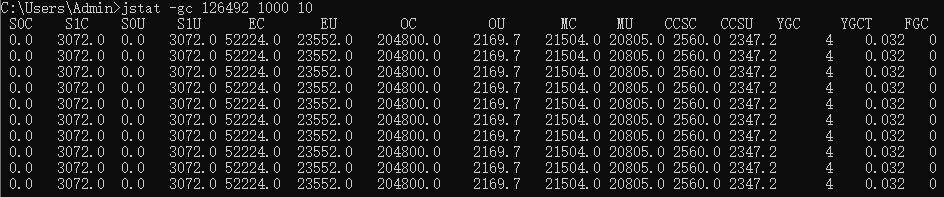
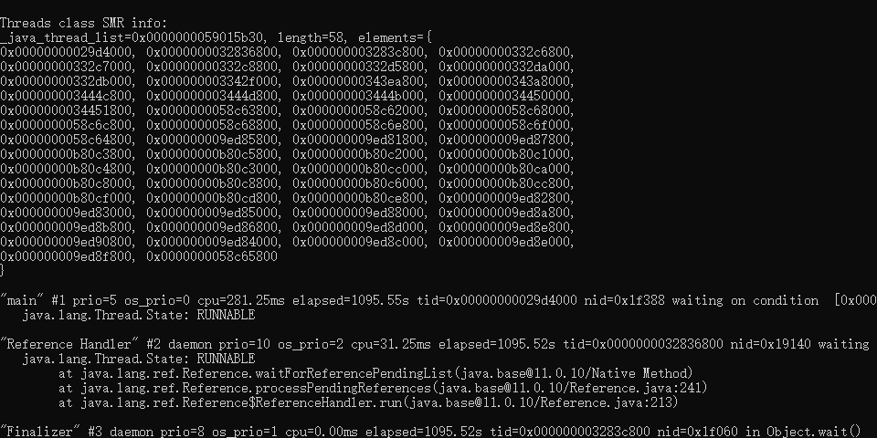
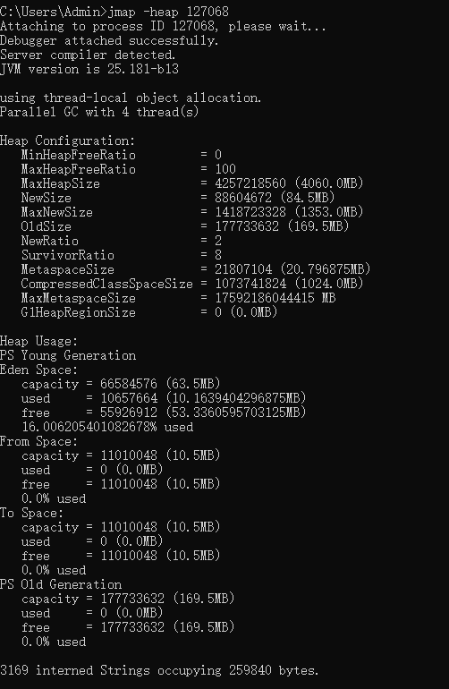
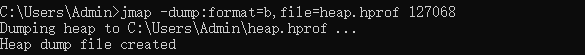

JVM参数可以分为三种类型，分别是以-、-X、-XX开头的参数  
-开头的参数比较稳定，后续版本基本不变，如-version  查看版本信息  
-X开头的参数比较稳定，后续版本可能改变，如-Xmx设置初始堆内存大小  
-XX开头的参数不稳定，后续版本会变动，如-XX:MetaspaceSize 设置元空间大小  

| 参数                                     | 含义                              | 备注                                                                            |
| ---------------------------------------- | --------------------------------- | ------------------------------------------------------------------------------- |
| -XX:CICompiler=3 | 最大并行编译数 | 如果设置大于1，虽然编译速度会提高，但同样影响系统稳定性，会增加JVM奔溃的可能 |
| -XX:InitialHeapSize=100M | 初始堆内存大小 | 简写-Xms100M |
| -XX:MaxHeapSize=100M | 最大堆大小 | 简写-Xmx100M(一般-Xms、-Xmx两个参数会配置相同的值,优点是能够在Java垃圾回收机制清理完堆区后不需要重新分隔计算堆区的大小而浪费资源） |
| -XX:NewSize=20M | 新生代大小 | (注意：该值需要小于-Xms的值)|
| -XX:MaxNewSize=50M | |新生代最大大小(可用-Xmn: 堆中新生代初始及最大大小,注意：该值需要小于-Xmx的值) 
| -XX:OldSize=50M | 老年代大小 |
| -XX:MetaspaceSize=50M | 方法区大小 |
| -XX:MaxMetaspaceSize=50M | 方法区最大大小 |
| -XX:+/-UseParallelGC | 是否使用ParallelGC | 新生代垃圾收集器，吞吐量优先|
| -XX:+/-UseParallelOldGC | 是否使用ParallelOldGC | 老年代代垃圾收集器，吞吐量优先 |
| -XX:+/-UseConcMarkSweepGC | 是否使用CMS | 老年代垃圾收集器，停顿时间优先 |
| -XX:+/-UseG1GC | 是否使用G1GC | 新生代/老年代代垃圾收集器，吞吐量优先 |
| -XX:CICompiler=3 | 最大并行编译数 | 如果设置大于1，虽然编译速度会提高，但同样影响系统稳定性，会增加JVM奔溃的可能 |
| -XX:NewRation | 新生代和老年代的比值 | 如-XX:NewRatio=4，表示新生代：老年代=1:4 |
| -XX:+/-HeapDumpOnOutOfMemoryError | 是否开启堆内存溢出时打印 | 当堆OOM时，会自动生成dump文件 |
| -XX:HeapDumpPath=heap.hprof | 指定堆内存溢出时打印目录 | 表示在当前目录生成一个heap.hprof |
| -XX:+/-PrintGCDetails   -XX:+/-PrintGCTimeStamps   -XX:+/-PrintGCDateStamps   -Xloggc:logs/gc.log | 打印GC日志 | 可以使用不同的垃圾收集器，对比查看GC情况 |
| -Xss128k | 设置每个线程的堆栈大小 |-Xss 设置每个线程可使用的内存大小，即栈的大小。在相同物理内存下，减小这个值能生成更多的线程，当然操作系统对一个进程内的线程数还是有限制的，不能无限生成。线程栈的大小是个双刃剑，如果设置过小，可能会出现栈溢出，特别是在该线程内有递归、大的循环时出现溢出的可能性更大，如果该值设置过大，就有影响到创建栈的数量，如果是多线程的应用，就会出现内存溢出的错误。|
| -XX:MaxTenuringThreshold=6 | 对象进入老年代的年龄阈值 | 默认值为15 |
| -XX:InitiatingHeapOccupancyPercent | 当整个堆占用超过某个百分比时，就会触发并发GC周期 | 基于整个堆的占用率，默认值为45 |
| -XX:G1HeapWastePercent | 允许整个堆内存中被浪费的空间的百分比 | 默认值为5%。如果并发标记可回收的空间小于5%,则不会触发MixedGC |
| -XX:MaxGCPauseMills | G1最大停顿时间 | 暂停时间不能太小，太小会导致G1跟不上垃圾产生的速度，最终退化成Full GC.所以对正么参数的调优是一个持续的过程，逐步调整到最佳状态 |
| -XX:ConcGCThreads | 并发垃圾收集器使用的线程数量 | |
| -XX:G1MixedGCLiveThresholdPercent | 混合垃圾回收周期中要包括的旧区域设置占用率阈值 | 默认65% |
| -XX:G1MixedGCCountTarget | G1回收分区时最大混合式GC周期数 | 默认值为8 |
| -XX:G1OldCSetRegionThresholdPercent | 设置混合垃圾回收期间要回收的最大旧区域数 | 默认值为10 |
# GC日志相关
通过GC日志能够分析JVM发生GC时各个数据区的情况  
`-XX:+PrintGC` 或 `-verbose:gc` 输出简单GC日志信息  
`-XX:+PrintGCDeatils` 输出详细GC日志信息  
`-XX:+PrintGCTimeStamps` 和 `-XX:+PrintGCDateStamps` 则是在详细输出GC日志信息的基础上增加时间，前者输出程序运行时间，后者输出时间戳  
其他参数还有 `-Xloggc:d:\gc.log` 将GC信息输出到d:\gc.log文件；`-XX:PrintHeapAtGC` 每次GC前后打印堆信息等  
# 运行时数据区相关
JVM有对各种运行时数据区（栈、堆、方法区、直接内存）的参数，常使用-XX命令，有些命令也可用-X来代替
# 栈
`-XX:ThreadStackSize=100k` 设置栈内存大小100k，可以使用 `-Xss100k`代替  
栈是线程私有的，设置太大且创建线程多的场景下，可能会内存不足导致OOM
# 堆
**-XX:InitalHeapSize=100m** 设置堆内存初始化为100m，可以使用 -Xms100m代替  
**-XX:MaxHeapSize=100m** 设置最大堆内存为100m，可以使用 -Xmx100m代替  
当 **-Xms和-Xmx** 设置成一样的值时，JVM就不需要对堆内存扩容，能够优化一些性能，但占用内存少时可能造成浪费  
当我们的开发工具idea比较卡时，可以用这两个参数将idea堆内存进行调整（idea 也是Java进程）  
**-Xmn2g** 设置年轻代最大内存为2g，等同于-XX:NewSize=2g+-XX:MaxNewSize=2g  
**-XX:+UseAdaptiveSizePolicy** 自动选择各区比例大小(默认开启)  
**-XX:SurvivorRatio=8** 设置survivor:Eden占比为 1:1:8（如果-XX:+UseAdaptiveSizePolicy是开启的，survivor:eden比例会被自动调成为1:1:6）  
**-XX:NewRatio=2** 设置年轻代:老年代占比为 1:2  
观察GC日志，如果是因为年轻代空间不够导致频繁minor GC，可以适当调整年轻代与老年代比例  
**-XX:PretenureSizeThreadshold=2014** 设置内存大于此值(byte)的对象作为大对象直接分配到老年代  
**-XX:MaxTenuringThreshold=15** 对象年龄超过15进入老年代  
**-XX:+PrintTenuringDistribution** JVM每次MinorGC后打印出当前使用的Survivor中对象的年龄分布  
**-XX:TargetSurvivorRatio** MinorGC结束后Survivor区域中占用空间的期望比例  
# 方法区
**-XX:MetaspaceSize** 元空间初始大小  
**-XX:MaxMetasoaceSize** 元空间最大大小  
**-XX:+UseCompressedOops** 使用压缩对象指针  
**-XX:+UseCompressedClassPointers** 使用压缩类执行  
**-XX:ComporessedClassSpaceSize** 设置ClassMetaspace大小，默认1g  
要回收元空间时只能触发FULL GC，频繁触发FULL GC也可能是元空间大小不够  
运行时产生大量动态类可能导致元空间被占满从而抛出OOM  
面对这两种情况可以适当调整元空间大小  
# 直接内存
**-XX:MaxDiectMemorySize**设置直接内存大小，未指定则和最大堆内存一致
# OOM相关
**-XX:+HeapDumpOutOfMemoryError** 发生OOM时生成堆dump文件  
**-XX:+HeapDumpBeforeFullGC** 发生FullGC时生成堆dump文件（OOM前会多次FullGC也就是可能多次生成dump文件）  
**-XX:HeapDumpPath=d:\xxx**指定生成堆dump文件路径为d:\ (默认生成的dump文件在项目当前目录下)  
**-XX:OnOutOfMemoryError=/opt/restart.sh** 发生OOM时去执行/opt/restart.sh文件  
# 垃圾收集器相关
## Serial 串行收集器
**-XX:+UseSerialGC** 年轻代，老年代都使用串行收集器
## ParNew 并行收集器
**-XX:+UseParNewGC** 年轻代使用ParNew收集器
JDK14 CMS被移除 没有老年代收集器配合 , 被废弃
## Parallel 吞吐量优先并行收集器
**-XX:+UseParallelGC 、-XX:+UseParallelOldGC** 使用任意一个参数，新生代、老年代就会使用Parallel收集器  
**-XX:ParallelGCThreads** 设置年轻代并行收集线程数 （CPU数 < 8 设置与核心数相同；CPU数 > 8 设置线程数 = 3 + (5 * 核心数) / 8）  
**-XX:+UseAdaptiveSizePolicy** 自适应调节策略  
**-XX:MaxGCPauseMillis** 设置最大STW时间，单位ms  
Parallel 主打高吞吐量优先，该参数具体值最好由`-XX:+UseAdaptiveSizePolicy`来分配  
**-XX:GCTimeRatio=N** 垃圾收集时间占比(1/N+1)  
用于衡量吞吐量，该值设置越大就与设置最大STW时间`-XX:MaxGCPauseMillis` 矛盾，不能同时使用  
## CMS 并发收集器
**-XX:+UseConcMarkSweepGC**老年代使用CMS垃圾收集器，新生代使用ParNew收集器  
**-XX:CMSInitiatingOccupancyFraction**设置老年代使用多少空间时开始垃圾回收  
如果设置的太高，不够内存分配不能满足并发执行，就会冻结用户线程启动Serial Old收集器，停顿时间就会变长（如果内存增长缓慢可以设置高一些，如果内存增长很快就要设置低一些 默认92%）  
**-XX:+UseCMSCompactAtFullCollection**指定在FULL GC后是否对内存进行压缩整理  
（开启后，通过`-XX:CMSFullGCsBeforeCompaction`设置执行多少次FULL GC后进行内存压缩整理）  
**-XX:ParallelCMSThreads** 设置CMS线程数量  
## G1 低延迟分代收集器
**-XX:+UseG1GC** 使用G1收集器  
**-XX:G1HeapRegionSize**设置每个region大小  
**-XX:MaxGCPauseMillis**设置预期停顿时间 （默认200ms，最好不要太小）  
**-XX:ParallelGCThread**设置STW时GC线程数  
**-XX:ConcGCThreads**设置并发标记线程数  
**-XX:InitiatingHeapOccupancyPercent**设置触发老年代GC的堆占用率阈值  
使用G1时最好不要使用`-XX:NewRatio 、-Xmn`，会影响G1自动调节  
查看其他更多JVM相关参数可以参考[官方文档](https://docs.oracle.com/javase/8/docs/technotes/tools/unix/java.html)
# 常用命令
## jps
查看进程
## jinfo
- 实时查看和调整JVM参数  
格式：`jinfo -flag <name> <PID>` 如：`jinfo -flag UserG1GC 126492`

- 修改  
只有被标记为manageable的参数才可以使用jinfo实时修改  
格式：  
1. `jinfo -flag [+/-]<name> <PID>` 
2. `jinfo -flag <name>=<value> <PID>` 如 `jinfo -flag HeapDumpPath=log/heap.hprof 126492`

## jstat
- 查看类装载信息  
`jstat -class PID 1000 10` 查看某个java进程的类装载信息，每1000毫秒输出一次，共输出10 次

- 查看垃圾收集信息
`jstat -gc PID 1000 1000`

## jstack
- 查看线程堆栈信息
`jstack PID`

## jmap
- 生成堆转储快照
- 打印堆内存相关信息
`jmap -heap PID`

- dump出堆内存相关信息
`jmap -dump:format=b,file=heap.hprof PID`

当发生堆内存溢出时，自动生成dump文件  
**-XX:+HeapDumpOnOutOfMemoryError -XX:HeapDumpPath=heap.hprof**
