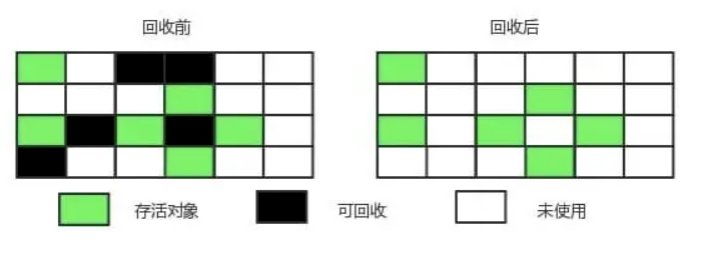
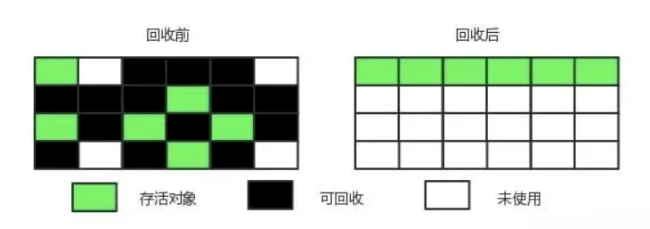
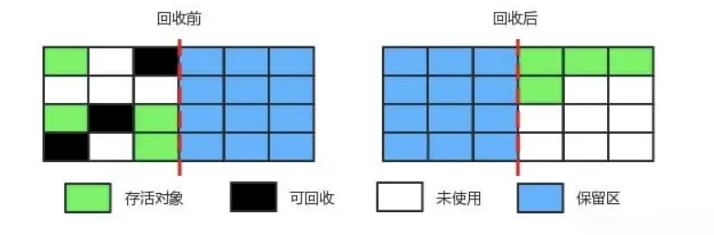
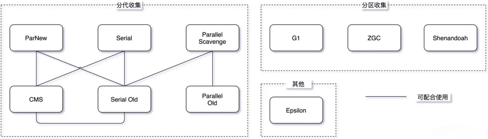
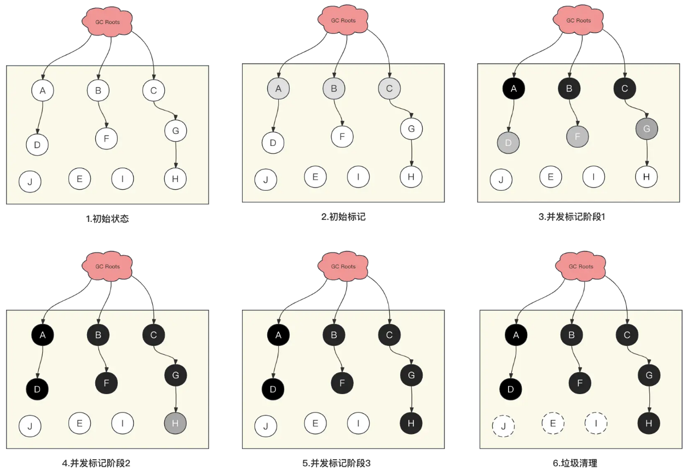
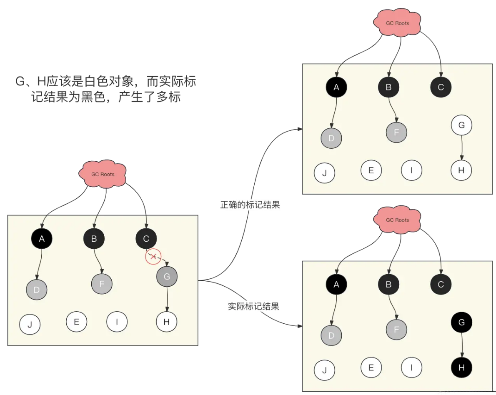
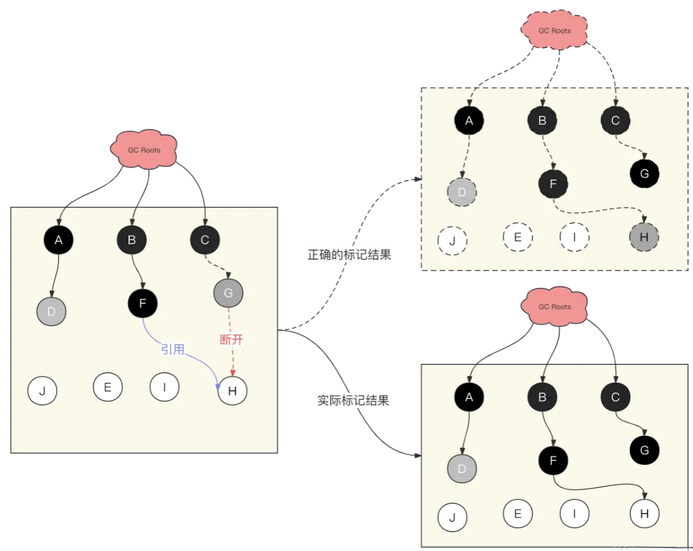

## Java引用类型


- 强引用（“Strong” Reference），就是我们最常见的普通对象引用，只要还有强引用指向一个对象，就能表明对象还“活着”，垃圾收集器不会碰这种对象。对于一个普通的对象，如果没有其他的引用关系，只要超过了引用的作用域或者显式地将相应（强）引用赋值为 null，就是可以被垃圾收集的了，当然具体回收时机还是要看垃圾收集策略。

- 软引用（SoftReference），是一种相对强引用弱化一些的引用，可以让对象豁免一些垃圾收集，只有当 JVM 认为内存不足时，才会去试图回收软引用指向的对象。JVM 会确保在抛出 OutOfMemoryError 之前，清理软引用指向的对象。软引用通常用来实现内存敏感的缓存，如果还有空闲内存，就可以暂时保留缓存，当内存不足时清理掉，这样就保证了使用缓存的同时，不会耗尽内存。

- 弱引用（WeakReference）并不能使对象豁免垃圾收集，仅仅是提供一种访问在弱引用状态下对象的途径。这就可以用来构建一种没有特定约束的关系，比如，维护一种非强制性的映射关系，如果试图获取时对象还在，就使用它，否则重现实例化。它同样是很多缓存实现的选择。

- 幻象引用，有时候也翻译成虚引用，你不能通过它访问对象。幻象引用仅仅是提供了一种确保对象被 finalize 以后，做某些事情的机制，比如，通常用来做所谓的 Post-Mortem 清理机制，也有人利用幻象引用监控对象的创建和销毁。

## 如何判断对象是否可以被回收？什么时候被回收？


- 引用计数器法：为每个对象创建一个引用计数，有对象引用时计数器 +1，引用被释放时计数 -1，当计数器为 0 时就可以被回收。但是他有一个缺点是不能解决循环引用的问题。

- 可达性分析算法：从 GC Roots 开始向下搜索，搜索所走过的路径称为引用链。当一个对象到 GC Roots 没有任何引用链相连时，则证明此对象是可以被回收的。

Java 虚拟机使用该算法来判断对象是否可被回收，在 Java 中 GC Roots 一般包含以下内容:

- 虚拟机栈中引用的对象
- 本地方法栈中引用的对象
- 方法区中类静态属性引用的对象
- 方法区中的常量引用的对象

### 1. 标记 - 清除


将存活的对象进行标记，然后清理掉未被标记的对象。



**不足**:

- 标记和清除过程效率都不高；

- 会产生大量不连续的内存碎片，导致无法给大对象分配内存。

### 2. 标记 - 整理



让所有存活的对象都向一端移动，然后直接清理掉端边界以外的内存。

### 3. 复制



将内存划分为大小相等的两块，每次只使用其中一块，当这一块内存用完了就将还存活的对象复制到另一块上面，然后再把使用过的内存空间进行一次清理。

主要不足是只使用了内存的一半。

现在的商业虚拟机都采用这种收集算法来回收新生代，但是并不是将新生代划分为大小相等的两块，而是分为一块较大的 Eden 空间和两块较小的 Survivor 空间，每次使用 Eden 空间和其中一块 Survivor。在回收时，将 Eden 和 Survivor 中还存活着的对象一次性复制到另一块 Survivor 空间上，最后清理 Eden 和使用过的那一块 Survivor。

HotSpot 虚拟机的 Eden 和 Survivor 的大小比例默认为 8:1，保证了内存的利用率达到 90%。如果每次回收有多于 10% 的对象存活，那么一块 Survivor 空间就不够用了，此时需要依赖于老年代进行分配担保，也就是借用老年代的空间存储放不下的对象。

- 分代收集 现在的商业虚拟机采用分代收集算法，它根据对象存活周期将内存划分为几块，不同块采用适当的收集算法。
一般将堆分为新生代和老年代。

- 新生代使用: 复制算法
- 老年代使用: 标记 - 清除 或者 标记 - 整理 算法

## 分代收集算法和分区收集算法区别？



分代收集算法 当前主流 VM 垃圾收集都采用”分代收集”(Generational Collection)算法, 这种算法会根据 对象存活周期的不同将内存划分为几块, 如 JVM 中的 新生代、老年代、永久代，这样就可以根据 各年代特点分别采用最适当的 GC 算法

在新生代-复制算法：
每次垃圾收集都能发现大批对象已死, 只有少量存活. 因此选用复制算法, 只需要付出少量 存活对象的复制成本就可以完成收集

在老年代-标记整理算法：

因为对象存活率高、没有额外空间对它进行分配担保, 就必须采用“标记—清理”或“标 记—整理”算法来进行回收, 不必进行内存复制, 且直接腾出空闲内存.

ParNew： 一款多线程的收集器，采用复制算法，主要工作在 Young 区，可以通过 -XX:ParallelGCThreads 参数来控制收集的线程数，整个过程都是 STW 的，常与 CMS 组合使用。

CMS： 以获取最短回收停顿时间为目标，采用“标记-清除”算法，分 4 大步进行垃圾收集，其中初始标记和重新标记会 STW ，多数应用于互联网站或者 B/S 系统的服务器端上，JDK9 被标记弃用，JDK14 被删除。

分区收集算法

分区算法则将整个堆空间划分为连续的不同小区间, 每个小区间独立使用, 独立回收. 这样做的 好处是可以控制一次回收多少个小区间 , 根据目标停顿时间, 每次合理地回收若干个小区间(而不是 整个堆), 从而减少一次 GC 所产生的停顿。

G1： 一种服务器端的垃圾收集器，应用在多处理器和大容量内存环境中，在实现高吞吐量的同时，尽可能地满足垃圾收集暂停时间的要求。

ZGC： JDK11 中推出的一款低延迟垃圾回收器，适用于大内存低延迟服务的内存管理和回收，SPECjbb 2015 基准测试，在 128G 的大堆下，最大停顿时间才 1.68 ms，停顿时间远胜于 G1 和 CMS。

## 三色标记整理

三色标记算法是一种JVM的垃圾标记算法，CMS/G1垃圾回收器就是使用的这种算法，它可以让JVM在不发生或者尽可能短的发生STW（Stop The World）的情况下进行垃圾的标记和清除。

顾名思义，三色标记算法是将Java堆中的对象分为了三种颜色，分别是：

- 白色：白色对象代表没有被标记过的对象，在GC标记阶段刚开始的时候所有对象都是白色对象；而在GC标记阶段结束的时候，所有白色对象表示没有被引用的对象（即垃圾）。
- 灰色：灰色对象表示该对象已经被标记过了，但是其引用的对象还没有被完全标记，JVM需要遍历其子对象来找到可达对象和垃圾。
- 黑色：黑色对象表示该对象及其子对象全部都被标记过了，说明该对象已经完成了标记，JVM无需继续处理它



如上图所示，以CMS垃圾回收流程为例展示三色标记算法中每种颜色对应的意义：

- 初始状态：初始状态时，GC标记还没开始，此时所有的Java对象都是白色对象，即未标记对象；
- 初始标记：在初始标记阶段为了缩短STW时间，只标记了GC Roots直接可达的对象。那么这个过程中标记的GC Roots直接可达的对象就是灰色对象，因为这些对象可能包含子对象还并未被完全标记。
- 并发标记：在并发标记阶段GC线程会从灰色对象出发，依次标记其所含的子对象，知道所有子对象都被标记完了之后，这些对象就称为了黑色对象。

- 阶段1:此时GC Roots直达对象A、B、C被标记称黑色，而它们的子对象D、F、G被标记成灰色；
- 阶段2:接着D、F、G对象被标记为黑色，而子对象H被标记成灰色；
- 阶段3:H也被标记成黑色，此时所有对象都被标记成了黑色，对象标记完成；


- 垃圾清理：在前面的标记过程中，由于所有的灰色对象都有GC Roots可以到达，所以这些黑色对象都是存活对象，而白色对象则是垃圾，需要被清理。

三色标记算法的优势在于是一种增量型的垃圾标记算法，一步步的标记出整个堆中的所有垃圾而无需长时间的STW，造成系统卡顿。


**三色标记算法存在的问题**

由于在并发标记阶段，GC线程和用户线程是并发运行的，随时可能发生对象之间引用变化从而导致“多标”和“漏标”的问题。

**多标**




如上图所示，在并发标记阶段，当对象G已经被标记成灰色对象之后，此时C到G得引用被干掉了。

那么此时，C的子对象G和H应该被标记为白色，因为从GC Roots到他们的引用已经消失了，它们已经成为了垃圾对象。

但是由于G已经被标记成为了灰色对象，所以GC线程并不知道G和H需要被标记为白色，而是继续将这两个对象标记成了黑色对象 。

最终结果导致，G和H这部分对象依旧存活，不会被本轮GC所清理，也就产生了浮动垃圾。

**漏标**



如上图所示，在并发标记阶段，当G已经被标记成了灰色对象，F已经被标记成为了黑色对象，而此时G->H的引用被断开，但是又新建立了一个F->H的引用。

那么此时，由于F已经被标记成为了黑色，那么F的子对象H就不会被扫描和标记到，因此就产生了“漏标”。这样就会导致H对象一直是白色，最后被当作垃圾被清除，这样直接会影响到程序运行的正确性，因此是绝对要被避免的。

实际上，漏标记只有同时满足以下两个条件才能发生：

1. 一个或者多个黑色对象重新引用了白色对象，即黑色对象成员变量增加了新的引用；
2. 灰色对象断开了白色对象的引用（直接或者间接），即灰色对象原来的成员变量引用发生了变化；
漏标的过程对应的Java代码如下所示：
```Java
// 此时应用线程执行了以下操作
ObjectH H = objG.fieldH;  // H 被引用
objG.fieldH = null;      // 断开引用，G为灰色，H为白色
objF.fieldH = H;         // F 引用 H，G变为黑色，但是H依旧为白色
```

在上面的三个步骤当中，我们只需要在任意一步的时候讲被漏标的对象H存储起来，然后作为一个灰色对象放入到一个集合当中。等到并发标记结束重新标记的时候，遍历这个集合再次标记剩余对象就可以解决漏标的问题。

但是，这样一来“重新标记”就需要STW，因为只要有用户线程在执行就有可能会出现新的漏标记的情况发生，导致永远无法完成GC的标记过程。不过好在前面的“并发标记”过程已经将大部分的垃圾标记出来了，所以“重新标记”过程所耗费的时间较低。

所以说三色标记算法也无法完全解决STW问题，只能尽可能缩短STW的时间，从而减少系统的停顿。

**如何解决漏标问题**
对于多标问题来说，由于像CMS这类垃圾回收算法本身就会产生浮动垃圾，所以不算特别严重的问题，只需要等到下一次GC再回收即可。

但是漏标问题就相对严重得多，它会错误的回收正常的对象，导致程序错误，因此必须避免漏标的情况发生，下面主要介绍漏标的解决方案。

**内存屏障方案**
首先回顾下漏标的过程对应的Java代码如下所示：

```Java
// 此时应用线程执行了以下操作
ObjectH H = objG.fieldH;  // H 被引用 （读操作）
objG.fieldH = null;      // 断开引用，G为灰色，H为白色 （写操作）
objF.fieldH = H;         // F 引用 H，G变为黑色，但是H依旧为白色 （写操作）
```

针对漏标问题，JVM 团队采用了读屏障与写屏障的方案。读屏障拦截了第一步，而写屏障用于拦截第二和第三步。它们的目的是在读写操作前后记录漏标对象H。下面是读屏障和写屏障的相关实现：

读屏障——读取之前记录漏标对象H

```Java
oop oop_field_load(oop* field) {
    pre_load_barrier(field); // 读屏障-读取前操作
    return *field;
}

void pre_load_barrier(oop* field, oop old_value) {  
    if ($gc_phase == GC_CONCURRENT_MARK && !isMarked(field)) {
        oop old_value = *field;
        remark_set.add(old_value); // 记录读取到的对象
    }
}
```

这里的读屏障直接针对第一步 ObjectH H = objG.fieldH; ，在读取成员变量之前先记录下来。这种做法是保守但安全的，因为重新引用的前提是获取到该白色对象，此时读屏障发挥了作用。

但是读屏障并不是所有对象的读写操作都会执行，只有在“并发标记”阶段（$gc_phase == GC_CONCURRENT_MARK）并且对象未被标记（白色对象，!isMarked(field)）的情况下才执行。这保证了读屏障的触发是有条件的，并不会对所有对象的读操作都进行记录。

**写屏障——写入之前记录漏标对象H**
```Java
void oop_field_store(oop* field, oop new_value) { 
    *field = new_value; // 赋值操作
} 
```

写屏障是在给某个对象的成员变量赋值操作前后进行处理，类似于 Spring AOP 的概念：

```java
void oop_field_store(oop* field, oop new_value) {  
    pre_write_barrier(field); // 写屏障-写前操作
    *field = new_value; 
    post_write_barrier(field, value); // 写屏障-写后操作
}
```
这样的设计在写操作前后加入了相应处理，保证了在写操作时对相关对象的状态进行记录和处理。

写屏障同样是在并发标记阶段执行的。在写操作前后加入了处理，包括写前操作 `pre_write_barrier` 和写后操作 `post_write_barrier`。写屏障的触发同样是有条件的，不是所有对象的写操作都会记录。

**增量更新（Incremental Update）与原始快照（Snapshot At The Beginning，SATB）方案**

**增量更新（Incremental Update）**

在对象D的成员变量引用发生变化时（例如 objF.fieldH = H;），通过写屏障，将F新的成员变量引用对象H记录下来：

```java
void post_write_barrier(oop* field, oop new_value) {  
    if ($gc_phase == GC_CONCURRENT_MARK && !isMarked(field)) {
        remark_set.add(new_value); // 记录新引用的对象
    }
}
```

这种做法的思路是不要求保留原始快照，而是针对新增的引用将其记录下来等待遍历，即增量更新。增量更新破坏了漏标的条件一：“一个或多个黑色对象重新引用了白色对象”，从而保证了不会漏标。

**原始快照（Snapshot At The Beginning，SATB）**
当对象E的成员变量引用发生变化时（例如 `objG.fieldH = null;`），通过写屏障，将E原来成员变量的引用对象G记录下来：
```java
void pre_write_barrier(oop* field) {
    oop old_value = *field; // 获取旧值
    remark_set.add(old_value); // 记录原来的引用对象
}
```


在原来成员变量引用发生变化之前，记录下原来的引用对象。这种做法的思路是尝试保留开始时的对象图，即原始快照（Snapshot At The Beginning，SATB）。当某个时刻的GC Roots确定后，当时的对象图就已经确定了。如果期间发生变化，则可以记录起来，保证标记依然按照原本的视图来。SATB破坏了漏标的条件二：“灰色对象断开了白色对象的引用（直接或间接的引用）”，从而保证了不会漏标。

**主流垃圾回收器的漏标处理方案**
基于可达性分析的GC算法，尤其是在并发标记的情境下，各种垃圾收集器采用了不同的漏标处理方案。在Java HotSpot VM中，具体的处理方式如下：

- **CMS（Concurrent Mark-Sweep）——写屏障 + 增量更新**： 在并发标记阶段，CMS采用写屏障机制，通过在对象引用发生变化时进行增量更新，将新的引用记录下来。这有助于防止漏标。增量更新相较于其他方案可能会引入更多的浮动垃圾，但在重新标记阶段无需深度扫描已被删除引用的对象。

- **G1（Garbage-First）——写屏障 + 原始快照**： G1在并发标记时采用写屏障，并选择了原始快照的方式。这意味着在对象引用发生变化时，将原始引用记录下来。相较于增量更新，原始快照在重新标记阶段可能会更高效，因为不需要深度扫描已被删除引用的对象。这对于G1来说是一个合适的选择，因为它的对象分布在不同的区域，而不像CMS一样集中在一个老年代区域。

- **Shenandoah——写屏障 + 原始快照**： 类似于G1，Shenandoah在并发标记时采用写屏障，并选择了原始快照的方式。这种设计可以提高效率，因为在重新标记阶段不需要深度扫描已被删除引用的对象。

- **ZGC（Z Garbage Collector）——读屏障 + 染色指针**： ZGC采用了染色指针技术，通过读屏障来处理并发标记。这种设计可以显著减少内存屏障的使用数量，特别是写屏障。染色指针直接在指针中维护引用变动的信息，避免了一些记录操作，对性能有显著的帮助。

这些选择基于不同垃圾收集器的特点和设计目标，以在并发标记过程中尽可能降低对应用程序的影响，并提高垃圾回收的效率。


## JVM内存分配策略
对象优先在 Eden 分配 大多数情况下，对象在新生代 Eden 区分配，当 Eden 区空间不够时，发起 Minor GC。

大对象直接进入老年代 大对象是指需要连续内存空间的对象，最典型的大对象是那种很长的字符串以及数组。

经常出现大对象会提前触发垃圾收集以获取足够的连续空间分配给大对象。

-XX:PretenureSizeThreshold，大于此值的对象直接在老年代分配，避免在 Eden 区和 Survivor 区之间的大量内存复制。

长期存活的对象进入老年代 为对象定义年龄计数器，对象在 Eden 出生并经过 Minor GC 依然存活，将移动到 Survivor 中，年龄就增加 1 岁，增加到一定年龄则移动到老年代中。
-XX:MaxTenuringThreshold 用来定义年龄的阈值。

动态对象年龄判定 虚拟机并不是永远地要求对象的年龄必须达到 MaxTenuringThreshold 才能晋升老年代，如果在 Survivor 中相同年龄所有对象大小的总和大于 Survivor 空间的一半，则年龄大于或等于该年龄的对象可以直接进入老年代，无需等到 MaxTenuringThreshold 中要求的年龄。

空间分配担保 在发生 Minor GC 之前，虚拟机先检查老年代最大可用的连续空间是否大于新生代所有对象总空间，如果条件成立的话，那么 Minor GC 可以确认是安全的。

如果不成立的话虚拟机会查看 HandlePromotionFailure 设置值是否允许担保失败，如果允许那么就会继续检查老年代最大可用的连续空间是否大于历次晋升到老年代对象的平均大小，如果大于，将尝试着进行一次 Minor GC；如果小于，或者 HandlePromotionFailure 设置不允许冒险，那么就要进行一次 Full GC。
