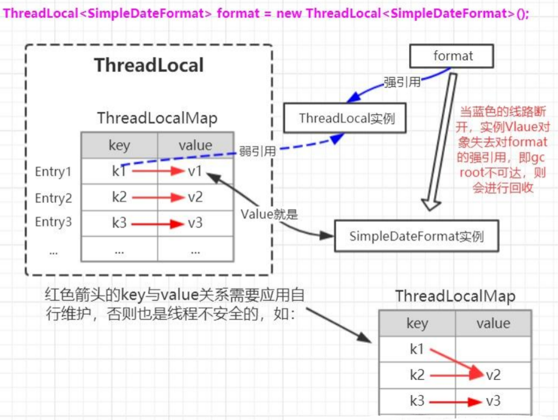
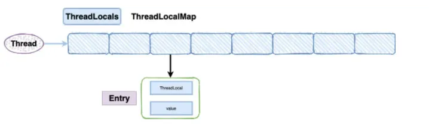
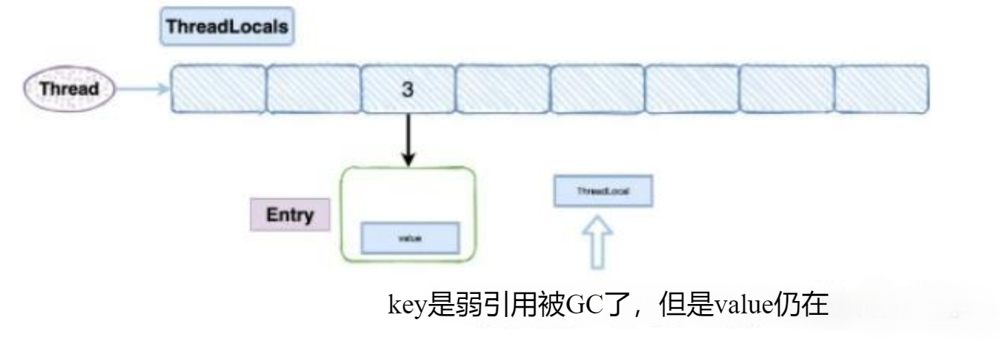
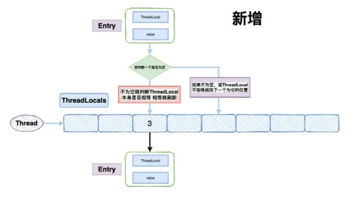
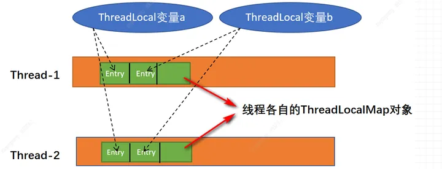
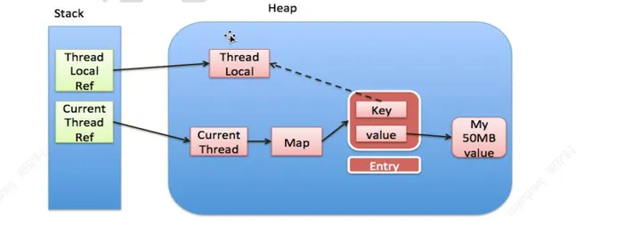
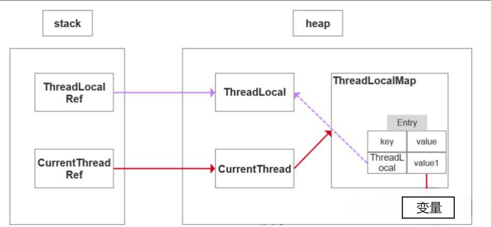

ThreadLocal存取的数据，总是与当前线程相关，也就是说，JVM 为每个运行的线程，绑定了私有的本地实例存取空间，从而为多线程环境常出现的并发访问问题提供了一种隔离机制。  
ThreadLocal的作用是提供线程内的局部变量，这种变量在线程的生命周期内起作用。提供一个线程内公共变量（比如本次请求的用户信息），减少同一个线程内多个函数或者组件之间一些公共变量的传递的复杂度，或者为线程提供一个私有的变量副本，这样每一个线程都可以随意修改自己的变量副本，而不会对其他线程产生影响。  
ThreadLocal的作用主要是做数据隔离，填充的数据只属于当前线程，变量的数据对别的线程而言是相对隔离的，在多线程环境下，如何防止自己的变量被其它线程篡改。  
# 数据结构
ThreadLocal内部维护的是一个类似Map的ThreadLocalMap数据结构

当执行set方法时，ThreadLocal首先会获取当前线程对象，然后获取当前线程的ThreadLocalMap对象。再以当前ThreadLocal对象为key，将值存储进ThreadLocalMap对象中。  
get方法执行过程类似。ThreadLocal首先会获取当前线程对象，然后获取当前线程的ThreadLocalMap对象。再以当前ThreadLocal对象为key，获取对应的value。  
由于每一条线程均含有各自私有的ThreadLocalMap容器，这些容器相互独立互不影响，因此不会存在线程安全性问题，从而也无需使用同步机制来保证多条线程访问容器的互斥性。  
# 源码解读
每一个 Thread 对象均含有一个 ThreadLocalMap 类型的成员变量 threadLocals ，它存储本线程中所 有ThreadLocal对象及其对应的值。
## 1. set方法
```java
public void set(T value) {
    Thread t = Thread.currentThread();
    ThreadLocalMap map = getMap(t);
    if (map != null)
        map.set(this, value);
    else
        createMap(t, value);
}
```
从set方法我们可以看到，首先获取到了当前线程t，然后调用getMap获取ThreadLocalMap，如果map存在，则将当前线程对象t作为key，要存储的对象作为value存到map里面去。如果该Map不存在，则初始化一个。  
看下ThreadLocalMap 源码
```java
static class ThreadLocalMap {
    /**
     * The entries in this hash map extend WeakReference, using
     * its main ref field as the key (which is always a
     * ThreadLocal object).  Note that null keys (i.e. entry.get()
     * == null) mean that the key is no longer referenced, so the
     * entry can be expunged from table.  Such entries are referred to
     * as "stale entries" in the code that follows.
     */
    static class Entry extends WeakReference<ThreadLocal<?>> {
        /** The value associated with this ThreadLocal. */
        Object value;
        Entry(ThreadLocal<?> k, Object v) {
            super(k);
            value = v;
        }
    }
}
```
可以看到ThreadLocalMap其实就是ThreadLocal的一个静态内部类，里面定义了一个Entry来保存数据，而且还是继承的弱引用。在Entry内部使用ThreadLocal作为key，使用我们设置的value作为value。

ThreadLocal在保存的时候会把自己当做Key存在ThreadLocalMap中，正常情况应该是key和value都应该被外界强引用才对，但是现在key被设计成WeakReference弱引用了。

接着看createMap
```java
void createMap(Thread t, T firstValue) {
    //ThreadLocalMap对象赋值给Thread 的 threadLocals 属性
    t.threadLocals = new ThreadLocalMap(this, firstValue);
}
static class Entry extends WeakReference<ThreadLocal<?>> {
            /** The value associated with this ThreadLocal. */
            Object value;
            Entry(ThreadLocal<?> k, Object v) {
                super(k);
                value = v;
            }
}
ThreadLocalMap(ThreadLocal<?> firstKey, Object firstValue) {
            table = new Entry[INITIAL_CAPACITY];
            //计算在数组中的下标
            int i = firstKey.threadLocalHashCode & (INITIAL_CAPACITY - 1);
            table[i] = new Entry(firstKey, firstValue);
            size = 1;
            setThreshold(INITIAL_CAPACITY);
}
```
可以发现这个**ThreadLocalMap的key是ThreadLocal类的实例对象，划重点，面试要考的，value为设置的值。**  
ThreadLocalMap 由一个个 Entry 对象构成 Entry 继承自 WeakReference> ，一个 Entry 由 ThreadLocal 对象和 Object 构 成。由此可见， Entry 的key是ThreadLocal对象，并且是一个弱引用。当没指向key的强引用后，该 key就会被垃圾收集器回收。  
为什么需要数组呢？没有了链表怎么解决Hash冲突呢？  
在看ThreadLocalMap的set方法  
用数组是因为我们开发过程中可以一个线程可以有多个TreadLocal来存放不同类型的对象的，但是他们都将放到你当前线程的ThreadLocalMap里，所以肯定要数组来存。
```java
private void set(ThreadLocal<?> key, Object value) {

    Entry[] tab = table;
    int len = tab.length;
    int i = key.threadLocalHashCode & (len-1);

    for (Entry e = tab[i];
         e != null;
         e = tab[i = nextIndex(i, len)]) {
        ThreadLocal<?> k = e.get();

        if (k == key) {
            e.value = value;
            return;
        }

        if (k == null) {
            replaceStaleEntry(key, value, i);
            return;
        }
    }

    tab[i] = new Entry(key, value);
    int sz = ++size;
    if (!cleanSomeSlots(i, sz) && sz >= threshold)
        rehash();
}
```
从源码里面看到ThreadLocalMap在存储的时候会给每一个ThreadLocal对象一个threadLocalHashCode，在插入过程中，根据ThreadLocal对象的hash值，定位到table中的位置i  
`int i = key.threadLocalHashCode & (len-1)。`  
然后会判断一下：如果当前位置是空的，就初始化一个Entry对象放在位置i上；
```java
if (k == null) {
    replaceStaleEntry(key, value, i);
    return;
}
```
如果位置i不为空，如果这个Entry对象的key正好是即将设置的key，那么就刷新Entry中的value；
```java
if (k == key) {
  e.value = value;
  return;
}
```
如果位置i的不为空，而且key不等于entry，那就找下一个空位置，直到为空为止。

到这里，我们就可以理解ThreadLocal究竟是如何工作的了
- Thread类中有一个成员变量属于ThreadLocalMap类(一个定义在ThreadLocal类中的内部类)，它是一个Map，他的key是ThreadLocal实例对象。
- 当为ThreadLocal类的对象set值时，首先获得当前线程的ThreadLocalMap类属性，然后以ThreadLocal类的对象为key，设定value。get值时则类似。
- ThreadLocal变量的活动范围为某线程，是该线程“专有的，独自霸占”的，对该变量的所有操作均由该线程完成！也就是说，ThreadLocal 不是用来解决共享对象的多线程访问的竞争问题的，因为`ThreadLocal.set()` 到线程中的对象是该线程自己使用的对象，其他线程是不需要访问的，也访问不到的。当线程终止后，这些值会作为垃圾回收。

#### 1. 哈希值的计算

首先，一个`ThreadLocal`对象如何得到它的哈希值？它并不是直接调用`hashCode()`方法。每个`ThreadLocal`对象在初始化时，都会被分配一个“神奇”的、唯一的`threadLocalHashCode`。

```java
// ThreadLocal.java
// 这个hash值是每个ThreadLocal对象创建时就确定，并且之后不会改变
private final int threadLocalHashCode = nextHashCode();

// 一个原子计数器，用来保证每个新创建的ThreadLocal对象的hash值是唯一的
private static AtomicInteger nextHashCode = new AtomicInteger();

// 一个“神奇”的魔数，0x61c88647，黄金分割数。
// 用它来递增可以使得哈希值在2的幂次长度的数组中分布得非常均匀，从而减少冲突。
private static final int HASH_INCREMENT = 0x61c88647;

private static int nextHashCode() {
    return nextHashCode.getAndAdd(HASH_INCREMENT);
}
```

*   **关键点**：通过一个`AtomicInteger`和一个固定的增量`HASH_INCREMENT`，`ThreadLocal`保证了每个实例都有一个不同的`threadLocalHashCode`，这大大降低了哈希冲突的概率。这个`HASH_INCREMENT`是经过精心挑选的，能让哈希码更均匀地分布。

#### 2. 数组索引的计算

当你调用`threadLocal.set(value)`时，`ThreadLocalMap`会用这个`threadLocalHashCode`来计算它在内部`Entry[] table`数组中的位置。

```java
// ThreadLocal.ThreadLocalMap.set(ThreadLocal<?> key, Object value)
Entry[] tab = table;
int len = tab.length;
// 计算索引：用哈希码和(数组长度-1)做与运算，这是哈希表标准的高效取模操作
int i = key.threadLocalHashCode & (len-1); 
```

#### 3. 冲突处理：线性探测

现在，真正的冲突处理来了。`set`方法的逻辑会从计算出的索引`i`开始，向后遍历数组：

```java
// 简化后的 set 方法逻辑
for (Entry e = tab[i]; e != null; e = tab[i = nextIndex(i, len)]) {
    ThreadLocal<?> k = e.get();

    // 情况1：找到了完全相同的Key（同一个ThreadLocal对象）
    if (k == key) {
        e.value = value; // 直接覆盖值，然后返回
        return;
    }

    // 情况2：找到了一个“过时”的槽位（Key为null，之前被GC回收了）
    if (k == null) {
        // 调用 replaceStaleEntry 清理这个过时的槽位，并把新值放进去
        replaceStaleEntry(key, value, i);
        return;
    }
  
    // 情况3（核心）：当前槽位被别的Key占了，发生哈希冲突
    // 循环会继续，i = nextIndex(i, len)，也就是 i++ (如果越界则回到0)
    // 继续探测下一个位置
}

// 循环结束，意味着从i开始向后探测，找到了一个空槽位(e == null)
tab[i] = new Entry(key, value); // 在空槽位上创建新的Entry
int sz = ++size;
// 如果没有清理掉过时Entry，并且元素数量超过阈值，就进行扩容
if (!cleanSomeSlots(i, sz) && sz >= threshold)
    rehash();
```

`nextIndex`的实现非常简单：

```java
// 循环获取下一个索引
private static int nextIndex(int i, int len) {
    return ((i + 1 < len) ? i + 1 : 0);
}
```

**我们来总结一下这个处理流程：**

1.  **计算初始位置**：通过 `key.threadLocalHashCode & (table.length - 1)` 计算出索引 `i`。
2.  **检查位置 `i`**：
    *   **如果是空位**：太好了，直接把新的`Entry`放这里，`set`操作完成。
    *   **如果不是空位**：检查这个位置上`Entry`的Key。
        *   **Key正好是我们要设置的`key`**：说明是更新操作，直接更新`value`，操作完成。
        *   **Key不是我们要设置的`key`**：**这就是哈希冲突**。
3.  **线性探测**：计算下一个索引 `i = (i + 1) % table.length`，然后重复**步骤2**，直到找到一个空位或者找到匹配的Key为止。

## 2. get方法
```java
public T get() {
    Thread t = Thread.currentThread();
    ThreadLocalMap map = getMap(t);
    if (map != null) {
        ThreadLocalMap.Entry e = map.getEntry(this);
        if (e != null) {
            @SuppressWarnings("unchecked")
            T result = (T)e.value;
            return result;
        }
    }
    return setInitialValue();
}
```
首先获取当前线程，然后调用getMap方法获取一个ThreadLocalMap，如果map不为null，那就使用当前线程作为ThreadLocalMap的Entry的键，然后值就作为相应的的值，如果没有那就设置一个初始值。  
如何设置一个初始值呢？
```java
private T setInitialValue() {
    T value = initialValue();
    Thread t = Thread.currentThread();
    ThreadLocalMap map = getMap(t);
    if (map != null)
        map.set(this, value);
    else
        createMap(t, value);
    return value;
}
```

`get`操作的逻辑是完全一样的。它也是从计算出的初始位置`i`开始，如果发现Key不匹配，就线性地向后探测，直到找到匹配的Key或者遇到一个`null`（表示这个Key不存在于Map中）。

#### 5. 顺带一提：清理机制 (`expungeStaleEntry`)

`ThreadLocalMap`的线性探测还有一个非常精妙的设计。在探测过程中，如果遇到了Key为`null`的“过时”`Entry`（这是因为`Entry`的Key是弱引用，`ThreadLocal`对象被GC回收了），它会触发一个清理动作`expungeStaleEntry`。

这个清理动作不仅会移除当前这个过时的`Entry`，还会继续向后检查，把因为哈希冲突而排在后面的`Entry`进行**再哈希 (rehash)**，把它们挪到更合适的位置，以保持探测链的紧凑和高效。

`ThreadLocalMap` 采用 **开放定址法中的线性探测** 来解决哈希冲突。当`set`一个键值对时，它会根据 `ThreadLocal` 对象的 `threadLocalHashCode` 计算出一个初始索引。

1.  如果该索引位置为空，则直接插入。
2.  如果该索引位置已被其他 `Entry` 占据，它会**向后逐一检查数组的下一个槽位**（`i+1`, `i+2`, ...，如果到末尾则从0开始），这个过程被称为“探测”。
3.  探测过程中，它会一直寻找，直到：
    *   找到一个**空的槽位**，然后将新的 `Entry` 放入。
    *   或者，找到一个 `Entry` 的Key与当前要`set`的`key`**完全相同**，此时执行值的覆盖操作。

这个机制保证了即使多个`ThreadLocal`对象不幸拥有了相同的哈希索引，它们也都能被正确地存入`ThreadLocalMap`中，只不过是沿着数组向后顺延排列而已。同时，这个过程还巧妙地集成了对过期弱引用的清理机制，使得`ThreadLocalMap`更加健壮。
## 3.remove方法
```java
public void remove() {
    ThreadLocalMap m = getMap(Thread.currentThread());
    if (m != null)
        m.remove(this);
}
```
**总结**
1. 每个Thread维护着一个ThreadLocalMap的引用
2. ThreadLocalMap是ThreadLocal的内部类，用Entry来进行存储
3. ThreadLocal创建的副本是存储在自己的threadLocals中的，也就是自己的ThreadLocalMap。
4. ThreadLocalMap的键值为ThreadLocal对象，而且可以有多个threadLocal变量，因此保存在map中
5. 在进行get之前，必须先set，否则会报空指针异常，当然也可以初始化一个，但是必须重写initialValue()方法。
6. ThreadLocal本身并不存储值，它只是作为一个key来让线程从ThreadLocalMap获取value。
# 注意的问题
使用不当会发生内存泄漏

图中的虚线表示弱引用。  
ThreadLocalMap， 这个 map是使用 ThreadLocal 的弱引用作为 Key 的， 弱引用的对象在 GC 时会被回收。  
这样， 当把 threadlocal 变量置为 null 以后， 没有任何强引用指向 threadlocal实例， 所以 threadlocal 将会被 gc 回收。 这样一来， ThreadLocalMap 中就会出现key 为 null 的 Entry， 就没有办法访问这些 key 为 null 的 Entry 的 value， 如果当前线程再迟迟不结束的话， 这些 key 为 null 的 Entry 的 value 就会一直存在一条强引用链： Thread Ref -> Thread -> ThreaLocalMap -> Entry -> value， 而这块 value 永远不会被访问到了， 所以存在着内存泄露。  
只有当前 thread 结束以后， current thread 就不会存在栈中， 强引用断开，Current Thread、 Map value 将全部被 GC 回收。  
**解决办法：使用完ThreadLocal后，执行remove操作，避免出现内存溢出情况。**
```java
ThreadLocal<String> localName = new ThreadLocal<>();
try {
    localName.set("hello");
    ……
} finally {
            localName.remove();
}
```
## ThreadLocal内存泄露原因，如何避免
内存泄露为程序在申请内存后，无法释放已申请的内存空间，一次内存泄露危害可以忽略，但内存泄露堆积后果很严重，无论多少内存,迟早会被占光，不再会被使用的对象或者变量占用的内存不能被回收，就是内存泄露。
强引用：使用最普遍的引用(new)，一个对象具有强引用，不会被垃圾回收器回收。当内存空间不足，Java虚拟机宁愿抛出OutOfMemoryError错误，使程序异常终止，也不回收这种对象。如果想取消强引用和某个对象之间的关联，可以显式地将引用赋值为null，这样可以使JVM在合适的时间就会回收该对象。  
弱引用：JVM进行垃圾回收时，无论内存是否充足，都会回收被弱引用关联的对象。在java中，用java.lang.ref.WeakReference类来表示。可以在缓存中使用弱引用。  
ThreadLocal的实现原理，每一个Thread维护一个ThreadLocalMap，key为使用弱引用的ThreadLocal实例，value为线程变量的副本。

threadLocalMap使用ThreadLocal的弱引用作为key，如果一个ThreadLocal不存在外部强引用时，Key(ThreadLocal)势必会被GC回收，这样就会导致ThreadLocalMap中key为null， 而value还存在着强引用，只有thead线程退出以后,value的强引用链条才会断掉，但如果当前线程再迟迟不结束的话，这些key为null的Entry的value就会一直存在一条强引用链（红色链条）
- key 使用强引用  
当hreadLocalMap的key为强引用回收ThreadLocal时，因为ThreadLocalMap还持有ThreadLocal的强引用，如果没有手动删除，ThreadLocal不会被回收，导致Entry内存泄漏。  
- key 使用弱引用  
当ThreadLocalMap的key为弱引用回收ThreadLocal时，由于ThreadLocalMap持有ThreadLocal的弱引用，即使没有手动删除，ThreadLocal也会被回收。  
当key为null，在下一次ThreadLocalMap调用set(),get()，`remove()`方法的时候会被清除value值。  
因此，ThreadLocal内存泄漏的根源是：由于ThreadLocalMap的生命周期跟Thread一样长，如果没有手动删除对应key就会导致内存泄漏，而不是因为弱引用。  

**ThreadLocal正确的使用方法**:  
- 每次使用完ThreadLocal都调用它的`remove()`方法清除数据
- 将ThreadLocal变量定义成private static，这样就一直存在ThreadLocal的强引用，也就能保证任何时候都能通过ThreadLocal的弱引用访问到Entry的value值，进而清除掉 。
# 使用场景
1. 在进行对象跨层传递的时候，使用ThreadLocal可以避免多次传递，打破层次间的约束。
2. 线程间数据隔离
3. 进行事务操作，用于存储线程事务信息。
4. 数据库连接，Session会话管理。
