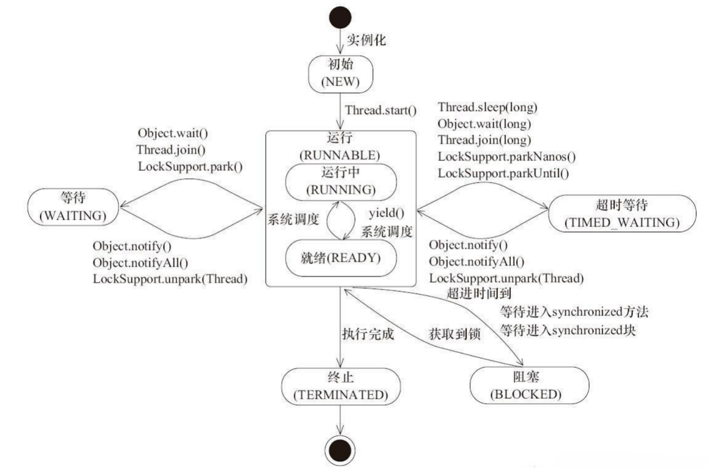
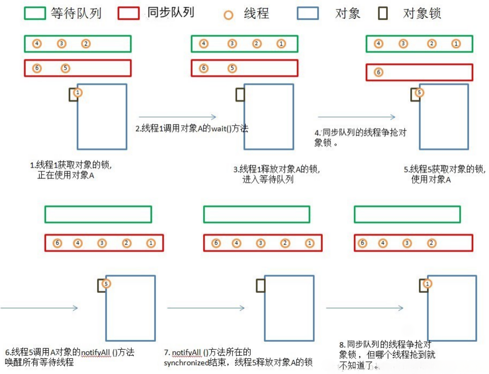

# 新建(new)
创建了一个新的线程对象
# 就绪(runnable)
调用线程的start()方法，处于就绪状态
# 运行(running)
获得了CPU时间片，执行程序代码  
**就绪状态是进入到运行状态的唯一入口**
# 阻塞(block)
因为某种原因，线程放弃对CPU的使用权，停止执行，直到进入就绪状态在有可能再次被CPU调度
阻塞又分为三种：
1. 等待阻塞：运行状态的线程执行wait方法，JVM会把线程放在等待队列中，使本线程进入阻塞状态。
2. 同步阻塞：线程在获得synchronized同步锁失败，JVM会把线程放入锁池中，线程进入同步阻塞。
3. 其他阻塞：调用线程的sleep()或者join()后，线程会进入道阻塞状态，当sleep超时或者join终止或超时，线程重新转入就绪状态
# 死亡(dead)
线程`run()`、`main()`方法执行结束，或者因为异常退出了`run()`方法，则该线程结束生命周期
**死亡的线程不可再次复生**
# Java线程的6种状态
<details>
<summary>通过查看Thread类的State方法，我们可以看到Java线程其实是六种状态</summary>

```Java
public enum State {
    /**
     * Thread state for a thread which has not yet started.
     */
    NEW,

    /**
     * Thread state for a runnable thread.  A thread in the runnable
     * state is executing in the Java virtual machine but it may
     * be waiting for other resources from the operating system
     * such as processor.
     */
    RUNNABLE,

    /**
     * Thread state for a thread blocked waiting for a monitor lock.
     * A thread in the blocked state is waiting for a monitor lock
     * to enter a synchronized block/method or
     * reenter a synchronized block/method after calling
     * {@link Object#wait() Object.wait}.
     */
    BLOCKED,

    /**
     * Thread state for a waiting thread.
     * A thread is in the waiting state due to calling one of the
     * following methods:
     * <ul>
     *   <li>{@link Object#wait() Object.wait} with no timeout</li>
     *   <li>{@link #join() Thread.join} with no timeout</li>
     *   <li>{@link LockSupport#park() LockSupport.park}</li>
     * </ul>
     *
     * <p>A thread in the waiting state is waiting for another thread to
     * perform a particular action.
     *
     * For example, a thread that has called <tt>Object.wait()</tt>
     * on an object is waiting for another thread to call
     * <tt>Object.notify()</tt> or <tt>Object.notifyAll()</tt> on
     * that object. A thread that has called <tt>Thread.join()</tt>
     * is waiting for a specified thread to terminate.
     */
    WAITING,

    /**
     * Thread state for a waiting thread with a specified waiting time.
     * A thread is in the timed waiting state due to calling one of
     * the following methods with a specified positive waiting time:
     * <ul>
     *   <li>{@link #sleep Thread.sleep}</li>
     *   <li>{@link Object#wait(long) Object.wait} with timeout</li>
     *   <li>{@link #join(long) Thread.join} with timeout</li>
     *   <li>{@link LockSupport#parkNanos LockSupport.parkNanos}</li>
     *   <li>{@link LockSupport#parkUntil LockSupport.parkUntil}</li>
     * </ul>
     */
    TIMED_WAITING,

    /**
     * Thread state for a terminated thread.
     * The thread has completed execution.
     */
    TERMINATED;
}
```
</details>

## 1. 初始状态(NEW)
实现Runnable接口和继承Thread可以得到一个线程类，new一个实例出来，线程就进入了初始状态。
## 2. 就绪
### 2.1. 就绪状态(RUNNABLE之READY)
就绪状态只是说你资格运行，调度程序没有挑选到你，你就永远是就绪状态。  
调用线程的`start()`方法，此线程进入就绪状态。  
当前线程`sleep()`方法结束，其他线程`join()`结束，等待用户输入完毕，某个线程拿到对象锁，这些线程也将进入就绪状态。  
当前线程时间片用完了，调用当前线程的yield()方法，当前线程进入就绪状态。  
锁池里的线程拿到对象锁后，进入就绪状态。
### 2.2. 运行中状态(RUNNABLE之RUNNING)
线程调度程序从可运行池中选择一个线程作为当前线程时线程所处的状态。这也是线程进入运行状态的唯一的一种方式。
## 3. 阻塞状态(BLOCKED)
阻塞状态是线程阻塞在进入synchronized关键字修饰的方法或代码块(获取锁)时的状态。
## 4. 等待(WAITING)
处于这种状态的线程不会被分配CPU执行时间，它们要等待被显式地唤醒，否则会处于无限期等待的状态。
## 5. 超时等待(TIMED_WAITING)
处于这种状态的线程不会被分配CPU执行时间，不过无须无限期等待被其他线程显示地唤醒，在达到一定时间后它们会自动唤醒。
## 6. 终止状态(TERMINATED)
当线程的run()方法完成时，或者主线程的main()方法完成时，我们就认为它终止了。这个线程对象也许是活的，但是它已经不是一个单独执行的线程。线程一旦终止了，就不能复生。  
在一个终止的线程上调用start()方法，会抛出java.lang.IllegalThreadStateException异常。

# 等待队列
- 调用obj的`wait()`, `notify()`方法前，必须获得obj锁，也就是必须写在`synchronized(obj)` 代码段内。
- 与等待队列相关的步骤和图

1. 线程1获取对象A的锁，正在使用对象A。
2. 线程1调用对象A的wait()方法。
3. 线程1释放对象A的锁，并马上进入等待队列。
4. 锁池里面的对象争抢对象A的锁。
5. 线程5获得对象A的锁，进入synchronized块，使用对象A。
6. 线程5调用对象A的`notifyAll()`方法，唤醒所有线程，所有线程进入同步队列。若线程5调用对象A的`notify()`方法，则唤醒一个线程，不知道会唤醒谁，被唤醒的那个线程进入同步队列。
7. `notifyAll()`方法所在synchronized结束，线程5释放对象A的锁。
8. 同步队列的线程争抢对象锁，但线程1什么时候能抢到就不知道了。 
# 同步队列状态
1. 当前线程想调用对象A的同步方法时，发现对象A的锁被别的线程占有，此时当前线程进入同步队列。简言之，同步队列里面放的都是想争夺对象锁的线程。
2. 当一个线程1被另外一个线程2唤醒时，1线程进入同步队列，去争夺对象锁。
3. 同步队列是在同步的环境下才有的概念，一个对象对应一个同步队列。
4. 线程等待时间到了或被notify/notifyAll唤醒后，会进入同步队列竞争锁，如果获得锁，进入RUNNABLE状态，否则进入BLOCKED状态等待获取锁。
# 几个方法比较
1. `Thread.sleep(long millis)`，一定是当前线程调用此方法，当前线程进入TIMED_WAITING状态，但不释放对象锁，millis后线程自动苏醒进入就绪状态。作用：给其它线程执行机会的最佳方式。
2. `Thread.yield()`，一定是当前线程调用此方法，当前线程放弃获取的CPU时间片，但不释放锁资源，由运行状态变为就绪状态，让OS再次选择线程。作用：让相同优先级的线程轮流执行，但并不保证一定会轮流执行。实际中无法保证`yield()`达到让步目的，因为让步的线程还有可能被线程调度程序再次选中。`Thread.yield()`不会导致阻塞。该方法与`sleep()`类似，只是不能由用户指定暂停多长时间。
3. `thread.join()`/`thread.join(long millis)`，当前线程里调用其它线程t的join方法，当前线程进入`WAITING/TIMED_WAITING`状态，当前线程不会释放已经持有的对象锁。线程t执行完毕或者millis时间到，当前线程一般情况下进入`RUNNABLE`状态，也有可能进入`BLOCKED`状态（因为join是基于wait实现的）。
4. `obj.wait()`，当前线程调用对象的`wait()`方法，当前线程释放对象锁，进入等待队列。依靠`notify()`/`notifyAll()`唤醒或者`wait(long timeout)` timeout时间到自动唤醒。
5. `obj.notify()`唤醒在此对象监视器上等待的单个线程，选择是任意性的。`notifyAll()`唤醒在此对象监视器上等待的所有线程。
6. `LockSupport.park()`/`LockSupport.parkNanos(long nanos)`,`LockSupport.parkUntil(long deadlines)`, 当前线程进入`WAITING/TIMED_WAITING`状态。对比wait方法,不需要获得锁就可以让线程进入`WAITING/TIMED_WAITING`状态，需要通过`LockSupport.unpark(Thread thread)`唤醒。
