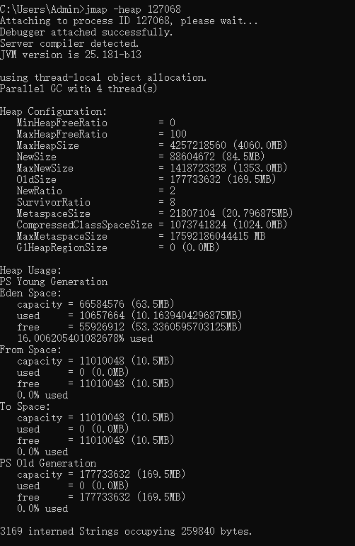

# 常用 JVM 参数
JVM参数可以分为三种类型，分别是以-、-X、-XX开头的参数
-开头的参数比较稳定，后续版本基本不变，如-version  查看版本信息
-X开头的参数比较稳定，后续版本可能改变，如-Xmx设置初始堆内存大小
-XX开头的参数不稳定，后续版本会变动，如-XX:MetaspaceSize 设置元空间大小

| 参数                                     | 含义                              | 备注                                                                            |
| ---------------------------------------- | --------------------------------- | ------------------------------------------------------------------------------- |
| -XX:CICompiler=3 | 最大并行编译数 | 如果设置大于1，虽然编译速度会提高，但同样影响系统稳定性，会增加JVM奔溃的可能 |
| -XX:InitialHeapSize=100M | 初始堆内存大小 | 简写-Xms100M |
| -XX:MaxHeapSize=100M | 最大堆大小 | 简写-Xmx100M |
| -XX:NewSize=20M | 新生代大小 | |
| -XX:MaxNewSize=50M | 新生代最大大小 |
| -XX:OldSize=50M | 老年代大小 |
| -XX:MetaspaceSize=50M | 方法区大小 |
| -XX:MaxMetaspaceSize=50M | 方法区最大大小 |
| -XX:+/-UseParallelGC | 是否使用ParallelGC | 新生代垃圾收集器，吞吐量优先|
| -XX:CICompiler=3 | 最大并行编译数 | 如果设置大于1，虽然编译速度会提高，但同样影响系统稳定性，会增加JVM奔溃的可能 |
| -XX:+/-UseParallelOldGC | 是否使用ParallelOldGC | 老年代代垃圾收集器，吞吐量优先 |
| -XX:+/-UseConcMarkSweepGC | 是否使用CMS | 老年代垃圾收集器，停顿时间优先 |
| -XX:+/-UseG1GC | 是否使用G1GC | 新生代/老年代代垃圾收集器，吞吐量优先 |
| -XX:NewRation | 新生代和老年代的比值 | 如-XX:NewRatio=4，表示新生代：老年代=1:4 |
| -XX:+/-HeapDumpOnOutOfMemoryError | 是否开启堆内存溢出时打印 | 当堆OOM时，会自动生成dump文件 |
| -XX:HeapDumpPath=heap.hprof | 指定堆内存溢出时打印目录 | 表示在当前目录生成一个heap.hprof |
| -XX:+/-PrintGCDetails   -XX:+/-PrintGCTimeStamps   -XX:+/-PrintGCDateStamps   -Xloggc:logs/gc.log | 打印GC日志 | 可以使用不同的垃圾收集器，对比查看GC情况 |
| -Xss128k | 设置每个线程的堆栈大小 | |
| -XX:MaxTenuringThreshold=6 | 对象进入老年代的年龄阈值 | 默认值为15 |
| -XX:InitiatingHeapOccupancyPercent | 当整个堆占用超过某个百分比时，就会触发并发GC周期 | 基于整个堆的占用率，默认值为45 |
| -XX:G1HeapWastePercent | 允许整个堆内存中被浪费的空间的百分比 | 默认值为5%。如果并发标记可回收的空间小于5%,则不会触发MixedGC |
| -XX:MaxGCPauseMills | G1最大停顿时间 | 暂停时间不能太小，太小会导致G1跟不上垃圾产生的速度，最终退化成Full GC.所以对正么参数的调优是一个持续的过程，逐步调整到最佳状态 |
| -XX:ConcGCThreads | 并发垃圾收集器使用的线程数量 | |
| -XX:G1MixedGCLiveThresholdPercent | 混合垃圾回收周期中要包括的旧区域设置占用率阈值 | 默认65% |
| -XX:G1MixedGCCountTarget | G1回收分区时最大混合式GC周期数 | 默认值为8 |
| -XX:G1OldCSetRegionThresholdPercent | 设置混合垃圾回收期间要回收的最大旧区域数 | 默认值为10 |
## GC日志相关
通过GC日志能够分析JVM发生GC时各个数据区的情况
-XX:+PrintGC 或 -verbose:gc 输出简单GC日志信息
-XX:+PrintGCDeatils 输出详细GC日志信息
-XX:+PrintGCTimeStamps  和 -XX:+PrintGCDateStamps 则是在详细输出GC日志信息的基础上增加时间，前者输出程序运行时间，后者输出时间戳
其他参数还有 -Xloggc:d:\gc.log 将GC信息输出到d:\gc.log文件；-XX:PrintHeapAtGC 每次GC前后打印堆信息等
## 运行时数据区相关
JVM有对各种运行时数据区（栈、堆、方法区、直接内存）的参数，常使用-XX命令，有些命令也可用-X来代替
## 栈
-XX:ThreadStackSize=100k 设置栈内存大小100k，可以使用 -Xss100k代替

栈是线程私有的，设置太大且创建线程多的场景下，可能会内存不足导致OOM
# 堆

-XX:InitalHeapSize=100m 设置堆内存初始化为100m，可以使用 -Xms100m代替
-XX:MaxHeapSize=100m 设置最大堆内存为100m，可以使用 -Xmx100m代替
当 **-Xms和-Xmx** 设置成一样的值时，JVM就不需要对堆内存扩容，能够优化一些性能，但占用内存少时可能造成浪费
当我们的开发工具idea比较卡时，可以用这两个参数将idea堆内存进行调整（idea 也是Java进程）
-Xmn2g 设置年轻代最大内存为2g，等同于-XX:NewSize=2g+-XX:MaxNewSize=2g
-XX:+UseAdaptiveSizePolicy 自动选择各区比例大小(默认开启)
-XX:SurvivorRatio=8 设置survivor:Eden占比为 1:1:8（如果-XX:+UseAdaptiveSizePolicy是开启的，survivor:eden比例会被自动调成为1:1:6）
-XX:NewRatio=2 设置年轻代:老年代占比为 1:2
观察GC日志，如果是因为年轻代空间不够导致频繁minor GC，可以适当调整年轻代与老年代比例
-XX:PretenureSizeThreadshold=2014 设置内存大于此值(byte)的对象作为大对象直接分配到老年代
-XX:MaxTenuringThreshold=15 对象年龄超过15进入老年代
-XX:+PrintTenuringDistribution JVM每次MinorGC后打印出当前使用的Survivor中对象的年龄分布
-XX:TargetSurvivorRatio MinorGC结束后Survivor区域中占用空间的期望比例

## 方法区
-XX:MetaspaceSize 元空间初始大小
-XX:MaxMetasoaceSize 元空间最大大小
-XX:+UseCompressedOops 使用压缩对象指针
-XX:+UseCompressedClassPointers 使用压缩类执行
-XX:ComporessedClassSpaceSize 设置ClassMetaspace大小，默认1g
要回收元空间时只能触发FULL GC，频繁触发FULL GC也可能是元空间大小不够
运行时产生大量动态类可能导致元空间被占满从而抛出OOM
面对这两种情况可以适当调整元空间大小

## 直接内存

-XX:MaxDiectMemorySize 设置直接内存大小，未指定则和最大堆内存一致

## OOM相关

-XX:+HeapDumpOutOfMemoryError 发生OOM时生成堆dump文件
-XX:+HeapDumpBeforeFullGC 发生FullGC时生成堆dump文件（OOM前会多次FullGC也就是可能多次生成dump文件）
-XX:HeapDumpPath=d:\指定生成堆dump文件路径为d:\ (默认生成的dump文件在项目当前目录下)
-XX:OnOutOfMemoryError=/opt/restart.sh  发生OOM时去执行/opt/restart.sh文件

## 垃圾收集器相关

### Serial 串行收集器
-XX:+UseSerialGC 年轻代，老年代都使用串行收集器

### ParNew 并行收集器

-XX:+UseParNewGC 年轻代使用ParNew收集器

JDK14 CMS被移除 没有老年代收集器配合 , 被废弃

### Parallel 吞吐量优先并行收集器

-XX:+UseParallelGC 、-XX:+UseParallelOldGC 使用任意一个参数，新生代、老年代就会使用Parallel收集器
-XX:ParallelGCThreads 设置年轻代并行收集线程数 （CPU数 < 8 设置与核心数相同；CPU数 > 8 设置线程数 = 3 + (5 * 核心数) / 8）
-XX:+UseAdaptiveSizePolicy 自适应调节策略
-XX:MaxGCPauseMillis 设置最大STW时间，单位ms
Parallel 主打高吞吐量优先，该参数具体值最好由-XX:+UseAdaptiveSizePolicy来分配
-XX:GCTimeRatio=N 垃圾收集时间占比(1/N+1)
用于衡量吞吐量，该值设置越大就与设置最大STW时间-XX:MaxGCPauseMillis 矛盾，不能同时使用

### CMS 并发收集器

-XX:+UseConcMarkSweepGC老年代使用CMS垃圾收集器，新生代使用ParNew收集器
-XX:CMSInitiatingOccupancyFraction设置老年代使用多少空间时开始垃圾回收
如果设置的太高，不够内存分配不能满足并发执行，就会冻结用户线程启动Serial Old收集器，停顿时间就会变长（如果内存增长缓慢可以设置高一些，如果内存增长很快就要设置低一些 默认92%）
-XX:+UseCMSCompactAtFullCollection指定在FULL GC后是否对内存进行压缩整理
（开启后，通过**-XX:CMSFullGCsBeforeCompaction设置执行多少次FULL GC后进行内存压缩整理**）
-XX:ParallelCMSThreads 设置CMS线程数量

### G1 低延迟分代收集器

-XX:+UseG1GC 使用G1收集器
-XX:G1HeapRegionSize设置每个region大小
-XX:MaxGCPauseMillis设置预期停顿时间 （默认200ms，最好不要太小）
-XX:ParallelGCThread设置STW时GC线程数
-XX:ConcGCThreads设置并发标记线程数
-XX:InitiatingHeapOccupancyPercent设置触发老年代GC的堆占用率阈值
使用G1时最好不要使用-XX:NewRatio 、-Xmn，会影响G1自动调节

查看其他更多JVM相关参数可以参考[官方文档](https://docs.oracle.com/javase/8/docs/technotes/tools/unix/java.html)

# 常用命令

## jps
查看进程

## jinfo
- 实时查看和调整JVM参数
格式：`jinfo -flag <name> <PID>` 如：jinfo -flag UserG1GC 126492

- 修改
只有被标记为manageable的参数才可以使用jinfo实时修改

格式： 
1. `jinfo -flag [+/-]<name> <PID>` 
2. `jinfo -flag <name>=<value> <PID>` 如 jinfo -flag HeapDumpPath=log/heap.hprof 126492

## jstat
- 查看类装载信息
jstat -class PID 1000 10 查看某个java进程的类装载信息，每1000毫秒输出一次，共输出10 次

- 查看垃圾收集信息
jstat -gc PID 1000 1000

## jstack
- 查看线程堆栈信息
jstack PID

## jmap
- 生成堆转储快照
- 打印堆内存相关信息

jmap -heap PID

- dump出堆内存相关信息

jmap -dump:format=b,file=heap.hprof PID

当发生堆内存溢出时，自动生成dump文件
-XX:+HeapDumpOnOutOfMemoryError -XX:HeapDumpPath=heap.hprof
