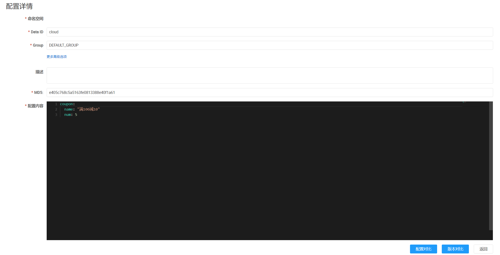

# 1. 添加依赖：

:::code-group
```xml [maven]
<dependency>
    <groupId>com.alibaba.cloud</groupId>
    <artifactId>spring-cloud-starter-alibaba-nacos-config</artifactId>
    <version>${latest.version}</version>
</dependency>
```

```txt [gradle]
   // https://mvnrepository.com/artifact/com.alibaba.cloud/spring-cloud-starter-alibaba-nacos-config
   implementation group: 'com.alibaba.cloud', name: 'spring-cloud-starter-alibaba-nacos-config', version: '2023.0.0.0-RC1'
```
:::
# 2. 在 `bootstrap.properties` 中配置 Nacos server 的地址和应用名
```properties
spring.application.name=cloud
server.port=8083
spring.cloud.nacos.config.server-addr=192.168.1.14:8848
spring.cloud.nacos.config.file-extension=yaml
```

说明：之所以需要配置 `spring.application.name` ，是因为它是构成 Nacos 配置管理 `dataId`字段的一部分。

在 Nacos Spring Cloud 中，`dataId` 的完整格式如下
```properties
${prefix}-${spring.profiles.active}.${file-extension}
```

`prefix` 默认为 `spring.application.name` 的值，也可以通过配置项 `spring.cloud.nacos.config.prefix`来配置。  
`spring.profiles.active` 即为当前环境对应的 `profile`，详情可以参考 Spring Boot文档。 注意：当 `spring.profiles.active` 为空时，  
对应的连接符 `-` 也将不存在，`dataId` 的拼接格式变成 `${prefix}.${file-extension}`  
`file-exetension` 为配置内容的数据格式，可以通过配置项 `spring.cloud.nacos.config.file-extension` 来配置.  
目前只支持 `properties` 和 `yaml` 类型。

# 3. 读取配置代码编写
```java
@Component
@ConfigurationProperties(prefix = "coupon")
public class Coupon {

    private String name;
    private Integer num;

    public String getName() {
        return name;
    }

    public void setName(String name) {
        this.name = name;
    }

    public Integer getNum() {
        return num;
    }

    public void setNum(Integer num) {
        this.num = num;
    }

    @Override
    public String toString() {
        return "Coupon{" +
                "name='" + name + '\'' +
                ", num=" + num +
                '}';
    }
}
```

```java
@RestController
// 通过 Spring Cloud 原生注解 @RefreshScope 实现配置自动更新
@RefreshScope
@RequestMapping("/coupon")
public class CouponController {

    private final Coupon coupon;

    @Autowired
    public CouponController(Coupon coupon) {
        this.coupon = coupon;
    }

    @GetMapping
    public String test() {
        return coupon.toString();
    }
}
```

# 4. 在nacos 控制台新建一个 DataID 为cloud的配置集：



```http 
GET http://localhost:8083/coupon
```

得到结果
```text
Coupon{name='满100减10', num=5}
```
