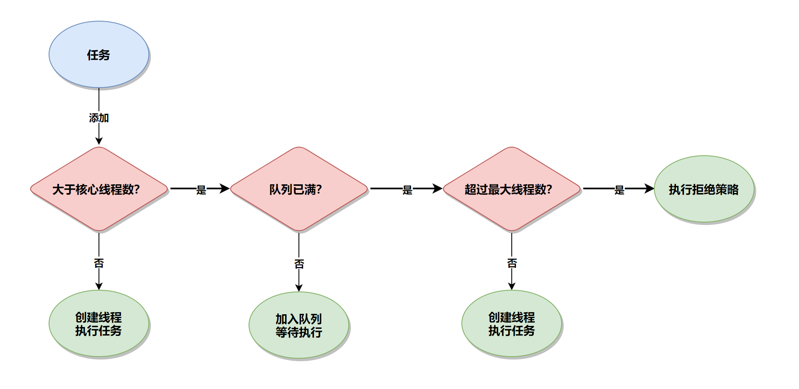
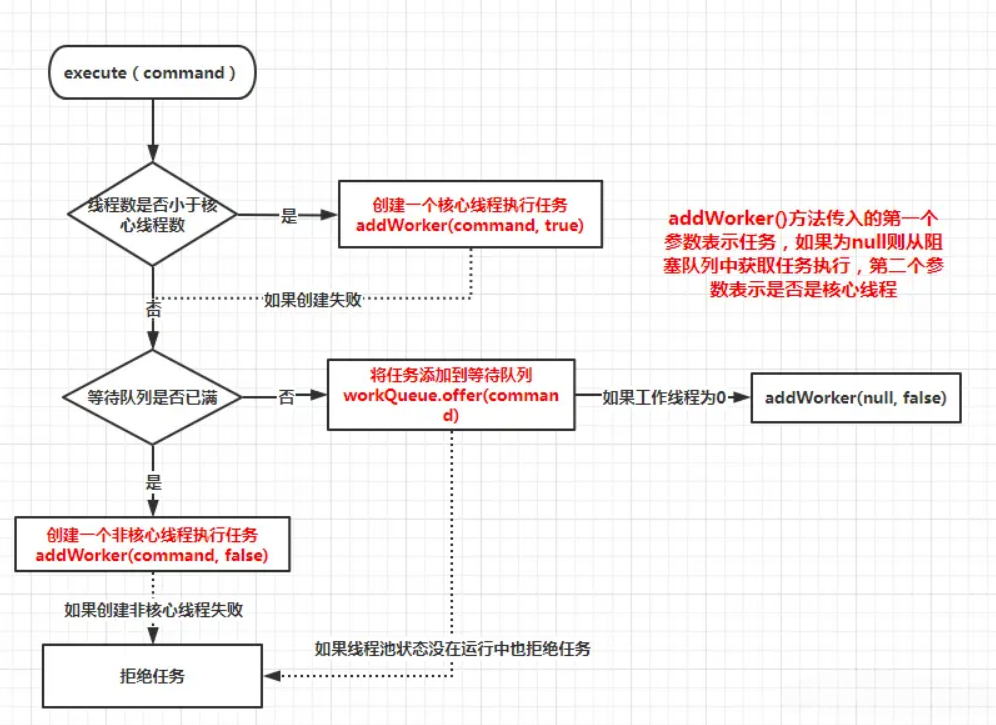
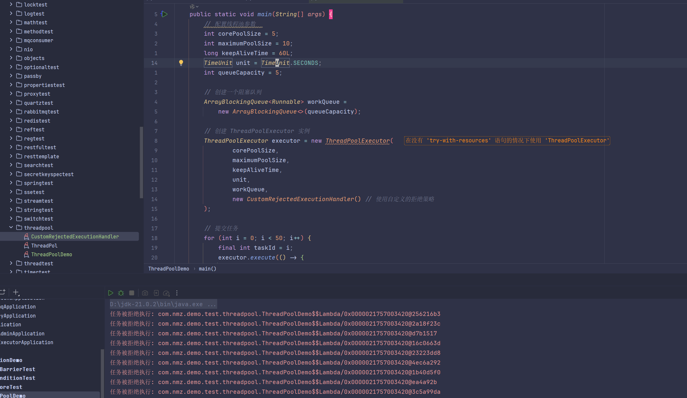
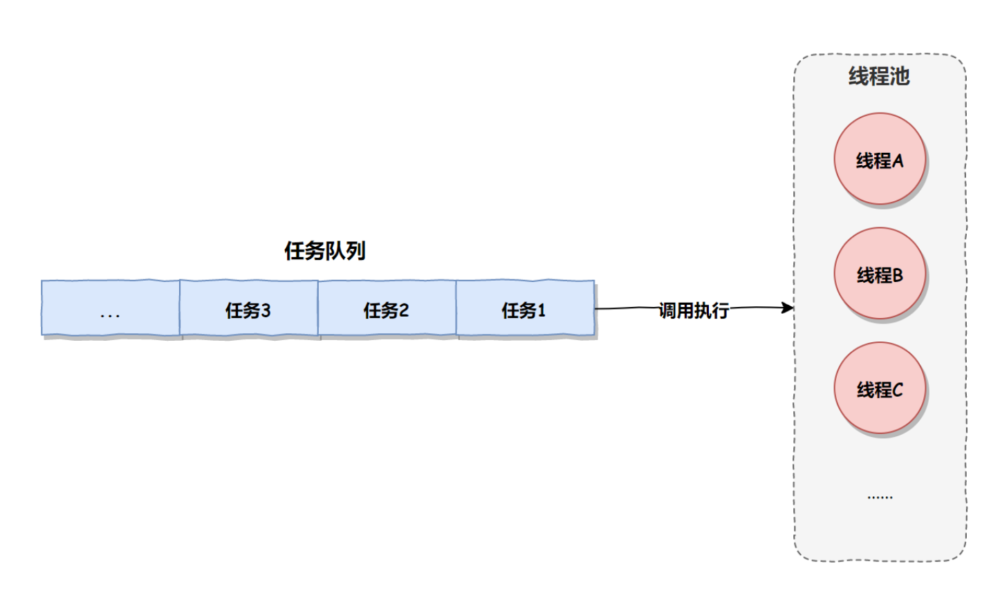
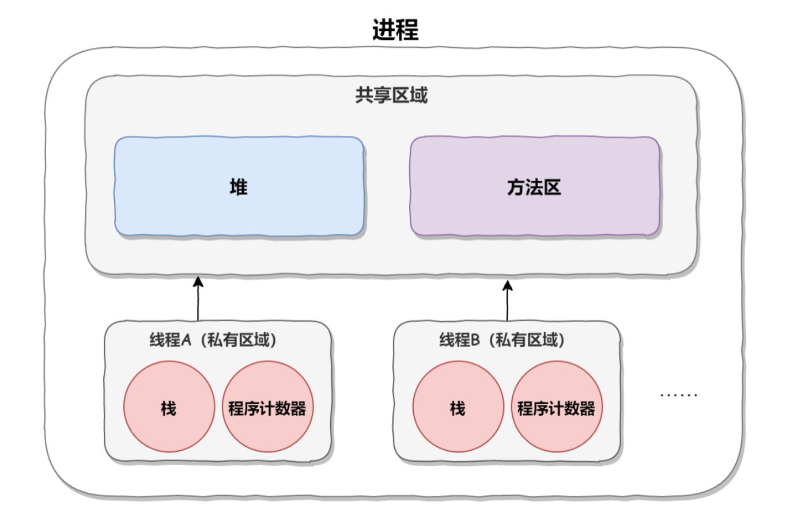

# 线程池相关
## 线程池参数
1. **corePoolSize**：核心线程数，线程池中始终存活的线程数。
2. **maximumPoolSize**: 最大线程数，线程池允许创建的最大线程数量，当线程池的任务队列满了之后，可以创建的最大线程数。
3. **keepAliveTime**: 存活时间，线程没有任务执行时最多保持多久时间会终止。当线程池中没有任务时，会销毁一些线程，销毁的线程数 = maximumPoolSize（最大线程数） - corePoolSize（核心线程数）。
4. **unit**: 单位，参数 keepAliveTime 的时间单位，7 种可选。空闲线程存活时间的描述单位，此参数是配合参数 3 使用的。 参数 3 是一个 long 类型的值，比如参数 3 传递的是 1，那么这个 1 表示的是 1 天？还是 1 小时？还是 1 秒钟？是由参数 4 说了算的。 TimeUnit 有以下 7 个值：
- **TimeUnit.DAYS**：天
- **TimeUnit.HOURS**：小时
- **TimeUnit.MINUTES**：分
- **TimeUnit.SECONDS**：秒
- **TimeUnit.MILLISECONDS**：毫秒
- **TimeUnit.MICROSECONDS**：微妙
- **TimeUnit.NANOSECONDS**：纳秒
5. **workQueue**: 一个阻塞队列，用来存储等待执行的任务，均为线程安全，7 种可选。
- **ArrayBlockingQueue**：一个由数组结构组成的有界阻塞队列。
- **LinkedBlockingQueue**：一个由链表结构组成的有界阻塞队列。
- **SynchronousQueue**：一个不存储元素的阻塞队列，即直接提交给线程不保持它们。
- **PriorityBlockingQueue**：一个支持优先级排序的无界阻塞队列。
- **DelayQueue**：一个使用优先级队列实现的无界阻塞队列，只有在延迟期满时才能从中提取元素。
- **LinkedTransferQueue**：一个由链表结构组成的无界阻塞队列。与**SynchronousQueue**类似，还含有非阻塞方法。
- **LinkedBlockingDeque**：一个由链表结构组成的双向阻塞队列。
比较常用的是 **LinkedBlockingQueue**，线程池的排队策略和 **BlockingQueue** 息息相关。
6. **threadFactory**: 线程工厂，主要用来创建线程，默及正常优先级、非守护线程。
7. **handler**：拒绝策略，拒绝处理任务时的策略，4 种可选。当线程池的任务超出线程池队列可以存储的最大值之后，执行的策略。 默认的拒绝策略有以下 4 种：
- **AbortPolicy**：拒绝并抛出异常。
- **CallerRunsPolicy**：使用当前调用的线程来执行此任务。
- **DiscardOldestPolicy**：抛弃队列头部（最旧）的一个任务，并执行当前任务。
- **DiscardPolicy**：忽略并抛弃当前任务。
线程池的默认策略是 AbortPolicy 拒绝并抛出异常。  
## 线程池执行流程


判断线程池中的线程数是否大于设置的核心线程数
- **如果小于**，就创建一个核心线程来执行任务
- **如果大于**，就会判断缓冲队列是否满了
- **如果没有满**，则放入队列，等待线程空闲时执行任务
- **如果队列已经满了**，则判断是否达到了线程池设置的最大线程数
- **如果没有达到**，就创建新线程来执行任务
- **如果已经达到了最大线程数**，则执行指定的拒绝策略

**核心线程不会销毁**
## 线程池阻塞队列
- **ArrayBlockingQueue** 基于数组的有界阻塞队列，按FIFO排序，当线程数量达到线程池核心线程数（`corePoolSize`）时，新的任务会放入队列的队尾，当队列满了时，会创建一个新的线程，当线程数达到线程池最大线程数（`MaxnumPoolSize`）时会执行拒绝策略。
- **LinkedBlockingQueue** 基于链表的无界阻塞队列（最大容量为`Integer.MAX`），按FIFO排序，当线程数达到线程池核心线程数（`corePoolSize`）时，新的任务会进入队列等待而不会创建新的线程直到队列达到`Integer.MAX`
- **SynchronousQueue** 不缓存任务的阻塞队列，直接执行任务，没有线程可以用时会新建线程，直到线程数达到线程池最大线程数（`MaxnumPoolSize`）时，执行拒绝策略
- **PriorityBlockingQueue** 具有优先级的无界阻塞队列，优先级通过参数`Comparator`实现
## 线程池拒绝策略
- **AbortPolicy**：直接丢弃任务，抛出异常，这是默认策略
- **CallerRunsPolicy**：只用调用者所在的线程来处理任务
- **DiscardOldestPolicy**：丢弃等待队列中最旧的任务，并执行当前任务
- **DiscardPolicy**：直接丢弃任务，也不抛出异常

当然除了 JDK 提供的四种拒绝策略之外，我们还可以实现通过 `new RejectedExecutionHandler`，并重写 `rejectedExecution` 方法来实现自定义拒绝策略，实现代码如下：
```java
import java.util.concurrent.RejectedExecutionHandler;  
import java.util.concurrent.ThreadPoolExecutor;  
  
public class CustomRejectedExecutionHandler implements RejectedExecutionHandler {  
  
    @Override  
    public void rejectedExecution(Runnable r, ThreadPoolExecutor executor) {  
        // 在这里处理拒绝的任务  
        System.err.println("任务被拒绝执行: " + r.toString());  
        // 可以选择记录日志、抛出自定义异常或采取其他措施  
        // 例如，可以将任务保存到某个队列中，稍后再尝试重新执行  
    }  
}
```
使用自定义策略
```java
import java.util.concurrent.ArrayBlockingQueue;  
import java.util.concurrent.ThreadPoolExecutor;  
import java.util.concurrent.TimeUnit;  

public class ThreadPoolDemo {

    public static void main(String[] args) {
        // 配置线程池参数
        int corePoolSize = 5;
        int maximumPoolSize = 10;
        long keepAliveTime = 60L;
        TimeUnit unit = TimeUnit.SECONDS;
        int queueCapacity = 25;

        // 创建一个阻塞队列
        ArrayBlockingQueue<Runnable> workQueue =
            new ArrayBlockingQueue<>(queueCapacity);

        // 创建 ThreadPoolExecutor 实例
        try (ThreadPoolExecutor executor = new ThreadPoolExecutor(
                corePoolSize,
                maximumPoolSize,
                keepAliveTime,
                unit,
                workQueue,
                new CustomRejectedExecutionHandler() // 使用自定义的拒绝策略  ,也可以直接用lambda表达式重写rejectedExecution方法
        )) {

            // 提交任务
            for (int i = 0; i < 50; i++) {
                final int taskId = i;
                executor.execute(() -> {
                    System.out.println("执行任务: " + taskId + " 由线程 " + Thread.currentThread().getName() + " 执行");
                    try {
                        Thread.sleep(1000); // 模拟耗时任务
                        } catch (InterruptedException e) {
                        e.printStackTrace();
                    }
                });
            }

            // 关闭线程池（这不会立即停止所有正在执行的任务）
            executor.shutdown();
        }
    }
}
```

## 线程池优点
线程池相比于线程来说，它不需要频繁的创建和销毁线程，线程一旦创建之后，默认情况下就会一直保持在线程池中，等到有任务来了，再用这些已有的线程来执行任务，如下图所示：

- 优点1：复用线程，降低资源消耗  
线程在创建时要开辟虚拟机栈、本地方法栈、程序计数器等私有线程的内存空间，而销毁时又要回收这些私有空间资源，如下图所示：

而线程池创建了线程之后就会放在线程池中，因此线程池相比于线程来说，第一个优点就是**可以复用线程、减低系统资源的消耗。**
- 优点2：提高响应速度  
线程池是复用已有线程来执行任务的，而线程是在有任务时才新建的，所以相比于线程来说，线程池能够更快的响应任务和执行任务。
- 优点3：管控线程数和任务数
线程池提供了更多的管理功能，这里管理功能主要体现在以下两个方面：
1. 控制最大并发数：线程池可以创建固定的线程数，从而避免了无限创建线程的问题。当线程创建过多时，会导致系统执行变慢，因为 CPU 核数是一定的、能同时处理的任务数也是一定的，而线程过多时就会造成线程恶意争抢和线程频繁切换的问题，从而导致程序执行变慢，所以合适的线程数才是高性能运行的关键。
2. 控制任务最大数：如果任务无限多，而内存又不足的情况下，就会导致程序执行报错，而线程池可以控制最大任务数，当任务超过一定数量之后，就会采用拒绝策略来处理多出的任务，从而保证了系统可以健康的运行。
- 优点4：更多增强功能
线程池相比于线程来说提供了更多的功能，比如定时执行和周期执行等功能。

**小结**  
线程池是一种管理和复用线程资源的机制。相比于线程，它具备四个主要优势：
1. 复用线程，降低了资源消耗；
2. 提高响应速度；
3. 提供了管理线程数和任务数的能力；
4. 更多增强功能。
## 停止线程池
在 Java 中，停止线程池可以通过以下两个步骤来实现：  
调用方法停止线程池：  
1. 调用线程池的 `shutdown()` 方法来关闭线程池。该方法会停止线程池的接受新任务，并尝试将所有未完成的任务完成执行；
2. 调用线程池的 `shutdownNow()` 方法来关闭线程池。该方法会停止线程池的接受新任务，并尝试停止所有正在执行的任务。该方法会返回一个未完成任务的列表，这些任务将被取消。  
等待线程池停止：在关闭线程池后，通过调用 `awaitTermination()` 方法来等待所有任务完成执行。该方法会阻塞当前线程，直到所有任务完成执行或者等待超时。  
下面是一个示例代码，演示如何中止线程池：
```java
ExecutorService executor = Executors.newFixedThreadPool(10);
// 提交任务到线程池
for (int i = 0; i < 100; i++) {
    executor.submit(new MyTask());
}
// 关闭线程池
executor.shutdown();
try {
    // 等待所有任务完成执行
    if (!executor.awaitTermination(60, TimeUnit.SECONDS)) {
        // 如果等待超时，强制关闭线程池
        executor.shutdownNow();
    }
} catch (InterruptedException e) {
    // 处理异常
}
```
在上面的示例代码中，首先创建了一个线程池，然后提交了 100 个任务到线程池中。然后，通过调用 `shutdown()` 方法关闭线程池，再通过调用 `awaitTermination()` 方法等待所有任务完成执行。如果等待超时，将强制调用 `shutdownNow()` 方法来停止所有正在执行的任务。最后，在 catch 块中处理中断异常。

