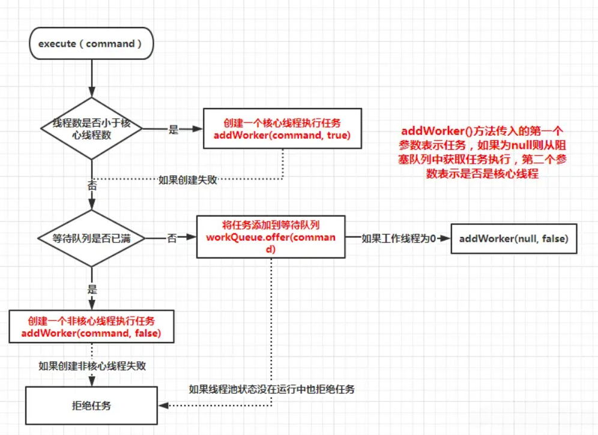

# 线程池相关

## 线程池参数

1. corePoolSize：核心线程数，线程池中始终存活的线程数。

2. maximumPoolSize: 最大线程数，线程池中允许的最大线程数。

3. keepAliveTime: 存活时间，线程没有任务执行时最多保持多久时间会终止。

4. unit: 单位，参数 keepAliveTime 的时间单位，7 种可选。

5. workQueue: 一个阻塞队列，用来存储等待执行的任务，均为线程安全，7 种可选。

6. threadFactory: 线程工厂，主要用来创建线程，默及正常优先级、非守护线程。

7. handler：拒绝策略，拒绝处理任务时的策略，4 种可选，默认为 AbortPolicy。

## 线程池执行流程

判断线程池中的线程数是否大于设置的核心线程数

- 如果小于，就创建一个核心线程来执行任务
- 如果大于，就会判断缓冲队列是否满了
- 如果没有满，则放入队列，等待线程空闲时执行任务
- 如果队列已经满了，则判断是否达到了线程池设置的最大线程数
- 如果没有达到，就创建新线程来执行任务
- 如果已经达到了最大线程数，则执行指定的拒绝策略

**核心线程不会销毁**

## 线程池阻塞队列

- ArrayBlockingQueue 基于数组的有界阻塞队列，按FIFO排序，当线程数量达到线程池核心线程数（corePoolSize）时，新的任务会放入队列的队尾，当队列满了时，会创建一个新的线程，当线程数达到线程池最大线程数（MaxnumPoolSize）时会执行拒绝策略。
- LinkedBlockingQueue 基于链表的无界阻塞队列（最大容量为Integer.MAX），按FIFO排序，当线程数达到线程池核心线程数（corePoolSize）时，新的任务会进入队列等待而不会创建新的线程直到队列达到Integer.MAX
- SynchronousQueue 不缓存任务的阻塞队列，直接执行任务，没有线程可以用时会新建线程，直到线程数达到线程池最大线程数（MaxnumPoolSize）时，执行拒绝策略
- PriorityBlockingQueue 具有优先级的无界阻塞队列，优先级通过参数Comparator实现

## 线程池拒绝策略

- AbortPolicy：直接丢弃任务，抛出异常，这是默认策略
- CallerRunsPolicy：只用调用者所在的线程来处理任务
- DiscardOldestPolicy：丢弃等待队列中最旧的任务，并执行当前任务
- DiscardPolicy：直接丢弃任务，也不抛出异常
