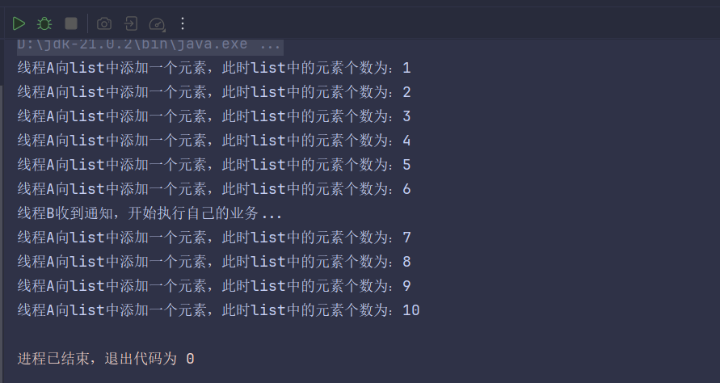
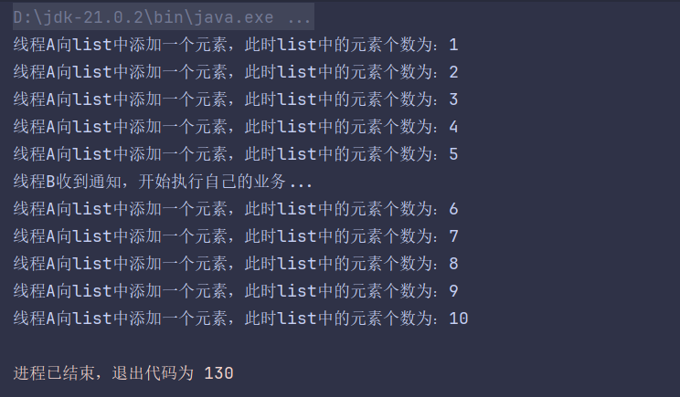
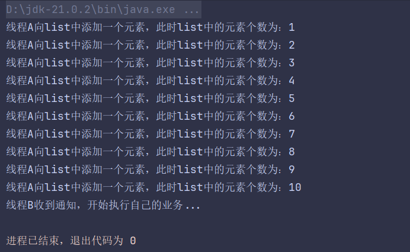
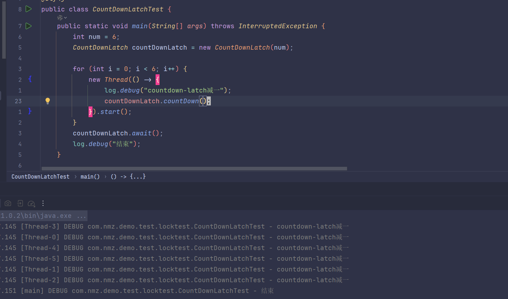
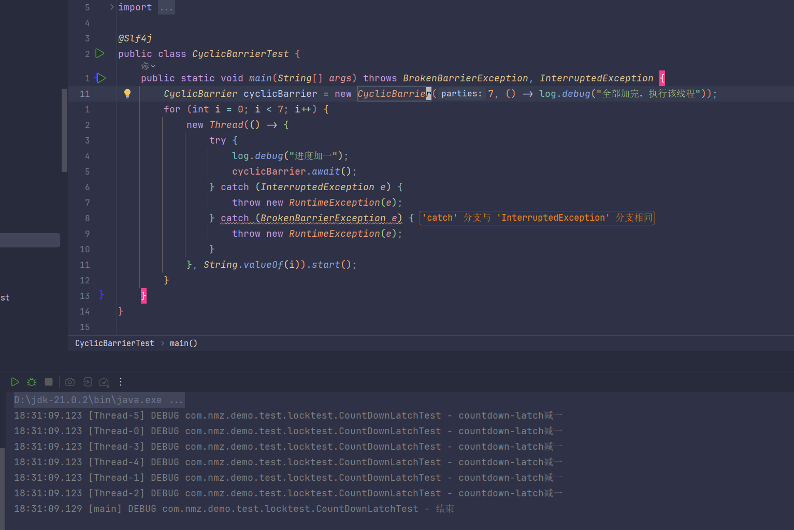
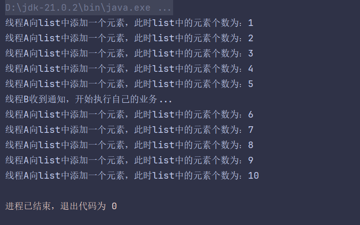

# 线程间通信方式
[原文链接](https://blog.csdn.net/qq_42411214/article/details/107767326)
## 1. volatile
关键字volatile可以用来修饰字段（成员变量），就是告知程序任何对该变量的访问均需要从共享内存中获取，而对它的改变必须同步刷新回共享内存，它能保证所有线程对变量访问的可见性。    
使用while进行轮询在这种方式下，线程A不断地改变条件，线程ThreadB不停地通过while语句检测这个条件(list.size==5)是否成立 ，从而实现了线程间的通信。但是这种方式会浪费CPU资源。之所以说它浪费资源，是因为JVM调度器将CPU交给线程B执行时，它没做啥“有用”的工作，只是在不断地测试某个条件是否成立。
```java
@Slf4j
public class TestSync {
    // 定义一个共享变量来实现通信，它需要是volatile修饰，否则线程不能及时感知
    static volatile boolean notice = false;

    public static void main(String[] args) {
        List<String>  list = new ArrayList<>();
        // 实现线程A
        Thread threadA = new Thread(() -> {
            for (int i = 1; i <= 10; i++) {
                list.add("abc");
                System.out.println("线程A向list中添加一个元素，此时list中的元素个数为：" + list.size());
                try {
                    Thread.sleep(500);
                } catch (InterruptedException e) {
                    log.error(e.getMessage());
                }
                if (list.size() == 5)
                    notice = true;
            }
        });
        // 实现线程B
        Thread threadB = new Thread(() -> {
            while (true) {
                if (notice) {
                    System.out.println("线程B收到通知，开始执行自己的业务...");
                    break;
                }
            }
        });
        //　需要先启动线程B
        threadB.start();
        try {
            Thread.sleep(1000);
        } catch (InterruptedException e) {
            log.error(e.getMessage());
        }
        // 再启动线程A
        threadA.start();
    }
}
```

## 2. synchronized 临界区方式
synchronized和ReentrantLock实现原理上有所不同，但是针对线程之间的通信的思想相同，都是保证多个线程互斥访问临界区（共享存储），来实现线程间的通信。
- synchronized
根据synchronized原理使用Object类提供了线程间通信的方法：`wait()`、`notify()`、`notifyaAll()`方法来实现多个线程互斥访问临界区资源`wait()`,`notify()`,`notifyAll()`必须在同步（Synchronized）方法/代码块中调用，否则会抛`IllegalMonitorStateException`异常
Object 类的方法说明：
1. `wait()`：让当前线程处于等待状态，并释放当前拥有的锁；
2. `notify()`：随机唤醒等待该锁的其他线程，重新获取锁，并执行后续的流程，只能唤醒一个线程；notify()的唤醒时间，是所处的代码块执行完毕,退出同步块的时候才会去真正唤醒对应的线程;
3. `notifyAll()`：唤醒所有等待该锁的线程（锁只有一把，虽然所有线程被唤醒，但所有线程需要排队执行）。
```java
@slf4
public class TestSyncBySyn {
    public static void main(String[] args) {
        // 定义一个锁对象
        Object lock = new Object();
        List<String> list = new ArrayList<>();
        // 实现线程A
        Thread threadA = new Thread(() -> {
            synchronized (lock) {
                for (int i = 1; i <= 10; i++) {
                    list.add("abc");
                    System.out.println("线程A向list中添加一个元素，此时list中的元素个数为：" + list.size());
                    try {
                        Thread.sleep(500);
                    } catch (InterruptedException e) {
                        log.error(e.getMessage());
                    }
                    if (list.size() == 5) {
                        lock.notify();// 唤醒B线程
                        try {
                            lock.wait();
                        } catch (InterruptedException e) {
                            throw new RuntimeException(e);
                        }
                    }
                }
            }
        });
        // 实现线程B
        Thread threadB = new Thread(() -> {
            while (true) {
                synchronized (lock) {
                    if (list.size() != 5) {
                        try {
                            lock.wait();
                        } catch (InterruptedException e) {
                            log.error(e.getMessage());
                        }
                    }
                    System.out.println("线程B收到通知，开始执行自己的业务...");
                    lock.notify();
                    try {
                        lock.wait();
                    } catch (InterruptedException e) {
                        throw new RuntimeException(e);
                    }
                }
            }
        });
        //　需要先启动线程B
        threadB.start();
        try {
            Thread.sleep(1000);
        } catch (InterruptedException e) {
            log.error(e.getMessage());
        }
        // 再启动线程A
        threadA.start();
    }
}
```

ReentrantLock/Condition 消息队列方式
- ReentrantLock/Condition
ReentrantLock锁的实现原理虽然和synchronized不用，但是它和synchronized一样都是通过保证线程间的互斥访问临界区，来保证线程安全，实现线程间的通信。相比于synchronized使用Object类的三个方法来实现线程的阻塞和运行两个状态的切换，ReentrantLock使用Condition阻塞队列的await()、signal()、signalAll()三个方法来实现线程阻塞和运行两个状态的切换，进而实现线程间的通信。

Condition 类的方法说明：

1. `await()`：对应 Object 的 wait() 方法，线程等待；
2. `signal()`：对应 Object 的 notify() 方法,唤醒一个等待线程。该线程从等待方法返回前必须获得与Condition相关的锁。；
3. `signalAll()`：对应 Object 的 notifyAll() 方法，唤醒所有线程,能够从等待方法返回的线程必须获得与Condition相关的锁。

显然这种方式使用起来并不是很好，代码编写复杂，而且线程B在被A唤醒之后由于没有获取锁还是不能立即执行，也就是说，A在唤醒操作之后，并不释放锁。这种方法跟 Object 的 wait() 和 notify() 一样。
## 3. Condition
```java
@Slf4j
public class LockConditionTest {
    static int h = 0;
    static int k = 0;

    public static void main(String[] args) {
        char[] list1 = "ABCDE".toCharArray();
        char[] list2 = "12345".toCharArray();


        Lock lock = new ReentrantLock();
        Condition condition1 = lock.newCondition();
        Condition condition2 = lock.newCondition();

        new Thread(() -> {
            while (true) {
                try {
                    lock.lock();
                if (h < list1.length) {
                    log.debug("{}", list1[h]);
                    h++;
                }
                condition2.signal();
                    condition1.await();
                } catch (Exception e) {
                    log.error(e.getMessage());
                } finally {
                    lock.unlock();
                }
            }
        }, "thread1").start();

        new Thread(() -> {
            while (true) {
                try {
                    lock.lock();
                if (h < list2.length) {
                    log.debug("{}", list2[h]);
                    h++;
                }
                condition1.signal();
                    condition2.await();
                } catch (Exception e) {
                    log.error(e.getMessage());
                } finally {
                    lock.unlock();
                }
            }
        }, "thread2").start();
    }
}
```
## 4. 使用JUC工具类 CountDownLatch
jdk1.5之后在java.util.concurrent包下提供了很多并发编程相关的工具类，简化了我们的并发编程代码的书写，**CountDownLatch**基于AQS框架，相当于也是维护了一个线程间共享变量state
```java
public class CountDownLatchTest {
    public static void main(String[] args) throws InterruptedException {
        int num = 6;
        CountDownLatch countDownLatch = new CountDownLatch(num);

        for (int i = 0; i < 6; i++) {
            new Thread(() -> {
                log.debug("countdown-latch减一");
                countDownLatch.countDown();
            }).start();
        }
        countDownLatch.await();
        log.debug("结束");
    }
}
```

## 5. 使用JUC工具类 CyclicBarrier
```java
public class CyclicBarrierTest {
    public static void main(String[] args) throws BrokenBarrierException, InterruptedException {
        CyclicBarrier cyclicBarrier = new CyclicBarrier(7, () -> log.debug("全部加完，执行该线程"));
        for (int i = 0; i < 7; i++) {
            new Thread(() -> {
                try {
                    log.debug("进度加一");
                    cyclicBarrier.await();
                } catch (InterruptedException e) {
                    throw new RuntimeException(e);
                } catch (BrokenBarrierException e) {
                    throw new RuntimeException(e);
                }
            }, String.valueOf(i)).start();
        }
    }
}
```

CountDownLatch 操作的是事件，阻塞足够多的次数即可，不管几个线程；而 CyclicBarrier 侧重点是线程，强调多个线程间互相等待，同时结束。  
最后，比较一下 CountDownLatch 和 CyclicBarrier 的不同点：
- CountDownLatch 是不可以重置的，所以无法重用；而 CyclicBarrier 则没有这个限制，可以重用；
- CountDownLatch 的基本操作组合是 countDown/await。调用 await 的线程阻塞等待 countDown 足够多的次数，不管你是在一个线程还是多个线程里 countDown，只要次数足够即可。
- CyclicBarrier 的基本操作组合，则就是 await，当所有伙伴 （parties）都调用了 await，才会继续进行任务，并自动进行重置。
- 注意，正常情况下，CyclicBarrier 的重置都是自动发生的，如果我们调用 reset 方法，但还有线程在等待，就会导致等待线程被打扰，抛出 BrokenBarrierException 异常。
- CyclicBarrier 侧重点是线程，而不是调用事件(具体线程执行内容需要直接写在lambda表达式中)，它的典型应用场景是用来等待并发线程结束。
## 6. 使用JUC工具类 Semaphore
在 Java 中使用 Semaphore 实现信号量，Semaphore 是一个计数器，用来控制同时访问某个资源的线程数。当某个线程需要访问共享资源时，它必须先从 Semaphore 中获取一个许可证，如果已经没有许可证可用，线程就会被阻塞，直到其他线程释放了许可证。它的示例代码如下：
```java
public class SemaphoreTest {
    public static void main(String[] args) {
        Semaphore semaphore = new Semaphore(3);

        for (int i = 0; i< 6; i++) {
            new Thread(() -> {
                try {
                    semaphore.acquire();
                    System.out.println(Thread.currentThread().getName()+"抢锁");
                    try { TimeUnit.SECONDS.sleep(3); } catch (InterruptedException e) { throw new RuntimeException(e); }
                    System.out.println("睡了三秒释放锁");
                } catch (InterruptedException e) {
                    throw new RuntimeException(e);
                } finally {
                    semaphore.release();
                }
            },String.valueOf(i)).start();
        }
    }
}
```
## 7. 基本LockSupport实现线程间的阻塞和唤醒
LockSupport 是一种非常灵活的实现线程间阻塞和唤醒的工具，使用它不用关注是等待线程先进行还是唤醒线程先运行，但是得知道线程的名字。  
LockSupport 类的方法说明：
1. LockSupport.park()：休眠当前线程。
2. LockSupport.unpark(线程对象)：唤醒某一个指定的线程。

> PS：LockSupport 无需配锁（synchronized 或 Lock）一起使用。
```java
@slf4j
public class TestSync {
    public static void main(String[] args) {
        List<String> list = new ArrayList<>();
        // 实现线程B
        final Thread threadB = new Thread(() -> {
            if (list.size() != 5) {
                LockSupport.park();
            }
            System.out.println("线程B收到通知，开始执行自己的业务...");
        });
        // 实现线程A
        Thread threadA = new Thread(() -> {
            for (int i = 1; i <= 10; i++) {
                list.add("abc");
                System.out.println("线程A向list中添加一个元素，此时list中的元素个数为：" + list.size());
                try {
                    Thread.sleep(500);
                } catch (InterruptedException e) {
                    log.error(e.getMessage());
                }
                if (list.size() == 5)
                    LockSupport.unpark(threadB);
            }
        });
        threadA.start();
        threadB.start();
    }
}
```

## 8. 阻塞队列
阻塞队列类似Semaphore,不过因为可以固定长度所以可以用另一种写法
```java
public class PrintABByLinkedBlockDeque {
    public static void main(String[] args) {
        LinkedBlockingDeque<Integer> printA = new LinkedBlockingDeque<>(1);
        LinkedBlockingDeque<Integer> printB = new LinkedBlockingDeque<>(1);

        new Thread(() -> {
            try {
                for (int i = 0; i < 50; i++) {
                    printA.put(1);
                    System.out.println("A");
                    printB.put(1);
                }
            } catch (InterruptedException e) {
                throw new RuntimeException(e);
            }
        }, "t1").start();
        new Thread(() -> {
            try {
                for (int i = 0; i < 50; i++) {
                    printB.take();
                    System.out.println("B");
                    printA.take();
                }
            } catch (InterruptedException e) {
                throw new RuntimeException(e);
            }
        }, "t1").start();
    }
}
```
