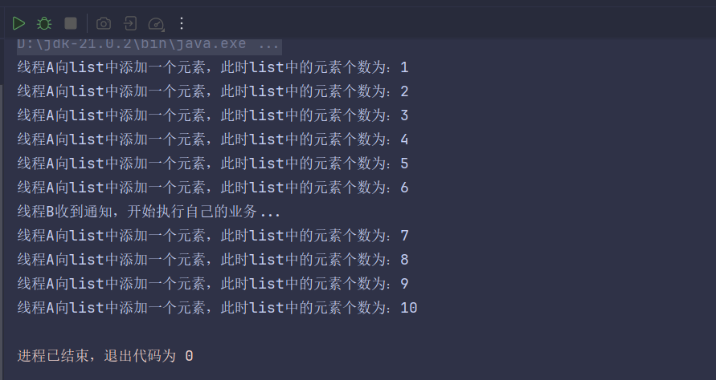
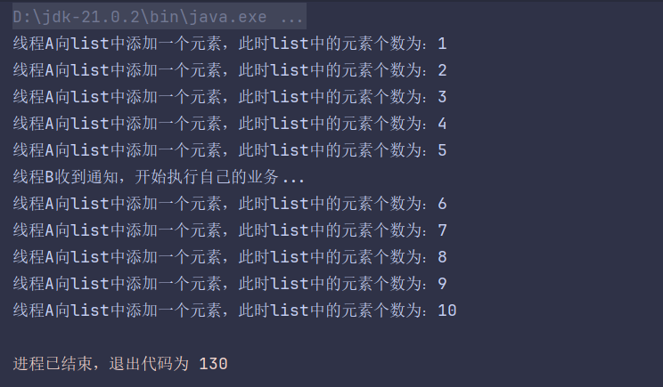
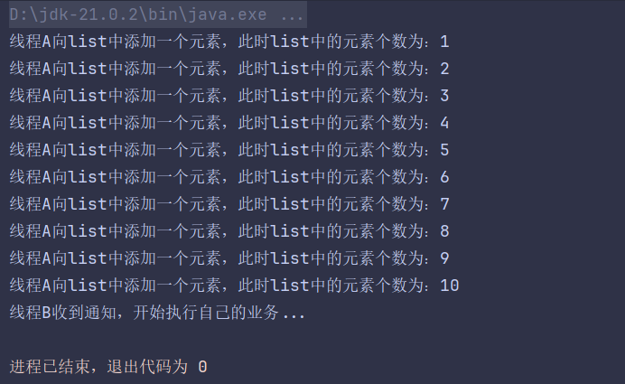
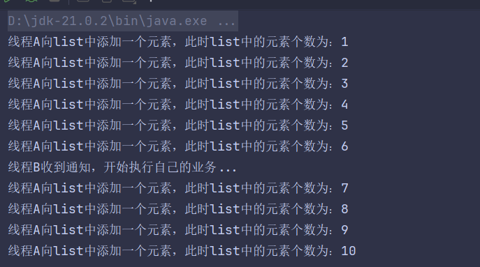
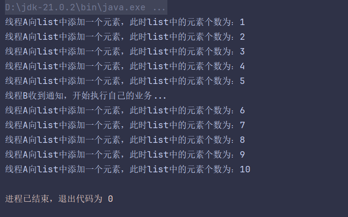

# 线程间通信方式
[原文链接](https://blog.csdn.net/qq_42411214/article/details/107767326)

## volatile

关键字volatile可以用来修饰字段（成员变量），就是告知程序任何对该变量的访问均需要从共享内存中获取，而对它的改变必须同步刷新回共享内存，它能保证所有线程对变量访问的可见性。

使用while进行轮询在这种方式下，线程A不断地改变条件，线程ThreadB不停地通过while语句检测这个条件(list.size==5)是否成立 ，从而实现了线程间的通信。但是这种方式会浪费CPU资源。之所以说它浪费资源，是因为JVM调度器将CPU交给线程B执行时，它没做啥“有用”的工作，只是在不断地测试某个条件是否成立。

```java
public class TestSync {
    // 定义一个共享变量来实现通信，它需要是volatile修饰，否则线程不能及时感知
    static volatile boolean notice = false;

    public static void main(String[] args) {
        List<String>  list = new ArrayList<>();
        // 实现线程A
        Thread threadA = new Thread(() -> {
            for (int i = 1; i <= 10; i++) {
                list.add("abc");
                System.out.println("线程A向list中添加一个元素，此时list中的元素个数为：" + list.size());
                try {
                    Thread.sleep(500);
                } catch (InterruptedException e) {
                    e.printStackTrace();
                }
                if (list.size() == 5)
                    notice = true;
            }
        });
        // 实现线程B
        Thread threadB = new Thread(() -> {
            while (true) {
                if (notice) {
                    System.out.println("线程B收到通知，开始执行自己的业务...");
                    break;
                }
            }
        });
        //　需要先启动线程B
        threadB.start();
        try {
            Thread.sleep(1000);
        } catch (InterruptedException e) {
            e.printStackTrace();
        }
        // 再启动线程A
        threadA.start();
    }
}
```



## 2. synchronized 临界区方式
synchronized和ReentrantLock实现原理上有所不同，但是针对线程之间的通信的思想相同，都是保证多个线程互斥访问临界区（共享存储），来实现线程间的通信。

- synchronized
根据synchronized原理使用Object类提供了线程间通信的方法：wait()、notify()、notifyaAl()方法来实现多个线程互斥访问临界区资源，Object类这几个方法必须配合synchronized来进行使用。

Object 类的方法说明：

1. wait()：让当前线程处于等待状态，并释放当前拥有的锁；
2. notify()：随机唤醒等待该锁的其他线程，重新获取锁，并执行后续的流程，只能唤醒一个线程；
3. notifyAll()：唤醒所有等待该锁的线程（锁只有一把，虽然所有线程被唤醒，但所有线程需要排队执行）。

```java
public class TestSyncBySyn {
    public static void main(String[] args) {
        // 定义一个锁对象
        Object lock = new Object();
        List<String> list = new ArrayList<>();
        // 实现线程A
        Thread threadA = new Thread(() -> {
            synchronized (lock) {
                for (int i = 1; i <= 10; i++) {
                    list.add("abc");
                    System.out.println("线程A向list中添加一个元素，此时list中的元素个数为：" + list.size());
                    try {
                        Thread.sleep(500);
                    } catch (InterruptedException e) {
                        e.printStackTrace();
                    }
                    if (list.size() == 5) {
                        lock.notify();// 唤醒B线程
                        try {
                            lock.wait();
                        } catch (InterruptedException e) {
                            throw new RuntimeException(e);
                        }
                    }
                }
            }
        });
        // 实现线程B
        Thread threadB = new Thread(() -> {
            while (true) {
                synchronized (lock) {
                    if (list.size() != 5) {
                        try {
                            lock.wait();
                        } catch (InterruptedException e) {
                            e.printStackTrace();
                        }
                    }
                    System.out.println("线程B收到通知，开始执行自己的业务...");
                    lock.notify();
                    try {
                        lock.wait();
                    } catch (InterruptedException e) {
                        throw new RuntimeException(e);
                    }
                }
            }
        });
        //　需要先启动线程B
        threadB.start();
        try {
            Thread.sleep(1000);
        } catch (InterruptedException e) {
            e.printStackTrace();
        }
        // 再启动线程A
        threadA.start();
    }
}```



ReentrantLock/Condition 消息队列方式
- ReentrantLock/Condition
ReentrantLock锁的实现原理虽然和synchronized不用，但是它和synchronized一样都是通过保证线程间的互斥访问临界区，来保证线程安全，实现线程间的通信。相比于synchronized使用Object类的三个方法来实现线程的阻塞和运行两个状态的切换，ReentrantLock使用Condition阻塞队列的await()、signal()、signalAll()三个方法来实现线程阻塞和运行两个状态的切换，进而实现线程间的通信。



显然这种方式使用起来并不是很好，代码编写复杂，而且线程B在被A唤醒之后由于没有获取锁还是不能立即执行，也就是说，A在唤醒操作之后，并不释放锁。这种方法跟 Object 的 wait() 和 notify() 一样。

## 3. 使用JUC工具类 CountDownLatch
jdk1.5之后在java.util.concurrent包下提供了很多并发编程相关的工具类，简化了我们的并发编程代码的书写，***CountDownLatch***基于AQS框架，相当于也是维护了一个线程间共享变量state




## 基本LockSupport实现线程间的阻塞和唤醒

LockSupport 是一种非常灵活的实现线程间阻塞和唤醒的工具，使用它不用关注是等待线程先进行还是唤醒线程先运行，但是得知道线程的名字。

```
public class TestSync {
    public static void main(String[] args) {
        List<String> list = new ArrayList<>();
        // 实现线程B
        final Thread threadB = new Thread(() -> {
            if (list.size() != 5) {
                LockSupport.park();
            }
            System.out.println("线程B收到通知，开始执行自己的业务...");
        });
        // 实现线程A
        Thread threadA = new Thread(() -> {
            for (int i = 1; i <= 10; i++) {
                list.add("abc");
                System.out.println("线程A向list中添加一个元素，此时list中的元素个数为：" + list.size());
                try {
                    Thread.sleep(500);
                } catch (InterruptedException e) {
                    e.printStackTrace();
                }
                if (list.size() == 5)
                    LockSupport.unpark(threadB);
            }
        });
        threadA.start();
        threadB.start();
    }
}
```




