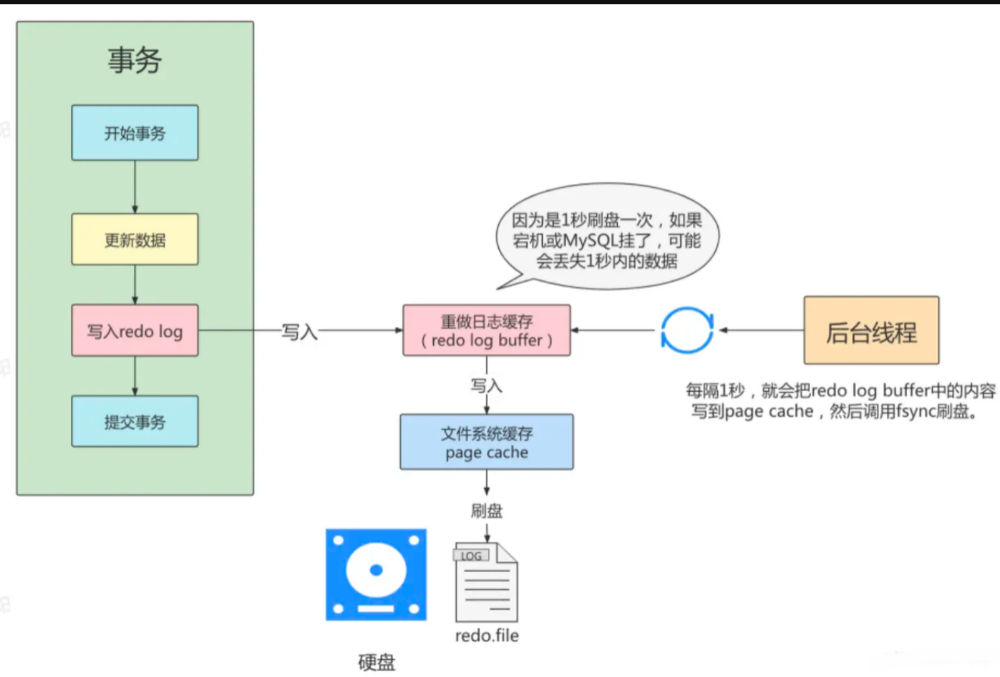
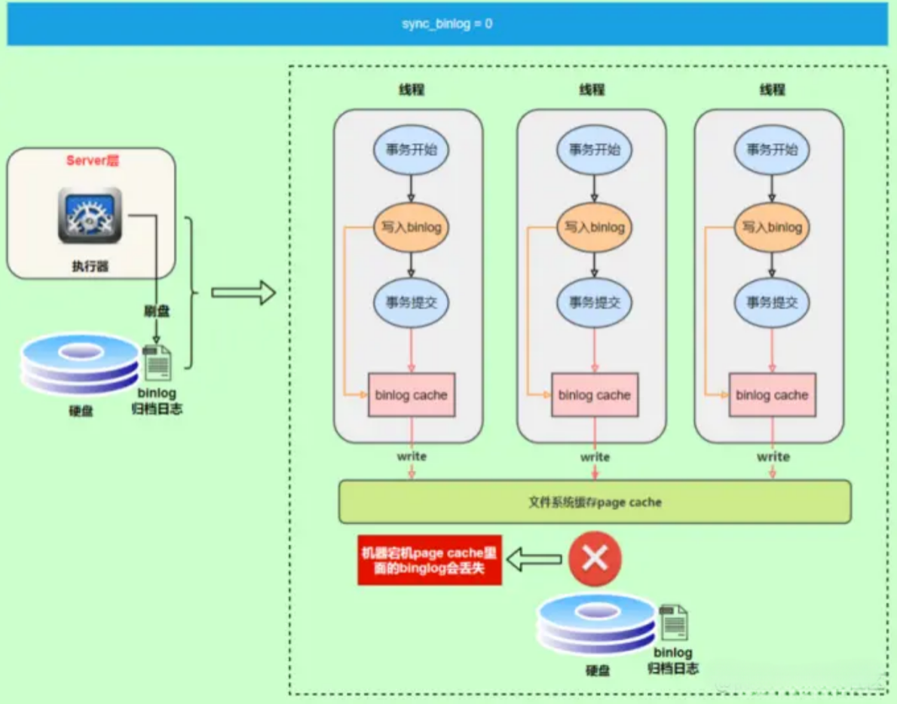

# MySQL日志整理
## Redo Log（重做日志）
- **作用**：Redo Log主要用于保证事务的持久性和数据库的崩溃恢复能力。当数据库发生崩溃时，InnoDB存储引擎可以使用Redo Log来恢复未提交事务的数据，确保数据的一致性。
- **内容**：在事务处理中产生的所有数据页的物理修改，比如数据页的变动。它包括内存中的Redo Log Buffer和磁盘上的Redo Log File。
- **写入时机**：在事务执行过程中，数据的更改首先被写入Redo Log Buffer，然后在事务提交时，这些更改会被写入到Redo Log File中。这个过程保证了MySQL可以在系统意外重启后，按照事务提交前的状态重新构建数据页，进而实现持久性。

redo log又叫“重做日志”,是存储引擎层 (innoDB) 生成的日志，记录的是"物理级别"上的页修改操作，比如页号x，偏移量y写入了'z'数据，主要目的为了保证数据不丢失，当MySQL发生宕机的时候，可以利用redo log日志进行数据恢复。

那想过为什么要"多此一举"先写入到redo log磁盘文件中，然后再落到数据库表中？而不直接落到数据库表中？

主要是因为顺序IO性能远高于随机IO。

数据在MySQL中存储是以页为单位，事务中的数据可能遍布在不同的页中，如果直接写入到对应的页中，是随机IO写入。


### redo log整体流程

事务在写入到数据库中涉及到redo log的整体流程如下图所示：


性能不够，缓存来凑。由于CPU的性能远远大于磁盘，为了消除这个鸿沟，引入了两个缓存，`Buffer Pool`和`redo log buffer`。`Buffer Pool`用来存放各种操作，比如写入数据时，先写到内存中，然后由后台线程再刷写到磁盘。`redo log buffer`用来存放重做日志，后续刷到磁盘中。

1. 先将原始数据从磁盘中读入到`Buffer Pool`中
2. 修改`Buffer Pool`中的数据
3. 生成一条重做日志并写入`redo log buffer`，记录数据修改后的值
4. 当事务提交时，将`redo log buffer`中的内容追加磁盘中的redo log文件中
5. 将磁盘日志文件`redo log file` 内容刷到数据库表中
上面流程中这种先写日志，再写磁盘，只有日志写入成功，才算事务提交成功的技术思想在MySQL也叫做WAL技术 (Write-Ahead Logging)。

### redo log落盘策略
事务的日志是先写入到`redo log buffer` 中是很快的，那如何保证`redo log buffer`中的信息高效的落到磁盘日志文件中呢？
- `redo log buffer`不是直接将日志内容刷盘到redo log file中。
- `redo log buffer`内容先刷入到操作系统的文件系统缓存 （page cache）中去，这个过程很快，而且整个系统宕机概率相对MySQL会小很多。
- 最后，日志内容会从操作系统的文件系统缓存中刷到磁盘的日志文件中，至于什么时候触发这个动作，MySQL的innoDB引擎提供了3种策略可选。
InnoDB引擎提供了 `innodb_flush_log_at_trx_commit` 参数，该参数控制 commit提交事务时，如何将 `redo log buffer` 中的日志刷新到 `redo log file` 的3种策略。
1. `innodb_flush_log_at_trx_commit`=1


每次事务提交时都将进行同步, 执行主动刷盘操作，如上图的红线位置，所以只要事务提交成功，redo log记录就一定在硬盘里，不会有田可数据丢失。
该种方式是MySQL innoDB存储引擎默认的刷盘机制。
如果事务执行期间MySQL挂了或宕机，这部分日志丢了，但是事务并没有提交，所以日志丢了也不会有损
失。可以保证ACID的D，数据绝对不会丢失，但是效率最差的。

2. innodb_flush_log_at_trx_commit=2


- 为2时，只要事务提交成功，redo log buffer中的内容只写入文件系统缓存（pagecache）
- 如果仅仅只是MySQL挂了不会有任何数据丢失，但是操作系统宕机可能会有1秒数据的丢失，这种情况下无法满足ACID中的D
- 数值2的效率是高于数值等于1的

3. innodb_flush_log_at_trx_commit=0



- 为0时，后台线程每隔1秒进行一次重做日志的刷盘操作，因此MySQL挂了最多丢失1秒钟内的事务。
- 这种方式效率是最高的，这种策略也有丢失数据的风险，也无法保证持久性。


4. 其他被动触发刷盘的场景
除了上面3种策略进行刷盘以外，还有两种场景会让一个没有提交的事务的 `redo log` 写入到磁盘中。

- `redo log buffer` 占用的空间即将达到 `innodb_log_buffer_size` 一半的时候，后台线程会主动写盘。注意，由于这个事务并没有提交，所以这个写盘动作只是 write，而没有调用 fsync，也就是只留在了文件系统的 page cache。
- 并行的事务提交的时候，顺带将这个事务的 `redo log buffer` 持久化到磁盘。假设一个事务 A 执行到一半，已经写了一些 redo log 到 buffer 中，这时候有另外一个线程的事务 B 提交，如果 `innodb_flush_log_at_trx_commit` 设置的是 1，那么按照这个参数的逻辑，事务 B 要把 `redo log buffer` 里的日志全部持久化到磁盘。这时候，就会带上事务 A 在 `redo log buffer` 里的日志一起持久化到磁盘。
**小结**：

我们可以根据实际的业务场景，在性能和持久性做一些权衡，但建议使用默认值，虽然操作系统宕机的概率理论小于数据库宕机的概率，但是一般既然使用了事务，那么数据的安全相对来说更重要些。

###  redo log写入数据页机制


目前事务日志已经落入到磁盘的`redo log file`中了，MySQL会去读取这个文件将数据写入到数据页中。

很显然，目前对`redo log file`会进行读和写的操作。在日志文件组中有两个重要的“指针”，分别是 `write pos`、`checkpoint`。

- `write pos`是当前记录的位置，一边写一边后移
- `checkpoint`是当前要擦除的位置，也是往后推移


- 每次刷盘 redo log 记录到日志文件组中，write pos 位置就会后移更新。
- 每次MySQL加载日志文件组恢复数据时，会清空加载过的 redo log 记录，并把checkpoint后移更新。
- 如果write pos 追上 checkpoint ，表示日志文件组满了，这时候不能再写入新的 redo log记录，MySQL 得停下来，清空一些记录，把 checkpoint 推进一下，如下图：


这就是整个`redo log file`中的日志恢复到数据页中的过程。

**总结**
事务日志`redo log`在MySQL innoDB存储引擎工作的机制，它主要是用来保证事务的持久性，避免数据丢失。


## Binlog（二进制日志）
- **作用**：Binlog主要用于数据复制（主从复制）和数据恢复。它记录了所有修改了数据库状态的SQL语句，比如实际执行的SQL语句。使得可以在主从复制环境中同步数据，或者在数据丢失后进行恢复。
- **内容**：Binlog记录了逻辑操作，如SQL语句。它以二进制的形式保存，并且可以是三种格式之一：Statement（记录SQL语句）、Row（记录行级更改）或Mixed（两者结合）。


`bin log`全称`binary log`，二进制日志文件，它记录了数据库所有执行的 DDL 和 DML 等数据库更新的语句，但是不包含select或者show等没有修改任何数据的语句。它是MySQL级别的日志，也就是说所有的存储引擎都会产生`bin log`，而`redo log`或者`undo log`事务日志只有innoDB存储引擎才有。

那`bin log`有什么用呢？

- 数据恢复，如果MySQL数据库意外挂了，可以利用`bin log`进行数据恢复，因为该日志记录所有数据库所有的变更，保证数据的安全性。
- 数据复制，利用一定的机制将主节点MySQL的日志数据传递给从节点，实现数据的一致性，实现架构的高可用和高性能。
所以`bin log`对于数据备份、主从、主主等都都起到了关键作用。


### bin log和redo log区别？


我们现在从多个角度对比下他们俩究竟有什么不一样?
从使用**场景角度**来说：

- `redo log`主要实现故障情况下的数据恢复，保证事务的持久性
- `bin log`主要用于数据灾备、同步

从**数据内容**角度来说：

- `redo log`是"物理日志", 记录的是具体数据页上做了什么修改
- `bin log`是"逻辑日志", 记录内容是语句的原始逻辑，类似于“给 ID=2 这一行的 name 改为alvin”

从**生成范围**角度来说：

- `redo log`是InnoDB存储引擎生成的事务日志，其他存储引擎没有
- `bin log`是MySQL Server生成的日志，所有的存储引擎都有

从**生成时机**角度来说：

- `redo log`是在事务执行过程中就会write
- `bin log`是在事务提交的时候write

### bin log怎么写的？

那bin log是什么时候写的，写入的机制又是怎么样的呢？
bin log写入的整体流程如下图所示：


- 为了保证写的效率，会将事务的bin log先写到binlog cache中，注意，这个cache位于事务线程的内存中，主要是一个事务的bin log不能被拆开，是一个整体
- 在提交事务的时候，将binlog cache中的数据统一写道文件系统缓存page cache中，这个过程速度也很快
- 然后根据不同的策略，将文件系统缓存中的bin logfsync刷到磁盘中，这里的策略后面详细讲解。

### 3种刷盘策略：

`bin log`和 `redo log`类似，都有3种刷盘策略， `bin log`的write和fsync时机是由参数 sync_binlog 控制，默认是 0 。

1. sync_binlog = 0




为0的时候，表示每次提交事务都只 write，由系统自行判断什么时候执行fsync。虽然性能得到提升，但是机器宕机，page cache里面的 binglog 会丢失。

2. sync_binlog = 1


表示每次提交事务都会执行fsync,更加安全
3. sync_binlog = N


可以设置为N(N>1)，表示每次提交事务都write，但累积N个事务后才fsync
我们已经知道，事务执行时会同时记录redo log和bin log两种日志，那会有日志出错不一致问题吗？


- `redo log`在事务执行过程中可以不断写入
- `bin log`只有在提交事务时才写入
假如事务执行sql`update T set c = 1 where id = 2`,在写完`redo log`日志后，`bin log`日志写期间发生了异常，会出现什么情况呢？


由于`bin log`没写完就异常，这时候`bin log`里面没有对应的修改记录。因此，之后用`bin log`日志恢复数据时，就会少这一次更新，恢复出来的这一行c值为0，而原库因为`redo log`日志恢复，这一行c的值是1，最终数据不一致。

**那有什么解决方案吗？二阶段提交方案。**

为了解决两份日志之间的一致性问题，InnoDB存储引擎使用两阶段提交方案。将`redo log`的写入拆成了两个步骤prepare和commit。


假如现在写入bin log时MySQL发生异常，这时候的redo log还处于prepare阶段，重启MySQL后，根据redo log记录中的事务ID，发现没有对应的bin log日志，回滚前面已写入的数据。
如果redo log 在commit阶段发生移除，但是能通过事务id找到对应的bin log日志，所以MySQL认为是完整的，就会提交事务恢复数据。
### bin log写到哪了？
前面讲解了bin log写入的过程，那么它写到了哪里去了呢？

1. 查看bin log位置
可以通过命令`show variables like '%log_bin%';`查看`bin log`最终输出的位置。


- `log_bin_basename`: 是bin log日志的基本文件名，后面会追加标识来表示每一个文件
- `log_bin_index`: 是binlog文件的索引文件，这个文件管理了所有的binlog文件的目录
通过 `SHOW BINARY LOGS`;查看当前的二进制日志文件列表及大小，如下图：


2. 修改 bin log位置

修改MySQL的my.cfg或my.ini配置
```text
#启用二进制日志
log-bin=cxw-bin
binlog_expire_logs_seconds=600
max_binlog_size=100M
```

- `log-bin`: `bin log`日志保存的位置
- `binlog_expire_logs_seconds`: `bin log`日志保存的时间，单位是秒
- `max_binlog_size`： 单个`bin log`日志的容量

### bin log内容长啥样？
我们已经知道了`bin log`的位置了，那它里面的内容长什么样呢？
我们可以用`show binlog events`命令工具查看`bin log`日志中的内容。
```SQL
show binlog events [IN 'log_name'] [FROM pos] [LIMIT [offset,] row_count];
```
- IN 'log_name' ：指定要查询的binlog文件名（不指定就是第一个binlog文件）
- FROM pos ：指定从哪个pos起始点开始查起（不指定就是从整个文件首个pos点开始算）
- LIMIT [offset] ：偏移量(不指定就是0)
- row_count :查询总条数（不指定就是所有行）


#### bin log 格式

实际上bin log输出的格式类型有3种，默认是ROW类型，就是上面例子中的格式。


1. Statement格式：每一条会修改数据的sql都会记录在bin log中
**优点**：不需要记录每一行的变化，减少了bin log日志量，节约了IO，提高性能。
**缺点**：比如sql中存在函数如now()等，依赖环境的函数，会导致主从同步、恢复数据不一致
2. ROW格式：为了解决Statement缺点，记录具体哪一个分区中的、哪一个页中的、哪一行数据被修改了
**优点：**清楚的记录下每一行数据修改的细节，不会出现某些特定情况下 的存储过程，或function无法被正确复制的问题。
**缺点：**比如对ID<600的所有数据进行了修改操作,那么意味着很多数据发生变化，最终导致同步的log很多，那么磁盘IO、网络带宽开销会很高。
3. Mixed格式: 混合模式，即Statment、Row的结合版
对于可以复制的SQL采用Statment模式记录，对于无法复制的SQL采用Row记录。
**总结**
`bin log`是MySQL中的一个非常重要的日志，它主要用来做数据恢复和同步的

## Undolog（回滚日志）
- **写入时机**：在事务提交时，Binlog会记录本次修改的数据。Binlog的写入通常在Redo Log之后，以确保数据的一致性。
- **作用**：`Undo Log`主要用于实现事务的原子性和隔离性。它记录了事务所做的更改，以便在事务失败或需要回滚时，可以恢复到事务开始之前的状态。
- **内容**：`Undo Log`记录了数据被修改前的样子，以及事务的回滚信息。它允许数据库在读取旧版本的数据时，能够提供一致的视图。
- **写入时机**：在数据被修改时，`Undo Log`会同时记录原始数据。在事务回滚或需要通过MVCC读取旧数据版本时，`Undo Log`会被使用。

众所周知，事务的一大特点是原子性，即同一事务的SQL要同时成功或者失败。那大家有没有想过在MySQL的innoDB存储引擎中是如何保证这样的原子性操作的？实际上它是利用事务执行过程中生成的日志`undo log`来实现的

### undo log介绍
如果事务中的SQL执行到一半,遇到报错，需要把前面已经执行过的SQL撤销以达到原子性的目的，这个过程也叫做"回滚"，该怎么实现呢？

每当我们要对一条记录做改动时（这里的改动可以指INSERT、DELETE、UPDATE),把回滚时所需的东西记下来。比如：

- 你插入一条记录时，至少要把这条记录的主键值记下来，之后回滚的时候只需要把这个主键值对应的记录删
掉就好了

- 你删除了一条记录，至少要把这条记录中的内容都记下来，这样之后回滚时再把由这些内容组成的记录插入
到表中就好了

- 你修改了一条记录，至少要把修改这条记录前的旧值都记录下来，这样之后回滚时再把这条记录更新为旧值
MySQL把这些为了回滚而记录的这些内容称之为撤销日志或者回滚日志, 即`undo log` 。


### undo log存储形式
`undo log`的日志内容是逻辑日志，非物理日志。

物理日志的意思是指具体的把具体某个数据页上的某个偏移量的指改为什么，是具体到物理结构上了，比如`redo log`就是物理日志。
而逻辑日志只是记录了某条数据的信息是怎么样的，没有到具体的物理磁盘上
InnoDB对`undo log`的管理采用段的方式，也就是回滚段（`rollback segment`） 。每个回滚段记录了 1024 个 `undo log segment` ，每个事务只会使用一个回滚段，当一个事务开始的时候，会制定一个回滚段，在事务进行的过程中，当数据被修改时，原始的数据会被复制到回滚段。

在MySQL5.5的时候，只有一个回滚段，那么最大同时支持的事务数量为1024个。在MySQL 5.6开始，InnoDB支持最大 128个回滚段，故其支持同时在线的事务限制提高到了 128*1024 。

1. `insert undo log`格式
记录的是insert 语句对应的`undo log`，它生成的`undo log`记录格式如下图：


2. `update undo log`格式
记录的是update、delete 语句对应的`undo log`，它生成的`undo log`记录格式如下图：


### 那么上面这些生成undo log日志文件最终是存储在哪的呢？

这些回滚段是存储于共享表空间ibdata中。从MySQL5.6版本开始，可通过参数对`rollback segment`做进一步的设置。这些参数包括：

- `innodb_undo_directory`: 设置`rollback segment`文件所在的路径。这意味着`rollback segment`可以存放在共享表空间以外的位置，即可以设置为独立表空间。该参数的默认值为“/”，表示当前noDB存储引擎的目录。
- `innodb_undo_logs`: 设置`rollback segment`的个数，默认值为128。
- `innodb_undo_tablespaces`: 设置构成`rollback segment`文件的数量，这样`rollback segment`可以较为平均地分布在多个文件中。设置该参数后，会在路径`innodb_undo_directory`看到undo为前缀的文件，该文件就代表`rollback segment`文件。
### 事务回滚机制
对于InnoDB引擎来说，每个行记录除了记录本身的数据之外，还有几个隐藏的列：

- DB_ROW_ID：如果没有为表显式的定义主键，并且表中也没有定义唯一索引，那么InnoDB会自动为表添加一个row_id的隐藏列作为主键。
- DB_TRX_ID：每个事务都会分配一个事务ID,当对某条记录发生变更时，就会将这个事务的事务ID写入tx_id
中。
- DB_ROLL_PTR: 回滚指针，本质上就是指向`undo log`的指针。
1. insert数据：
```SQL
insert into user (name, sex) values('旭阳', '女')
```

插入的数据都会生成一条`insert undo log`，并且数据的回滚指针会指向它。`undo log`会记录`undo log`的序号、插入主键的列和值...，那么在进行rollback的时候，通过主键直接把对应的数据删除即可。


2. update数据
```sql
update user set sex = '男' where id = 1;

update user set name = 'alvin' where id = 1;
```

这时会把老的记录写入新的`undo log`，让回滚指针指向新的`undo log`，它的`undo no`是1，并且新的`undo log`会指向老的`undo log`（`undo no`=0），最终形成`undo log`版本链，如下图所示：


可以发现每次对数据的变更都会产生一个`undo log`，当一条记录被变更多次时，那么就会产生多条`undo log`，`undo log`记录的是变更前的日志，并且每个`undo log`的序号是递增的，那么当要回滚的时候，按照序号依次向前推，就可以找到我们的原始数据了。

那么按照上面的例子，事务要进行回滚，最终得到下面的执行流程：

- 通过undo no=2的日志把id=1的数据的name还原成“旭阳"

- 通过undo no=1的日志把id=1的数据的sex还原成"女"

- 通过undo no=0的日志把id=1的数据根据主键信息删除

### undo log生命周期
#### 生成过程


MySQL处于性能考虑，数据会优先从磁盘加载到`Buffer Pool`中，在更新`Buffer Pool`中数据之前，会优先将数据记录到`undo log`中。
记录`undo log`日志，MySQL不会直接去往磁盘中的xx.ibdata文件写数据，而是会写在`undo_log_buffer`缓冲区中，因为工作线程直接去写磁盘太影响效率了，写进缓冲区后会由后台线程去刷写磁盘。
#### 删除过程
现在我们已经明白了`undo log`日志是如何生成，并且作用于事务回滚的，那这些数据是什么时候删除呢？

- 针对于`insert undo log`，因为insert操作的记录，只对事务本身可见，对其他事务不可见。故该`undo log`在事务提交后就没有用，就会直接删除。

- 针对于`update undo log`，该`undo log`需要支持MVCC机制，因此不能在事务提交时就进行删除。提交时放入`undo log`链表，有专门的purge线程进行删除。

**总结**

`undo log`保证事务的原子性。实际上，`undo log`也还有一个很重要的作用就是还对事务的隔离性实现起到作用


## 日志之间的关系
`Redo Log`和`Undo Log`是InnoDB存储引擎紧密关联的组成部分，其中Redo负责记录事务的前景操作，Undo负责记录事务的后景操作。而Binlog记录了执行修改的SQL语句，这三者协同工作保障了事务的ACID特性。Redo和Undo日志通常存在于存储引擎层面，而Binlog则是MySQL数据库级别的记录。

- `Redo Log`是InnoDB特有的，专门记录物理更改，用于保证数据的持久性和崩溃恢复。
- `Binlog`是MySQL服务器层面的，记录逻辑更改，用于主从复制和数据恢复，记录逻辑操作。
- `Undo Log`也是InnoDB特有的，记录数据改变前的状态，用于事务的回滚和多版本并发控制（MVCC）。
## 日志写入流程
以一次事务执行为例，使用流程图画一下日志写入流程：


在这个流程图中，我们描述了以下步骤：

1. 用户通过执行`START TRANSACTION`、`BEGIN`或者`DML`语句发起一个事务。
2. 事务执行数据修改，同时记录到`Undo Log`（记录修改前的状态）和`Redo Log Buffer`（记录修改的内容）。
3. 事务数据预写入内存中的`Redo Log Buffer`，为提交做好准备，但这是临时的。
4. 事务完成所有操作。
5. 事务提交时，`Redo Log Buffer`中的内容被写入到磁盘上的`Redo Log File`，确保数据的持久性。
6. 同时，事务的更改被记录到`Binlog Buffer`，为复制和数据恢复做准备。
7. 执行COMMIT命令，请求提交事务。
8. 在提交时，事务确保`Redo Log Buffer`和`Binlog Buffer`中的更改都已同步到各自的磁盘文件。
9. 事务将修改最终应用到磁盘文件，完成数据的持久化。
10. 返回事务提交成功的确认给用户。

## 其他问题
### 1. 会不会出现数据库磁盘中的文件已经被修改，但是没有记录到binlog日志中的情况？
通常情况下，这种情况是不会发生的。因为数据库在执行写操作的时候，会先将操作记录在Binlog中，然后再修改磁盘中的对应数据库文件。这就是所谓的write-ahead logging（WAL，预写式日志），即修改磁盘中的文件之前，必须先将相关的操作信息写入日志。
数据库维护了一个缓冲区，当有数据需要写入磁盘时，首先将这些数据写入缓冲区，然后再由缓冲区将这些数据批量写入磁盘，这样可以提高数据写入磁盘的效率。
而缓冲区在将数据写入磁盘之前，必须先将相关的操作信息写入日志。也就是说，任何修改磁盘中文件的操作，必须先写入日志。只有在日志成功写入后，缓冲区的数据才能写入硬盘。这种机制保证了在数据库系统崩溃的情况下，可以通过重放日志来恢复数据，确保数据的最终一致性和原子性。
至于你提到的这种情况，可能是由于些别的情况，比如操作系统崩溃，数据库软件的bug等等，导致数据已经写入了磁盘但是日志还没有来得及写入。但是这种情况在正常操作下是非常少见的，一般只会在极端的情况下才会发生。
### 2. 事务提交前直接把数据写入磁盘就能保证持久性，为什么还要用redo log呢？
1. 性能问题，直接写入磁盘（随机写）的性能通常比顺序写入要差。直接写入磁盘是随机写入。而`Redo Log`通常是顺序写入的，这可以提高写入效率。
2. 原子性，如果在将数据写入磁盘的过程中发生系统崩溃（如电源故障、硬件故障等），那么可能只有部分数据被写入，导致数据不一致。`Redo Log`通过记录事务所做的修改，`可以在故障后重做这些操作，确保事务的原子性`。
3. `并发问题，在高并发环境下`，如果每个事务都直接写入磁盘，那么在多个事务同时修改同一条记录时，可能会出现冲突。`Redo Log`通过记录事务所做的修改，可以在`事务提交时快速完成，而不需要对数据行进行长时间的锁定`。

