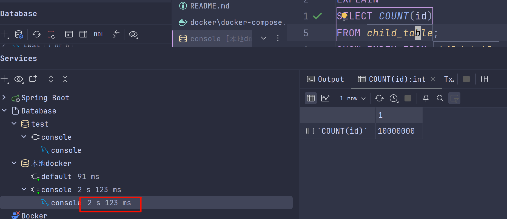
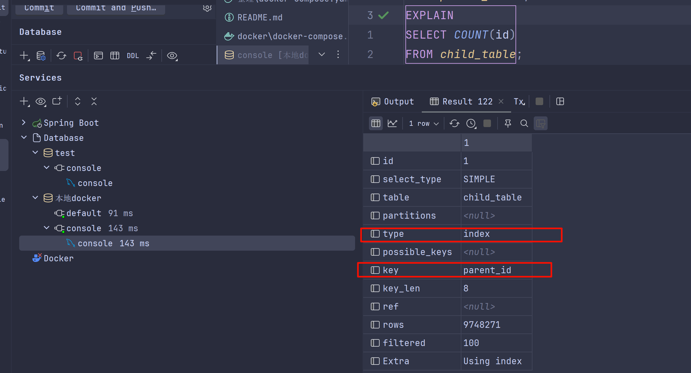
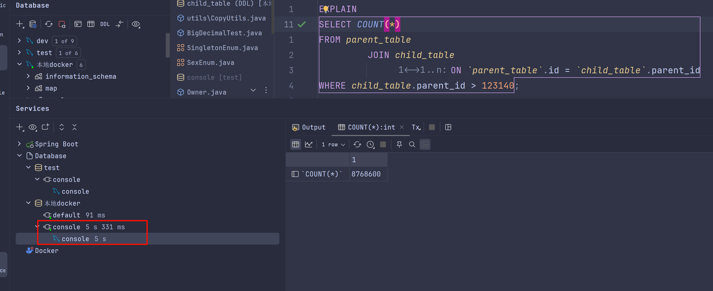
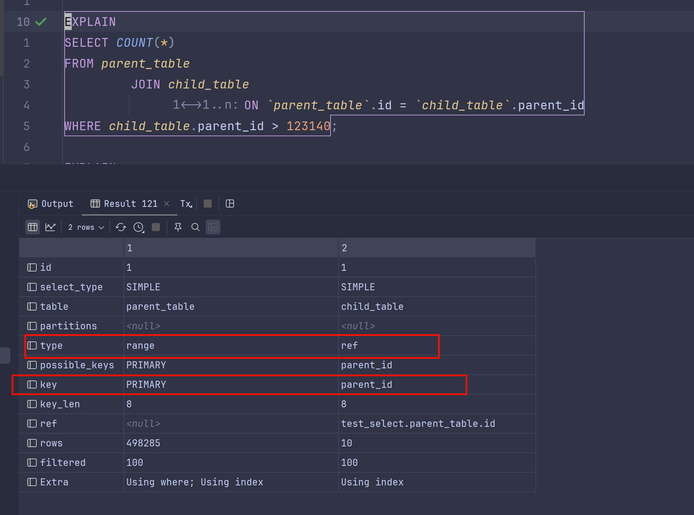
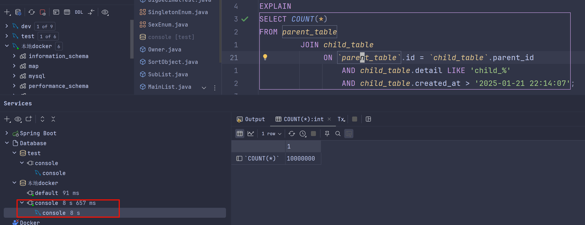
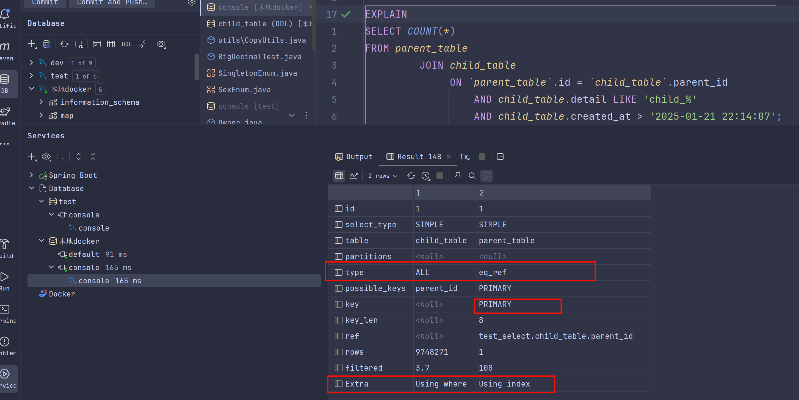

# MySQL测试大量数据的COUNT

## 创建表SQL
<details>
<summary>create_table.sql</summary>

```sql:no-line-numbers
-- 创建主表
CREATE TABLE parent_table (
    id BIGINT AUTO_INCREMENT PRIMARY KEY,
    name VARCHAR(255) NOT NULL,
    created_at DATETIME DEFAULT CURRENT_TIMESTAMP
);

-- 创建子表
CREATE TABLE child_table (
id BIGINT AUTO_INCREMENT PRIMARY KEY,
parent_id BIGINT NOT NULL,
detail VARCHAR(255),
created_at DATETIME DEFAULT CURRENT_TIMESTAMP,
FOREIGN KEY (parent_id) REFERENCES parent_table(id) ON DELETE CASCADE
);
```
</details>

## 插入数据SQL
<details>
<summary>gene_data.sql</summary>

```sql:no-line-numbers
-- 插入生成的数字到 parent_table
INSERT INTO parent_table (name)
SELECT CONCAT('parent_', i)
FROM (SELECT CONCAT('parent_', @rownum := @rownum + 1) AS i
      FROM information_schema.tables t1,
           information_schema.tables t2,
           information_schema.tables t3,
           (SELECT @rownum := 0) r
      LIMIT 1000000) temp;

-- 插入生成的数字到 child_table
INSERT INTO child_table (parent_id, detail)
SELECT p.id, CONCAT('child_', @rownum := @rownum + 1)
FROM parent_table p
         JOIN (SELECT @rownum := 0) r
         JOIN (SELECT 1 AS num
               UNION ALL
               SELECT 2
               UNION ALL
               SELECT 3
               UNION ALL
               SELECT 4
               UNION ALL
               SELECT 5
               UNION ALL
               SELECT 6
               UNION ALL
               SELECT 7
               UNION ALL
               SELECT 8
               UNION ALL
               SELECT 9
               UNION ALL
               SELECT 10) n ON 1 = 1
LIMIT 10000000; -- 插入 1000 万条记录

```
</details>

## 查询结果
```sql:no-line-numbers
SELECT COUNT(id)
FROM child_table;
```
直接COUNT(ID) 耗时 2s+

EXPLAIN 结果是走了索引(没走主键索引不知道为什么)

```sql:no-line-numbers
SELECT COUNT(*)
FROM parent_table
         JOIN child_table
              ON `parent_table`.id = `child_table`.parent_id
WHERE child_table.parent_id > 123140;
```
通过子表的主键进行COUNT耗时5S+

EXPLAIN结果

测试子表查询不走索引SQL耗时8S+
```sql:no-line-numbers
SELECT COUNT(*)
FROM parent_table
         JOIN child_table
              ON `parent_table`.id = `child_table`.parent_id
                  AND child_table.detail = 'child_123123'
                  AND child_table.created_at > '2025-01-21 22:14:07';
```

EXPLAIN结果

