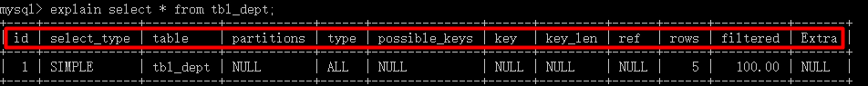
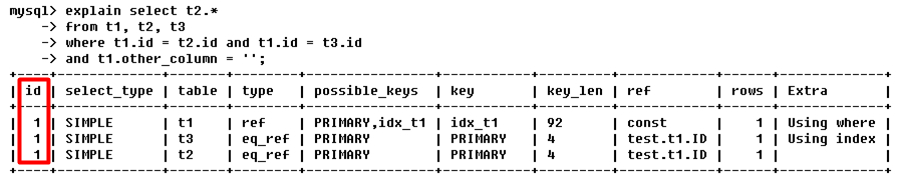
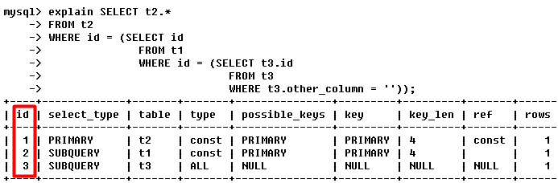
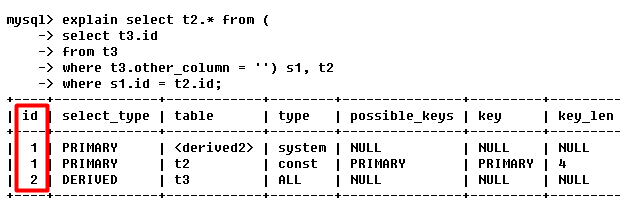
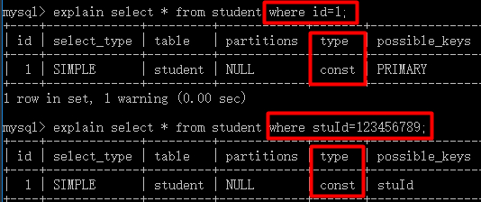
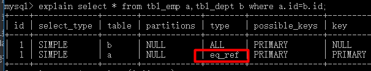
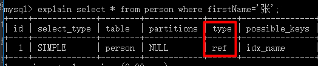
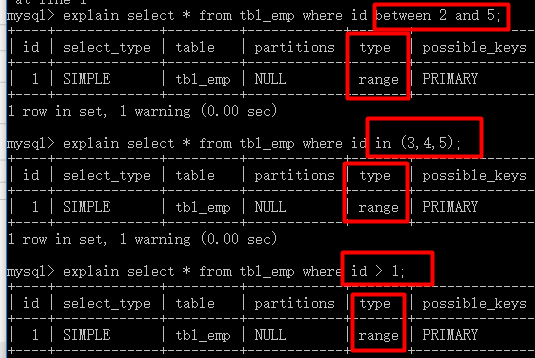
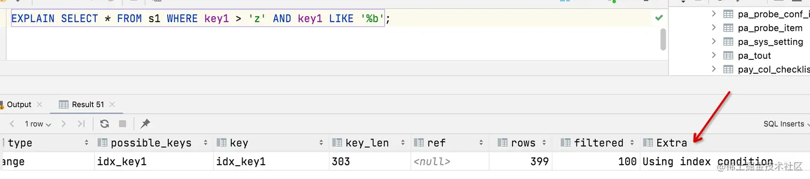

# SQL执行计划——Explain

使用**EXPLAIN**关键字可以模拟优化器执行SQL查询语句，从而知道MySQL是如何处理你的SQL语句的。分析你的查询语句或是表结构的性能瓶颈。

通过**EXPLAIN**分析某条SQL语句执行时的如下特征：

- 表的读取顺序（涉及到多张表时）
- 数据读取操作的操作类型
- 哪些索引可以使用
- 哪些索引被实际使用
- 表之间的引用
- 每张表有多少行被优化器查询

格式为：**explain \<SQL语句\>**：


| 字段          | 含义                                                                                   |
| ------------- | -------------------------------------------------------------------------------------- |
| id            | select查询的序列号，包含一组数字，表示查询中执行select子句或操作表的顺序               |
| select_type   | 查询类型 或者是 其他操作类型                                                           |
| table         | 正在访问哪个表                                                                         |
| partitions    | 匹配的分区信息                                                                         |
| type          | 访问方式                                                                               |
| possible_keys | 显示可能应用在这张表中的索引，一个或多个，但不一定实际使用到                           |
| key           | 实际使用到的索引，如果为NULL，则没有使用索引                                           |
| key_len       | 表示索引中使用的字节数，可通过该列计算查询中使用的索引的长度                           |
| ref           | 显示索引的哪一列被使用了，如果可能的话，是一个常数，哪些列或常量被用于查找索引列上的值 |
| rows          | 根据表统计信息及索引选用情况，大致估算出找到所需的记录所需读取的行数                   |
| filtered      | 表示符合查询条件的数据百分比                                                           |
| Extra         | 附加信息                                                                               |

## id :star:(select唯一标识)

select查询的序列号，包含一组数字，表示查询中执行select子句或操作表的顺序。
根据id是否相同可以分为下列三种情况：

- 所有表项的id相同，如：
  
  则上表中的3个表项按照从上到下的顺序执行，如读表顺序为**t1,t3,t2**。
  由第一节提到的SQL解析顺序也可验证，首先**from t1,t2,t3**表明此次查询设计到的表，
  由于没有**join**，接着解析**where**时开始读表，值得注意的是并不是按照**where**书写的顺序，
  而是逆序，即先解析**t1.other_column=''**于是读表**t1**，然后**t1.id=t3.id**读表**t3**，
  最后**t1.id=t2.id**读表**t2**。解析顺序如下：

```sql:no-line-numbers
from
	t1,t2,t3
where
	t1.other_column='', t1.id=t3.id, t1.id=t2.id
select
	t2.*
```

- 所有表项的id不同，嵌套查询，id的序号会递增，id值越大优先级越高，越先被执行。类似子查询，有执行依赖关系的,
  id的序号会递增，id值越大优先级越高，越先被执行如：
  
  对于多层嵌套的查询，执行顺序由内而外。解析顺序：

```sql:no-line-numbers
from
	t2
where
	t2.id=
	from
		t1
	where
		t1.id=
		from
			t3
		where
			t3.other_column=''
		select
		 	t3.id
	select
		t1.id
select
	t2.*
```

由第**12,8,4**行可知查表顺序为**t3,t1,t2**。

- 有的表项id相同，有的则不同。id相同的表项遵循结论1，不同的则遵循结论2
  
  解析顺序：

```sql:no-line-numbers
from
    (
    from
		t3
	where
		t3.other_column=''
	select
		t3.id
     ) s1, t2	#s1是衍生表
where
	s1.id=t2.id
select
	t2.*
```

## select_type(select类型)

该列常出现的值如下：

| 查询类型             | 作用                                                                                                                                                            |
| -------------------- | --------------------------------------------------------------------------------------------------------------------------------------------------------------- |
| SIMPLE               | 简单查询（未使用UNION或子查询）                                                                                                                                 |
| UNION                | 在UNION中的第二个和随后的SELECT被标记为UNION。如果UNION被FROM子句中的子查询包含，那么它的第一个SELECT会被标记为DERIVED。 **union**右侧的**select**              |
| UNION RESULT         | UNION的结果                                                                                                                                                     |
| PRIMARY              | 查询中若包含任何复杂的子部分，最外层查询被标记为**PRIMARY**。                                                                                                   |
| DEPENDENT UNION      | UNION中的第二个或后面的查询，依赖了外面的查询                                                                                                                   |
| SUBQUERY             | 子查询中的第一个 SELECT,在**select**或**where**列表中包含的子查询                                                                                               |
| DEPENDENT SUBQUERY   | 子查询中的第一个 SELECT，依赖了外面的查询                                                                                                                       |
| DERIVED              | 用来表示包含在FROM子句的子查询中的SELECT，MySQL会递归执行并将结果放到一个临时表中。MySQL内部将其称为是Derived table（派生表），因为该临时表是从子查询派生出来的 |
| DEPENDENT DERIVED    | 派生表，依赖了其他的表                                                                                                                                          |
| MATERIALIZED         | 物化子查询                                                                                                                                                      |
| UNCACHEABLE SUBQUERY | 子查询，结果无法缓存，必须针对外部查询的每一行重新评估                                                                                                          |
| UNCACHEABLE UNION    | UNION属于UNCACHEABLE SUBQUERY的第二个或后面的查询                                                                                                               |

## table(表名称)

表名，表示该表项是关于哪张表的，也可以是如形式：

- **\<derived,N\>**，表示该表是表项**id**为**N**的衍生表
- **\<unionM,N\>**，表示该表是表项**id**为**M**和**N**两者**union**之后的结果

## partition(匹配的分区)

如果启用了表分区策略，则该字段显示可能匹配查询的记录所在的分区

## type :star2:(连接类型)

type显示的是访问类型，是较为重要的一个指标，结果值从最好到最坏依次是：
system > const > eq_ref > ref > fulltext >
ref_or_null > index_merge > unique_subquery >
index_subquery > range > index > ALL 。

| type值           | 含义                                                                                                            | 例子                                                                                                              |
|-----------------|---------------------------------------------------------------------------------------------------------------|-----------------------------------------------------------------------------------------------------------------|
| NULL            | 不访问任何表或者索引                                                                                                    | **explain select 1**                                                                                            |
| system          | 表只有一行记录，是const类型的特例                                                                                           |                                                                                                                 |
| const           | 针对主键或唯一索引的等值查询扫描, 最多只返回一行数据                                                                                   | **explain select * from s1 where id = 10002;**                                                                  |
| eq_ref          | 用于联表查询，索引必须是主键或者唯一索引                                                                                          | **explain select * from s1 left join s2 on s1.id = s2.id;**                                                     |
| ref             | 使用普通索引进行单表或者联表查找,支持最左前缀原则                                                                                     | **explain select * from s1 where key1 = 'cxw';**                                                                |
| fulltext        | 全文索引                                                                                                          |                                                                                                                 |                                                            |
| ref_or_null     | 类似于ref,但是相比于ref额外多了去查NULL的数据                                                                                  | **explain select * from s1 where key1 = 'cxw' or key1 is null;**                                                |                                                            |
| index_merge     | 索引合并优化，表示一个查询里面用到了多个索引                                                                                        | **explain select * from s1 where key1 = 'cxw' or key3 = 'cxw2';**                                               |                                                             |                                                            |
| unique_subquery | 和eq_ref类似，但是使用了IN子查询，且子查询用的主键或者唯一索引                                                                           | **EXPLAIN SELECT * FROM s1 WHERE key2 IN (SELECT id FROM s2 where s1.key1 = s2.key1) OR key3 = 'a'**            |                                                             |                                                            |
| index_subquery  | 和unique_subquery类似，唯一区别是子查询是用的是普通二级索引                                                                         | **EXPLAIN SELECT * FROM s1 WHERE common_field IN (SELECT key3 FROM s2 where s1.key1 = s2.key1) OR key3 = 'a';** |                                                             |                                                            |
| range           | 范围扫描，表示检索了指定范围的行，主要用于有限制的索引扫描。比较常见的范围扫描是带有BETWEEN子句或WHERE子句里有**>、>=、<、<=、IS NULL、<=>、BETWEEN、LIKE、IN()**等操作符。 | **EXPLAIN SELECT * FROM s1 WHERE key1 IN ('a', 'b', 'c');**                                                     |                                                             |                                                            |
| index           | 遍历索引树，常见的就是“覆盖索引的场景                                                                                           | **EXPLAIN SELECT key_part2 FROM s1 WHERE key_part3 = 'a';**                                                     |                                                    |                                                             |                                                            |
| ALL             | 全表扫描， 性能最糟糕                                                                                                   | **EXPLAIN SELECT * FROM s1;**                                                                                   |                                                    |                                                             |                                                            |

> 按照表格顺序，从上向下，性能从好到坏排序
> 根据阿里巴巴开发手册要求，SQL性能优化的目标：至少要达到 range 级别，要求是 ref 级别，最好是 const级别。

- **system**，**表只有一行记录**（等于系统表），这是const类型的特列，平时不会出现，这个也可以忽略不计
- **const**，表示通过索引一次就找到了，**const**用于比较**primary key**或者**unique key**。
- 因为只匹配一行数据，所以很快。若将主键置于where列表中，MySQL就能将该查询转换为一个常量

```sql:no-line-numbers
mysql> select * from student;
+----+-----------+------+
| id | stuId     | name |
+----+-----------+------+
|  1 | 123456789 | jack |
|  3 |      NULL | tom  |
+----+-----------+------+
```



- **eq_ref**，**唯一性索引扫描**，对于每个索引键，表中只有一条记录与之匹配。
  **常见于主键或唯一索引扫描**
  
  对于b中的每一条数据，从a的主键索引中查找id和其相等的
- **ref**,**非唯一性索引扫描，返回匹配某个单独值的所有行**。本质上也是一种索引访问，
  它返回所有匹配某个单独值的行，然而，它可能会找到多个
  符合条件的行，所以他应该属于查找和扫描的混合体。（ **查找是基于有序性的能利用二分，而扫描则是线性的**）

```sql:no-line-numbers
mysql> create table `person` (
    ->  `id` int(32) not null auto_increment,
    ->  `firstName` varchar(30) default null,
    ->  `lastName` varchar(30) default null,
    ->  primary key(`id`),
    ->  index idx_name (firstName,lastName)
    -> ) engine=innodb auto_increment=1 default charset=utf8;
```

查询姓张的人：


- **range**，根据索引的有序性检索特定范围内的行，通常出现在**between、<、>、in**等范围检索中
  
- **index**，在索引中扫描，只需读取索引数据。
  由于复合索引idx_name是基于（firstName，lastName）的，这种索引只能保证在整体上是按定义时的第一列（即firstName）有序的，当firstName相同时，再按lastName排序，如果不只两列则以此类推。也就是说在根据lastName查找时是无法利用二分的，只能做全索引扫描。
- **all**，全表扫描，需要从磁盘上读取表数据

> 备注：一般来说，得保证查询至少达到**range**级别，最好能达到**ref**。

## possible_keys(可能的索引选择)

MySQL可以利用以快速检索行的索引。

## key :star:(实际用到的索引)

MySQL执行时实际使用的索引。

## key_len(实际索引长度)

- 表示索引中每个元素最大字节数，可通过该列计算查询中使用的索引的长度（如何计算稍后详细结束）。

> 在不损失精确性的情况下，长度越短越好。

- key_len显示的值为索引字段的最大可能长度，并非实际使用长度，即key_len是根据表定义计算而得，不是通过表内检索出的。

## ref(实际索引长度)

显示哪一列或常量被拿来与索引列进行比较以从表中检索行。

## rows :star:(预计要检查的行数)

根据表统计信息及索引选用情况，大致估算出找到所需的记录所需要读取的行数,值越小越好。

## Extra :star2:(附加信息)

- **Using index**：表示相应的**select**操作中使用了**覆盖索引**(Covering Index)，避免访问了表的数据行（需要读磁盘），效率不错！

```sql:no-line-numbers
mysql> explain select * from person order by firstName,lastName\G
*************************** 1. row ***************************
           id: 1
  select_type: SIMPLE
        table: person
   partitions: NULL
         type: index
possible_keys: NULL
          key: idx_name
      key_len: 186
          ref: NULL
         rows: 1
     filtered: 100.00
        Extra: Using index
```

> 使用\G代替;结尾可以使执行计划垂直显示。

- **Using temporary**：使用了临时表保存中间结果。**MySQL在对查询结果聚合时使用临时表**。常见于排序 **order by** 和分组查询
  **group by**。
- **Using filesort**：MySQL中无法利用索引完成的排序操作，只能在内存或者磁盘中进行排序，叫做Using filesort，使用了文件排序。
  **MySQL在对查询结果排序时使用文件排序**。

```sql:no-line-numbers
mysql> insert into person(firstName,lastName) values('张','三');

mysql> insert into person(firstName,lastName) values('李','三');

mysql> insert into person(firstName,lastName) values('王','三');

mysql> insert into person(firstName,lastName) values('李','明');

mysql> select lastName,count(lastName) from person group by lastName;
+----------+-----------------+
| lastName | count(lastName) |
+----------+-----------------+
| 三       |               3 |
| 明       |               1 |
+----------+-----------------+

mysql> explain select lastName,count(lastName) from person group by lastName\G
*************************** 1. row ***************************
           id: 1
  select_type: SIMPLE
        table: person
   partitions: NULL
         type: index
possible_keys: idx_name
          key: idx_name
      key_len: 186
          ref: NULL
         rows: 4
     filtered: 100.00
        Extra: Using index; Using temporary; Using filesort
```

> 使用filesort的方式进行排序的记录非常多，那么这个过程是很耗费性能的，我们最好想办法将使用文件排序的执行方式改为索引进行排序。

- 出现**Using where**，表明索引被用来执行索引键值的查找；如果没有同时出现**Using where**，表明索引用来读取数据而非执行查找动作。注意并不是不是所有带where语句的查询都会显示Using where。

> 索引覆盖：就是select的数据列只用从索引中就能够取得，不必读取数据行，MySQL可以利用索引返回select列表中的字段，而不必根据索引再次读取数据文件，换句话说查询列要被所建的索引覆盖。
> 如果要使用覆盖索引，一定要注意select列表中只取出需要的列，不可select \*，因为如果将所有字段一起做索引会导致索引文件过大，查询性能下降。

- **Using where**：查询使用到了where语句
- **Using index condition**: 有些搜索条件中虽然出现了索引列，但却不能使用到索引，会显示**Using index condition**。
  
  > 因为**key1 like '%b'**不满足最左匹配原则，无法用到索引，显示**Using index condition**。
- **Using join buffer**：使用了连接缓存,在连接查询执行过程中，当被驱动表不能有效的利用索引加快访问速度，MySQL一般会为其分配一块名叫join buffer的内存块来加快查询速度，也就是我们所讲的基于块的嵌套循环算法。
- **Impossible where**：where子句的值总是**false**，如

```sql:no-line-numbers
select * from person where id=1 and id=2;
```

