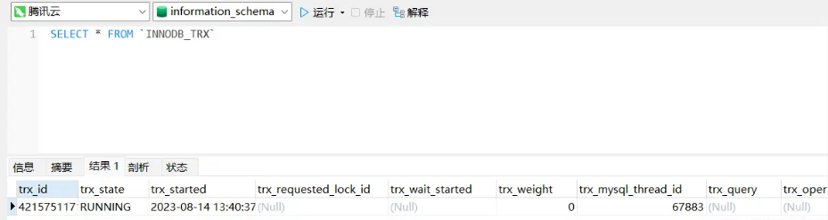
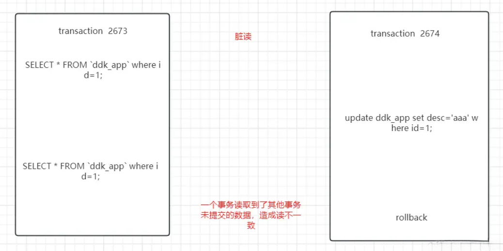
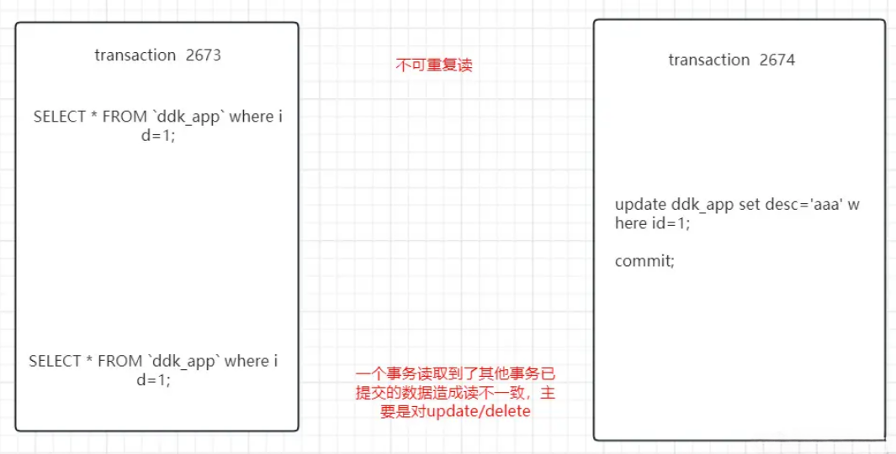
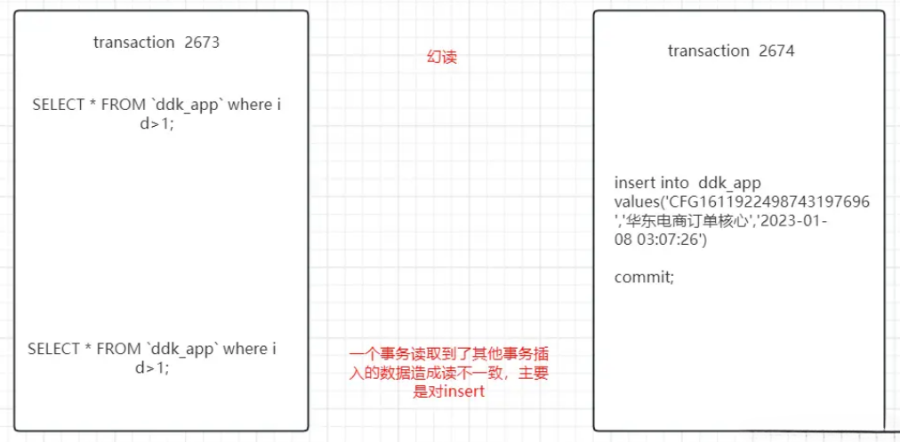
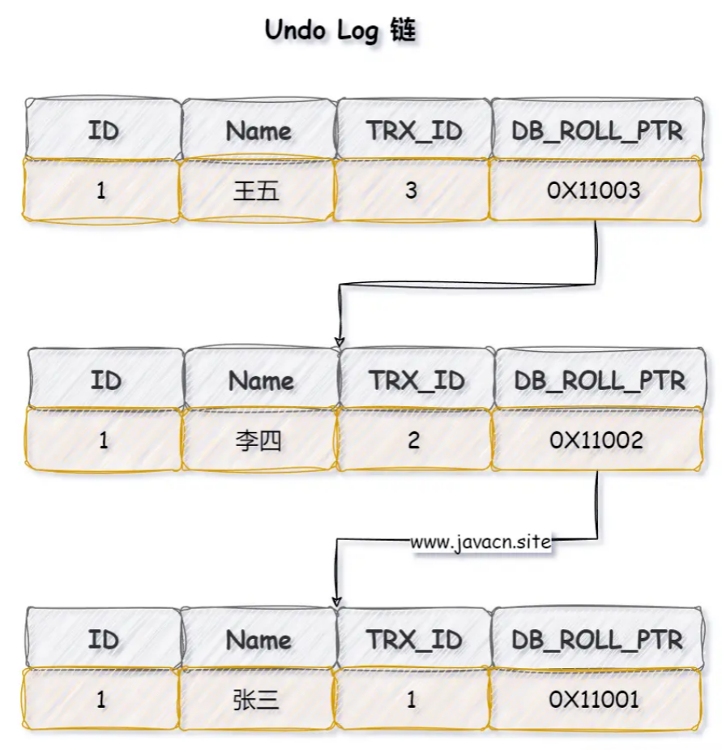
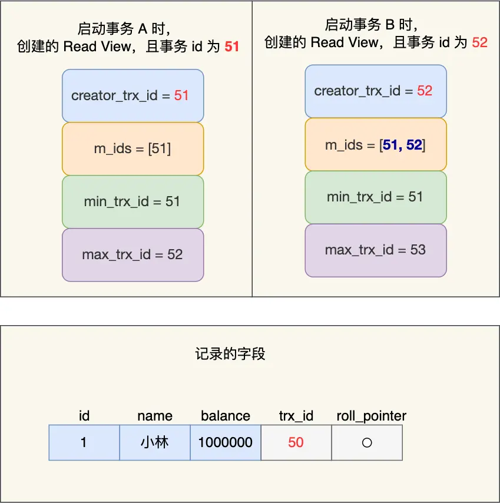
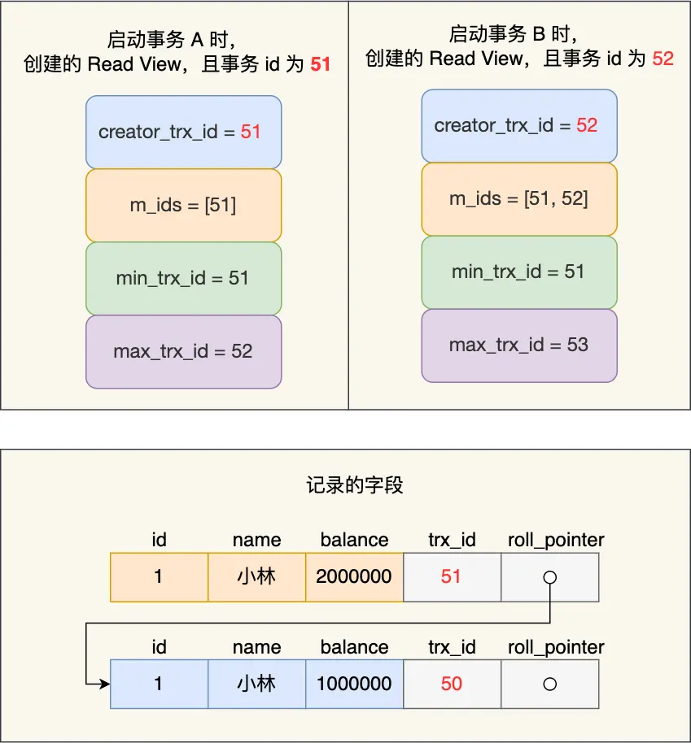
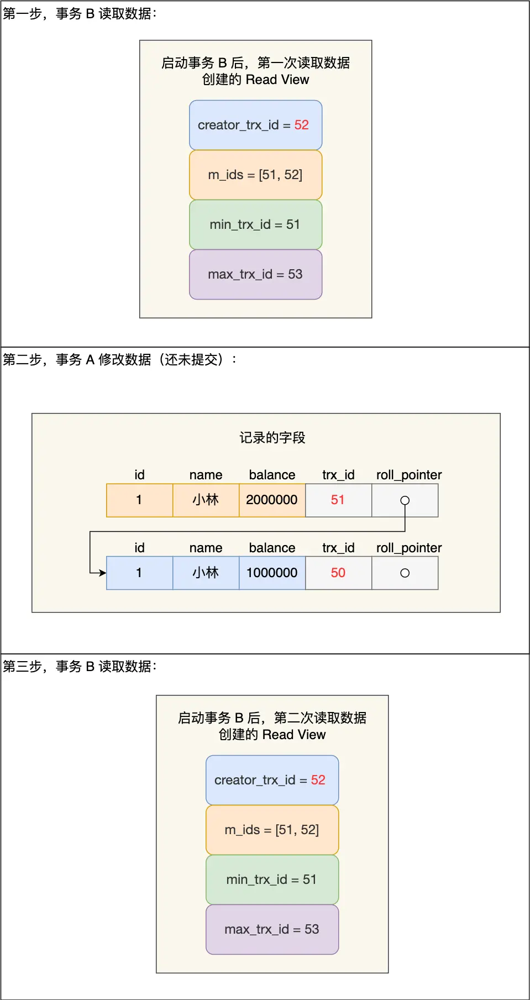
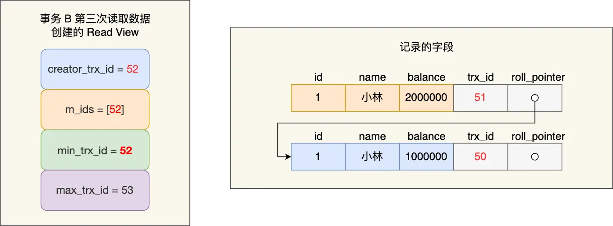

# 事务

[原文连接](https://juejin.cn/post/7269085173642788900?searchId=202401071754494BC35C1171BD9DB3E5D7)

**什么是事务，当事务对数据库进行多个更改时，要么在事务提交时所有更改都成功，要么在事务回滚时所有
更改都被撤销。**
在MySQL中，事务支持是在引擎层实现的。MySQL是一个支持多引擎的系统，但并不是所有的引擎都支持事务。比如
MySQL原生的MyISAM引擎就不支持事务，这也是MyISAM被InnoDB取代的重要原因。

事务有四个特性，ACID，即原子性、一致性、隔离性和持久性。

- **原子性(Atomicity)**：一个事务中的所有操作，要么全部完成，要么全部不完成，不会结束在中间某个环节，而且事务在执行过程中发生错误，会被回滚到事务开始前的状态，就像这个事务从来没有执行过一样，就好比买一件商品，购买成功时，则给商家付了钱，商品到手；购买失败时，则商品在商家手中，消费者的钱也没花出去。
- **一致性(Consistency)**：是指事务操作前和操作后，数据满足完整性约束，数据库保持一致性状态。比如，用户 A 和用户 B 在银行分别有 800 元和 600 元，总共 1400 元，用户 A 给用户 B 转账 200 元，分为两个步骤，从 A 的账户扣除 200 元和对 B 的账户增加 200 元。一致性就是要求上述步骤操作后，最后的结果是用户 A 还有 600 元，用户 B 有 800 元，总共 1400 元，而不会出现用户 A 扣除了 200 元，但用户 B 未增加的情况（该情况，用户 A 和 B 均为 600 元，总共 1200 元）。
- **隔离性(Isolation)**: 数据库允许多个并发事务同时对其数据进行读写和修改的能力，隔离性可以防止多个事务并发执行时由于交叉执行而导致数据的不一致，因为多个事务同时使用相同的数据时，不会相互干扰，每个事务都有一个完整的数据空间，对其他并发事务是隔离的。也就是说，消费者购买商品这个事务，是不影响其他消费者购买的。
- **持久性(Durability)**：事务处理结束后，对数据的修改就是永久的，即便系统故障也不会丢失。

InnoDB 引擎通过什么技术来保证事务的这四个特性的呢？
- 持久性是通过 redo log （重做日志）来保证的；
- 原子性是通过 undo log（回滚日志） 来保证的；
- 隔离性是通过 MVCC（多版本并发控制） 或锁机制来保证的；
- 一致性则是通过持久性+原子性+隔离性来保证；

开启事务用start transaction或者begin，配套的提交语句是commit，回滚语句是rollback。

```sql:no-line-numbers
//开启事务，READ WRITE可写可不写，默认就是READ WRITE，也可以指定只读READ ONLY
START TRANSACTION READ WRITE;

//事务里面有查询语句，有更新语句
SELECT * FROM `ddk_app_config`;
update ddk_app set desc='aaa' where id=1;

//提交该事务
COMMIT; 

//回滚该事务
ROLLBACK;
```

一条或者多条sql语句都属于事务，那为什么我们平时在写update语句的时候没有手动开启start
transaction呢，因为我们有一个属性叫做autocommit自动提交，这个属性平时就是开着的。会话
和全局都是开着的


set SESSION autocommit=0, 关闭自动提交，关闭以后单条语句也必须进行commit或者ROLLBACK。
有些客户端连接框架会默认连接成功后先执行一个set autocommit=0命令。这就导致接下来的查询都在事务中，
如果是长连接，就导致意外的长事务。所以可以总是使用set autocommit=1，通过显式语句的方式来启动事务

查询事务表，比如下面这个语句，用来持续查找持续时间超过60s的事务。

```sql:no-line-numbers
select * from information_schema.innodb_trx where TIME_TO_SEC(timediff(now(),trx_started))>60
```

在表 `INNODB_TRX` 中保存的是还没有提交的事务，会有一些关于事务的信息字段


## 脏读


能读取到其他线程还没有提交的数据，但是这些数据可能是会回滚的

## 不可重复读


在开启事务之后，读取到其他事务进行修改或者删除提交的的数据

## 幻读


在开启事务之后，读到了其他事务新添加的新数据

# 隔离级别

SQL标准的事务隔离级别包括：读未提交(READ UNCOMMITTED)、读已提交(READ COMMITTED)、可重复读(REPEATABLE READ)和串行化(
SERIALIZABLE)。)

## 读未提交

查询语句以非锁定的方式执行，既然非锁定，那么数据还在操作的时候，只要在内存中了，不管有没有提交，都会读取到，所以会导致读取到还没提交的数据，这些数据
也可能是要回滚的，是脏数据。读取到没有提交的数据就是脏读。

## 读已提交

读取已经提交的数据，保证在同一个事务中不会读取到其他事务未提交的数据，可以避免脏读，但可能导致不可重复读和幻读

## 可重复读

可重复读是MySQL的默认级别，在同一个事务中多次读取的数据是一致的。

## 串行化

对同一行记录，“写”加“写锁”，“读”加“读锁”。当出现读写锁冲突的时候，后访问的事务必须等待前一个事务执行完成，才能继续执行。

```sql:no-line-numbers
//修改当前会话读未提交
SET SESSION TRANSACTION ISOLATION LEVEL READ UNCOMMITTED;

//修改当前会话读已提交级别
SET SESSION TRANSACTION ISOLATION LEVEL READ COMMITTED;

//修改当前会话RR级别
SET SESSION TRANSACTION ISOLATION LEVEL REPEATABLE READ;

//修改当前会话串行化级别
SET SESSION TRANSACTION ISOLATION LEVEL SERIALIZABLE; 


//查看全局隔离级别
SHOW GLOBAL VARIABLES LIKE '%isolation%'; 
//查看会话隔离级别
SHOW SESSION VARIABLES LIKE '%isolation%';
```

| 事务隔离级别 | 脏读 | 不可重复读 | 幻读 |
| ------------ | ----- | --------- | ---- |
| 未提交读（Read Uncommitted ） | 可能 | 可能 | 可能 |
| 已提交读（Read Committed）| 不可能 | 可能 | 可能 |
| 可重复读（Repeatable Read） | 不可能 | 不可能 | InnoDB不可能 |
| 串行化（Serializable） | 不可能 | 不可能 | 不可能 |


# MVCC

MVCC（Multi-Version Concurrency Control）是一种并发控制机制，用于解决数据库并发访问中，数据一致性问题。它通过在读写操作期间保存多个数据版本，以提供并发事务间的隔离性，从而避免了传统的锁机制所带来的资源争用和阻塞问题。

> 所谓的一致性问题，就是在并发事务执行时，应该看到那些数据和不应该看到那些数据。

在 MVCC 机制中，每个事务的读操作都能看到事务开始之前的一致性数据快照，而不受其他并发事务的修改的影响。核心思想是通过**创建多个数据版本，保持事务的一致性和隔离性。**

MVCC机制在MySQL中，仅有InnoDB引擎支持，而在该引擎中，MVCC机制只对RC、RR两个隔离级别下的事务生效。当然，RC、RR两个不同的隔离级别中，MVCC的实现也存在些许差异

使用 MVCC 机制解决了 RR 隔离级别中，部分幻读问题，但又没把全部幻读问题都解决。

- MVCC 解决了 RR 隔离级别中，快照读的幻读问题。多次查询快照读时，因为 RR 级别是复用 Read View（读视图），所以没有幻读问题。
- 但 MVCC 解决不了 RR 隔离级别中，如果遇到快照读和当前读（读取当前最新的数据）中间发生过添加操作，那么 Read View 不能复用，就出现了幻读的问题。

## 快照读和当前读

快照读：是指在一个事务中，读取的数据版本是在事务开始时已经存在的数据版本，而不是最新的数据版本。这种读取方式提供了事务在执行期间看到的数据视图的一致性，**select 查询就是快照读。** 

当前读：是指在事务中读取最新的数据版本，以下几种操作都是快照读：

- select ... for update;
- select ... lock in share mode;
- insert ...
- update ...
- delete ...

## MVCC 实现原理

MVCC 主要是依靠以下两部分实现的：

1. Undo Log 链
2. Read View（读视图或者叫一致性视图）

### Undo Log 链

我们知道 Undo Log 主要是用于数据库中事务回滚的，但在 MVCC 机制中也发挥着重要的作用，那什么是 Undo Log 链呢？

Undo Log 链是指在每个数据对象上维护的 Undo Log 记录链表。每张表都会有与之相对应的 Undo Log 链，用于记录修改前的数据信息（以方便数据进行回滚）。



### Read View

Read View（读视图）用于管理事务之间数据可见性的一种机制。Read View 在特定时刻为事务创建的一个快照，该快照包含了在该时刻所有未提交事务的事务标识符，以及其他一些辅助信息。

在 Read View 中包含了以下 4 个主要的字段：

1. m_ids：当前活跃的事务编号集合。
2. min_trx_id：最小活跃事务编号。
3. max_trx_id：预分配事务编号，当前最大事务编号+1。
4. creator_trx_id：ReadView 创建者的事务编号。

RC 级别中，每次快照读都会生成一个全新的 Read View，而 RR 级别中同一个事务会复用一个 Read View。

有了 Read View 和 Undo Log 链之后，并发事务在查询时就知道要读取那些数据了。

### 判断方法

判断方法是根据 Read View 中的 4 个重要字段，先去 Undo Log 中最新的数据行进行比对，如果满足下面 Read View 的判断条件，则返回当前行的数据，如果不满足则继续查找 Undo Log 的下一行数据，直到找到满足的条件的数据为止，如果查询完没有满足条件的数据，则返回 NULL。

### 判断规则

1. `trx_id==creator_trx_id`：先将 Undo Log 最新数据行中的 trx_id 和 ReadView 中的 creator_trx_id 进行对比，如果他们两个值相同，则说明是在同一个事务中执行，那么直接返回当前 Undo Log 的数据行即可，如果不相等，则继续下面流程。
2. `trx_id<min_trx_id`：如果 trx_id 小于 min_trx_id，则说明在执行查询时，其他事务已经提交此行数据了，那么直接返回此行数据即可，如果大于等于，则继续下面流程。
3. `trx_id>max_trx_id`：如果 trx_id 如果大于等于 max_trx_id，则说明该行数据比当前操作执行的晚，当前行数据不可见，继续执行后续流程。
4. `min_trx_id<=trx_id<max_trx_id`：trx_id 在 min_trx_id 和 max_trx_id 之间还分为以下两种情况：
    1. `trx_id 在 m_ids 中`：说明事务尚未执行完，该行数据不可被访问。
    2. `trx_id 未在 m_ids 中`：说明事务已经执行完，可以返回该行数据。

以上判断规则从 Undo Log 最新的行数据，逐行对比，直到找到匹配的数据，否则查询完未匹配上，则返回 NULL。

## 可重复读是如何工作的？
可重复读隔离级别是启动事务时生成一个 Read View，然后整个事务期间都在用这个 Read View  
假设事务 A （事务 id 为51）启动后，紧接着事务 B （事务 id 为52）也启动了，那这两个事务创建的 Read View 如下：

事务 A 和 事务 B 的 Read View 具体内容如下：
- 在事务 A 的 Read View 中，它的事务 id 是 51，由于它是第一个启动的事务，所以此时活跃事务的事务 id 列表就只有 51，活跃事务的事务 id 列表中最小的事务 id 是事务 A 本身，下一个事务 id 则是 52。
- 在事务 B 的 Read View 中，它的事务 id 是 52，由于事务 A 是活跃的，所以此时活跃事务的事务 id 列表是 51 和 52，**活跃的事务 id 中最小的事务 id 是事务 A**下一个事务 id 应该是 53。  
接着，在可重复读隔离级别下，事务 A 和事务 B 按顺序执行了以下操作：
- 事务 B 读取小林的账户余额记录，读到余额是 100 万；
- 事务 A 将小林的账户余额记录修改成 200 万，并没有提交事务；
- 事务 B 读取小林的账户余额记录，读到余额还是 100 万；
- 事务 A 提交事务；
- 事务 B 读取小林的账户余额记录，读到余额依然还是 100 万；

接下来，跟大家具体分析下。  
事务B第一次读小林的账户余额记录，在找到记录后，它会先看这条记录的trx_id，此时发现 trx_id 为
50，比事务B 的 Read View 中的 min_trx_id 值（51）还小，这意味着修改这条记录的事务早就在事务B
启动前提交过了，所以该版本的记录对事务B 可见的，也就是事务B可以获取到这条记录。  
接着，事务A通过update 语句将这条记录修改了（还未提交事务），将小林的余额改成 200 万，这时
MySQL 会记录相应的undo log，并以链表的方式串联起来，形成版本链，如下图：

你可以在上图的「记录的字段」看到，由于事务A修改了该记录，以前的记录就变成旧版本记录了，于是
最新记录和旧版本记录通过链表的方式串起来，而且最新记录的 trx_id 是事务 A 的事务 id（trx_id =
51）。  
然后事务 B 第二次去读取该记录，**发现这条记录的 trx_id 值为 51，在事务 B 的 Read View 的 min_trx_id
和 max_trx_id 之间，则需要判断 trx_id 值是否在 m_ids 范围内，判断的结果是在的，那么说明这条记录
是被还未提交的事务修改的，这时事务B并不会读取这个版本的记录。而是沿着undolog 链条往下找旧
版本的记录，直到找到 trx_id「小于」事务 B的 Read View 中的 min_trx_id 值的第一条记录**，所以事务
B 能读取到的是 trx_id 为 50 的记录，也就是小林余额是 100 万的这条记录。  
最后，当事物A提交事务后，**由于隔离级别时「可重复读」，所以事务B再次读取记录时，还是基于启
动事务时创建的 Read View 来判断当前版本的记录是否可见。所以，即使事物A 将小林余额修改为 200
万并提交了事务，事务B第三次读取记录时，读到的记录都是小林余额是100万的这条记录。**  
就是通过这样的方式实现了，「可重复读」隔离级别下在事务期间读到的记录都是事务启动前的记录。
## 读提交是如何工作的？
**读提交隔离级别是在每次读取数据时，都会生成一个新的 ReadView。**  
也意味着，事务期间的多次读取同一条数据，前后两次读的数据可能会出现不一致，因为可能这期间另外
一个事务修改了该记录，并提交了事务。
那读提交隔离级别是怎么工作呢？我们还是以前面的例子来聊聊。  
假设事务A（事务id为51）启动后，紧接着事务B（事务id为52）也启动了，接着按顺序执行了以下操
作:
- 事务B读取数据（创建ReadView），小林的账户余额为100 万;
- 事务A修改数据（还没提交事务），将小林的账户余额从100万修改成了200万;
- 事务B读取数据（创建Read View），小林的账户余额为 100 万;
- 事务A提交事务;
- 事务B读取数据（创建Read View），小林的账户余额为 200万;

那具体怎么做到的呢？我们重点看事务B 每次读取数据时创建的 Read View。前两次 事务 B 读取数据时
创建的 Read View 如下图:

我们来分析下为什么事务B第二次读数据时，读不到事务A（还未提交事务）修改的数据?

事务 B 在找到小林这条记录时，会看这条记录的 trx_id 是 51，在事务 B 的 Read View 的 min_trx_id 和
max_trx_id 之间，接下来需要判断 trx_id 值是否在 m_ids 范围内，判断的结果是在的，那么说明 **这条记录
是被还未提交的事务修改的，这时事务B并不会读取这个版本的记录。** 而是，沿着undolog 链条往下找
旧版本的记录，直到找到 trx_id「小于」事务 B 的 Read View 中的 min_trx_id 值的第一条记录，所以事务  
B 能读取到的是 trx_id 为 50 的记录，也就是小林余额是 100 万的这条记录。  
我们来分析下为什么事务A提交后，事务B 就可以读到事务A修改的数据？  
在事务A提交后，**由于隔离级别是「读提交」，所以事务B在每次读数据的时候，会重新创建Read
View**，此时事务B 第三次读取数据时创建的 Read View 如下:

事务B 在找到小林这条记录时，**会发现这条记录的 trx_id 是 51，比事务 B 的 Read View 中的 min_trx_id
值（52）还小，这意味着修改这条记录的事务早就在创建ReadView 前提交过了，所以该版本的记录对
事务 B 是可见的。**  
正是因为在读提交隔离级别下，事务每次读数据时都重新创建Read View，那么在事务期间的多次读取同
一条数据，前后两次读的数据可能会出现不一致，因为可能这期间另外一个事务修改了该记录，并提交了
事务。
