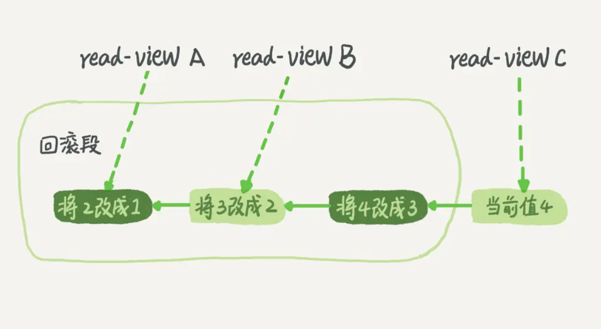
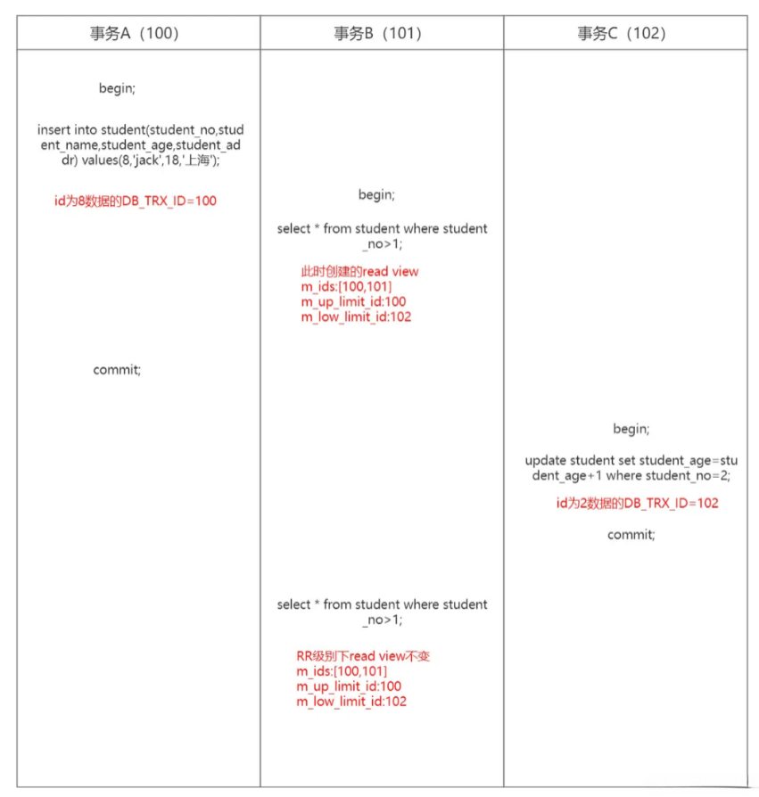
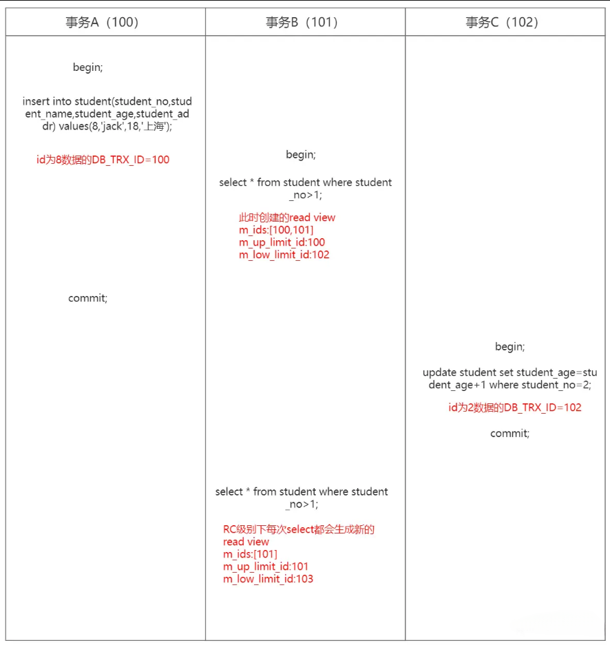

# 事务

[原文连接](https://juejin.cn/post/7269085173642788900?searchId=202401071754494BC35C1171BD9DB3E5D7)

**什么是事务，当事务对数据库进行多个更改时，要么在事务提交时所有更改都成功，要么在事务回滚时所有
更改都被撤销。**
在MySQL中，事务支持是在引擎层实现的。MySQL是一个支持多引擎的系统，但并不是所有的引擎都支持事务。比如
MySQL原生的MyISAM引擎就不支持事务，这也是MyISAM被InnoDB取代的重要原因。

事务有四个特性，ACID，即原子性、一致性、隔离性和持久性。

开启事务用start transaction或者begin，配套的提交语句是commit，回滚语句是rollback。

```sql
//开启事务，READ WRITE可写可不写，默认就是READ WRITE，也可以指定只读READ ONLY
START TRANSACTION READ WRITE;

//事务里面有查询语句，有更新语句
SELECT * FROM `ddk_app_config`;
update ddk_app set desc='aaa' where id=1;

//提交该事务
COMMIT; 

//回滚该事务
ROLLBACK;
```

一条或者多条sql语句都属于事务，那为什么我们平时在写update语句的时候没有手动开启start
transaction呢，因为我们有一个属性叫做autocommit自动提交，这个属性平时就是开着的。会话
和全局都是开着的


set SESSION autocommit=0, 关闭自动提交，关闭以后单条语句也必须进行commit或者ROLLBACK。
有些客户端连接框架会默认连接成功后先执行一个set autocommit=0命令。这就导致接下来的查询都在事务中，
如果是长连接，就导致意外的长事务。所以可以总是使用set autocommit=1，通过显式语句的方式来启动事务

查询事务表，比如下面这个语句，用来持续查找持续时间超过60s的事务。

```sql
select * from information_schema.innodb_trx where TIME_TO_SEC(timediff(now(),trx_started))>60
```

在表 `INNODB_TRX` 中保存的是还没有提交的事务，会有一些关于事务的信息字段


# 脏读幻读不可重复读

## 脏读


能读取到其他线程还没有提交的数据，但是这些数据可能是会回滚的

## 不可重复读


在开启事务之后，读取到其他事务进行修改或者删除提交的的数据

## 幻读


在开启事务之后，读到了其他事务新添加的新数据

# 隔离级别

SQL标准的事务隔离级别包括：读未提交(READ UNCOMMITTED)、读已提交(READ COMMITTED)、可重复读(REPEATABLE READ)和串行化(
SERIALIZABLE)。)

## 读未提交

查询语句以非锁定的方式执行，既然非锁定，那么数据还在操作的时候，只要在内存中了，不管有没有提交，都会读取到，所以会导致读取到还没提交的数据，这些数据
也可能是要回滚的，是脏数据。读取到没有提交的数据就是脏读。

## 读已提交

读取已经提交的数据，保证在同一个事务中不会读取到其他事务未提交的数据，可以避免脏读，但可能导致不可重复读和幻读

## 可重复读

可重复读是MySQL的默认级别，在同一个事务中多次读取的数据是一致的。

## 串行化

对同一行记录，“写”加“写锁”，“读”加“读锁”。当出现读写锁冲突的时候，后访问的事务必须等待前一个事务执行完成，才能继续执行。

```sql
//修改当前会话读未提交
SET SESSION TRANSACTION ISOLATION LEVEL READ UNCOMMITTED;

//修改当前会话读已提交级别
SET SESSION TRANSACTION ISOLATION LEVEL READ COMMITTED;

//修改当前会话RR级别
SET SESSION TRANSACTION ISOLATION LEVEL REPEATABLE READ;

//修改当前会话串行化级别
SET SESSION TRANSACTION ISOLATION LEVEL SERIALIZABLE; 


//查看全局隔离级别
SHOW GLOBAL VARIABLES LIKE '%isolation%'; 
//查看会话隔离级别
SHOW SESSION VARIABLES LIKE '%isolation%';
```


# MVCC

**同一条记录在系统中可以存在多个版本，就是数据库的多版本并发控制（MVCC）**。InnoDB在实现 MVCC 时
用到的一致性读视图，即 consistent read view，用于支持RC（Read Committed，读提交）和RR
（Repeatable Read，可重复读）隔离级别的实现。
一致性读取意味着InnoDB使用多版本来向查询提供数据库在某个时间点的**快照**。该查询查看在该时间点之前
提交的事务所做的更改，而不查看后来或未提交的事务所做的更改。所以关键在于快照，就是在某些时间点，我
创建一个快照，这个快照创建了之后，后续同一个事务的所有读取都是读取的这个快照内容。
**在RC隔离级别下，则每次一致性读都会创建一个新的快照。
在RR隔离级别下，则在第一次一致性读的时候，创建快照。如果不在第一个select创建快照，也可以用 start transaction with consistent
snapshot，
这个在事务开启的时候就会创建一个read view。**
这里的快照其实不是真正意义的将数据存储了一份，而是一个readView的数据结构保存了某些信息，然后
通过对这些信息的判断来达到不会读到最新数据的目的。

对于 read-view A，要得到 1，就必须将当前值依次执行图中所有的回滚操作得到。

# Read View

下面我们来看下什么是Read View，源码在 \storage\innobase\include\read0types.h

```c++
class ReadView {

//省略

..................

/** The read should not see any transaction with trx id >= this value. In other words, this is the "high water mark". */

trx_id_t m_low_limit_id; //如果大于等于这个值的事务不可见，也称高水位线


/** The read should see all trx ids which are strictly smaller (<) than this value. In other words, this is the low water mark". */

trx_id_t m_up_limit_id; // 所有小于这个值的事务的值都可见，也称低水位线，其实是m_ids里面的最小值


/** trx id of creating transaction, set to TRX_ID_MAX for free views. */

trx_id_t m_creator_trx_id; // 当前的事务ID


/** Set of RW transactions that was active when this snapshot was taken */

ids_t m_ids; //存活的事务ID，就是在创建readView 没有提交的事务的ID集合

}
```

```text
m_low_limit_id： 当前系统里面已经创建过的事务 ID 的最大值加 1，记为高水位
m_up_limit_id： 所有存活的（没有提交的）事务ID中最小值，即低水位
m_creator_trx_id：创建这个readView的事务ID
m_ids： 创建readView时，所有存活的事务ID列表，活跃的意思是启动了还没有提交
```

一个ReadView还不能够判断可见与不可见，可见与不可见跟行数据相关，所以还跟每行数据的一些隐藏字段有关：

```text
DB_ROW_ID： 隐藏的字段ID，当没有主键或者非空唯一索引时，我们的主键所以基于这个递增字段建立。

DB_TRX_ID： 更新这行数据的事务ID

DB_ROLL_PTR ： 回滚指针，被改动前的undolog日志指针。
```

每行数据也都是有多个版本的。每次事务更新数据的时候，都会生成一个新的数据版本，并且把transaction id赋值给这个数据版本的事务ID，记为row
trx_id。同时，旧的数据版本要保留，并且在新的数据版本中，能够有信息可以直接拿到它。也就是说，数据表中的一行记录，其实可能有多个版本 (
row)，每个版本有自己的 row trx_id。
下图就是一个数据版本：


那么ReadView怎么跟我的行数据的DB_TRX_ID来配合做到解决我的不可重复读或者幻读问题呢？
判断规则：

1. 如果数据的DB_TRX_ID < m_up_limit_id, 都小于存活的事务ID了，那么肯定不存活了，说明在创建ReadView的时候已经提交了，可见。
2. 如果数据的DB_TRX_ID >=m_low_limit_id, 大于等于我即将分配的事务ID， 那么表明修改这条数据的事务是在创建了ReadView之后开启的，不可见。
3. 如果 m_up_limit_id<= DB_TRX_ID< m_low_limit_id, 表明修改这条数据的事务在第一次快照之前就创建好了，但是不确定提没提交，判断有没有提交，直接可以根据活跃的事务列表
   m_ids判断

- DB_TRX_ID如果在m_ids中，表面在创建ReadView之时还没提交，不可见
- DB_TRX_ID如果不在m_ids，表面在创建ReadView之时已经提交，可见

## 案例分析

RR级别，这个是每次查询read view都是一样的


我们看B事务第一条查询语句，对于id为8的数据DB_TRX_ID=100，符合3.1的条件，DB_TRX_ID如果在m_ids中，表面在创建ReadView之时还没提交，不可见。那么在第二次查询的时候其实也是不可见的，所以
**解决了幻读的问题**。
我们看B事务第一条查询语句，对于id为2的数据DB_TRX_ID=102，符合2的条件，表明修改这条数据的事务是在创建了ReadView之后开启的，不可见。那么在第二次查询的时候其实也是不可见的，所以
**解决了不可重复读的问题**。
**而RC级别下每次select都会生成新的read view。**



我们看B事务第一条查询语句，对于id为8的数据DB_TRX_ID=100，符合3.1的条件，DB_TRX_ID如果在m_ids中，表面在创建ReadView之时还没提交，不可见。那么在第二次查询的时候100<
101，满足DB_TRX_ID < m_up_limit_id，此时数据是可见的，**造成了幻读。**
我们看B事务第一条查询语句，对于id为2的数据DB_TRX_ID=102，符合2的条件，表明修改这条数据的事务是在创建了ReadView之后开启的，不可见。那么在第二次查询的时候101<
=102<103，符合3.2的条件，DB_TRX_ID如果不在m_ids，表面在创建ReadView之时已经提交，**可见，造成了不可重复读。**
**所以MVCC在RC跟RR的区别就在于是不是每次快照读是否都会生成新的read view，这也是为什么RC没有解决幻读跟可重复读。**

但是也有个例外：更新数据都是先读后写的，而这个读，只能读当前的值，称为“当前读”（current
read）。因为如果我在改动数据的时候，拿到的不是最新数据，那么就会导致数据丢失。