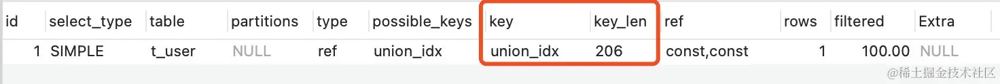

# Mysql 索引失效

[原文链接](https://juejin.cn/post/7307166050512388096?searchId=2024011708424080E96C10C96313ECDE9A)

## 数据库及索引准备

### 创建表结构

为了逐项验证索引的使用情况，我们先准备一张表t_user：

```sql:no-line-numbers
CREATE TABLE `t_user` (
  `id` int(11) unsigned NOT NULL AUTO_INCREMENT COMMENT 'ID',
  `id_no` varchar(18) CHARACTER SET utf8mb4 COLLATE utf8mb4_bin DEFAULT NULL COMMENT '身份编号',
  `username` varchar(32) CHARACTER SET utf8mb4 COLLATE utf8mb4_bin DEFAULT NULL COMMENT '用户名',
  `age` int(11) DEFAULT NULL COMMENT '年龄',
  `create_time` datetime DEFAULT CURRENT_TIMESTAMP COMMENT '创建时间',
  PRIMARY KEY (`id`),
  KEY `union_idx` (`id_no`,`username`,`age`),
  KEY `create_time_idx` (`create_time`)
) ENGINE=InnoDB DEFAULT CHARSET=utf8mb4 COLLATE=utf8mb4_bin;
```

在上述表结构中有三个索引：

- id：为数据库主键；
- union_idx：为id_no、username、age构成的联合索引；
- create_time_idx：是由create_time构成的普通索引；

### 初始化数据

初始化数据分两部分：基础数据和批量导入数据。
基础数据insert了4条数据，其中第4条数据的创建时间为未来的时间，用于后续特殊场景的验证:

```sql:no-line-numbers
INSERT INTO `t_user` (`id`, `id_no`, `username`, `age`, `create_time`) VALUES (null, '1001', 'Tom1', 11, '2022-02-27 09:04:23');
INSERT INTO `t_user` (`id`, `id_no`, `username`, `age`, `create_time`) VALUES (null, '1002', 'Tom2', 12, '2022-02-26 09:04:23');
INSERT INTO `t_user` (`id`, `id_no`, `username`, `age`, `create_time`) VALUES (null, '1003', 'Tom3', 13, '2022-02-25 09:04:23');
INSERT INTO `t_user` (`id`, `id_no`, `username`, `age`, `create_time`) VALUES (null, '1004', 'Tom4', 14, '2023-02-25 09:04:23');
```

除了基础数据，还有一条存储过程及其调用的SQL，方便批量插入数据，用来验证数据比较多的场景：

```sql:no-line-numbers
-- 删除历史存储过程
DROP PROCEDURE IF EXISTS `insert_t_user`

-- 创建存储过程
delimiter $

CREATE PROCEDURE insert_t_user(IN limit_num int)
BEGIN
  DECLARE i INT DEFAULT 10;
    DECLARE id_no varchar(18) ;
    DECLARE username varchar(32) ;
    DECLARE age TINYINT DEFAULT 1;
    WHILE i < limit_num DO
        SET id_no = CONCAT("NO", i);
        SET username = CONCAT("Tom",i);
        SET age = FLOOR(10 + RAND()*2);
        INSERT INTO `t_user` VALUES (NULL, id_no, username, age, NOW());
        SET i = i + 1;
    END WHILE;

END $
-- 调用存储过程
call insert_t_user(100);
```

关于存储过程的创建和存储，可暂时不执行，当用到时再执行。

### 数据库版本及执行计划

```sql:no-line-numbers
select version();
8.0.18
```

上述为本人测试的数据库版本：8.0.18。当然，以下的所有示例，大家可在其他版本进行执行验证。
查看SQL语句执行计划，一般我们都采用explain关键字，通过执行结果来判断索引使用情况。
执行示例：

```sql:no-line-numbers
explain select * from t_user where id = 1;
```

执行结果：

可以看到上述SQL语句使用了主键索引（PRIMARY），key_len为4；
其中key_len的含义为：表示索引使用的字节数，根据这个值可以判断索引的使用情况，特别是在组合索引的时候，判断该索引有多少部分被使用到非常重要。
做好以上数据及知识的准备，下面就开始讲解具体索引失效的实例了。

## 1. 联合索引不满足最左匹配原则

联合索引遵从最左匹配原则，顾名思义，在联合索引中，最左侧的字段优先匹配。因此，在创建联合索引时，where子句中使用最频繁的字段放在组合索引的最左侧。
而在查询时，要想让查询条件走索引，则需满足：最左边的字段要出现在查询条件中。
实例中，union_idx联合索引组成：

```sql:no-line-numbers
KEY `union_idx` (`id_no`,`username`,`age`)
```

最左边的字段为id_no，一般情况下，只要保证id_no出现在查询条件中，则会走该联合索引。\
示例一：

```sql:no-line-numbers
explain select * from t_user where id_no = '1002';
```

explain结果：

通过explain执行结果可以看出，上述SQL语句走了union_idx这条索引。
这里再普及一下key_len的计算：

- id_no 类型为varchar(18)，字符集为utf8mb4_bin，也就是使用4个字节来表示一个完整的UTF-8。此时，key_len = 18* 4 = 72；
- 由于该字段类型varchar为变长数据类型，需要再额外添加2个字节。此时，key_len = 72 + 2 = 74；
- 由于该字段运行为NULL（default NULL），需要再添加1个字节。此时，key_len = 74 + 1 = 75；

上面演示了key_len一种情况的计算过程，后续不再进行逐一推演，知道基本组成和原理即可，更多情况大家可自行查看。
示例二：
```sql:no-line-numbers
explain select * from t_user where id_no = '1002' and username = 'Tom2';
```
explain结果：

很显然，依旧走了union_idx索引，根据上面key_len的分析，大胆猜测，在使用索引时，不仅使用了id_no列，还使用了username列。

示例三：
```sql:no-line-numbers
explain select * from t_user where id_no = '1002' and age = 12;
```
explain结果：

走了union_idx索引，但跟示例一一样，只用到了id_no列。

当然，还有三列都在查询条件中的情况，就不再举例了。上面都是走索引的正向例子，也就是满足最左匹配原则的例子，下面来看看，不满足该原则的反向例子。

反向示例：
```sql:no-line-numbers
explain select * from t_user where username = 'Tom2' and age = 12;
```
explain结果：

此时，可以看到未走任何索引，也就是说索引失效了。

同样的，下面只要没出现最左条件的组合，索引也是失效的：
```sql:no-line-numbers
explain select * from t_user where age = 12;
explain select * from t_user where username = 'Tom2';
```
那么，第一种索引失效的场景就是：在联合索引的场景下，查询条件不满足最左匹配原则。
## 2. 使用了select *
在《阿里巴巴开发手册》的ORM映射章节中有一条【强制】的规范：
【强制】在表查询中，一律不要使用 * 作为查询的字段列表，需要哪些字段必须明确写明。 说明:
1) 增加查询分析器解析成本。
2) 增减字段容易与 resultMap 配置不一致。
3) 无用字段增加网络消耗，尤其是 text 类型的字段。

虽然在规范手册中没有提到索引方面的问题，但禁止使用select * 语句可能会带来的附带好处就是：某些情况下可以走覆盖索引。
比如，在上面的联合索引中，如果查询条件是age或username，当使用了select * ，肯定是不会走索引的。
但如果希望根据username查询出id_no、username、age这三个结果（均为索引字段），明确查询结果字段，是可以走覆盖索引的：
```sql:no-line-numbers
explain select id_no, username, age from t_user where username = 'Tom2';
explain select id_no, username, age from t_user where age = 12;
```
explain结果：

无论查询条件是username还是age，都走了索引，根据key_len可以看出使用了索引的所有列。
第二种索引失效场景：在联合索引下，尽量使用明确的查询列来趋向于走覆盖索引；
这一条不走索引的情况属于优化项，如果业务场景满足，则进来促使SQL语句走索引。至于阿里巴巴开发手册中的规范，只不过是两者撞到一起了，规范本身并不是为这条索引规则而定的。
## 3. 索引列参与运算
直接来看示例：
```sql:no-line-numbers
explain select * from t_user where id + 1 = 2 ;
```
explain结果：

可以看到，即便id列有索引，由于进行了计算处理，导致无法正常走索引。
针对这种情况，其实不单单是索引的问题，还会增加数据库的计算负担。就以上述SQL语句为例，数据库需要全表扫描出所有的id字段值，然后对其计算，计算之后再与参数值进行比较。如果每次执行都经历上述步骤，性能损耗可想而知。
建议的使用方式是：先在内存中进行计算好预期的值，或者在SQL语句条件的右侧进行参数值的计算。
针对上述示例的优化如下：
```sql:no-line-numbers
-- 内存计算，得知要查询的id为1
explain select * from t_user where id = 1 ;
-- 参数侧计算
explain select * from t_user where id = 2 - 1 ;
```
第三种索引失效情况：索引列参与了运算，会导致全表扫描，索引失效。
## 4. 索引列参使用了函数操作
示例:
```sql:no-line-numbers
explain select * from t_user where SUBSTR(id_no,1,3) = '100';
```
explain结果：

上述示例中，索引列使用了函数（SUBSTR，字符串截取），导致索引失效。
此时，索引失效的原因与第三种情况一样，都是因为数据库要先进行全表扫描，获得数据之后再进行截取、计算，导致索引索引失效。同时，还伴随着性能问题。
示例中只列举了SUBSTR函数，像CONCAT等类似的函数，也都会出现类似的情况。解决方案可参考第三种场景，可考虑先通过内存计算或其他方式减少数据库来进行内容的处理。
第四种索引失效情况：索引列参与了函数处理，会导致全表扫描，索引失效。
## 5.错误的Like使用
示例：
```sql:no-line-numbers
explain select * from t_user where id_no like '%00%';
```
explain结果：

针对like的使用非常频繁，但使用不当往往会导致不走索引。常见的like使用方式有：

- 方式一：like ‘%abc’；
- 方式二：like ‘abc%’；
- 方式三：like ‘%abc%’；

其中方式一和方式三，由于占位符出现在首部，导致无法走索引。这种情况不做索引的原因很容易理解，索引本身就相当于目录，从左到右逐个排序。而条件的左侧使用了占位符，导致无法按照正常的目录进行匹配，导致索引失效就很正常了。
第五种索引失效情况：模糊查询时（like语句），模糊匹配的占位符位于条件的首部

## 6.类型隐式转换
示例：
```sql:no-line-numbers
explain select * from t_user where id_no = 1002;
```
explain结果：

id_no字段类型为varchar，但在SQL语句中使用了int类型，导致全表扫描。
出现索引失效的原因是：varchar和int是两个种不同的类型。
解决方案就是将参数1002添加上单引号或双引号。
第六种索引失效情况：参数类型与字段类型不匹配，导致类型发生了隐式转换，索引失效。
这种情况还有一个特例，如果字段类型为int类型，而查询条件添加了单引号或双引号，则Mysql会参数转化为int类型，虽然使用了单引号或双引号：
```sql:no-line-numbers
explain select * from t_user where id = '2';
```
上述语句是依旧会走索引的。
## 7. 使用OR操作
OR是日常使用最多的操作关键字了，但使用不当，也会导致索引失效。
示例：
```sql:no-line-numbers
explain select * from t_user where id = 2 or username = 'Tom2';
```
explain结果：

看到上述执行结果是否是很惊奇啊，明明id字段是有索引的，由于使用or关键字，索引竟然失效了。
其实，换一个角度来想，如果单独使用username字段作为条件很显然是全表扫描，既然已经进行了全表扫描了，前面id的条件再走一次索引反而是浪费了。所以，在使用or关键字时，切记两个条件都要添加索引，否则会导致索引失效。
但如果or两边同时使用“>”和“<”，则索引也会失效：
```sql:no-line-numbers
explain select * from t_user where id  > 1 or id  < 80;
```
explain结果：

第七种索引失效情况：查询条件使用or关键字，其中一个字段没有创建索引，则会导致整个查询语句索引失效； or两边为“>”和“<”范围查询时，索引失效。
## 8. 两列做比较
如果两个列数据都有索引，但在查询条件中对两列数据进行了对比操作，则会导致索引失效。
这里举个不恰当的示例，比如age小于id这样的两列（真实场景可能是两列同维度的数据比较，这里迁就现有表结构）：
```sql:no-line-numbers
explain select * from t_user where id > age;
```
explain结果：

这里虽然id有索引，age也可以创建索引，但当两列做比较时，索引还是会失效的。
第八种索引失效情况：两列数据做比较，即便两列都创建了索引，索引也会失效。
## 9. 不等于比较
示例：
```sql:no-line-numbers
explain select * from t_user where id_no <> '1002';
```
explain结果：

当查询条件为字符串时，使用”\<\>“或”!=“作为条件查询，有可能不走索引，但也不全是。
```sql:no-line-numbers
explain select * from t_user where create_time != '2022-02-27 09:56:42';
```
上述SQL中，由于“2022-02-27 09:56:42”是存储过程在同一秒生成的，大量数据是这个时间。执行之后会发现，当查询结果集占比比较小时，会走索引，占比比较大时不会走索引。此处与结果集与总体的占比有关。
需要注意的是：上述语句如果是id进行不等操作，则正常走索引。
```sql:no-line-numbers
explain select * from t_user where id != 2;
```
explain结果：

## 10. is not null
示例：
```sql:no-line-numbers
explain select * from t_user where id_no is not null;
```
explain结果：

第十种索引失效情况：查询条件使用is null时正常走索引，使用is not null时，不走索引。
## 11. not in和not exists
在日常中使用比较多的范围查询有in、exists、not in、not exists、between and等。
```sql:no-line-numbers
explain select * from t_user where id in (2,3);
explain select * from t_user where id_no in ('1001','1002');
explain select * from t_user u1 where exists (select 1 from t_user u2 where u2.id  = 2 and u2.id = u1.id);
explain select * from t_user where id_no between '1002' and '1003';
```
上述四种语句执行时都会正常走索引，具体的explain结果就不再展示。主要看不走索引的情况：
```sql:no-line-numbers
explain select * from t_user where id_no not in('1002' , '1003');
```
explain结果：

当使用not in时，不走索引？把条件列换成主键试试：
```sql:no-line-numbers
explain select * from t_user where id not in (2,3);
```
explain结果：

如果是主键，则正常走索引。
第十一种索引失效情况：查询条件使用not in时，如果是主键则走索引，如果是普通索引，则索引失效。
再来看看not exists：
```sql:no-line-numbers
explain select * from t_user u1 where not exists (select 1 from t_user u2 where u2.id  = 2 and u2.id = u1.id);
```
explain结果：

当查询条件使用not exists时，不走索引。
第十二种索引失效情况：查询条件使用not exists时，索引失效。
## 12. order by导致索引失效
示例：
```sql:no-line-numbers
explain select * from t_user order by id_no ;
```
explain结果：

其实这种情况的索引失效很容易理解，毕竟需要对全表数据进行排序处理。
那么，添加删limit关键字是否就走索引了呢？
```sql:no-line-numbers
explain select * from t_user order by id_no limit 10;
```
explain结果：

结果依旧不走索引。在网络上看到有说如果order by条件满足最左匹配则会正常走索引， 在当前8.0.18版本中并未出现。所以，在基于order by和limit进行使用时，要特别留意。是否走索引不仅涉及到数据库版本，还要看Mysql优化器是如何处理的。
这里还有一个特例，就是主键使用order by时，可以正常走索引。
```sql:no-line-numbers
explain select * from t_user order by id desc;
```
explain结果：

可以看出针对主键，还是order by可以正常走索引。
另外，笔者测试如下SQL语句：
```sql:no-line-numbers
explain select id from t_user order by age;
explain select id , username from t_user order by age;
explain select id_no from t_user order by id_no;
```
上述三条SQL语句都是走索引的，也就是说覆盖索引的场景也是可以正常走索引的。
现在将id和id_no组合起来进行order by：
```sql:no-line-numbers
explain select * from t_user order by id,id_no desc;
explain select * from t_user order by id,id_no desc limit 10;
explain select * from t_user order by id_no desc,username desc;
```
explain结果：

上述两个SQL语句，都未走索引。
第十三种索引失效情况：当查询条件涉及到order by、limit等条件时，是否走索引情况比较复杂，而且与Mysql版本有关，通常普通索引，如果未使用limit，则不会走索引。order by多个索引字段时，可能不会走索引。其他情况，建议在使用时进行expain验证。
## 13. 参数不同导致索引失效
此时，如果你还未执行最开始创建的存储过程，建议你先执行一下存储过程，然后执行如下SQL：
```sql:no-line-numbers
explain select * from t_user where create_time > '2023-02-24 09:04:23';
```
其中，时间是未来的时间，确保能够查到数据。
explain结果：

可以看到，正常走索引。
随后，我们将查询条件的参数换个日期：
```sql:no-line-numbers
explain select * from t_user where create_time > '2023-11-29 09:04:23';
```
explain结果：

此时，进行了全表扫描。这也是最开始提到的奇怪的现象。
为什么同样的查询语句，只是查询的参数值不同，却会出现一个走索引，一个不走索引的情况呢？
答案很简单：上述索引失效是因为DBMS发现全表扫描比走索引效率更高，因此就放弃了走索引。
也就是说，当Mysql发现通过索引扫描的行记录数超过全表的10%-30%时，优化器可能会放弃走索引，自动变成全表扫描。某些场景下即便强制SQL语句走索引，也同样会失效。
类似的问题，在进行范围查询（比如\>、\< 、\>=、\<=、in等条件）时往往会出现上述情况，而上面提到的临界值根据场景不同也会有所不同。
第十四种索引失效情况：当查询条件为大于等于、in等范围查询时，根据查询结果占全表数据比例的不同，优化器有可能会放弃索引，进行全表扫描。
## 14.其他
当然，还有其他一些是否走索引的规则，这与索引的类型是B-tree索引还是位图索引也有关系，就不再详细展开。
这里要说的其他，可以总结为第十五种索引失效的情况：Mysql优化器的其他优化策略，比如优化器认为在某些情况下，全表扫描比走索引快，则它就会放弃索引。
针对这种情况，一般不用过多理会，当发现问题时再定点排查即可。
