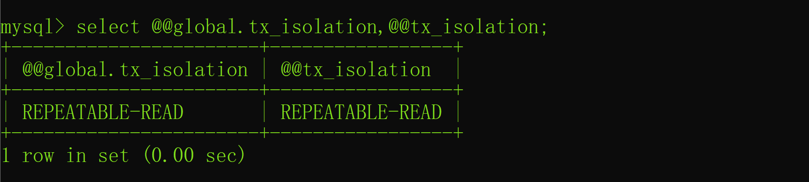
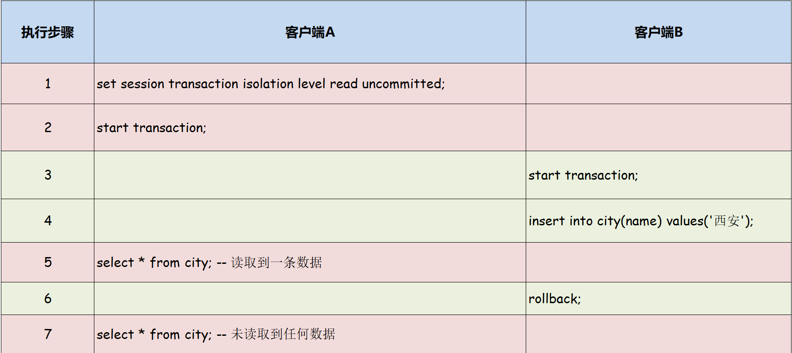
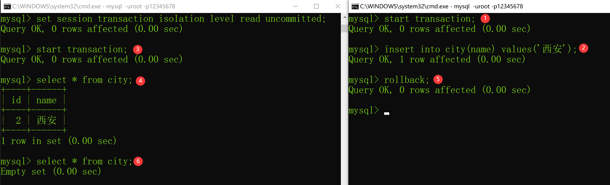
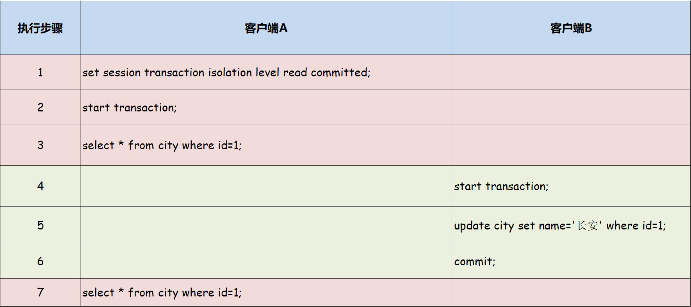
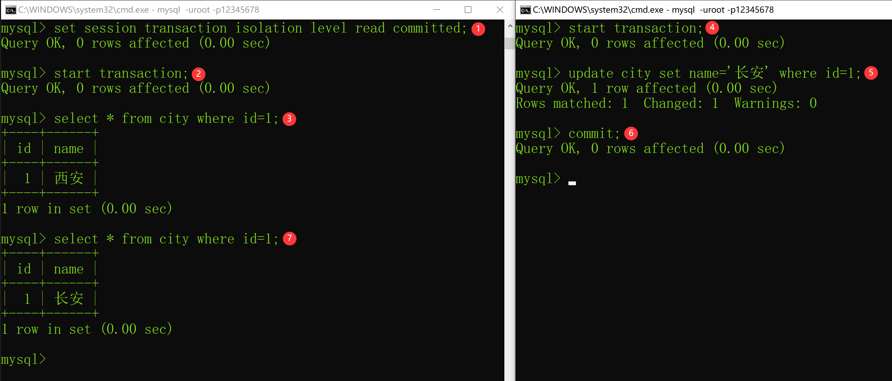
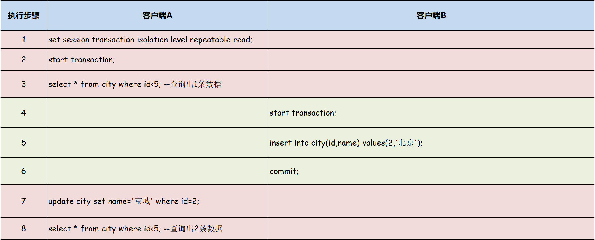
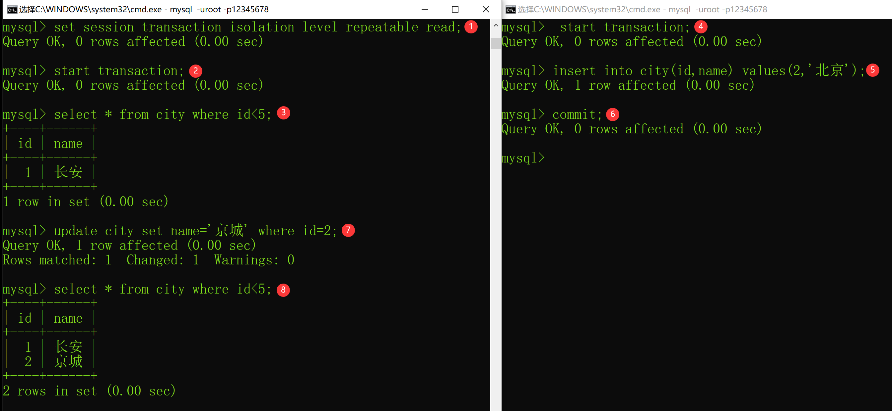

## 四种隔离级别

### 1.1 READ UNCOMMITTED
读未提交，也叫未提交读，该隔离级别的事务可以看到其他事务中未提交的数据。该隔离级别因为可以读取到其他事务中未提交的数据，而未提交的数据可能会发生回滚，因此我们把该级别读取到的数据称之为脏数据，把这个问题称之为脏读。

### 1.2 READ COMMITTED
读已提交，也叫提交读，该隔离级别的事务能读取到已经提交事务的数据，因此它不会有脏读问题。但由于在事务的执行中可以读取到其他事务提交的结果，所以在不同时间的相同 SQL 查询中，可能会得到不同的结果，这种现象叫做不可重复读。

### 1.3 REPEATABLE READ
可重复读，MySQL 默认的事务隔离级别。可重复读可以解决“不可重复读”的问题，但还存在幻读的问题。所谓的幻读指的是，在同一事务的不同时间使用相同 SQL 查询时，会产生不同的结果。例如，一个 SELECT 被执行了两次，但是第二次返回了第一次没有返回的一行，那么这一行就是一个“幻像”行。

**注意：幻读和不可重复读的侧重点是不同的，不可重复读侧重于数据修改，两次读取到的同一行数据不一样；而幻读侧重于添加或删除，两次查询返回的数据行数不同。**

### 1.4 SERIALIZABLE
序列化，事务最高隔离级别，它会强制事务排序，使之不会发生冲突，从而解决了脏读、不可重复读和幻读问题，但因为执行效率低，所以真正使用的场景并不多。

### 1.5 小结
简单总结一下，MySQL 中的事务隔离级别就是为了解决脏读、不可重复读和幻读等问题的，这 4 种隔离级别与这 3 个问题之间的对应关系如下：

| 事务隔离级别 | 脏读 | 不可重复度 | 幻读 |
| ------------ | -----| ---------- | ---- |
| 读未提交（READ UNCOMMITTED） | √ | √ | √ |
| 读已提交（READ COMMITTED） | × | √ | √ |
| 可重复读（REPEATABLE READ）| × | × | √ |
| 串行化（SERIALIZABLE） | × | × | × |

## 2. 并发事务中的问题
并发事务中存在以下 3 个问题。

### 2.1 脏读
一个事务读取到了另一个事务为提交保存的数据，之后此事务进行了回滚操作，从而导致第一个事务读取了一个不存在的脏数据。

### 2.2 不可重复读
在同一个事务中，同一个查询在不同的时间得到了不同的结果。例如事务在 T1 读取到了某一行数据，在 T2 时间重新读取这一行时候，这一行的数据已经发生修改，所以再次读取时得到了一个和 T1 查询时不同的结果。

### 2.3 幻读
MySQL 对幻读的定义如下：

** The so-called phantom problem occurs within a transaction when the same query produces different sets of rows at different times. For example, if a SELECT is executed twice, but returns a row the second time that was not returned the first time, the row is a “phantom” row. **

官方文档：https://dev.mysql.com/doc/refman/5.7/en/innodb-next-key-locking.html
翻译为中文是：同一个查询在不同时间得到了不同的结果，这就是事务中的幻读问题。例如，一个 SELECT 被执行了两次，但是第二次返回了第一次没有返回的一行，那么这一行就是一个“幻像”行。

## 3. 隔离级别实战
### 3.1 查询事务隔离级别
查看全局 MySQL 事务隔离级别和当前会话的事务隔离级别的 SQL 如下：

`select @@global.tx_isolation,@@tx_isolation;` 

以上 SQL 执行结果如下图所示：



### 3.2 设置事务隔离级别
**每个连接到 MySQL 的客户端可以单独设置事务的隔离级别**，MySQL 可以使用以下 SQL 设置当前连接（客户端）的事务隔离级别：

`set session transaction isolation level 事务隔离级别;`
其中事务隔离级别有 4 个值：

- READ UNCOMMITTED

- READ COMMITTED

- REPEATABLE READ

- SERIALIZABLE

### 3.3 脏读问题
一个事务读取到了另一个事务为提交保存的数据，之后此事务进行了回滚操作，从而导致第一个事务读取了一个不存在的脏数据。接下来，我们使用 SQL 来演示一下脏读问题。

正式开始之前，先创建一个测试表：
```sql
-- 创建一个城市表
drop table if exists city;
create table city(
    id int primary key auto_increment,
    name varchar(250) not null
);
```
脏读的执行顺序如下：



脏读的执行 SQL 和执行顺序如下：

客户端 A：set session transaction isolation level read uncommitted;
客户端 A：start transaction;
客户端 B：start transaction;
客户端 B：insert into city(name) values('西安');
客户端 A：select * from city;
客户端 B：rollback;
客户端 A：select * from city;
对应的执行结果如下图所示：


从上述结果可以看出，当把客户端 A 设置为读未提交的事务隔离级别后，客户端 A 可以读取到其他事务未提交的数据，当其他事务回滚之后，客户端 A 读取的数据就成了脏数据，这就是脏读，也就是**读未提交的事务隔离级别中存在脏读的问题。**

### 3.4 不可重复读问题
在同一个事务中，同一个查询在不同的时间得到了不同的结果。例如事务在 T1 读取到了某一行数据，在 T2 时间重新读取这一行时候，这一行的数据已经发生修改，所以再次读取时得到了一个和 T1 查询时不同的结果。

不可重复读的执行顺序如下：



不可重复读的执行 SQL 和执行顺序如下：

客户端 A：set session transaction isolation level read committed;
客户端 A：start transaction;
客户端 A：select * from city where id=1;
客户端 B：start transaction;
客户端 B：update city set name='长安' where id=1;
客户端 B：commit;
客户端 A：select * from city where id=1;
对应执行的结果如下图所示：



从上述结果中可以看出，客户端 A 被设置了读已提交的事务隔离级别之后，使用同样的 SQL 两次读取到的同一条数据，内容是不一样的，这就是不可重复读。也就是读已提交的事务隔离级别中，可能存在不可重复读的问题。

3.5 幻读问题
同一个查询在不同时间得到了不同的结果，这就是事务中的幻读问题。例如，一个 SELECT 被执行了两次，但是第二次返回了第一次没有返回的一行，那么这一行就是一个“幻像”行。

幻读的执行顺序如下：



幻读的执行 SQL 和执行顺序如下：
客户端 A：set session transaction isolation level repeatable read;
客户端 A：start transaction;
客户端 A：select * from city where id<5; --查询出1条数据
客户端 B：start transaction;
客户端 B：insert into city(id,name) values(2,'北京');
客户端 B：commit;
客户端 A：update city set name='京城' where id=2;
客户端 A：select * from city where id<5; --查询出2条数据
对应执行的结果如下图所示：


从上述结果可以看出，客户端 A 被设置了可重复读的事务隔离级别之后，使用相同的 SQL 却查询出了一样的结果，第一次查询出了一条数据，而第二次查询出了两条数据，多出来的这行数据就叫做“幻像”行，因此我们可以得出结果，在可重复读中可能会存在幻读的问题。

## 总结
MySQL 中有 4 种事务隔离级别：读未提交（存在脏读/不可重复读/幻读问题）、读已提交（存在不可重复读/幻读问题）、可重复读（存在幻读问题）和序列化，其中可重复读是 MySQL 默认的事务隔离级别。脏读是读到了其他事务未提交的数据，不可重复读是读到了其他事务修改的数据，而幻读则是读取到了其他事务新增或删除的“幻像”行数据。

