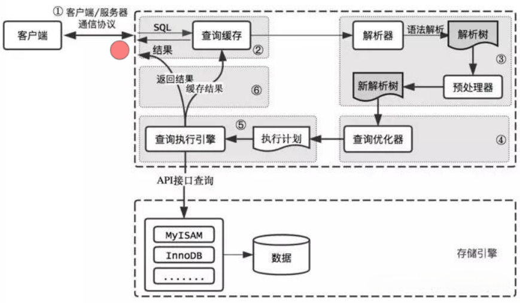
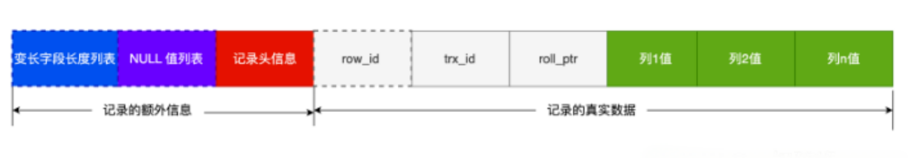

# Mysql 优化

## 慢查询优化基本步骤
先运行看看是否真的很慢，注意设置SQL_NO_CACHE

1. where条件单表查，锁定最小返回记录表。这句话的意思是把查询语句的where都应用到表中返回的记录数最小的表开始查起，单表每个字段分别查询，看哪个字段的区分度最高

2. explain查看执行计划，是否与1预期一致（从锁定记录较少的表开始查询）

3. order by limit 形式的sql语句让排序的表优先查

4. 了解业务方使用场景

5. 加索引时参照建索引的几大原则

6. 观察结果，不符合预期继续从头分析

## SELECT语句 - 执行顺序：
FROM
<表名> # 选取表，将多个表数据通过笛卡尔积变成一个表。

ON
<筛选条件> # 对笛卡尔积的虚表进行筛选

JOIN  
指定join，用于添加数据到on之后的虚表中，例如left join会将左表的剩余数据添加到虚表中

WHERE
对上述虚表进行筛选

GROUP BY
<分组条件> # 分组

用于having子句进行判断，在书写上这类聚合函数是写在having判断里面的

HAVING
<分组筛选> # 对分组后的结果进行聚合筛选

SELECT
<返回数据列表> # 返回的单列必须在group by子句中，聚合函数除外

DISTINCT
数据去重

ORDER BY
<排序条件> # 排序

LIMIT
<行数限制>
## Mysql查询过程

## 1.对查询进行优化，要尽量避免全表扫描，首先应考虑在 where 及 order by 涉及的列上建立索引。 

## 2. 索引列设置NOT NULL约束
比如，`select * from table where a = xxx or a is null;`
通过explain 看这条sql的执行计划，type = ref_or_null，这条sql语句会查询两次，第一次按照查询 a = xxx，第二次再单独查询 a is null
1. 索引列存在 NULL 就会导致优化器在做索引选择的时候更加复杂，更加难以优化，因为可为 NULL 的列会使索引、索引统计和值比较都更复杂，比如进行索引统计时，count 会省略值为NULL 的行。
2. NULL 值是一个没意义的值，但是它会占用物理空间，所以会带来的存储空间的问题，因为 InnoDB 存储记录的时候，如果表中存在允许为 NULL 的字段，那么行格式(opens new window)中至少会用 1 字节空间存储 NULL 值列表，如下图的紫色部分：

## 3. 优化Limit分页查询
当需要分页操作时，通常会使用LIMIT加上偏移量的办法实现，同时加上合适的ORDER BY字句。如果有对应的索引，通常效率会不错，否则，MySQL需要做大量的文件排序操作。

一个常见的问题是当偏移量非常大的时候，比如：LIMIT 10000 20这样的查询，MySQL需要查询10020条记录然后只返回20条记录，前面的10000条都将被抛弃，这样的代价非常高。

优化这种查询一个最简单的办法就是尽可能的使用覆盖索引扫描，而不是查询所有的列。然后根据需要做一次关联查询再返回所有的列。对于偏移量很大时，这样做的效率会提升非常大。考虑下面的查询：
`SELECT film_id,description FROM film ORDER BY title LIMIT 50,5;`
如果这张表非常大，那么这个查询最好改成下面的样子：
`
SELECT film.film_id,film.description
FROM film INNER JOIN (
   SELECT film_id FROM film ORDER BY title LIMIT 50,5
) AS tmp USING(film_id);
`
limit偏移量大的时候，查询效率较低，可以记录上次查询最大的ID，下次查询时直接根据该ID来查询

## 4. 优化UNION
MySQL处理UNION的策略是先创建临时表，然后再把各个查询结果插入到临时表中，最后再来做查询。因此很多优化策略在UNION查询中都没有办法很好的时候。经常需要手动将WHERE、LIMIT、ORDER BY等字句“下推”到各个子查询中，以便优化器可以充分利用这些条件先优化。

除非确实需要服务器去重，否则就一定要使用UNION ALL，如果没有ALL关键字，MySQL会给临时表加上DISTINCT选项，这会导致整个临时表的数据做唯一性检查，这样做的代价非常高。当然即使使用ALL关键字，MySQL总是将结果放入临时表，然后再读出，再返回给客户端。虽然很多时候没有这个必要，比如有时候可以直接把每个子查询的结果返回给客户端。

## 5. 优化count语句

执行流程。
count方法的大原则是server层会从innodb存储引擎里读来一行行数据，并且只累计非null的值。但这个过程，根据count()方法括号内的传参，有略有不同。

count(*)
server层拿到innodb返回的行数据，不对里面的行数据做任何解析和判断，默认取出的值肯定都不是null，直接行数+1。

count(1)
server层拿到innodb返回的行数据，每行放个1进去，默认不可能为null，直接行数+1.

count(某个列字段)
由于指明了要count某个字段，innodb在取数据的时候，会把这个字段解析出来返回给server层，所以会比count(1)和count(*)多了个解析字段出来的流程。

如果这个列字段是主键id，主键是不可能为null的，所以server层也不用判断是否为null，innodb每返回一行，行数结果就+1.

如果这个列是普通索引字段，innodb一般会走普通索引，每返回一行数据，server层就会判断这个字段是否为null，不是null的情况下+1。当然如果建表sql里字段定义为not null的话，那就不用做这一步判断直接+1。

如果这个列没有加过索引，那innodb可能会全表扫描，返回的每一行数据，server层都会判断这个字段是否为null，不是null的情况下+1。同上面的情况一样，字段加了not null也就省下这一步判断了。

理解了原理后我们大概可以知道他们的性能排序是

**count(*) ≈ count(1) > count(主键id) > count(普通索引列) > count(未加索引列)**
允许粗略估计行数的场景
我们回过头来细品下文章开头的需求，我们只是希望知道数据库里还有多少短信是堆积在那没发的，具体是1k还是2k其实都是差不多量级，等到了百万以上，具体数值已经不重要了，我们知道它现在堆积得很离谱，就够了。因此这个场景，其实是允许使用比较粗略的估计的。

那怎么样才能获得粗略的数值呢？
其中有个rows，会用来估计接下来执行这条sql需要扫描和检查多少行。它是通过采样的方式计算出来的，虽然会有一定的偏差，但它能反映一定的数量级。

explain里的rows
可以把explain语句当做raw sql传入，从返回的结果里将rows那一列读出来使用。
一般情况下，explain的sql如果能走索引，那会比不走索引的情况更准 。单个字段的索引会比多个字段组成的复合索引要准。索引区分度越高，rows的值也会越准。
mysql用count方法查全表数据，在不同的存储引擎里实现不同，myisam有专门字段记录全表的行数，直接读这个字段就好了。而innodb则需要一行行去算。
如果确实需要获取行数，且可以接受不那么精确的行数（只需要判断大概的量级）的话，那可以用explain里的rows，这可以满足大部分的监控场景，实现简单。
如果要求行数准确，可以建个新表，里面专门放表行数的信息。
如果对实时性要求比较高的话，可以将更新行数的sql放入到对应事务里，这样既能满足事务隔离性，还能快速读取到行数信息。
如果对实时性要求不高，接受一小时或者一天的更新频率，那既可以自己写脚本遍历全表后更新行数信息。也可以将通过监听binlog将数据导入hive，需要数据时直接通过hive计算得出。

## 6. 优化子查询
尽可能使用关联查询代替子查询

## 7. 多表关联查询时，小表在前，大表在后。

在MySQL中，执行 from 后的表关联查询是从左往右执行的（Oracle相反），第一张表会涉及到全表扫描，所以将小表放在前面，先扫小表，扫描快效率较高，在扫描后面的大表，或许只扫描大表的前100行就符合返回条件并return了。

## 8. 调整Where字句中的连接顺序

MySQL采用从左往右，自上而下的顺序解析where子句。根据这个原理，应将过滤数据多的条件往前放，最快速度缩小结果集。

## 9. 优化join语句

MySQL中可以通过子查询来使用 SELECT 语句来创建一个单列的查询结果，然后把这个结果作为过滤条件用在另一个查询中。使用子查询可以一次性的完成很多逻辑上需要多个步骤才能完成的 SQL 操作，同时也可以避免事务或者表锁死，并且写起来也很容易。但是，有些情况下，子查询可以被更有效率的连接(JOIN)..替代。

例子：假设要将所有没有订单记录的用户取出来，可以用下面这个查询完成：

`SELECT col1 FROM customerinfo WHERE CustomerID NOT in (SELECT CustomerID FROM salesinfo )`
如果使用连接(JOIN).. 来完成这个查询工作，速度将会有所提升。尤其是当 salesinfo表中对 CustomerID 建有索引的话，性能将会更好，查询如下：

`
SELECT col1 FROM customerinfo 
   LEFT JOIN salesinfoON customerinfo.CustomerID=salesinfo.CustomerID 
      WHERE salesinfo.CustomerID IS NULL
`
连接(JOIN).. 之所以更有效率一些，是因为 MySQL 不需要在内存中创建临时表来完成这个逻辑上的需要两个步骤的查询工作。

## 10. 使用truncate代替delete

当删除全表中记录时，使用delete语句的操作会被记录到undo块中，删除记录也记录binlog，当确认需要删除全表时，会产生很大量的binlog并占用大量的undo数据块，此时既没有很好的效率也占用了大量的资源。

使用truncate替代，不会记录可恢复的信息，数据不能被恢复。也因此使用truncate操作有其极少的资源占用与极快的时间。另外，使用truncate可以回收表的水位，使自增字段值归零。
