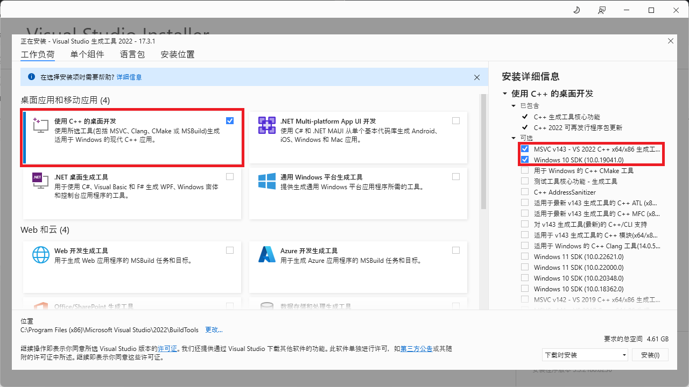

# Rust 环境安装

## 环境安装

需要安装 Microsoft C++ 生成工具。 最简单的方法是下载 [Microsoft C++ Build Tools](https://visualstudio.microsoft.com/visual-cpp-build-tools/)。 进行安装选择时，请勾选 "C++ 生成工具" 和 Windows 10 SDK。



前往[Rust 官网](https://www.rust-lang.org/learn/get-started)，在打开的页面中按照你的系统位数选择对应的链接下载 rust 安装程序。

## 设置安装目录

rust 默认安装在 C 盘，想安装到其他盘需要先设置变量
自己先创建好目录，.rustup 和 .cargo
RUSTUP_HOME，CARGO_HOME，


双击打开 rustup-init.exe，进入以下命令行界面：

```text
This path will then be added to your PATH environment variable by modifying the HKEY_CURRENT_USER/Environment/PATH registry key。
​
You can uninstall at any time with rustup self uninstall and these changes will be reverted.
​
Current installation options:
​
default host triple: x86_64-pc-windows-msvc
default toolchain: stable (default)
profile: default
modify PATH variable: yes
​
1) Proceed with installation (default)
2) Customize installation
3) Cancel installation
>
```

输入 1，之后按下回车键，开始安装 Rust

## 安装完成检查

Rust 开发环境中，所有工具都安装在 ~/.cargo/bin 目录，包括 rustc、cargo 和 rustup

```shell
rustc --version
```

rustup 常用命令

```shell
# 查看rustc版本
rustc --version

# 显示当前安装的工具链信息
rustup show
# 检查安装更新
rustup update
# 卸载
rustup self uninstall
# 设置当前默认工具链
rustup default stable-x86_64-pc-windows-gnu
# 查看帮助
rustup -h

# -------------------------->配置工具链
# 查看工具链
rustup toolchain list
# 安装工具链
rustup toolchain install stable-x86_64-pc-windows-gnu
# 卸载工具链
rustup toolchain uninstall stable-x86_64-pc-windows-gnu
# 设置自定义工具链
rustup toolchain link <toolchain-name> "<toolchain-path>"

# -------------------------->配置一个目录以及其子目录的默认工具链
# 查看已设置的默认工具链
rustup override list
# 设置该目录以及其子目录的默认工具链
rustup override set <toolchain> --path <path>
# 取消目录以及其子目录的默认工具链
rustup override unset --path <path>

# -------------------------->配置工具链的可用目标
# 查看目标列表
rustup target list
# 安装目标
rustup target add <target>
# 卸载目标
rustup target remove <target>
# 为特定工具链安装目标
rustup target add --toolchain <toolchain> <target>

# -------------------------->配置 rustup 安装的组件
# 查看可用组件
rustup component list
# 安装组件
rustup component add <component>
# 卸载组件
rustup component remove <component>
```

## cargo 配置

在用户主目录的 .cargo 目录下新建一个文件，命名为 config（没有扩展名），并输入以下内容：

```text
[source.crates-io]
registry = "https://github.com/rust-lang/crates.io-index"
replace-with = 'ustc'

## 二选择一
## replace-with = 'XXX' 选择配置

# 中国科学技术大学
[source.ustc]
registry = "git://mirrors.ustc.edu.cn/crates.io-index"

# 清华大学
[source.tuna]
registry = "https://mirrors.tuna.tsinghua.edu.cn/git/crates.io-index.git"

```

## cargo 基本命令

```shell
 查看cargo版本
cargo --version

# 新建项目
cargo new <project_name>

# 构建项目
cargo build

# 运行项目
cargo run

# 检查项目
cargo check

# 查看帮助
cargo -h

```
