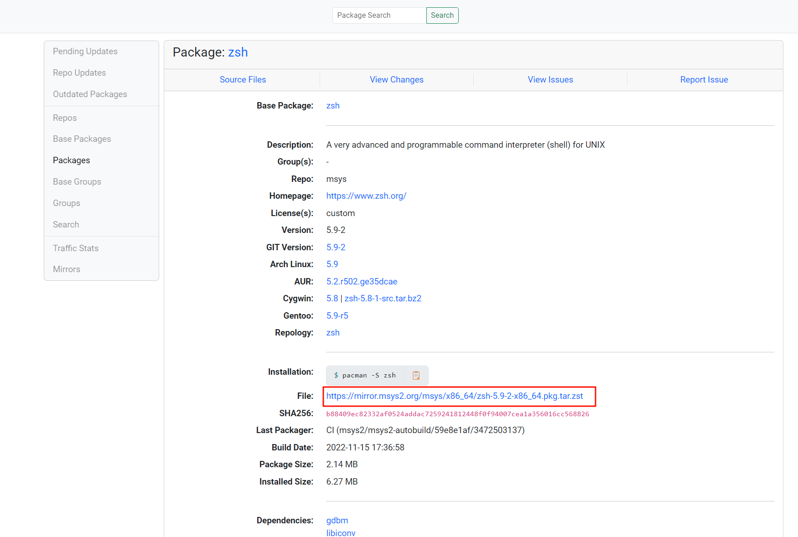
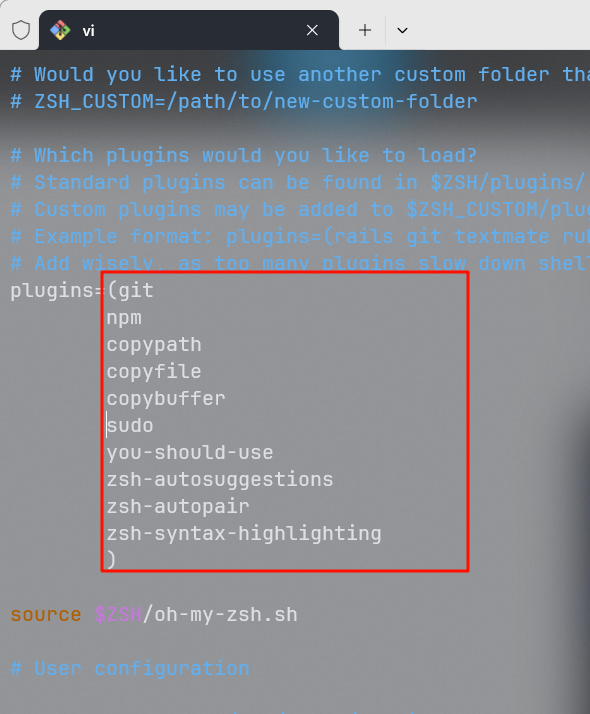

# Zsh 整理

## Windows Zsh 安装

### 安装 Git

前往[git 官网](https://gitforwindows.org/)安装 git


### 安装 Zsh

下载[zsh](https://packages.msys2.org/package/zsh?repo=msys&variant=x86_64)压缩文件,

直接解压至 Git 根目录下**重点**，可使用[PeaZip](https://peazip.github.io/)解压
打开 Git Bash 标签页输入 zsh，出现下图则代表安装成功，否则检查是否解压至 Git 根目录下

初始化直到生成对应的.zshrc 文件,输入`zsh`即可进入

## 安装 Oh My Zsh

进入[官网](https://ohmyz.sh/#install)，复制首页命令进行安装

```shell
sh -c "$(curl -fsSL https://raw.githubusercontent.com/ohmyzsh/ohmyzsh/master/tools/install.sh)"
```

提示可忽略

配置默认启动 zsh
在`../Git/etc/bash.bashrc`文件末尾追加以下内容：

```shell
# 运行 Zsh
if [ -t 1 ]; then
exec zsh
fi
```

## 安装插件

### 下载

```shell
cd ~/.oh-my-zsh/custom/plugins

git clone https://github.com/MichaelAquilina/zsh-you-should-use.git
git clone https://github.com/hlissner/zsh-autopair.git
git clone https://github.com/zsh-users/zsh-autosuggestions.git
git clone https://github.com/zsh-users/zsh-syntax-highlighting.git

```

### 配置

```shell
vi ~/.zshrc
```

```shell
source ~/.zshrc
```



**在 VSCode 和 Idea 中移动终端会使终端卡顿无法使用，暂未解决**
