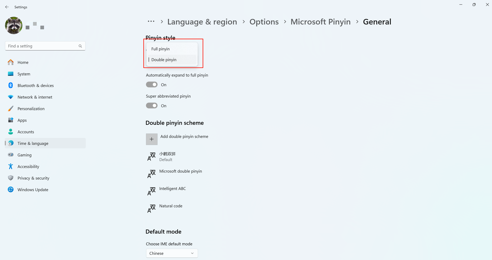

1.打开注册表编辑器


2.定位到如下位置
```text:no-line-numbers
\HKEY_CURRENT_USER\Software\Microsoft\InputMethod\Settings\CHS
```

3.新增一个字符串，名和值如下
```text:no-line-numbers
#名字
UserDefinedDoublePinyinScheme0
#值
小鹤双拼*2*^*iuvdjhcwfg^xmlnpbksqszxkrltvyovt
```

4.更换微软输入法设置


双拼输入法键位如下：


