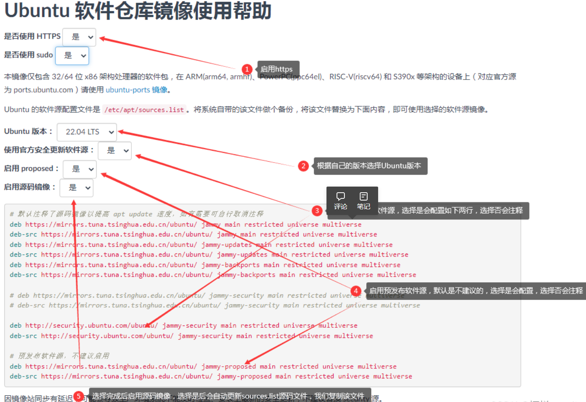

# 如何使用 WSL 在 Windows 上安装 Linux

## 安装 WSL 命令

现在，可以使用单个命令安装运行 WSL 所需的一切内容。 在管理员模式下打开 PowerShell 或 Windows 命令提示符，方法是右键单击并选择“以管理员身份运行”，输入
wsl --install 命令，然后重启计算机。

```shell:no-line-numbers
wsl --install
```

此命令将启用运行 WSL 并安装 Linux 的 Ubuntu 发行版所需的功能。 （可以更改此默认发行版）。

首次启动新安装的 Linux 发行版时，将打开一个控制台窗口，要求你等待将文件解压缩并存储到计算机上。 未来的所有启动时间应不到一秒。

上述命令仅在完全未安装 WSL 时才有效，如果运行 wsl --install 并查看 WSL 帮助文本，请尝试运行 wsl --list --online
以查看可用发行版列表并运行 wsl --install -d DistroName 以安装发行版。 若要卸载 WSL，请参阅卸载旧版 WSL 或注销或卸载
Linux 发行版。

## 更改默认安装的 Linux 发行版

默认情况下，安装的 Linux 分发版为 Ubuntu。 可以使用 -d 标志进行更改。

若要更改安装的发行版，请输入：wsl --install -d Distribution Name。 将 Distribution Name 替换为要安装的发行版的名称。
若要查看可通过在线商店下载的可用 Linux 发行版列表，请输入：wsl --list --online 或 wsl -l -o。
若要在初始安装后安装其他 Linux 发行版，还可使用命令：wsl --install -d Distribution Name。
提示

如果要通过 Linux/Bash 命令行（而不是通过 PowerShell 或命令提示符）安装其他发行版，必须在命令中使用 .exe：wsl.exe --install
-d Distribution Name 或若要列出可用发行版，则使用：wsl.exe -l -o。

## 更改root密码并取消登陆密码
1. 首先，输入如下代码设置root密码
```shell:no-line-numbers
sudo passwd root
```

2. 然后设置新的密码，将其输入两次
输入完成，root用户的密码就设置上了
接下来，就可以快速取消登录密码了，输入如下代码：

```shell:no-line-numbers
sudo passwd -d root
```
它可以将root用户的密码取消掉。在执行完毕此操作后，就可以登录该用户而不需要密码验证

## 设置登录自动进入root
```shell:no-line-numbers
vim ~/.basshrc
```
在最后添加
```text:no-line-numbers
#进入管理员
su
```

## 设置java等环境目录
```shell:no-line-numbers
vim /etc/profile
```
在最后添加相关环境位置
```text
# java环境
export JAVA_HOME=/opt/jdk-17.0.6
export PATH=$PATH:$JAVA_HOME/bin;
export CLASSPATH=.:$JAVA_HOME/lib/dt.jar:$JAVA_HOME/lib/tools.jar;
# lua环境
export PATH=/opt/lua-5.4.4/src:$PATH
```

## 设置启动root自动启动Docker
**需要先设置开启Systemctl支持**见 [WSL支持systemctl命令](./WSL支持systemctl命令.md)
```shell:no-line-numbers
vim bashrc
```

```text:no-line-numbers
#刷新环境变量
source /etc/profile

#启动docker
sytemctl start docker

#清空控制台
clear
```

## 设置开机启动WLS2
1. 打开“任务计划程序”应用程序。你可以在开始菜单中搜索“任务计划程序”以打开它。
2. 在左侧面板中，选择“任务计划程序库”。
3. 在右侧面板中，右键单击空白区域，选择“创建任务”。
4. 在“常规”选项卡中，输入任务的名称和描述。
5. 在“触发器”选项卡中，选择“新建”，然后设置任务的触发条件。例如，你可以设置在用户登录时启动任务。
6. 在“操作”选项卡中，选择“新建”，然后设置任务要执行的操作。在“程序/脚本”框中输入以下命令：
```shell:no-line-numbers
wsl -d Ubuntu -u root
#其中Ubuntu为WSL2实例名
```

## 更改镜像源
1. 备份镜像源
```shell:no-line-numbers
cp /etc/apt/sources.list /etc/apt/sources.list.bak
```
2. 查看Linux版本
```shell:no-line-numbers
 cat /etc/os-release
```

```text:no-line-numbers
root@c4b4e6b8e891:/# cat /etc/os-release
PRETTY_NAME=“Ubuntu 22.04.2 LTS”
NAME=“Ubuntu”
VERSION_ID=“22.04”
VERSION=“22.04.2 LTS (Jammy Jellyfish)”
VERSION_CODENAME=jammy
ID=ubuntu
ID_LIKE=debian
HOME_URL=“https://www.ubuntu.com/”
SUPPORT_URL=“https://help.ubuntu.com/”
BUG_REPORT_URL=“https://bugs.launchpad.net/ubuntu/”
PRIVACY_POLICY_URL=“https://www.ubuntu.com/legal/terms-and-policies/privacy-policy”
UBUNTU_CODENAME=jammy
```

3. 更换为清华大学镜像
访问[清华大学Ubuntu镜像源网站](https://mirror.tuna.tsinghua.edu.cn/help/ubuntu/)，根据版本情况选择配置。


4. 更新镜像源
```shell:no-line-numbers
vim /etc/apt/sources.list
```

5. 更新apt源及sources.list文件
```shell:no-line-numbers
apt-get update
```