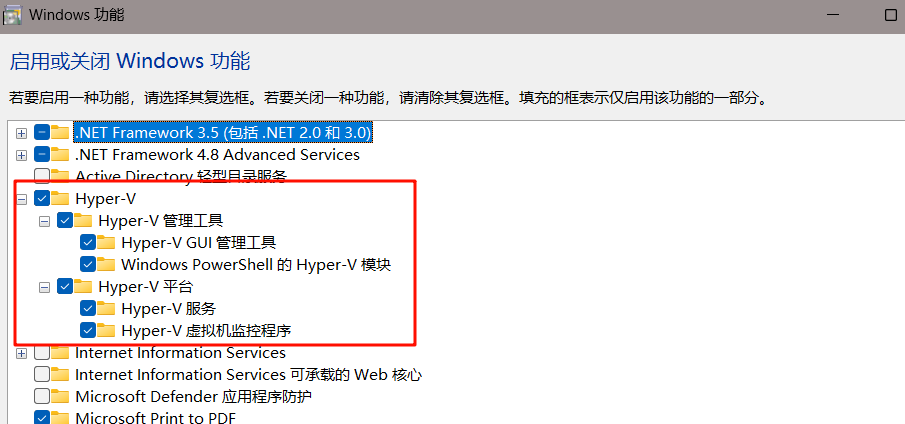

## 安装Hyper-V管理器
如果是专业版Windows操作系统，可以直接在
“控制面板->程序和功能->启用或关闭Windows功能”
界面选中Hyper-V后，确定退出并重启计算机。


## 打开Hyper-V管理器

安装完成后，可在Windows搜索栏内搜索Hyper-V管理器，打开后界面如上图所示。

## 创建桥接网络虚拟交换机

按照上图标示的步骤创建虚拟交换机，将其命名为WSLBridge。

## 修改配置文件

1.使用快捷键Win+R唤出运行窗口，在打开栏内填入%USERPROFILE%并在打开的文件夹内创建配置文件".wslconfig"，并在该配置文件内输入以下内容。
```text:no-line-numbers
[wsl2]
vmIdleTimeout=-1
networkingMode=bridged
vmSwitch=WSLBridge
ipv6=true
dhcp=false
```

2.进入wsl的Ubuntu子系统，打开/etc/wsl.conf，若文件不存在则创建,在wsl.conf配置文件内填入以下内容
```text:no-line-numbers
[boot]
systemd = true
[network]
generateHosts = false
generateResolvConf = false
```

3.检查/etc/systemd/network/，若文件夹下没有文件则创建一个配置文件my-network.conf，若文件夹下有文件则忽略此步骤。
```shell:no-line-numbers
sudo vim /etc/systemd/network/my-network.conf

[Match]
Name=en*
 
[Network]
DHCP=ipv4
```

重启networkd
```shell:no-line-numbers
sudo systemctl restart systemd-networkd.service
```

打开配置文件/etc/netplan/00-wsl2.yaml，如果不存在就创建。
```shell:no-line-numbers
sudo vim /etc/netplan/00-wsl2.yaml

network:
  version: 2
  ethernets:
    eth0:
      dhcp4: no
      addresses: [192.168.1.14/24]
      gateway4: 192.168.1.1
      nameservers:
        addresses: [8.8.8.8, 144.144.144.144]
```

```text:no-line-numbers
network:
  version: 2
  ethernets:
    eth0:
      dhcp4: no
      addresses: [静态IP地址/子网掩码]
      gateway4: 网关IP地址
      nameservers:
        addresses: [DNS服务器IP地址1, DNS服务器IP地址2]
```

然后使用sudo netplan apply应用新的网络设置，重启WSL2子系统即可。
```shell:no-line-numbers
sudo netplan apply
```