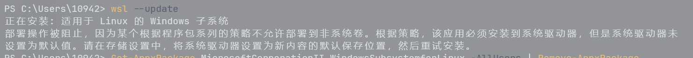

#  wsl --update错误


解决方法：
[WSL issues](https://github.com/microsoft/WSL/issues/10897)

```shell
Get-AppxPackage MicrosoftCorporationII.WindowsSubsystemforLinux -AllUsers | Remove-AppxPackage
wsl --update --web-download
```

# WSL: Could not resolve hostname Temporary failure
WSL 无法解析域名：
> Could not resolve hostname github.com: Temporary failure in name resolution

1. 编辑 /etc/wsl.conf 文件
```shell
vim /etc/wsl.conf
```

```text
[network]
generateResolvConf = false
```

2. 重启 wsl
```shell
wsl --shutdown
```
3. 启动 wsl, 拷贝保留原来的 /etc/resolv.conf文件， 创建一个新的 /etc/resolv.conf 文件编辑如下
```shell
mv /etc/resolv.conf /etc/resolv.conf.old
vi /etc/resolv.conf
```
```text
nameserver 8.8.8.8
```